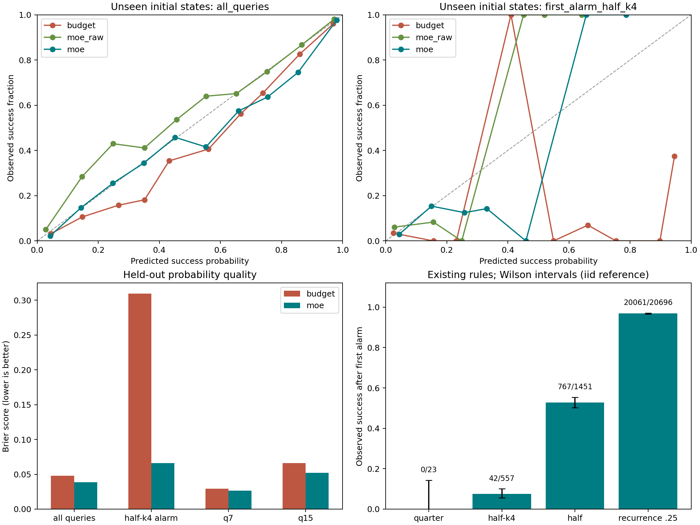
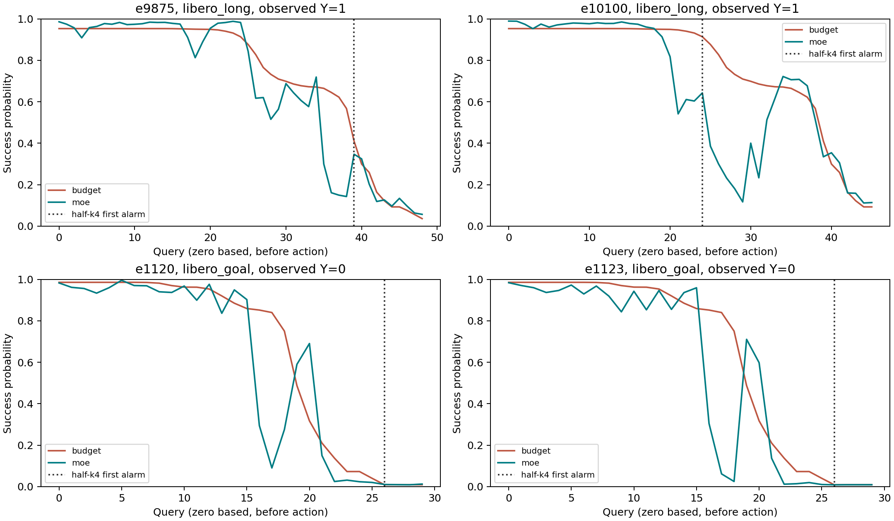

# MoE 前缀成功概率：离线实验报告

## 实际结论

在两个完整自然执行批次的 32,000 条 rollout 中，严格主规则首次报警后，最终成功 **0/23 = 0.00%**。
Wilson 95% 区间（独立样本参考，不校正 seed/初态相关）为 [0.00%, 14.31%]。零成功时经验 bootstrap 退化，不报告虚假的 [0,0] 概率区间。这个严格规则缺少报警后成功样本，不能证明真实概率为零。完整现有规则的描述性敏感性结果如下，未按终局调参或替换主规则。

| 既有规则 | 报警集数 | 报警后成功 | 成功率 |
|---|---:|---:|---:|
| freeze_back_quarter | 23 | 0 | 0.00% |
| freeze_back_half | 1451 | 767 | 52.86% |
| freeze_back_eighth | 0 | 0 | NA |
| freeze_all_half | 476 | 143 | 30.04% |
| freeze_all_quarter | 0 | 0 | NA |
| freeze_all_eighth | 0 | 0 | NA |
| freeze_front_half | 88 | 49 | 55.68% |
| freeze_front_quarter | 0 | 0 | NA |
| freeze_front_eighth | 0 | 0 | NA |
| freeze_back_quarter_k1 | 31 | 1 | 3.23% |
| freeze_back_quarter_k4 | 11 | 0 | 0.00% |
| freeze_back_quarter_b2 | 23 | 1 | 4.35% |
| freeze_back_quarter_b8 | 24 | 0 | 0.00% |
| recurrence_back_015 | 22 | 0 | 0.00% |
| recurrence_back_025 | 20696 | 20061 | 96.93% |
| recurrence_back_035 | 32000 | 30904 | 96.58% |
| collapse_back_half | 210 | 210 | 100.00% |
| joint_back_half | 17 | 17 | 100.00% |
| collapse_back_quarter | 0 | 0 | NA |
| joint_back_quarter | 0 | 0 | NA |
| freeze_back_half_k1 | 3411 | 2646 | 77.57% |
| freeze_back_half_k4 | 557 | 42 | 7.54% |
| freeze_back_half_k8 | 325 | 12 | 3.69% |

这些是 D 条件下的终局成功率，不是真实 trap 的恢复率。全部规则都保留，不从中挑选最符合假设的结果。half-k4 是仓库已有的探索性规则，其阈值为 0.5、连续确认 4 次；额外报告其首次报警概率诊断，不改变已固定的模型。

未见初始状态测试集上，MoE 模型相对预算基线的逐 query Brier 差为 **-0.00929**，95% 区间 [-0.01365, -0.00571]。区间低于零，支持该测试分布下 MoE 提供额外概率预测信息。

## 样本与目标

覆盖 40 个 LIBERO 任务、4 个 suite、508,023 个执行前 query；成功 30,904 集，失败 1,096 集。
只使用 right-50x8-20260903（噪声 1000..1007）与 right-50x8b-20260903（1008..1015）。旧 16x32 批次不并入，避免重叠初态与种子重复计数；pin 干预、重复 pin-base、smoke 和不完整 CALVIN 不进入自然概率标定。

估计目标是 P(Y=1 | 当前 MoE 因果历史、已执行步数、剩余步数、仍在执行)。每个 suite 的 checkpoint、归一化、采样配置分别验证，并训练独立模型。任务 ID、初态、种子、物理状态、动作、终局长度与未来窗口均不作为在线输入。

q 从 0 开始；R_q 在本 chunk 推理后、执行前可用。剩余动作预算是 max_steps - 10*q，包含已经采样但尚未执行的当前 chunk。使用真实预算上限，绝不使用 length-q。失败必须完整耗尽原定动作预算；提前中断会拒绝进入训练。

## 数据隔离

固定 seed=20260907，逐任务将 50 个初态按哈希种子置乱：30 个用于第一批训练（9,600 集），10 个用于第一批校准（3,200 集），另 10 个在两批中共同作为主测试（6,400 集）。训练、校准、主测试的 task/init 集合完全不相交。
第二批其余 12,800 集仅作新噪声、已见初态的次测试；它不是独立初态泛化证据。同一 rollout 所有 chunk 永远处于同一分组。分支数据尚未加入训练。

本语料已被仓库内其他实验分析，当前划分是可复现的回顾评估，不是前瞻盲测。

## 模型与指标

冻结报警器为现有 history-only PRIMARY: freeze_back_quarter，初始 4 次转移作基线，后层 mobility 降至 1/4，2-query 平滑、2 次确认。最早 q7 报警。alarm_now 与历史上曾报警分别保存；二者都不命名为真实 Z。

模型为固定 120 轮、15 叶的 HistGradientBoostingClassifier。预算基线和 MoE 模型使用相同容量；sigmoid 校准只读取独立校准集。保留原始和校准后概率，测试结果不用于选择参数或校准方式。

| 测试位置 | 模型 | Brier | Log loss | AUROC | ECE (10 bins) |
|---|---|---:|---:|---:|---:|
| all_queries | prior | 0.06816 | 0.25651 | 0.6519 | 0.01749 |
| all_queries | budget | 0.04771 | 0.18693 | 0.8228 | 0.01357 |
| all_queries | moe_raw | 0.03808 | 0.14464 | 0.9137 | 0.01109 |
| all_queries | moe | 0.03842 | 0.14518 | 0.9146 | 0.01184 |
| first_alarm | prior | 0.84746 | 2.96579 | NA | 0.91840 |
| first_alarm | budget | 0.01557 | 0.12335 | NA | 0.11468 |
| first_alarm | moe_raw | 0.00068 | 0.02350 | NA | 0.02315 |
| first_alarm | moe | 0.00162 | 0.04047 | NA | 0.03964 |
| first_alarm_half_k4 | prior | 0.69920 | 2.04531 | 0.3793 | 0.77218 |
| first_alarm_half_k4 | budget | 0.30927 | 0.87729 | 0.7515 | 0.40203 |
| first_alarm_half_k4 | moe_raw | 0.06853 | 0.25689 | 0.8141 | 0.06441 |
| first_alarm_half_k4 | moe | 0.06597 | 0.25085 | 0.8182 | 0.05430 |
| q7 | prior | 0.03245 | 0.15317 | 0.6451 | 0.04826 |
| q7 | budget | 0.02937 | 0.13185 | 0.6758 | 0.00692 |
| q7 | moe_raw | 0.02643 | 0.11070 | 0.8226 | 0.01025 |
| q7 | moe | 0.02663 | 0.11120 | 0.8231 | 0.00761 |
| q15 | prior | 0.09357 | 0.35460 | 0.3499 | 0.10199 |
| q15 | budget | 0.06624 | 0.25682 | 0.6821 | 0.01733 |
| q15 | moe_raw | 0.04871 | 0.17550 | 0.9179 | 0.02178 |
| q15 | moe | 0.05218 | 0.18542 | 0.9167 | 0.02617 |

严格主规则的主测试首次报警只有 2 个样本，单类 AUROC 为 NA，该子组指标及 bootstrap 仅作小样本诊断，不支持校准有效性的结论。全体 query 的 sigmoid 校准也未必优于原始模型；原始与校准结果均公开，未按测试集择优。

逐 query 的主指标对应部署时实际遇到的决策分布。长轨迹产生更多决策，但置信区间以任务内初态聚类，不把相邻 chunk 当独立样本。另报告每集等权的损失诊断、固定 q 的风险集以及每集一次的首次报警指标。训练不采用 1/终局长度加权，因为这种依赖未来的权重会改变条件成功概率的目标分布。

Brier/log loss 同时受区分能力与校准影响；请结合可靠性曲线和 bin 样本数读取。整体校准良好不保证首次报警等子群校准良好。参见 [scikit-learn 校准文档](https://scikit-learn.org/stable/modules/calibration.html)。

示例图按已有 half-k4 规则报警后实际成功/失败各抽取两集，仅用于回顾展示；分支采样不使用终局标签。

## 可识别性与剩余证据

真实 trap Z、首次物理脱困时间与不可逆失败时间缺少一致的独立标签。现有 physical-failure-labels 主要对失败集做物理原因标注，成功集没有同等的局部受困核验。已有 centered-window 的几何事件代理也不能直接替代部署时 Z。
因此 natural_escape_probability、trap_probability 保持 null，未训练伪造的脱困头；报警消失不被当作物理脱困。超时对预算内成功 Y 是 0，不是删失；若以后做无界脱困时间分析，截止时未脱困才涉及生存删失。

不同 rollout 的相同 q 不代表同一物理检查点。当前读出是表征条件概率，不是同一个完整 x_t 经多次续跑的 committor 真值，也不能通过任意改小预算输入来宣称获得已验证的反事实 V(b) 曲线。

已生成 4 个报警/对照检查点候选（见 branch_candidates.csv），按与终局无关的哈希选取，每任务最多 2 个首次报警，并匹配同任务、同 q、同预算且截至此时未报警的对照；真实任务阶段仍未匹配。局部受困证据须离线盲核验。
另提供 branch_candidates_half_k4.csv，记录已有 half-k4 规则的相同采样设计，不替换主规则。两个清单的相同 checkpoint_id 是同一个父检查点，未来采集/划分须合并。
候选只是定位清单。Hub 的 sim_state/动作记录不等于完整闭环快照；当前没有与此检测时刻对齐的完整状态分支证据。必须复原模拟器、控制器与观测历史、固定当前已采样 chunk，再从下一个 chunk 重抽独立未来噪声。每点 K=64，保持原始剩余预算，保存恢复审计与来源哈希。

既有恢复实验包含失败 trunk 筛选、不同报警规则或重抽当前 chunk，不能直接混入此处的自然条件概率监督。branch-summary 接口只接收满足完整恢复、当前 chunk 保留、策略固定、独立未来 RNG 等契约的记录，并输出带试验次数与 Wilson 区间的软标签；0/K 不被解释为真实概率为零。

95% bootstrap 区间固定已采样任务，按 task/init 重采样；未涵盖任务迁移、共享 seed 引起的跨初态依赖或模型重新训练的不确定性。

## 验证

校验 80 个 run 的原始 summaries、采集预算、策略元数据、MoE 特征缓存 SHA-256与逐集终局标签；首次报警与现有检测器逐集一致。原始 Zarr 抽查 80 个 run、1256 个 query，流式/离线特征最大绝对差 0。
原始大数组只读打开。特征提取、分组、防未来泄漏、预算边界、分支证据契约与在线读出均有针对性测试。完整 provenance 见 data_audit.json、raw_verification.json和 artifact_manifest.json。
