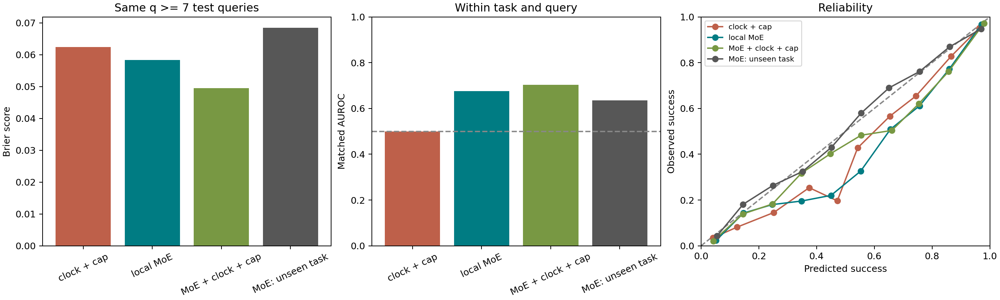

# 预算与任务先验审计

## 对原结论的修正

原来的‘仅执行预算’实际是 suite 专属模型加执行时钟。两列预算特征之和给出固定上限，220/280/300/520 在本数据中恰好分别识别 spatial/object/goal/long。原先的 MoE 模型也使用了这些信息，所以 0.9146 AUROC 不能直接称为纯 MoE 的成绩。

当前实现中的上限来自固定评测配置；实际 rollout 的终局长度没有进入在线特征。因此本次发现的是任务套件与时钟先验的混杂，未发现直接读取未来轨迹或终局长度的输入。若用实际结束时刻减当前时刻作剩余预算，则会构成未来信息泄漏；本实现没有这样做。

## 新的受限读出

新主模型所有 suite 共用一套参数，仅接收最近 8 个 query 的 MoE 路由。18 个输入是前/后层的 mobility、4 步位移、token spread 各自的当前值、最近 4 值均值、3 步差分。没有任务/suite ID、预算、绝对 query、初始窗口基线、报警持续时间或历史长度。
窗口未满时返回未就绪，前 7 个 query 不预测。所有对照都在同一 q>=7 风险集评估，并在相同范围重训，不能将这里的损失与旧版全时段损失直接相减。

主划分沿用原先按任务/初态隔离的训练、校准和测试集合。模型容量与 sigmoid 校准流程固定，未按此次测试结果选择超参数；原始概率也完整保存在 CSV。此实验是用户提出混杂问题后的回顾性追加审计，不是新的盲测。

## 同一测试风险集

主测试覆盖 6,368 条 rollout、56,437 个 q>=7 的 query。

| 读出 | Brier | Log loss | AUROC | 同任务、同 q 的 AUROC |
|---|---:|---:|---:|---:|
| 共享常数先验 | 0.09868 | 0.34978 | 0.5000 | 0.5000 |
| suite 专属常数先验 | 0.09734 | 0.34046 | 0.6025 | 0.5000 |
| 共享模型，仅执行时钟 | 0.07390 | 0.26757 | 0.7931 | 0.5000 |
| 共享模型，时钟＋预算上限 | 0.06242 | 0.23154 | 0.8380 | 0.5000 |
| suite 分模，仅执行时钟 | 0.06239 | 0.23110 | 0.8387 | 0.5000 |
| 纯局部 MoE，共享模型 | 0.05833 | 0.20495 | 0.9092 | 0.6763 |
| 局部 MoE＋时钟，共享模型 | 0.05177 | 0.18436 | 0.9245 | 0.6854 |
| 局部 MoE＋时钟＋上限，共享模型 | 0.04946 | 0.17658 | 0.9300 | 0.7033 |
| 局部 MoE，suite 分模 | 0.05405 | 0.18887 | 0.9249 | 0.7091 |
| 纯局部 MoE，未见任务 | 0.06846 | 0.25417 | 0.8226 | 0.6345 |

纯局部 MoE 的 Brier 为 0.05833，时钟加上限基线为 0.06242；配对差的 95% 区间为 [-0.01059, +0.00089]。区间跨零，不能据此断言纯 MoE 的 Brier 稳定优于该基线。

同任务、同 q 的 AUROC 只比较同一任务、同一执行时刻下结局不同的轨迹，再按成功/失败对数加权汇总。常数、suite 和时钟基线在每个这样的组内给出相同值，因此为 0.5。该诊断帮助排除仅靠区分任务或执行时刻获得较高池化 AUROC 的解释。

suite 分模会同时改变参数共享和模型总容量，其差值不是任务先验的纯因果效应。共享模型中添加时钟/上限的对照保持了相同算法容量和局部 MoE 特征。

## 配对误差区间

差值为左侧模型减右侧模型；负数表示左侧损失更低。任务内按初态聚类 bootstrap，固定已训练模型与已采样任务，不包含重新训练的不确定性。

| 左侧 | 右侧 | Brier 差 | 95% 区间 |
|---|---|---:|---|
| moe_local_global | clock_cap_global | -0.00409 | [-0.01059, +0.00089] |
| moe_local_global | clock_suite | -0.00406 | [-0.01085, +0.00116] |
| moe_local_clock_cap_global | moe_local_global | -0.00887 | [-0.01143, -0.00655] |
| moe_local_suite | moe_local_global | -0.00428 | [-0.00631, -0.00231] |
| moe_local_unseen_task | prior_unseen_task | -0.03386 | [-0.04710, -0.02356] |

## 未见任务检查

40 个任务分为 5 折，每折留出 8 个任务，每 suite 留出 2 个。留出任务完全不进入该折训练或校准；仍在原测试轨迹上报告结果。所有 5 折的任务隔离检查通过。折内常数先验也保存在 metrics.csv。

## 解释边界

没有显式时钟输入，不代表 MoE 内部不能反映任务身份或执行阶段。未见任务与同任务同 q 检查对这种解释提供约束，不能证明表征与时间完全独立。
删掉预算后，预测目标是原语料中任务、策略与原定截止条件混合分布下的P(终局成功 | 最近 MoE 窗口)。它不再显式条件于给定的 b，不能声称估计了任意预算下的 V(x,b)，也不能外推为无限预算成功概率。
真实 trap 与自然脱困仍没有独立真值。本审计没有增加物理状态输入、真实脱困标签或新的环境续跑。

## 可复核产物

32,000 集中全部 284,023 个合格 query 都生成了受限模型预测；未重新全量读取原始路由。复用已校验缓存，并对原先的 80 个原始 Zarr 样本逐 chunk重放新在线接口，核对 696 个概率值，最大误差 0。
在线共享模型：models/moe_window_shared.joblib；入口：probability.pure_moe.MoEWindowMonitor。模型输入契约、逐项消融、逐 q 指标、任务分折和哈希清单均随结果保存。

