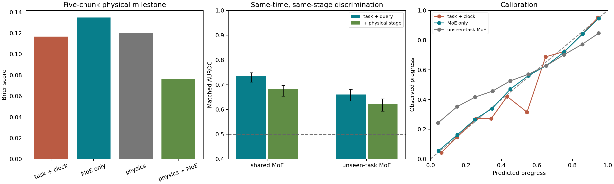

# 固定 5 个 chunk 的物理进展实验

本实验将目标改为未来 50 个动作内是否出现可观测物理里程碑。所有任务共用同一预测窗口；在线只读最近 8 次推理的 MoE，使用一套共享参数。没有预算、绝对时间、任务 ID、机器人状态或物体状态输入。物理信息只用于离线标签、分层评价和明确标注的对照模型。

## 主结果

原始物理提取覆盖 32,000 条自然 rollout、508,023 个检查点、40 个任务。满足观察条件的起点共 278,174 个；主测试有 6,367 条轨迹、55,389 个起点，其中 67.0% 在未来 5 个 chunk 内出现标签所定义的进展。

| 模型 | Brier | Log loss | AUROC | 同任务、同 q、同粗阶段 AUROC（95% 区间） |
|---|---:|---:|---:|---|
| 共享常数先验 | 0.22117 | 0.63433 | 0.5000 | 0.5000 [0.5000, 0.5000] |
| 任务 ID＋时钟（离线对照） | 0.11660 | 0.37659 | 0.8946 | 0.5000 [0.5000, 0.5000] |
| 纯 MoE，共享模型 | 0.13489 | 0.42052 | 0.8663 | 0.6811 [0.6541, 0.6972] |
| 当前物理阶段（离线对照） | 0.12030 | 0.38243 | 0.8813 | 0.6696 [0.6363, 0.6955] |
| 物理阶段＋MoE（离线对照） | 0.07619 | 0.25695 | 0.9503 | 0.7472 [0.7146, 0.7640] |
| 物理阶段＋任务＋时钟（离线对照） | 0.07439 | 0.25463 | 0.9491 | 0.6624 [0.6282, 0.6916] |
| 物理阶段＋任务＋时钟＋MoE（离线对照） | 0.06592 | 0.22570 | 0.9607 | 0.7419 [0.7076, 0.7620] |
| 未见任务：训练折先验 | 0.22306 | 0.63863 | 0.4315 | 0.5000 [0.5000, 0.5000] |
| 未见任务：纯 MoE | 0.19739 | 0.60348 | 0.7353 | 0.6212 [0.5936, 0.6428] |
| 未见任务：物理阶段 | 0.19898 | 0.64828 | 0.7468 | 0.5610 [0.5328, 0.5888] |
| 未见任务：物理阶段＋MoE | 0.14823 | 0.49742 | 0.8542 | 0.6450 [0.6145, 0.6661] |

完整任务留出的纯 MoE 模型，训练和校准均未见测试任务；同任务、同 q、同粗阶段的AUROC 为 0.6212，区间 [0.5936, 0.6428]。在本次固定模型、固定任务的聚类重采样下，区间下界高于 0.5。
这里的 AUROC 与旧终局成功目标不同，不宜直接把数值相减作为改进量。
严格分层下有 33/40 个任务包含可比较的正负样本，其中 25 个的 AUROC 点估计高于 0.5，任务等权平均为 0.6083。不能将总体区间解释为每个任务都有效。

## 概率校准仍有限制

共享纯 MoE 模型的 ECE（10 个等宽概率区间）为 0.0129；完整任务留出后为 0.0946。跨任务时，辨别能力高于随机并不代表绝对概率已经可信。
未见任务的原始概率 Brier/ECE 为 0.18952/0.0461，固定 sigmoid 校准后为 0.19739/0.0946，本次校准在跨任务分布上反而变差。保留全部原始和校准结果，没有按测试表现更换输出头。

## 是否超出物理阶段本身

下表的差值是左侧损失减右侧损失；负值表示加入 MoE 后更低。模型算法与容量设置固定，但信息组合改变了拟合问题，不是因果干预证据。

| 左侧 | 右侧 | Brier 差 | 95% 区间 |
|---|---|---:|---|
| 纯 MoE，共享模型 | 共享常数先验 | -0.08627 | [-0.09350, -0.07898] |
| 纯 MoE，共享模型 | 任务 ID＋时钟（离线对照） | +0.01830 | [+0.01007, +0.02557] |
| 物理阶段＋MoE（离线对照） | 当前物理阶段（离线对照） | -0.04411 | [-0.05016, -0.03891] |
| 物理阶段＋任务＋时钟＋MoE（离线对照） | 物理阶段＋任务＋时钟（离线对照） | -0.00847 | [-0.01258, -0.00515] |
| 未见任务：纯 MoE | 未见任务：训练折先验 | -0.02567 | [-0.03359, -0.01905] |
| 未见任务：物理阶段＋MoE | 未见任务：物理阶段 | -0.05075 | [-0.06020, -0.04268] |

未见任务中，在当前物理阶段对照上加入 MoE 的 Brier 差为 -0.05075，区间 [-0.06020, -0.04268]。区间完全低于零，支持 MoE 在该物理摘要之外仍有预测信息。

## 物理标签

未来 5 个 chunk 内满足任一条件即为正例：采集器记录任务成功；连续两个未来检查点的原始 BDDL 已满足目标数都多于当前；或尚未完成的目标物体新出现双指抓持，且比该物体首个检查点高至少 2.5 厘米，在两个未来检查点均成立，同时没有减少已满足目标数。两个确认点都必须在 q 之后、q+5 以内。单次短暂接触不计为确认事件。

主测试中，未来窗口内成功为 25,549 个起点，目标数增加为 5,377 个，新抓持并抬升为 7,482 个。这些分量可以重叠。正例中有 11,556 个并未在 5 个 chunk 内成功，因此标签包含中间里程碑；同时应注意完成任务可能占正例的较大部分。

这是保守的物理进展代理：接近物体、尚未达到阈值的抽屉运动、两个检查点之间的短事件可能被遗漏。高度以每集首个检查点为基准，也会漏掉某些从已降低位置重新抬起的情况。两次接触观测不保证中间持续接触；没有里程碑不能自动等同于受困。

## 观察范围与对齐

仅纳入 q>=7 且 (q+5)*10 严格小于原定执行上限的起点。此规则在当前即可确定；提前成功仍作为正例保留。严格小于的原因是原日志未保存预算耗尽后的终态，恰好触及上限的完整物理窗口无法核实，不能补写为无进展。

全语料有 290 个采集器尚未停止、但恢复状态并重新前向计算后已满足完整目标的检查点。记录这项差异并排除这些起点，保留更早前缀，终局时间仍来自原采集器。不能声称恢复后的目标判定与采集时每个子步严格相同。
逐状态检查原子谓词与恢复环境的 check_success 一致；所有任务关节布局匹配。恢复机器人读数与日志的最大末端位置误差为 0.001403 米，最大姿态角差为 0.003921 弧度。超过预设位置/姿态/夹爪诊断阈值的检查点数为 0。完整差异保存在物理审计中。

固定预测长度并未消除采集上限对语料分布的影响：晚期存活轨迹和不同任务的阶段分布仍不同。模型只在上述观察范围接受检验；没有识别原策略在原上限以后继续执行的反事实概率。

## 对照与统计

共享模型沿用原初始状态分组：训练、校准、主测试无同任务初态交叉；另保存新噪声但见过初态的次测试结果。40 个任务采用原先冻结的 5 折，每折留出 8 个任务。学习器和校准设置固定，未按新测试结果调参；原始与校准概率都保存在结果中。

粗阶段由当前目标位掩码、目标物体抓持/抬升/接近位掩码组成；接近阈值为 12 厘米。更严格的 AUROC 仅比较同任务、同 q、同粗阶段的正负样本，再按样本对数加权。其有效分层覆盖 33,573/55,389 个主测试起点，共有 382,198 对正负比较。相同粗阶段不等于相同物理状态。

Brier/log loss 差和匹配 AUROC 的 95% 区间均在每个任务内按初始状态聚类重采样 1,000 次，保留同初态的所有种子与多个前缀。区间条件于已有模型与这 40 个任务，不包含重新训练或采样新任务的不确定性。任务级细分和各分层支持数随结果保存。

## 既有报警的描述性检查

half-k4 规则及其报警病例已被旧分析查看，本节不是新的盲测。每条轨迹只取首次报警，所有报警均保留；窗口不可观测时不赋予可靠的正负标签。

| 最终结果 | 首次报警数 | 有效观察窗口 | 窗口内物理进展 | 窗口内成功 |
|---|---:|---:|---:|---:|
| 失败 | 515 | 360 | 4 | 0 |
| 成功 | 42 | 41 | 13 | 4 |

报警后的物理里程碑说明后续有可观测推进；它不能证明报警当时是真 trap。要估计真实受困后的自然脱困概率，仍需独立的受困判据、脱困标注或对齐检查点的分支续跑。

## 复核与使用

本次全量重新读取的是 32,000 条轨迹的模拟器状态；MoE 复用此前校验的全量因果特征缓存。另在 80 条原始路由样本的 1,256 个 chunk 上重放新在线接口，对比 686 个有效预测，最大概率差 0。没有采样或执行新机器人动作。

运行 `bash extract_progress.sh --workers 4` 提取物理状态，随后运行 `python -m probability.run_progress --threads 4`。仅重绘报告用 `--render-only`。协议见 `../PROGRESS_PROTOCOL.md`；在线入口为 `probability.progress_model.MoEProgressMonitor`，模型为 `models/moe_progress_shared.joblib`。每条新 rollout 新建 monitor；前 7 次推理不输出概率。
本实验是已有语料上的追加研究。它验证的是有限观察范围内的物理里程碑预测，不是‘模型知道自己受困’的证明，也不直接说明干预能带来多少增益。

