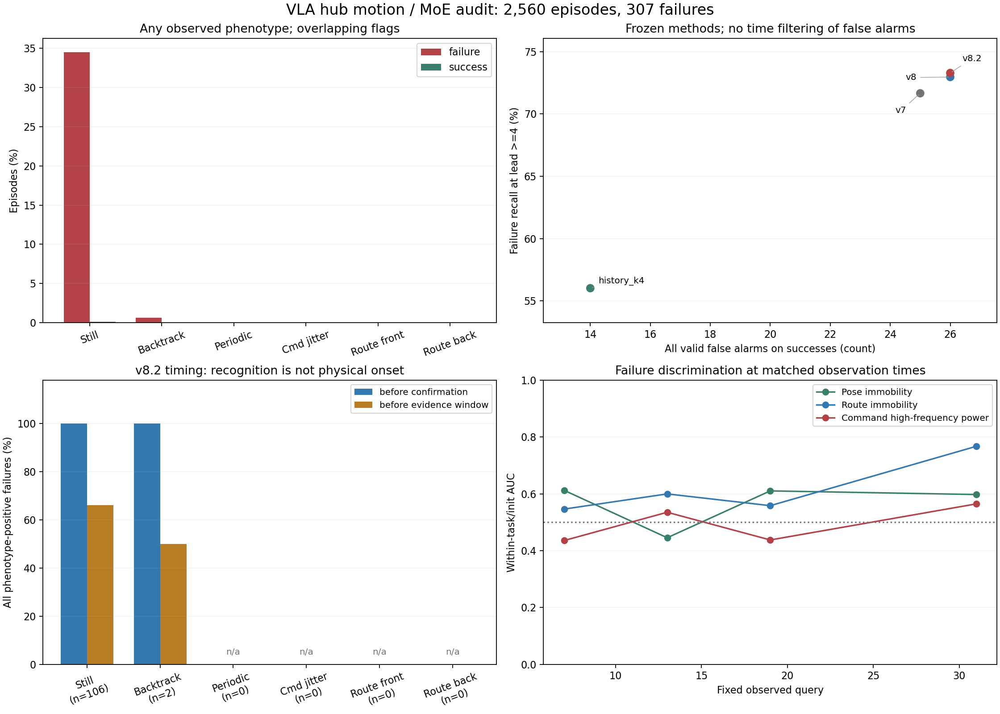

# 运动与 MoE 联合观察

## 本轮范围

已分析 `right-16x32` 的全部 5 个任务、2,560 条轨迹、51,308 次推理：2,253 成功、307 失败。
这是历史数据上的描述性分析；新运动判据没有用这些失败标签调参，但这些数据已经被此前研究查看过。
末端 xyz 每 10 个策略动作观察一次。动作频谱来自生成的 10 步指令，不能替代真实高频运动记录。
其中 2024 条轨迹最后一个 chunk 只执行部分动作；频谱仍明确表示完整预测指令。

## 观察到的模式

各模式可以重叠，不是物理失败原因标签。分母包括短轨迹，窗口可用率另见 `phenotype_metrics.csv`。

| 固定描述性判据 | 失败轨迹 / 307 | 成功轨迹 / 2253 |
|---|---:|---:|
| 末端停滞 | 106 | 2 |
| 末端方向反复 | 2 | 0 |
| 末端周期性回返 | 0 | 0 |
| 预测动作抖动代理 | 0 | 0 |
| 前层路由周期性回返 | 0 | 0 |
| 后层路由周期性回返 | 0 | 0 |

在本轮四类运动判据中，失败轨迹最多出现的是末端停滞。
严格判据下未检出的模式：末端周期性回返、预测动作抖动代理、前层路由周期性回返、后层路由周期性回返。未检出不能证明所有振动均不存在。
周期判据在成功轨迹中有 838/2253 条具备足够窗口，失败轨迹为 307/307；全程发生率不是等观察时长的因果比较。

周期性回返要求在 13 个观察点中实际返回先前状态，并且相对相邻 lag 出现明显距离低谷；
不把距离曲线的弯曲、路由熵变大或方向改变一次直接算成周期。只检查 2–5 query 周期，未检出不表示所有频率均不存在。
动作抖动代理有幅度、频谱和反向差分三个门槛；发生在最终成功的轨迹中也不能自动称为误动作。

下面显示最接近阈值的程度：对所有必需条件取最弱的一项相对阈值比例，连续两 query 取较小值、全轨迹取最大值。
只有比例达到 1 才满足完整判据。极值案例及同期相关性是在看到首轮计数后补充的描述性检查，未改变任何判据或阈值。

| 模式 | 失败中的最高比例 | 成功中的最高比例 |
|---|---:|---:|
| 末端周期性回返 | 0.676 | 0.456 |
| 预测动作抖动代理 | 0.610 | 0.403 |
| 前层路由周期性回返 | 0.531 | 0.550 |
| 后层路由周期性回返 | 0.565 | 0.527 |

## 冻结方法的失败检测

所有告警必须满足 `0 <= q < length`。提前 4 chunk 沿用旧协议 `length - q >= 4`，包含即将执行的 chunk。
主表保留成功轨迹上的全部有效误报，避免用事后时长过滤掉误报。

| 方法 | 任意时刻检出失败 | 提前至少4 chunk检出 | 全部有效成功误报 | 旧口径提前4 chunk误报 |
|---|---:|---:|---:|---:|
| v7 | 257/307 | 220/307 | 25/2253 | 16 |
| v8 | 261/307 | 224/307 | 26/2253 | 16 |
| v8.2 | 262/307 | 225/307 | 26/2253 | 17 |
| history_k4 | 211/307 | 172/307 | 14/2253 | 12 |

**缓存问题已经在本分析中处理：**旧 v8/v8.2 在变长轨迹的 NaN 补齐区间上求和，可能产生假的前后层反转。
本次逐条用未补齐的 flow-speed 重算新增检测头，确认与裁去越界值后的缓存一致；原缓存保留。

| 方法 | 缓存中 q>=length 的告警 | 其中 q==length |
|---|---:|---:|
| v7 | 0 | 0 |
| v8 | 2231 | 0 |
| v8.2 | 2230 | 0 |
| history_k4 | 0 | 0 |

## 是提前还是事后

下面分母是具有该模式的全部失败轨迹，包括从未告警者。q 从 0 开始。
“早于确认”仅表示比积累完整证据更早，不能写成早于物理异常发生；“早于观察窗”要求告警早于用于该事件的最早位置样本。

| 模式 | 有该模式的失败 | v8.2早于确认 | v8.2早于整个观察窗 |
|---|---:|---:|---:|
| 末端停滞 | 106 | 106 | 70 |
| 末端方向反复 | 2 | 2 | 1 |
| 末端周期性回返 | 0 | 0 | 0 |
| 预测动作抖动代理 | 0 | 0 | 0 |
| 前层路由周期性回返 | 0 | 0 | 0 |
| 后层路由周期性回返 | 0 | 0 | 0 |

## 怎么看图



固定 query 的曲线只比较同任务、同初态、仍有该次观察的成功/失败配对。AUC 按配对数加权，方向预先固定。
样本、可配对初态和配对数见 `fixed_query_metrics.csv`。这些是多项描述性比较，不给独立显著性或跨任务泛化保证。

同期关系另外按同任务、同初态、固定 query 比较：将两个信号各自在组内转成秩并去均值，再计算相关性。
结果见 `coupling_metrics.csv`；这不说明 MoE 导致了物理运动。后层路由更新与已观察到的末端位移的结果如下：

| query | 组内秩相关 | 有效轨迹 | 初态组数 |
|---|---:|---:|---:|
| 7 | -0.033 | 2560 | 80 |
| 13 | -0.269 | 1120 | 40 |
| 19 | -0.142 | 657 | 27 |
| 31 | 0.301 | 512 | 16 |

案例按各模式首次确认时刻的中位数选取，分别保留成功和失败；能匹配时加入同任务、同初态、最接近噪声 seed 的反结局对照。
没有通过判据的模式展示最接近阈值的案例，明确标为 `strongest_nondetection`；这些极值只用于检查现象，不作为检测效果证据。
图中灰色区域是证据窗，黑色虚线是确认时刻，彩色竖线为各方法告警；最后一个动作图的灰色后缀表示未执行预测。

- [末端停滞，row 1504，失败，median_confirmation](examples/00_still_row1504.png)
- [末端停滞，row 1124，成功，median_confirmation](examples/01_still_row1124.png)
- [末端停滞，row 1123，失败，matched_opposite_outcome](examples/02_still_row1123.png)
- [末端方向反复，row 691，失败，median_confirmation](examples/03_backtracking_row691.png)
- [末端方向反复，row 687，成功，matched_opposite_outcome](examples/04_backtracking_row687.png)
- [末端周期性回返，row 1166，失败，strongest_nondetection](examples/05_periodic_return_row1166.png)
- [末端周期性回返，row 1163，成功，matched_opposite_outcome](examples/06_periodic_return_row1163.png)
- [末端周期性回返，row 1124，成功，strongest_nondetection](examples/07_periodic_return_row1124.png)
- [末端周期性回返，row 1123，失败，matched_opposite_outcome](examples/08_periodic_return_row1123.png)
- [预测动作抖动代理，row 1985，失败，strongest_nondetection](examples/09_command_jitter_row1985.png)
- [预测动作抖动代理，row 1986，成功，matched_opposite_outcome](examples/10_command_jitter_row1986.png)
- [预测动作抖动代理，row 507，成功，strongest_nondetection](examples/11_command_jitter_row507.png)
- [前层路由周期性回返，row 1074，失败，strongest_nondetection](examples/12_route_periodic_front_row1074.png)
- [前层路由周期性回返，row 1075，成功，matched_opposite_outcome](examples/13_route_periodic_front_row1075.png)
- [前层路由周期性回返，row 1967，成功，strongest_nondetection](examples/14_route_periodic_front_row1967.png)
- [前层路由周期性回返，row 1971，失败，matched_opposite_outcome](examples/15_route_periodic_front_row1971.png)
- [后层路由周期性回返，row 1179，失败，strongest_nondetection](examples/16_route_periodic_back_row1179.png)
- [后层路由周期性回返，row 1180，成功，matched_opposite_outcome](examples/17_route_periodic_back_row1180.png)
- [后层路由周期性回返，row 1967，成功，strongest_nondetection](examples/18_route_periodic_back_row1967.png)
- [后层路由周期性回返，row 1971，失败，matched_opposite_outcome](examples/19_route_periodic_back_row1971.png)

## 对方法设计的含义

1. 保留 v8/v8.2 作为一般路由异常基线；不能把其 flow 曲率或 turbulence 名称直接解释为机器人的物理振荡。
2. 将末端停滞、非周期方向反复、明确周期回返、预测动作抖动分别记录。物理状态只进入本轮事后评价，冻结 MoE 方法不读取它。
3. 按任务和固定 query 检查成功对照后，才能判断运动信号是否具有失败特异性。整体发生率受轨迹长短与任务构成影响。
4. 下一轮需恢复模拟器状态、执行真实动作前缀，并对齐下个保存状态后，记录每步 xyz/姿态/关节速度/接触/目标进展来验证真实振动。
5. 只有独立数据确认有效后，再设计同一触发状态下的原策略、平滑/滞回、v8触发重规划对照。本轮没有执行控制干预，不能声称抖动已减少或成功率已提高。

## 复现

```bash
python VLA_MUI_HUB/moe-motion-diagnostics/analyze.py
python -m pytest VLA_MUI_HUB/moe-motion-diagnostics -q
```

`episode_metrics.csv` 可回查每条轨迹及所有首次确认/告警；`features.npz` 保留逐 query 分数。
`extraction_audit.json`、`input_checksums.json` 和 `summary.json` 记录原数据对齐、逐条物理文件摘要、缓存核验与配置。
`--reuse-features` 仅复用这次已提取的特征，不代表重新校验所有原始 Zarr 字节。
