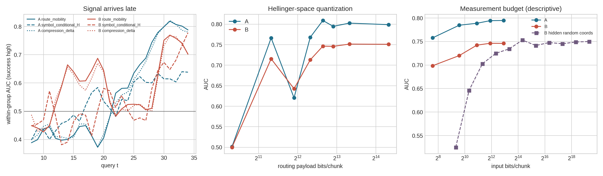

# Kolmogorov 启发的 MoE 动力学实验（train-free）

> 运行日期：2026-09-03。新统计量不训练分类器、不拟合 PCA/k-means、也不使用结局标签构造特征；
> 标签只在特征冻结后用于组内 AUC 与置换检验。分位点和报警阈值属于校准。

## 口径

- A：rolling-star，352 条分支，117 成功 / 235 失败，4 个 worker（3 个混合结局组）。
- B：SCENE8 right-16x32，512 条轨迹，296 成功 / 216 失败，16 个初态（13 个混合结局组）。
- 路由切片：深层 12–15、动作 token 1–10、`d9`（从 0 编号的最后一个去噪步）、32 专家软概率。
- 基线：相邻 chunk 逐 `(layer, token)` 算 Hellinger，再对 40 格和最近 8 chunk 取均值。
- AUC 全部按组内成功–失败配对数合并；`t=30` 时两批轨迹全部仍在场。

## 1. Markov / trap basin

把 W8 路由变化率按早期 `t=8..12` 的无标签四分位点离散成 4 状态，state 0 是低变化，state 3 是高变化。

| corpus | P(low→low) | P(high→high) | low 占比 success / failure | P(low→low) success / failure |
|---|---:|---:|---:|---:|
| A | 0.843 | 0.908 | 0.062 / 0.255 | 0.659 / 0.866 |
| B | 0.786 | 0.911 | 0.055 / 0.249 | 0.607 / 0.845 |

低变化状态确实在失败中更常驻留，但高变化状态同样很粘；因此“低变化盆地”是把旧变化率阈值化后得到的宏状态，
不是从完整路由状态中发现的独立吸引子。已有 20 组 PCA/k-means Markov 检查中，15/20 的瞬态图只有一个完整强连通类。

5-step hitting probability 的组内 AUC：

| corpus | t20 | t25 | t30 | 连续 W8 基线 t30 |
|---|---:|---:|---:|---:|
| A | 0.496 | 0.637 | 0.760 | 0.799 |
| B | 0.524 | 0.527 | 0.722 | 0.751 |

结论：Markov hitting probability 没有产生早期信号，并因四状态量化而弱于连续基线。

## 2. Symbolic entropy rate

每个路由格的 chunk-to-chunk Hellinger 变化按早期无标签四分位点编码成 4 个符号；在 8-step 窗内估计
`H(symbol)`、`H(symbol_t | symbol_{t-1})`、二者比值、符号 novelty 和二周期率。

| metric @ t30 | A raw / residual | B raw / residual |
|---|---:|---:|
| `symbol_marginal_H` | 0.626 / 0.521 | 0.644 / 0.515 |
| `symbol_conditional_H` | 0.615 / 0.543 | 0.673 / 0.535 |
| `symbol_entropy_ratio` | 0.615 / 0.578 | 0.569 / 0.567 |
| `symbol_novelty` | 0.624 / 0.576 | 0.471 / 0.404 |
| `symbol_nonperiod2` | 0.476 / 0.489 | 0.665 / 0.644 |

置换检验使用 2000 次组内标签置换，并对 5 指标 × 3 时点做 maxT。条件熵有原始区分度，但对 W8 变化率做组内秩残差后接近机会线；二周期指标也没有跨语料同向增量。
一个未跨语料复现的早期候选是 B 的 `t20` entropy ratio：raw AUC=0.654，W8 残差 AUC=0.623，maxT `p=0.0105`，9/13 个混合初态同向；A 的对应残差 AUC=0.543（`p=0.999`）。
所以数据支持的是“失败时 route mobility 降低”，尚不支持可跨语料复现的独立 KS-entropy collapse。

## 3. 压缩复杂度

把 `sqrt(p)` 固定量化到 uint8，按 `(cell, expert, time)` 排列，用 raw DEFLATE 长度除以未压缩长度；
delta 版本对时间差分做可逆 modulo-256 编码。它是可计算的压缩代理，不是真正的 Kolmogorov complexity。

| window / metric @ t30 | A raw / matched residual | B raw / matched residual |
|---|---:|---:|
| W8 `raw_ncl` | 0.759 / 0.418 | 0.732 / 0.528 |
| W8 `delta_ncl` | 0.799 / 0.557 | 0.733 / 0.493 |
| W20 `raw_ncl` | 0.722 / 0.468 | 0.739 / 0.512 |
| W20 `delta_ncl` | 0.749 / 0.470 | 0.766 / 0.503 |

压缩长度能读到失败序列更重复，但和同窗口的平均 Hellinger 控制后没有稳定的双语料增量。
A 的 W8 delta-compression 在 `t25` 有单语料残差效应：direction-free AUC=0.665，maxT `p=0.0135`，3/3 个混合 worker 同向；但其 raw AUC=0.613 仍低于 W8，而且 B 的对应残差 AUC=0.509（`p=1.000`）。
因此可以把 compression transition 作为可视化分析，不能替代主检测器。

## 4. ε-entropy / bits per chunk

先在 Hellinger 坐标 `sqrt(p)` 上做均匀量化，再重归一化回 simplex。

| corpus | float16 route（20,480 bit） | 6-bit route（7,680 bit） | ρ(full) |
|---|---:|---:|---:|
| A | 0.799 | 0.795 | 0.9970 |
| B | 0.751 | 0.746 | 0.9965 |

按 `|ΔAUC|≤0.01 且 ρ≥0.99`，两批共同的最小保真点是每个概率 6 bit：相对 float16 输入缩小 2.67×。
这仍是输入路由的存储成本，不是最终报警标量。

使用 6-bit 概率，不做标签选择时，各自然测量预算的中位 AUC：

| family | bits/chunk | A median [min,max] | B median [min,max] |
|---|---:|---:|---:|
| `one_cell` | 192 | 0.758 [0.651,0.818] | 0.698 [0.641,0.754] |
| `one_token` | 768 | 0.785 [0.714,0.802] | 0.720 [0.707,0.740] |
| `one_layer` | 1920 | 0.789 [0.785,0.794] | 0.742 [0.715,0.754] |
| `two_layers` | 3840 | 0.794 [0.790,0.796] | 0.746 [0.731,0.757] |
| `all` | 7680 | 0.795 [0.795,0.795] | 0.746 [0.746,0.746] |

若路由在前向时临时可用、只保存在线算出的标量变化率，则 3 bit/chunk 已给出 A/B AUC 0.798 / 0.744；4 bit 时排序相关超过 0.997。这个数字只回答遥测/落盘成本。

### B-only hidden control

完整 hidden 相邻变化率 AUC=0.750；固定随机坐标每格取 32/1024 维，4 次中位 AUC=0.753。磁盘上的完整 hidden.zarr / routes.zarr = 37.4×。
这说明 routing 文件确实更小，但 hidden 的 Trap 变化也能被少量随机坐标保留；当前数据不能声称 MoE routing 在信息论上是唯一低维的表示。A 没有 hidden capture，所以该控制不能做双语料确认。

## 5. 多尺度 / cascade 检查

四个深层的 W8 变化率在 A 的零延迟相关为 0.904–0.947，B 为 0.902–0.938；两批语料合计 12 组 layer-pair 的最大相关延迟全部是 0（12/12）。
没有观察到逐层传播；与旧 denoise sweep 一样，更像所有切片同时投影同一个 route-mobility 因子。

## 6. 在线报警与物理 onset

阈值按 leave-one-group-out 的成功轨迹校准，连续 3 次低于阈值触发；每个指标只按成功误报率选择最接近旧基线的工作点。

| corpus | metric | FA | detection | median alarm t | known-onset median delay |
|---|---|---:|---:|---:|---:|
| A | `route_mobility_w8` | 0.162 | 0.549 | 29.0 | 8.0 |
| A | `symbol_conditional_H` | 0.120 | 0.570 | 30.0 | 9.0 |
| A | `compression_delta_w8` | 0.162 | 0.566 | 28.0 | 8.0 |
| B | `route_mobility_w8` | 0.044 | 0.718 | 32.0 | nan |
| B | `symbol_conditional_H` | 0.051 | 0.694 | 32.0 | nan |
| B | `compression_delta_w8` | 0.051 | 0.713 | 32.0 | nan |

物理 onset 延迟只在 A 且 `loop_onset_query >= 0` 的轨迹上计算。熵率/压缩没有稳定提前于物理 onset，
也没有在两批同时超过 d9+W8。

## 7. 救回实验的证据边界

现有触发式 fork：q32 报警点重抽 flow noise 为 3/8 成功；随机较早点 q19 同样 3/8。
现有数据没有多个噪声幅度，也只有一个失败 trunk，不能估计 `P_escape(σ)`，更不能把 KAM 当理论依据。
下一项真正需要新增 rollout 的实验应固定多个失败 trunk，预注册 σ 网格和相同随机数，再比较报警点、随机时点和不干预。

## 总结

1. **保留**：`d9 + cross-chunk Hellinger + W8` 仍是最强且最简单的 train-free MoE 基线。
2. **可作机制图**：失败时低 route-mobility 状态更驻留、符号条件熵和压缩长度下降。
3. **未复现**：B-t20 entropy ratio 与 A-t25 delta-compression 各有单语料残差信号，但都没有跨语料复现。
4. **新正结果**：6-bit 概率可保真复现基线；只落盘报警变化率时 3–4 bit/chunk 足够。
5. **限制**：B-only hidden 控制同样低维，因此“routing 独有的信息压缩优势”目前不能声称。

## 产物

- `dynamics_auc.csv`：熵率、递归与时间曲线。
- `markov_*.csv`：转移矩阵、驻留和 hitting probability。
- `compression_auc.csv`：DEFLATE 复杂度代理及基线残差。
- `route_quantization.csv` / `cell_budget.csv` / `telemetry_budget.csv`：信息预算。
- `hidden_budget_B.csv`：B-only hidden 随机坐标控制。
- `group_robustness.csv`：候选信号在各 worker / 初态内的方向与强度。
- `cascade_*.csv`：逐层时序与延迟相关。
- `online_operating_points.csv`：校准后的报警率和 onset 延迟。
