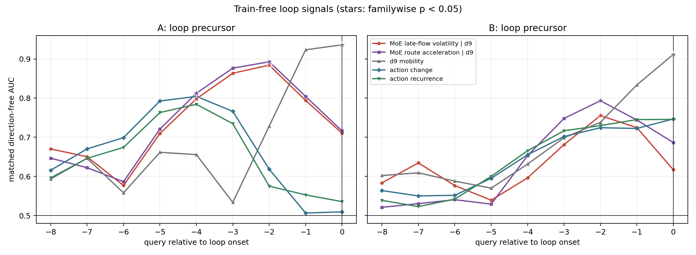
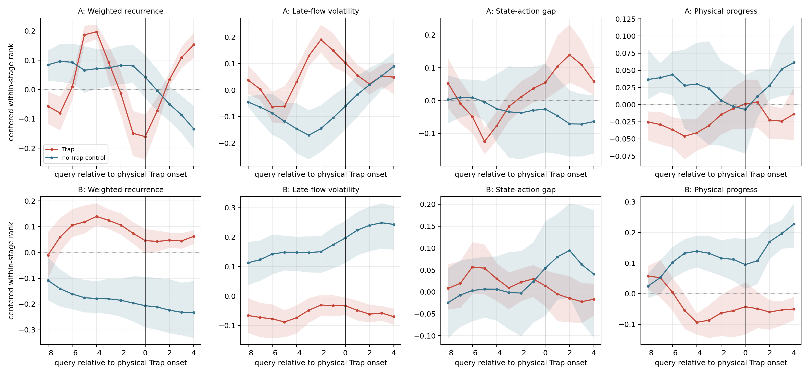
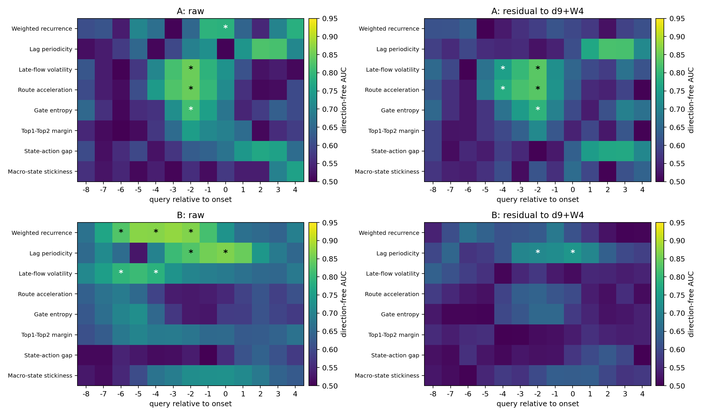

# HiMoE-VLA Train-free Trap 信号矩阵

> 正式运行：2000 次组内标签置换 / 组级 sign-flip；没有训练 outcome predictor、PCA、k-means 或 probe。

## 核心结论

1. `weighted_recurrence` 在固定 t=30 复现了旧 d9 结果，但与 d9 Hellinger mobility 的 Spearman 相关接近 -1；去掉 d9 后没有在 A/B 同时成立，因此它主要是旧变化率的反向表达。
2. 聚合 Trap 的 d9-residual 预注册单元中，A/B 分别有 5/2 个通过 maxT；严格同 signal、同 lead、同方向的跨语料复现为 0 个。
3. loop/static 分层后，跨语料复现单元为 loop/late_flow_volatility@-2, loop/route_acceleration@-2, static/lag_periodicity@0。其中真正位于 onset 前的有 2 个：loop 的 late-flow volatility 与 route acceleration 都在 lead=-2 升高。
4. 所以当前支持的是“type-specific loop precursor”，不是通用 Trap 早预警。聚合任务上 action change/recurrence 在 lead=-4 已很强；但 loop/lead=-2 的动作对照未通过校正。
5. static 的跨语料 periodicity 只在 onset=0 成立，是检测信号而非前兆。新增的物理 Snapshot-Fork 中，loop 前兆在新 rollout 上再次升高，但 fresh-seed 在 -4/-2/0 三个窗口均为 0/8 成功；当前结论是 routing 可作 sensor，尚未证明它能选择 recovery actuator 或最佳触发时机。

## 数据与 Ground Truth

- A：352 条 rolling-star 分支；使用稠密 520-step 物理轨迹定义 loop 或持续 80-action static onset。
- B：512 条 right-16x32 轨迹；使用 query-resolution 代理。该代理先在 A 上验证，再迁移到 B。
- 路由：HB layers 12–15，完整 10 flow；state token=0，action tokens=1–10，逐 token 的 32-way full softmax。
- `gate_entropy`/`top12_margin` 基于 full softmax；它们不是实际 Top-4 combine weights。combine weights 可由 `hb_selected_prob` 归一化恢复。
- 所有 feature 定义不读取成功/失败或 Trap 标签；标签只在评估阶段使用。

| corpus | event | ground truth | events | failure / success | proxy sensitivity | specificity | agreement |
|---|---|---|---:|---:|---:|---:|---:|
| A | loop | dense | 172 | 170 / 2 | 1.000 | 1.000 | 1.000 |
| A | static | dense | 54 | 54 / 0 | 1.000 | 0.943 | 0.952 |
| A | trap | dense | 210 | 208 / 2 | 1.000 | 0.937 | 0.974 |
| B | loop | query_proxy | 57 | 55 / 2 | NA | NA | NA |
| B | static | query_proxy | 146 | 143 / 3 | NA | NA | NA |
| B | trap | query_proxy | 193 | 188 / 5 | NA | NA | NA |

A 上综合 Trap 代理的验证决定 B-onset 结果是否可解释；B 仍明确标为 proxy，不与 A 的稠密真值等同。

## 固定 t=30：Outcome 分离

AUC 是组内成功–失败配对；det AUC 只表示可分性，不预设 Trap 一定高或低。Residual 是组内秩回归去掉 `d9 Hellinger + W8` 后的剩余信号。

| signal | A raw / residual / p | B raw / residual / p | same raw direction |
|---|---:|---:|---:|
| `weighted_recurrence` | 0.800 / 0.565 / 0.9825 | 0.749 / 0.618 / 0.0345 | yes |
| `lag_periodicity` | 0.525 / 0.534 / 1.0000 | 0.737 / 0.651 / 0.0015 | no |
| `late_flow_volatility` | 0.565 / 0.644 / 0.0995 | 0.680 / 0.539 / 0.9985 | no |
| `route_acceleration` | 0.591 / 0.633 / 0.1849 | 0.644 / 0.519 / 1.0000 | no |
| `gate_entropy` | 0.565 / 0.579 / 0.9060 | 0.664 / 0.558 / 0.9040 | yes |
| `top12_margin` | 0.566 / 0.527 / 1.0000 | 0.646 / 0.562 / 0.8556 | yes |
| `state_action_gap` | 0.501 / 0.504 / 1.0000 | 0.568 / 0.542 / 0.9960 | yes |
| `macro_stickiness` | 0.687 / 0.557 / 0.9980 | 0.544 / 0.575 / 0.6202 | no |

### Action-only 对照

| signal @ t30 | A det AUC | B det AUC |
|---|---:|---:|
| `route_mobility` | 0.799 | 0.751 |
| `action_change` | 0.814 | 0.635 |
| `action_recurrence` | 0.805 | 0.701 |
| `action_magnitude` | 0.816 | 0.565 |

## Trap 特异性 Onset 对齐

主检验把每个 Trap episode 与同 snapshot/init-state、同绝对 query 的全部 no-Trap 轨迹比较，包括其他失败；这样不会把一般 success/failure 差异冒充 Trap 信号。

下表给出 lead=-4；`p` 对 8 signals × 5 预注册 lead 共同做 maxT。Residual 是去掉同 query、同组 d9 Hellinger mobility 后的秩残差。

| signal | A raw / residual / p | B raw / residual / p | replicated residual? |
|---|---:|---:|---:|
| `weighted_recurrence` | 0.665 / 0.533 / 1.0000 | 0.869 / 0.613 / 0.5582 | no |
| `lag_periodicity` | 0.508 / 0.550 / 0.9995 | 0.700 / 0.614 / 0.5542 | no |
| `late_flow_volatility` | 0.707 / 0.754 / 0.0220 | 0.787 / 0.507 / 1.0000 | no |
| `route_acceleration` | 0.745 / 0.778 / 0.0085 | 0.591 / 0.591 / 0.8576 | no |
| `gate_entropy` | 0.566 / 0.669 / 0.1819 | 0.652 / 0.597 / 0.7666 | no |
| `top12_margin` | 0.572 / 0.599 / 0.7721 | 0.685 / 0.501 / 1.0000 | no |
| `state_action_gap` | 0.522 / 0.583 / 0.9260 | 0.516 / 0.511 / 1.0000 | no |
| `macro_stickiness` | 0.538 / 0.607 / 0.6707 | 0.672 / 0.577 / 0.9720 | no |

### 通过聚合 Trap 主检验的 residual 单元

| corpus | signal | lead | direction | det AUC | maxT p |
|---|---|---:|---|---:|---:|
| A | `late_flow_volatility` | -4 | trap_high | 0.754 | 0.0220 |
| A | `route_acceleration` | -4 | trap_high | 0.778 | 0.0085 |
| A | `gate_entropy` | -2 | trap_low | 0.792 | 0.0045 |
| A | `late_flow_volatility` | -2 | trap_high | 0.835 | 0.0005 |
| A | `route_acceleration` | -2 | trap_high | 0.833 | 0.0005 |
| B | `lag_periodicity` | -2 | trap_high | 0.711 | 0.0155 |
| B | `lag_periodicity` | 0 | trap_high | 0.737 | 0.0015 |

### 同 lead 的 train-free 对照

这些 p 值在 comparator 自己的 5 signals × 5 leads 族内校正。physical progress 与 Trap 定义相邻，只作 sanity check。

| comparator @ lead=-4 | A det / p | B det / p |
|---|---:|---:|
| `route_mobility` | 0.695 / 0.1739 | 0.872 / 0.0010 |
| `action_change` | 0.853 / 0.0020 | 0.845 / 0.0055 |
| `action_recurrence` | 0.827 / 0.0030 | 0.847 / 0.0055 |
| `action_magnitude` | 0.631 / 0.5087 | 0.834 / 0.0100 |
| `physical_progress` | 0.589 / 0.8336 | 0.786 / 0.0395 |

## Loop / Static 分层

每类事件都与同组、同 query 的 all-no-that-event 控制比较；maxT 同时覆盖 2 event types × 8 signals × 5 leads。

| corpus | event | signal | lead | direction | residual det AUC | maxT p |
|---|---|---|---:|---|---:|---:|
| A | loop | `late_flow_volatility` | -4 | event_high | 0.798 | 0.0110 |
| A | loop | `route_acceleration` | -4 | event_high | 0.812 | 0.0070 |
| A | loop | `gate_entropy` | -2 | event_low | 0.829 | 0.0030 |
| A | loop | `late_flow_volatility` | -2 | event_high | 0.884 | 0.0005 |
| A | loop | `route_acceleration` | -2 | event_high | 0.893 | 0.0005 |
| A | loop | `top12_margin` | -2 | event_high | 0.778 | 0.0160 |
| A | static | `weighted_recurrence` | -2 | event_high | 0.741 | 0.0490 |
| A | static | `lag_periodicity` | 0 | event_high | 0.761 | 0.0245 |
| A | static | `weighted_recurrence` | 0 | event_high | 0.778 | 0.0160 |
| B | loop | `late_flow_volatility` | -2 | event_high | 0.755 | 0.0285 |
| B | loop | `route_acceleration` | -2 | event_high | 0.793 | 0.0055 |
| B | static | `lag_periodicity` | -2 | event_high | 0.749 | 0.0370 |
| B | static | `lag_periodicity` | 0 | event_high | 0.753 | 0.0320 |

严格跨语料复现共 3 个，其中 onset 前 2 个。分层解释了 aggregate 的方向冲突；只有通过跨类型 maxT 的单元计入证据。

### 跨语料复现单元

| event | signal | lead | direction | A det / p | B det / p |
|---|---|---:|---|---:|---:|
| loop | `late_flow_volatility` | -2 | event_high | 0.884 / 0.0005 | 0.755 / 0.0285 |
| loop | `route_acceleration` | -2 | event_high | 0.893 / 0.0005 | 0.793 / 0.0055 |
| static | `lag_periodicity` | 0 | event_high | 0.761 / 0.0245 | 0.753 / 0.0320 |

### Loop 在 lead=-2 的对照

对照 p 值共同校正 2 event types × 5 comparators × 5 leads。

| comparator | A det / p | B det / p |
|---|---:|---:|
| `route_mobility` | 0.728 / 0.2064 | 0.738 / 0.2549 |
| `action_change` | 0.618 / 0.7806 | 0.724 / 0.3148 |
| `action_recurrence` | 0.575 / 0.9855 | 0.730 / 0.2929 |
| `action_magnitude` | 0.640 / 0.6322 | 0.579 / 1.0000 |
| `physical_progress` | 0.514 / 1.0000 | 0.637 / 0.8346 |

## Success-only 敏感性分析

与 success/no-Trap 控制比较时，d9-residual 通过的预注册单元为 5 个。这回答的是偏离健康成功轨迹，不是 Trap 特异性；完整结果保存在 `onset_alignment.csv`。

## Macro-state stickiness

- A: highest `Pii=0.645` at state 10; descriptive high-stickiness/low-progress states: 10, 11.
- B: highest `Pii=0.540` at state 13; descriptive high-stickiness/low-progress states: 11.

16 个状态由四个早期无标签中位数位组成：route change、gate entropy、late-flow volatility、state-action gap。所谓 descriptive basin 使用同批物理 progress，只作机制描述，不当作独立预测证据。

## Snapshot-Fork 恢复实验

### 设计

- 任务固定为 LIBERO-10 task 8：`put both moka pots on the stove`；冻结 checkpoint、环境和全部信号定义，不训练或拟合任何 predictor。
- trunk 只用物理 query 轨迹判定 loop onset，不读取 MoE；本次失败 trunk 在 query 36 进入 loop，匹配到 query 30，episode 最终 520 actions / 52 queries 未成功。
- 从完全相同的 simulator/controller state 在 onset 的 -4、-2、0 query 分叉；每个窗口注入 8 条 fresh Gaussian flow-noise 序列。
- candidate 0--7 在三个窗口使用同一组相对 noise streams，便于配对；原 trunk continuation 是无干预 control。每次重规划执行 10 个低层动作，所以 lead=-2 对应约 20 个低层动作，而不是 2 个动作 token。

| offset | fork query | fresh-seed success | rate | Wilson 95% CI |
|---:|---:|---:|---:|---:|
| -4 | 32 | 0 / 8 | 0.000 | [0.000, 0.324] |
| -2 | 34 | 0 / 8 | 0.000 | [0.000, 0.324] |
| 0 | 36 | 0 / 8 | 0.000 | [0.000, 0.324] |

三个 offset 是不同物理状态，并且共享配对 candidate streams，不能把 0/24 当作 24 个独立干预重复。0/8 只说明这个 basin 中没有观察到恢复；样本量仍不足以声称 fresh seed 永远无效。

### 新 rollout 上的信号核验

以下 percentile 使用同 init-state 的 22 条历史 no-loop 轨迹、同绝对 query 作描述性 calibration；它不是新增训练，也不是预注册显著性检验。

| offset | late-flow volatility / pct | route acceleration / pct | d9 mobility / pct |
|---:|---:|---:|---:|
| -4 | 0.02357 / 81.8% | 0.00707 / 90.9% | 0.03328 / 81.8% |
| -2 | 0.02721 / 100.0% | 0.00776 / 100.0% | 0.03390 / 81.8% |
| 0 | 0.02939 / 100.0% | 0.00814 / 100.0% | 0.04742 / 100.0% |

在 lead=-2，两个跨语料复现的 MoE flow 信号都高于 22/22 个 no-loop controls，而旧 d9 mobility 只有 81.8 百分位。这是对“loop 前约两个 chunk 出现 flow-routing 异常”的新个案机制核验。可是同一时刻 fresh seed 仍是 0/8，所以检测信号强并不等价于可恢复性高。

### 与旧恢复结果的关系

- 旧 init 7/q32 fresh-noise 为 3/8，但更早的 random q19 也是 3/8，没有显示 MoE 时机优势。
- 本次先按预定 seed 复跑 init 7；当前硬件上原 trunk 在 375 actions 成功，未形成可分叉 loop。相同 seed 与旧 A100 rollout 不再逐步复现，因此保留结果但不把它替换成失败样本。
- 随后的预定扫描首先命中 init 3 的失败 loop，三个窗口全部 0/8；结合旧结果，只能说重采样偶尔可救，尚未证明由 MoE signal 触发优于随机/固定时机。
- 既有 route max/min/random candidate-selection 实验也均未救回。现有最稳妥的机制判断是 **sensor evidence positive, actuator evidence negative/inconclusive**。

## 证据边界

- state token 跨 flow 的最大概率偏差：A=0.00269，B=0；因此 flow volatility/acceleration 只定义在 action tokens。
- full softmax 接近均匀是已知 capture 性质；hard Top-4 边界受 fp16 近平局影响。本轮主时序距离使用 soft probability，避免把 ID 翻转直接解释成动力学跳变。
- 当前 capture 没有每个 flow step 的中间 action trajectory，不能在同一 A/B 上计算真正的 flow-action acceleration baseline。
- SAFE/VLA-FAIL 属于 supervised probe，不纳入本轮 train-free 主检验；action change/recurrence/magnitude 是可用的无训练对照。
- Snapshot-Fork 目前只有一个形成 loop 的新 trunk、每窗口 K=8；它能否跨 init/task 复现，以及其他干预（short chunk、retract、higher-noise）的 ATE，仍未回答。
- onset-aligned AUC 是离线排序证据，不自动给出成熟 online threshold。严格按 episode leave-one-out 控制 specificity 时，现有 loop 覆盖不足，因此目前不能声称已经得到可靠在线报警器。
- B 的 static onset 是经过 A 验证的 query proxy，不能冒充 dense-contact ground truth。

## 产物

- `fixed_time_auc.csv`: 八信号固定时点评估和 maxT。
- `onset_alignment.csv`: onset-relative AUC、残差与多重校正。
- `onset_group_effects.csv`: 每个 snapshot/init-state 的方向。
- `type_onset_alignment.csv` / `type_onset_group_effects.csv`: loop/static 分层。
- `aligned_means.csv`: 四张时间对齐曲线的数据。
- `macro_states.csv` / `macro_transition.csv`: 确定性 macro-state 动力学。
- `onset_inventory.csv`: A 稠密真值与 B 代理审计。
- `recovery_window_summary.csv` / `recovery_signal_audit.csv`: Snapshot-Fork 成功率与同 init-state no-loop 百分位审计。
- `recovery_window/scan_init3_seed20260903/`: trunk、三个完整物理快照、24 条 candidate JSON/NPZ 和代表性视频。
- `recovery_window_collect.py`: 可重复的 train-free 物理 onset + paired Snapshot-Fork collector。
