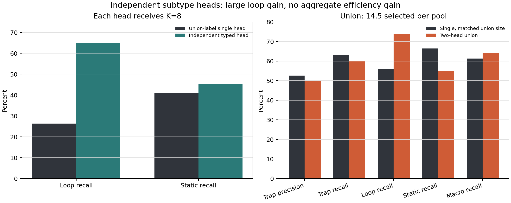

# 独立分型双头 Trap trajectory selector

> **状态说明（2026-09-03）：**最终要求是 train-free。当前结果与可执行选择器
> 见 [`trainfree/REPORT.md`](trainfree/REPORT.md)。本文件仅保留此前有监督
> logistic heads 的参考结果，其拟合 AUC 不能作为 train-free 证据。

## 修正后的结论

用户澄清的设定是：**loop 和 static 分开处理，每个 head 都拥有完整的 K=8 选择预算**，而不是
共享一个 K=8 再拆成 4+4。按这个定义，答案是：**双头确实提高了各自类型被选出来的概率。**

在 `q=34`、外层 leave-one-init-state-out 下：

| 目标 | 任意-Trap 单头 top-8 | 对应 specialist top-8 | recall 差 | 95% CI | p |
|---|---:|---:|---:|---:|---:|
| Loop | 26.32% | **64.91%** | **+38.60 pp** | [21.43, 57.35] | 0.0020 |
| Static | 41.10% | **45.21%** | **+4.11 pp** | [1.73, 7.45] | 0.0011 |

Loop head 的 precision 也从单头在 loop 上的 11.72% 升到 **28.91%**；static head 从
46.88% 升到 **51.56%**。所以“分型后各管一种”是成立的，特别是 loop，不是之前报告里的小幅趋势。



## 为什么之前看起来没有提高

上一版主表把总预算固定为 8，并强行分成 `4 loop + 4 static`。它回答的是“固定总计算量时是否
提高任意 Trap 命中”，不是你说的“每种单独处理”。在那个约束下，两个 head 会竞争名额：loop
增加的同时 static 被挤掉，所以总体没有提高。该结果现在只保留为固定总预算对照。

当两个 head 各选 8 条时，它们在每个 32 分支池中有重叠；取并集后平均选 **14.5 条**
（范围 12--16），不是 8 条。typed 双头并集的结果为：

| selector | 每池平均条数 | Trap precision | Trap recall | Loop recall | Static recall | 类型宏平均 |
|---|---:|---:|---:|---:|---:|---:|
| 两个独立 typed heads 的并集 | 14.5 | 50.00% | 60.10% | **73.68%** | 54.79% | **64.24%** |
| 单头，逐池匹配相同并集大小 | 14.5 | **52.59%** | **63.21%** | 56.14% | **66.44%** | 61.29% |

这说明两件事同时成立：

1. 相对原来的单头 top-8，双头并集的 Trap recall 从 36.79% 上升到 60.10%，但选择预算也从
   8 增到 14.5。
2. 控制相同并集大小后，双头的总体 Trap recall 反而低 **3.11 pp**，CI
   `[-6.77, 0.37]`，`p=0.1094`；没有总体排序效率增益。

匹配预算后，双头仍将 loop recall 提高 **17.54 pp**（`[6.45, 34.00]`, `p=0.0042`），
但 static recall 降低 **11.64 pp**（`[-20.23, -4.23]`, `p=0.0011`）。类型宏平均增加
2.95 pp，CI `[-1.45, 10.19]`，未排除零效应。

因此最准确的表述是：

> 独立双头显著改善 subtype-specific selection，尤其能把 loop 单独挑出来；它没有改善
> “任意 Trap / 每单位选择预算”的总体排序效率。

## Head 是否真的分化

是。q=34 时，各 specialist 对自己目标的组内 OOF AUC 为：

| score | target | AUC |
|---|---|---:|
| 单头 | 任意 Trap | 0.894 |
| Typed loop head | Loop | **0.867** |
| Typed static head | Static | **0.925** |
| Typed noisy-OR | 任意 Trap | 0.890 |

Loop/static head 在各自任务上都形成了有效排序。把二者压回一个标量或共享固定预算，才会重新引入
两种异向机制之间的冲突。

## 固定总预算对照

如果部署约束是“每个初态总共只能选 8 条”，结果仍是：

| selector | Trap precision | Trap recall | Loop recall | Static recall | 类型宏平均 |
|---|---:|---:|---:|---:|---:|
| random expectation | 37.70% | 25.00% | 25.00% | 25.00% | 25.00% |
| single | **55.47%** | **36.79%** | 26.32% | **41.10%** | 33.71% |
| double typed, 4+4 quota | 50.00% | 33.16% | **42.11%** | 30.82% | 36.46% |
| double typed, noisy-OR top-8 | 55.47% | 36.79% | 36.84% | 36.99% | 36.91% |

4+4 quota 相对单头的 Trap precision/recall 分别下降 5.47 pp 和 3.63 pp；noisy-OR 保持
相同 Trap 总命中，并把预算从 static 向 loop 调整。这个对照不否定独立 head，而是说明固定总 K
时不存在免费收益。

## Hard Top-4 消融

去掉所有 hard expert-ID/support 特征后，soft typed loop head 的 recall 仍为 **64.91%**，与完整
typed loop head 相同；soft static head 为 43.84%。这说明 loop 的提升主要来自 gate 尖化、完整
flow 不稳定等概率特征，不依赖 fp16 第四/第五名边界敏感的专家 ID。

soft 双头并集平均选择 14.88 条，Trap recall 63.21%；匹配大小的单头为 65.80%。结果方向与完整
typed 双头一致：保留分型覆盖变化，但没有总体效率增益。

## 顺序扫描

顺序扫描是另一种约束：两个 head 的 OR 报警必须共同满足同一个 trajectory-level 8% no-Trap
误报预算。每个外层测试初态的阈值由其余初态再做 inner-LOIO 校准。

| selector | 外层误报 | Trap precision | Trap recall | Loop recall | Static recall |
|---|---:|---:|---:|---:|---:|
| single | 7.21% | **87.89%** | **86.53%** | **59.65%** | **97.26%** |
| double shared, max | 8.15% | 85.87% | 81.87% | 52.63% | 93.84% |
| double typed, noisy-OR | 7.84% | 79.17% | 49.22% | 43.86% | 52.74% |

这里双头没有提高，因为两个独立报警又被压回同一误报预算。并且 86.53% 是“最终会出现 Trap”的
轨迹级筛选，不是可靠 onset 提前量：到 q=34 真正 onset 的只有 18/193 条（loop 16、static 2）。

## 建议

- 若目的是分别建设 loop/static 数据集，使用两个独立队列，每个 head 分配自己的 K；这是本轮明确
  支持的使用方式。
- 若目的是单一在线报警或固定总计算预算，保留单头；双头不会提高任意 Trap 的单位预算命中率。
- Loop head 的收益强且不依赖 hard Top-4 ID；static head 的增益较小，跨任务验证优先级更高。
- 这仍是 Trap trajectory selector，不是同一状态多个 action candidate 之间的动作 selector，也未
  证明被选中后的恢复干预有效。

## 复现与产物

```bash
python double-selete/run_double_selector.py --bootstrap 20000
python double-selete/validate_results.py --expected-bootstrap 20000
pytest -q double-selete/test_double_selector.py
```

- `PROTOCOL.md`：原固定总预算协议及用户澄清后的独立-head estimand。
- `results/independent_heads_metrics.csv`：每个 head 独立 K、并集及匹配预算单头结果。
- `results/independent_heads_bootstrap_deltas.csv`：独立-head 的 20,000 次配对 CI/p。
- `results/independent_heads_by_init_state.csv`：逐初态选择计数和 episode ID。
- `results/selection_metrics.csv`：固定总 K 对照。
- `results/fixed_time_auc.csv`：各 head 的分型 AUC。
- `results/sequential_metrics.csv`：共同误报预算下的顺序扫描。
- `run_double_selector.py`：完整特征、LOIO、选择和 bootstrap 实现。
- `results/manifest.json`：语料计数与冻结参数。
