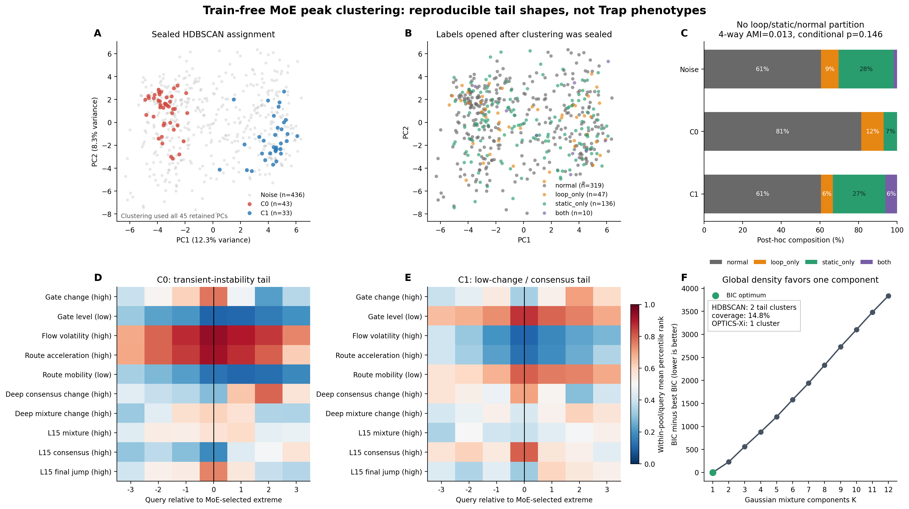

# MoE 峰谷的 Train-free 无监督聚类

## 结论

**结果偏负面：MoE 时序中确实存在两个可重复的尾部形状，但它们没有把
`loop`、`static`、`normal` 自然分开，因此当前不能把聚类直接当作 Trap
识别器。**

冻结的 HDBSCAN 自适应得到 2 个簇，但只覆盖 76/512（14.8%）轨迹，其余
436 条（85.2%）为 noise。把 noise 保留为一个 assignment 后，四类
`normal / loop_only / static_only / both` 的 AMI 仅为 **0.013**，同 init pool
内 20,000 次条件置换检验 `p=0.146`。排除 10 条 `both` 后，三类 AMI 为
**0.012**，`p=0.198`。

## 无标签聚类结果

| 方法 | 自适应结果 | 覆盖率 | 解释 |
|---|---:|---:|---|
| HDBSCAN（主方法） | 2 簇，大小 43/33 | 14.8% | 只找到两个稀疏尾部，85.2% 为 noise |
| OPTICS-Xi | 1 簇 | 100% | 没有全局离散结构 |
| diagonal GMM + BIC | **K=1** | 100% | BIC 不支持多簇全局模型 |
| temporal-novelty anchor + HDBSCAN | 0 簇 | 0% | 全部为 noise |
| fixed-prefix full curve + HDBSCAN | 0 簇 | 0% | 全部为 noise |

HDBSCAN 的两个尾部不是随机数值事故：1% jitter 的 30 次复验均为 2 簇，
相对主 assignment 的 ARI 中位数为 0.876；随机保留 80% 特征时 ARI 中位数为
0.703，但部分复验退化为全 noise。逐 `(pool, query, component)` 打乱轨迹身份后，
30 次均为全 noise，说明局部时间结构和跨 component 配对对这两个尾部是必要的。
同规模三高斯簇阳性对照准确恢复 3 簇，ARI=1.0。

因此更准确的说法是：**存在两个有一定稳定性的 MoE 尾部形状，但整体样本更像
连续单峰分布，而不是三个自然表型簇。**

## 标签揭盲

标签仅在聚类 assignment、协议、代码和输入哈希封存后打开。`both` 没有被强行
归入 loop 或 static。

| assignment | n | normal | loop only | static only | both | 成功率 |
|---|---:|---:|---:|---:|---:|---:|
| 全体 | 512 | 62.3% | 9.2% | 26.6% | 2.0% | 57.8% |
| noise | 436 | 60.6% | 9.2% | 28.4% | 1.8% | 56.0% |
| cluster 0 | 43 | **81.4%** | 11.6% | 7.0% | 0.0% | **76.7%** |
| cluster 1 | 33 | 60.6% | 6.1% | 27.3% | 6.1% | 57.6% |

主检验如下。AMI/ARI 为 0 表示与随机独立近似，1 表示完全一致；负 ARI 表示比
随机配对还差。这里不使用 AUC，因为无监督聚类没有预先指定正类，也没有一个
用于排序的单标量。

| 揭盲目标 | AMI | NMI | ARI | pool 内置换 p |
|---|---:|---:|---:|---:|
| 四类 phenotype，全部 512 条 | **0.013** | 0.021 | -0.027 | 0.146 |
| 三类，排除 `both` | **0.012** | 0.018 | -0.032 | 0.198 |
| 四类，仅 HDBSCAN 接纳的 76 条 | 0.058 | 0.087 | 0.065 | 0.023 |
| Trap vs normal，全部 512 条 | 0.010 | 0.013 | -0.020 | 0.021 |

“仅接纳样本”检验是次要分析，且效应仍很小。Trap 二分类的未校正 `p=0.021`
也不能解释为检测成功：关联主要来自 cluster 0 **排斥 Trap、富集成功 normal**，
而不是形成了一个 Trap 簇；cluster 0 中只有 8/43 是 Trap。多项次要检验也未做
事后挑选校正。预先冻结的四类主检验不显著。

## 两个 MoE 形状是什么

数值是同一 `(init pool, query)` 内的 percentile rank；越接近 1，越符合分量名
括号中的方向。

- **cluster 0：短暂失稳尾部。** 锚点处 late-flow volatility 为 0.938、route
  acceleration 为 0.920，而 gate-level-low 与 route-mobility-low 分别仅 0.100、
  0.133。它像一次强烈的动态修正脉冲，但 35/43 是 normal，33/43 最终成功。
- **cluster 1：低变化/共识尾部。** 锚点处 volatility 为 0.102、acceleration
  为 0.127，而 gate-level-low、mobility-low、L15 consensus 分别为 0.862、
  0.801、0.800。形状更接近 static 假设，但 static（含 both）只有 11/33，
  相对全体的 28.5% 只升到 33.3%。

所以形状本身有机制意义，却不是类型标签：正常恢复也会产生尖峰，正常稳定执行
也会产生低变化/高共识。仅凭“峰或谷”缺少任务进度和反馈失配信息。

## 方法

1. 使用同一 moka-pot 任务的 `right-16x32` corpus B：16 个初始状态，每个状态
   32 条轨迹，共 512 条；296 success、216 failure。
2. 使用所有轨迹共同存在的 `q4..q34` 前缀，避免把提前成功造成的 episode 长度、
   可见后缀和 failure 跑满 horizon 直接聚成簇。
3. 只读 10 个 soft-probability MoE component，不读 success、动作、物理状态、
   loop/static 标签或 onset；不使用 hard Top-4 expert ID，也不使用已经合成的
   loop/static head score。
4. 每个 component 在同一 `(init pool, query)` 内转为 percentile rank。每条轨迹
   以 `argmax RMS(rank-0.5)` 选择纯 MoE 极值锚点，截取前后各 3 query。
5. 拼接 7x10 level、6x10 delta、每维 mean/std/min/max，共 170 维；median/IQR
   robust scale 后用 PCA 保留 90% 方差，得到 45 维。
6. 主算法用 HDBSCAN，`min_cluster_size=ceil(sqrt(512))=23`，
   `min_samples=ceil(log2(512))=9`，不预设 K 并允许 noise。标签不参与表示、
   参数、K 或 cluster ID 的选择。
7. 揭盲后用 AMI/NMI/ARI 和在 16 个 init pool 内的 20,000 次条件置换检验。

没有把 14,800 条跨任务轨迹直接混在主聚类里：那会首先按任务、horizon 和
成功终止长度分组，而且当前可核验的 loop/static 逐轨迹标签集中在这 512 条语料。
先在同任务、同固定时间窗内检验，才能回答峰谷本身是否对应 Trap，而不是回答
任务身份是否容易被 MoE 识别。

## 边界

固定公共前缀也是一个有意的限制：57 个 loop 中只有 16 个、146 个 static 中只有
2 个在 q34 前发生物理 onset。因此本轮主要检验的是“能否从无标签的早期 MoE
极值自然形成可报警的表型簇”，并不是使用 onset 标签对齐后的事中形状分类。
若用 onset 选窗口，就已经不是纯无监督；若直接使用完整可见轨迹，则会把成功早停
和失败长轨迹泄漏进聚类。当前结果不能越过这条边界解释。

另外，这十个 component 来自此前机制分析。聚类过程是 label-blind、train-free，
但不是在独立数据集上从零发现特征。结论需要冻结后在新任务或新 rollout 上复验。

## 产物

- 冻结协议：[`UNSUPERVISED_CLUSTER_PROTOCOL.md`](UNSUPERVISED_CLUSTER_PROTOCOL.md)
- 无标签聚类：[`cluster_moe_peaks.py`](cluster_moe_peaks.py)
- 标签揭盲评估：[`evaluate_moe_peak_clusters.py`](evaluate_moe_peak_clusters.py)
- 图：[`figures/unsupervised_moe_peak_clusters.png`](figures/unsupervised_moe_peak_clusters.png)
- assignment：[`results/unsupervised_cluster/unlabeled_cluster_assignments.csv`](results/unsupervised_cluster/unlabeled_cluster_assignments.csv)
- 完整摘要：[`results/unsupervised_cluster/evaluation_summary.json`](results/unsupervised_cluster/evaluation_summary.json)

