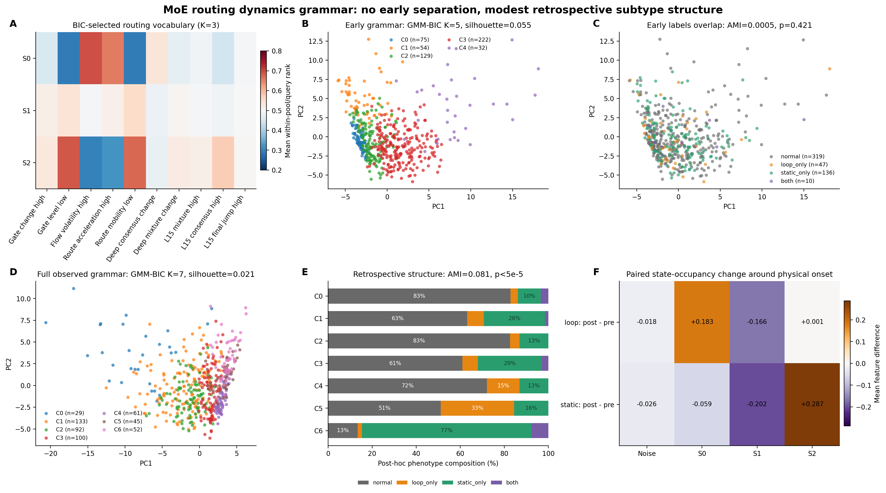

# MoE 路由动态语法无监督聚类

## 结论

**这次比“单个最强峰”多得到了一条有机制意义的结果，但仍不能作为早期报警器：**

- 在所有轨迹共同存在的早期窗口 `q6..q32`，动态语法没有分开
  `normal / loop / static`：GMM-BIC 自适应五分区的四类 AMI 仅 **0.0005**，
  条件置换 `p=0.421`；success/failure AMI 为 -0.0024，`p=0.849`。
- 使用每条轨迹的完整可见序列后，GMM-BIC 七分区出现**统计显著但仍偏弱**的
  phenotype 结构：四类 AMI **0.081**，`p<5e-5`。
- 该完整序列关联并不只是 episode length：在 216 条等长 `T=52` failure 中，
  四类 AMI 为 **0.084**；只比较 47 个 loop-only 和 136 个 static-only，AMI 为
  **0.083**，均 `p<5e-5`。
- 但 HDBSCAN 在早期和完整语法上都找不到任何密度簇，OPTICS 也只得到一个全局簇；
  GMM 簇的 silhouette 只有 0.055/0.021，且扰动下 K 和 assignment 不稳定。

所以准确判断是：

> **loop/static 的差异确实更多存在于状态驻留与转移语法中，而不是单个峰；但这种
> 差异主要在物理 onset 之后才显现，并呈连续谱而非稳定自然簇。**

## 三个无标签路由状态

状态词汇只用公共前缀的 13,824 个五-query 窗口学习。状态层 HDBSCAN 将全部窗口
判为 noise；在揭盲前按无标签 BIC 改用 diagonal GMM，自动选择 K=3。

| 状态 | 主要中心形状 | flow volatility rank | acceleration rank | gate-level-low rank | mobility-low rank |
|---|---|---:|---:|---:|---:|
| S0 | 动态失稳/修正 | 0.695 | 0.655 | 0.290 | 0.291 |
| S1 | 中间/常规计算 | 0.495 | 0.514 | 0.541 | 0.554 |
| S2 | 低变化/稳定支持 | 0.297 | 0.321 | 0.685 | 0.673 |

这三个状态和先前机制假设一致：S0 类似 volatility/acceleration 脉冲，S2 类似
低 mobility、较平坦 gate 的稳定状态，S1 位于中间。但状态本身不等于标签；关键
是轨迹在状态间如何驻留和切换。

## 为什么早期仍然分不开

早期每条轨迹都用相同的 27 个状态中心 `q6..q32`。四类的主要动态统计非常接近：

| phenotype | S0 occupancy | S2 occupancy | switch rate | lag-2 recurrence |
|---|---:|---:|---:|---:|
| normal | 0.345 | 0.299 | 0.330 | 0.512 |
| loop only | 0.351 | 0.318 | 0.313 | 0.522 |
| static only | 0.319 | 0.349 | 0.325 | 0.522 |
| both | 0.274 | 0.381 | 0.331 | 0.524 |

57 个 loop 中只有 16 个、146 个 static 中只有 2 个在 q34 前发生 onset。大多数
轨迹在这个窗口仍处于相同任务阶段，因此即使把单峰升级为完整状态语法，也没有足够
信息区分未来是否进入 Trap。早期 GMM 五个分区的 normal 比例都在 53.7%-65.6%，
没有形成 Trap 富集簇。

## 完整轨迹出现了什么

加入后缀后，状态占用和驻留开始沿类型分化：

| phenotype | S0 occupancy | S2 occupancy | longest S0 dwell | longest S2 dwell | switch rate |
|---|---:|---:|---:|---:|---:|
| normal | 0.358 | 0.309 | 0.182 | 0.167 | 0.324 |
| loop only | **0.470** | 0.288 | **0.262** | 0.134 | 0.260 |
| static only | 0.285 | **0.495** | 0.140 | **0.327** | **0.244** |
| both | 0.273 | 0.450 | 0.141 | 0.316 | 0.267 |

这对应一个清晰但事后的机制图景：loop 更长时间停留在 S0 动态状态；static 更长
时间停留在 S2 低变化状态，并且整体切换更少。

同一 episode 的 onset 前后配对进一步支持这个解释。为避免五-query 窗跨过事件，
pre 只保留中心 `q <= onset-2`，post 只保留 `q >= onset+2`，两侧至少各 3 个状态：

| 事件 | 配对 n | 关键状态 | onset 前占用 | onset 后占用 | 平均变化（95% bootstrap CI） | sign-permutation p |
|---|---:|---|---:|---:|---:|---:|
| loop | 37 | S0 动态状态 | 0.391 | 0.574 | **+0.183 [0.069, 0.289]** | 0.0034 |
| static | 141 | S2 低变化状态 | 0.410 | 0.697 | **+0.287 [0.222, 0.351]** | <5e-5 |

两类事件发生后，中间状态 S1 都明显减少：loop 为 -0.166，static 为 -0.202。
因此完整轨迹的类型关联不只是终止长度差异，而确实包含 onset 后路由状态驻留改变。

七个 GMM 分区中有两个相对可解释的尾部：

| 完整轨迹簇 | n | normal | loop only | static only | both | 成功率 |
|---|---:|---:|---:|---:|---:|---:|
| C5 | 45 | 51.1% | **33.3%** | 15.6% | 0% | 40.0% |
| C6 | 52 | 13.5% | 1.9% | **76.9%** | 7.7% | 15.4% |

C6 是较明确的 retrospective static 富集区；C5 是较弱的 loop 富集区。在 C5 的
27 条 failure 内，15 条（55.6%）是 loop-only。其余五个簇仍高度混合。

## 分离强度

这里使用 AMI/NMI/ARI 而不是 AUC，因为聚类没有预先指定正类或一维排序分数。

| scope / assignment | 目标 | AMI | NMI | ARI | pool 内条件置换 p |
|---|---|---:|---:|---:|---:|
| early HDBSCAN | 四类 | 0.000 | 0.000 | 0.000 | 1.000 |
| early GMM-BIC K=5 | 四类 | **0.0005** | 0.011 | 0.007 | 0.421 |
| early GMM-BIC K=5 | success/failure | -0.002 | 0.001 | -0.002 | 0.849 |
| full GMM-BIC K=7 | 四类 | **0.081** | 0.093 | 0.044 | <5e-5 |
| full GMM-BIC K=7 | 四类，仅 failure | **0.084** | 0.113 | 0.069 | <5e-5 |
| full GMM-BIC K=7 | loop vs static | **0.083** | 0.097 | 0.067 | <5e-5 |

与上一轮单峰聚类的四类 AMI 0.013 相比，早期动态语法并未提升；完整轨迹的 0.081
更高，但二者不能作为报警能力直接比较，因为完整版本使用了 onset 后的信息。

## 自然簇与 GMM 分区不是一回事

密度方法在所有冻结参数和 90%/95%/99% 接纳半径下，均把 512 条轨迹全部判为
noise；OPTICS 只支持一个全局簇。这意味着没有可靠证据表明数据天然由 5 或 7 个
离散 phenotype 组成。GMM-BIC 只是在连续云上给出最优概率分区。

GMM 的无标签稳定性也有限：

| scope | 扰动 | K 范围（中位数） | 相对原 assignment ARI 中位数 |
|---|---|---:|---:|
| early | 80% 特征子采样 | 3-8（6） | 0.578 |
| early | 1% jitter | 10-12（12） | 0.202 |
| full | 80% 特征子采样 | 5-9（6） | 0.374 |
| full | 1% jitter | 10-12（12） | 0.232 |

逐 `(pool, query, component)` 打乱轨迹身份后，早期 GMM 与原 assignment 的 ARI
约为 0，说明真实时间配对确实贡献了结构；但原本的精确 K 并不稳。因此 C5/C6 应
视为有解释力的探索性区域，不能冻结成通用报警类别。

## 方法

1. 五-query 局部窗使用 10 个 soft MoE component 的 level 和一阶差分，共 90 维；
   robust scaling 后 PCA 保留至少 90% 方差。
2. 在公共前缀 512x27 个窗口上用 GMM-BIC 自适应得到 S0/S1/S2，95% component
   Mahalanobis 接纳范围以外保留为 noise state。
3. 每条状态序列转为 occupancy、visit、longest dwell、完整 transition matrix、
   switch/run statistics、lag-1..8 recurrence、return-after-change 和前后半段状态漂移。
4. 轨迹层同时运行 HDBSCAN、OPTICS-Xi 和 diagonal GMM-BIC；标签只在协议、代码、
   assignment、状态序列和模型选择哈希封存后打开。
5. 所有显著性用 16 个 init pool 内 20,000 次条件置换；另做等长度 failure 子集和
   `pool x episode length` 条件检验；onset 前后状态占用使用 episode 内配对、
   bootstrap CI 与随机符号置换。

本方法由上一轮单峰混簇结果启发，因此是 train-free、label-blind 的探索性分析，
不是 discovery-independent 复验。

## 产物

- 冻结协议：[`UNSUPERVISED_DYNAMICS_PROTOCOL.md`](UNSUPERVISED_DYNAMICS_PROTOCOL.md)
- 无标签聚类：[`cluster_moe_dynamics.py`](cluster_moe_dynamics.py)
- 标签评估：[`evaluate_moe_dynamics_clusters.py`](evaluate_moe_dynamics_clusters.py)
- 主图：[`figures/unsupervised_moe_dynamics.png`](figures/unsupervised_moe_dynamics.png)
- 无标签 assignment：[`results/unsupervised_dynamics/unlabeled_trajectory_assignments.csv`](results/unsupervised_dynamics/unlabeled_trajectory_assignments.csv)
- 完整评估：[`results/unsupervised_dynamics/evaluation_summary.json`](results/unsupervised_dynamics/evaluation_summary.json)
