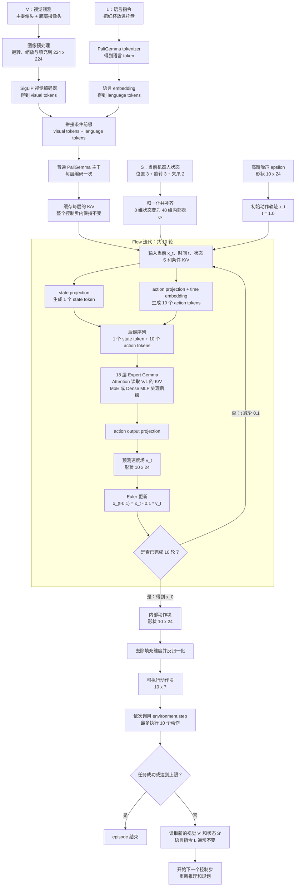
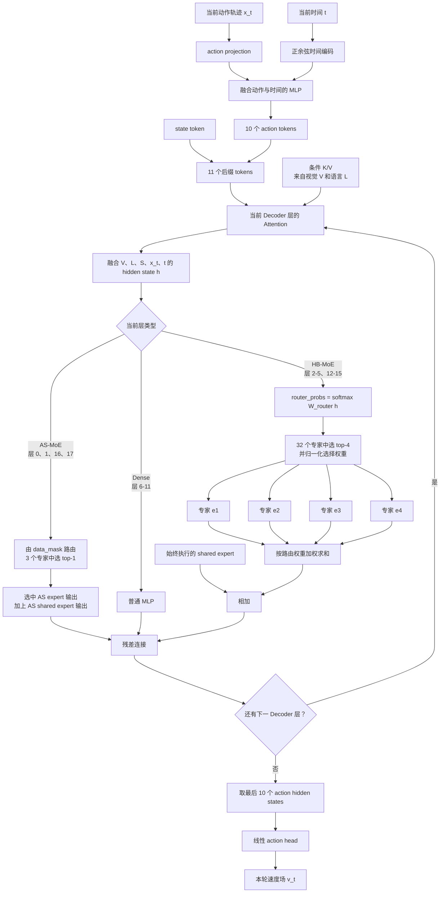

# HiMoE-VLA 从视觉与语言到机器人动作的完整流程

本文说明一次 HiMoE-VLA 控制步中，视觉输入 `V`、语言指令 `L` 和机器人状态 `S` 如何经过条件编码、10 轮 flow 迭代与 MoE 路由，最终生成一段机器人动作。

示例输入：

```text
V：主摄像头和腕部摄像头看到桌上的红杯与托盘
L："把红杯放进托盘"
S：机械臂末端位置、姿态和夹爪状态
```

> `V + L` 还不足以闭环控制机器人；实际推理还需要当前机器人状态 `S`。

## 完整控制步



## 一轮 Flow 内部的 MoE 计算

下面展开主图中的一轮 `Expert Gemma`。MoE 不负责决定 flow 的迭代次数；它负责在每轮迭代中计算速度场 `v_t`。



HB-MoE 路由可以概括为：

```text
h = ExpertGemmaSuffix(S, x_t, t | KV(V, L))
p = softmax(W_router * h)
top4_ids, top4_weights = TopK(p, 4)
moe_out = sum(top4_weights[i] * Expert[top4_ids[i]](h))
          + SharedExpert(h)
v_t = ActionHead(h_action)
x_(t-0.1) = x_t - 0.1 * v_t
```

## 三种容易混淆的“10”

| 名称 | 数量 | 含义 |
|---|---:|---|
| Flow 迭代 | 10 轮 | 同一段动作轨迹在模型内部被整体修正 10 次 |
| Action token | 10 个 | 一次推理同时预测的 10 个未来动作位置 |
| 环境动作步 | 最多 10 步 | 推理完成后，客户端实际调用 `environment.step()` 的次数 |

Flow 迭代发生在一次 `policy.infer()` 内部，期间环境不会前进。只有 10 轮全部完成后，客户端才开始执行动作。

## 路由捕获的数据层级

一次控制步内，HB-MoE 的主要路由张量为：

```text
hb_expert_ids[8 个 HB 层, 10 个 flow 迭代, 11 个后缀 token, top-4]
```

如果包含多个控制步，则最外层再增加控制步轴 `T`：

```text
hb_expert_ids[T, 8, 10, 11, 4]
```

因此一个控制步包含：

```text
8 层 x 10 轮 x 11 个 token = 880 个 HB 路由位置
每个位置从 32 个专家中选择 4 个专家
```

HB 路由器直接读取当前 hidden state。该 hidden state 已通过 Attention 融合 `V/L`，并随 `S`、`x_t` 和 `t` 改变，所以不同视觉、指令、控制步或 flow 轮次都可能产生不同路由。

AS-MoE 路由只由 `data_mask` 决定。在当前 LIBERO 配置中，它通常跨 flow 轮次和 token 保持相同，因此采集器会验证后将其折叠存储。

## 对应代码

| 阶段 | 代码位置 |
|---|---|
| 构建视觉、状态与语言观测 | `rollout_with_routes.py::run_one`、桥接层 `preprocess.py::build_policy_observation` |
| V/L 前缀编码 | 上游 `moevla.py::embed_prefix` |
| state/action/time 后缀编码 | 上游 `moevla.py::embed_suffix` |
| 10 轮 flow 与 Euler 更新 | 上游 `moevla.py::sample_actions` |
| AS/HB-MoE 路由和专家合并 | 上游 `modeling_moe.py` |
| 每个控制步的路由捕获 | `himoe_router_recorder.py` |
| 路由数组的存储结构 | `himoe_route_store.py`、`within64_lib.py` |
| 动作块在环境中的执行 | `rollout_with_routes.py::run_one` |
