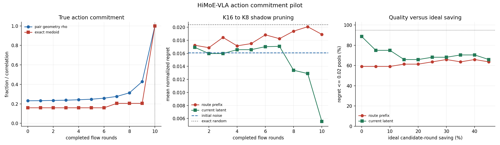

# Action commitment and MoE pruning pilot

## Question

Can the HB-MoE route estimate when an action computation is stable enough to reduce the candidate budget? This report does **not** treat action stability as task success.

## Result

The direction is partially supported as an **action-compute proxy**, but MoE-specific pruning is not yet established.

- Route features improve leave-one-rollout-out prediction of remaining denoising correction over the flow-round clock: R2 `0.923` to `0.968`.
- The already-available current action latent is much stronger: R2 `0.997`. Adding route changes it by `-0.0005`.
- Exact action-medoid identity is not committed early: median stabilization round is `10` of 10. Pairwise action geometry also reaches the predeclared rho>=0.90 condition only at the final round for all 44 queries.
- A separate 10-task/701-pool shadow does show that conservative route pruning can preserve final action consensus better than random, but initial-noise centrality remains better than route.

## True latent pilot

One Goal task, one initial scene, 4 correlated rollouts, 44 query states, K16 candidates. `x0...x10` are the true model-normalized action latents. Distances use the live `10x7` dimensions.

| completed rounds | provisional/final geometry rho | exact final medoid | provisional medoid regret |
|---:|---:|---:|---:|
| 0 | 0.231 | 15.9% | 0.0522 |
| 1 | 0.232 | 15.9% | 0.0522 |
| 3 | 0.237 | 15.9% | 0.0522 |
| 5 | 0.247 | 15.9% | 0.0530 |
| 7 | 0.276 | 20.5% | 0.0502 |
| 9 | 0.428 | 20.5% | 0.0447 |
| 10 | 1.000 | 100.0% | 0.0000 |

`rho` compares all 120 candidate-pair distances to the final action geometry. Regret is the selected candidate's excess full-pool centrality, divided by the pool median pair distance. Identity is strict; low regret can still hold when several central candidates are near-tied.

## Commitment sensor

Target: pool RMS remaining correction `||x_m-x10||`. Models use a fixed ridge alpha `1.0` and leave one complete rollout out.

| observable | OOF R2 | OOF Spearman | within-round OOF R2 |
|---|---:|---:|---:|
| flow round only | 0.923 | 0.960 | -0.000 |
| flow round + MoE route | 0.968 | 0.987 | 0.577 |
| flow round + current latent | 0.997 | 0.998 | 0.966 |
| flow round + latent + route | 0.997 | 0.998 | 0.960 |

This is the useful positive result: routing contains a readable "how unfinished is this computation?" signal beyond merely knowing the denoise round. It is not an independent information advantage because the sampler's current latent and last update are already available and predict the same target substantially better.

## Multi-task pruning shadow

The separate RAD shadow contains `701` K8 pools across `10` LIBERO-Goal tasks. After one of ten flow rounds, route centrality keeps K6, for an ideal candidate-round saving of `22.5%`.

| metric | route K6 | route - exact random | route - initial noise |
|---|---:|---:|---:|
| exact K8 medoid reproduced | 66.7% | +7.4 pp | -2.4 pp |
| normalized medoid regret | 0.0065 | -0.0035 | +0.0012 |
| regret <= 0.02 | 86.5% | +5.9 pp | -2.0 pp |
| regret <= 0.05 | 97.7% | +2.2 pp | -1.5 pp |

For normalized regret, lower is better. Route minus random is `-0.0035` with task-cluster 95% CI `[-0.004534656163735641, -0.0023912740445505122]`. Route minus noise is `+0.0012` with CI `[0.00024052578287280083, 0.0021267923827194123]`, so the cheap noise baseline is significantly better on this development set.

## Decision

1. **Supported:** MoE routing carries a measurable action-computation progress signal, and conservative route-central pruning preserves final action consensus better than uniform random pruning.
2. **Not supported:** routing adds value beyond the current action latent or the known initial noise; exact action commitment before the final denoise round; any claim about task success, real GPU latency, or rescue decisions.
3. **Next confirmation:** recapture K32 with `x0...x10`, freeze one point (`m=3`, K32 to K8), and test `current latent + route` against `current latent` on fully held-out tasks and fresh, non-reused seeds. Only if route has positive incremental value should an online compaction/latency experiment be run.

## Scope

- The K16 mechanism pilot has only four correlated rollouts from one task and one scene; its cross-validation is diagnostic, not confirmatory.
- The 701-pool pruning experiment is retrospective: all candidates completed all ten flow rounds.
- The multi-task grid was exploratory and was previously inspected; its confidence intervals are descriptive rather than a fresh preregistered test.
- Final episode success is not a valid label for whether the first action chunk was correct, and no alternative pruned candidate was executed here.
