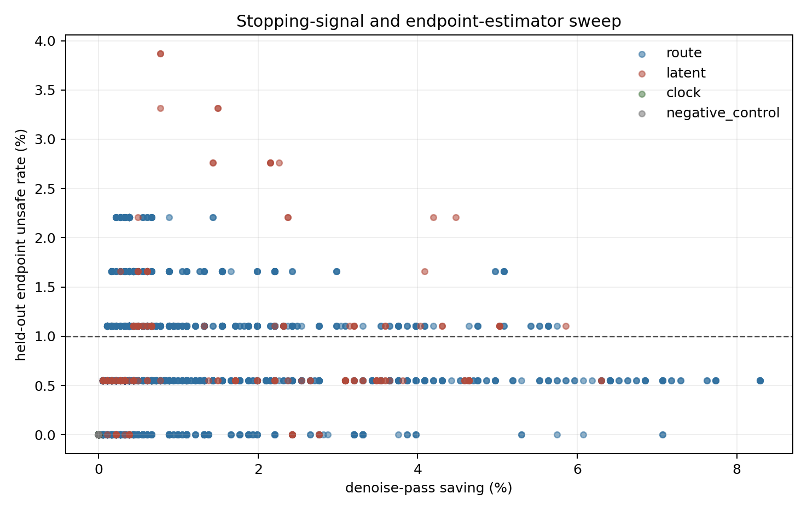

# 每次推理内去噪停止方法全量扫描

## 实验思路

- 单位是一次 policy query 内的一条完整 `x0→x10` 推理轨迹；每个 query 的停止器独立重置，不跨控制步。
- 数据为 `181` 条候选轨迹、`181` 个真实控制状态、`4` 条完整 rollout。所有阈值按完整 rollout 留一，测试折从不参与阈值选择。
- 不使用 reward/success。自监督真值只是同一次推理完整第 10 轮的动作；主安全线定义为预测动作与第 10 轮动作的相对 L2 误差 `<= 0.050`。
- 共扫描路由概率距离、top-k/去重集合、熵与集中度、两/三轮连续规则、latent 更新/曲率、固定轮数，以及 10 种停止后输出方式；其中 7 种无训练输出器与停止信号做完整笛卡尔组合，3 种自监督输出头单独做 rollout 留出。
- 这里的“全量”指当前前向过程可直接读取的有限方法网格，不声称穷尽数学上无限多的函数。完整 `24192` 行结果保存在 `signal_sweep.csv`。

| 信号族 | 实际扫描内容 |
|---|---|
| 路由概率 | Hellinger、TV、JS、cosine、L2；token 均值/最大值、先聚合 token 再比较 |
| 专家身份 | top-1 切换、token top-4 Jaccard、逐层去重集合 Jaccard、加权 Jaccard、去重数量 |
| 路由形状 | entropy、top-1 mass、top1-top2 margin、top-4 mass、活跃专家数的绝对值与相邻变化 |
| 时间规则 | 当前一轮、最近两/三轮 max 与 mean；最早第 4/6/8 轮；阈值正反方向 |
| latent | 更新 RMS/最大值、平移/旋转/gripper、相对更新、加速度、转向、外推终点自洽性 |
| 零对照 | state-token 路由变化、恒定 AS 路由；必须退化为固定轮数，不能产生候选判别 |
| 输出器 | 当前 latent、常速度、两轮平均速度、常加速度、3/4 点线性、3 点二次，以及 3 个 x10 自监督速度头 |

## 先看天花板

直接输出当前 latent 的事后 oracle 也只能节省 `0.0%`；常速度外推的 oracle 可节省 `29.7%`。这说明问题的关键首先不是如何识别稳定，而是停止后不能直接返回未积分到 `t=0` 的 `x_s`。

| 输出方式 | 轮数 | 节省 | 中位相对误差 | P90 | 超过安全线 | gripper 符号变化 |
|---|---:|---:|---:|---:|---:|---:|
| 直接输出当前 latent | 4 | 60.0% | 1.0195 | 1.4316 | 100.0% | 95.6% |
| 直接输出当前 latent | 6 | 40.0% | 0.6795 | 0.9548 | 100.0% | 58.6% |
| 直接输出当前 latent | 8 | 20.0% | 0.3365 | 0.4760 | 100.0% | 1.1% |
| 直接输出当前 latent | 9 | 10.0% | 0.1635 | 0.2341 | 100.0% | 0.0% |
| 最近速度外推 | 4 | 60.0% | 0.0740 | 0.1641 | 84.5% | 2.8% |
| 最近速度外推 | 6 | 40.0% | 0.0577 | 0.1070 | 66.9% | 1.1% |
| 最近速度外推 | 8 | 20.0% | 0.0430 | 0.0648 | 32.0% | 0.6% |
| 最近速度外推 | 9 | 10.0% | 0.0296 | 0.0403 | 2.2% | 0.0% |
| 最近两轮平均速度外推 | 4 | 60.0% | 0.0764 | 0.1669 | 87.8% | 2.8% |
| 最近两轮平均速度外推 | 6 | 40.0% | 0.0604 | 0.1213 | 70.7% | 1.7% |
| 最近两轮平均速度外推 | 8 | 20.0% | 0.0449 | 0.0682 | 38.7% | 0.6% |
| 最近两轮平均速度外推 | 9 | 10.0% | 0.0321 | 0.0450 | 3.9% | 0.0% |
| 常加速度外推 | 4 | 60.0% | 0.0830 | 0.1505 | 92.8% | 3.3% |
| 常加速度外推 | 6 | 40.0% | 0.0604 | 0.0990 | 65.7% | 0.6% |
| 常加速度外推 | 8 | 20.0% | 0.0421 | 0.0640 | 28.2% | 0.0% |
| 常加速度外推 | 9 | 10.0% | 0.0270 | 0.0386 | 4.4% | 0.0% |
| 最近 3 点线性拟合 | 4 | 60.0% | 0.0767 | 0.1671 | 87.8% | 2.8% |
| 最近 3 点线性拟合 | 6 | 40.0% | 0.0608 | 0.1218 | 70.7% | 1.7% |
| 最近 3 点线性拟合 | 8 | 20.0% | 0.0453 | 0.0694 | 38.7% | 0.6% |
| 最近 3 点线性拟合 | 9 | 10.0% | 0.0331 | 0.0471 | 7.2% | 0.0% |
| 最近 4 点线性拟合 | 4 | 60.0% | 0.0801 | 0.1689 | 91.2% | 2.2% |
| 最近 4 点线性拟合 | 6 | 40.0% | 0.0632 | 0.1311 | 74.0% | 1.7% |
| 最近 4 点线性拟合 | 8 | 20.0% | 0.0477 | 0.0756 | 44.2% | 0.6% |
| 最近 4 点线性拟合 | 9 | 10.0% | 0.0357 | 0.0541 | 13.8% | 0.0% |
| 最近 3 点二次外推 | 4 | 60.0% | 0.0830 | 0.1505 | 92.8% | 3.3% |
| 最近 3 点二次外推 | 6 | 40.0% | 0.0604 | 0.0990 | 65.7% | 0.6% |
| 最近 3 点二次外推 | 8 | 20.0% | 0.0421 | 0.0640 | 28.2% | 0.0% |
| 最近 3 点二次外推 | 9 | 10.0% | 0.0270 | 0.0386 | 4.4% | 0.0% |
| 自监督单速度系数 | 4 | 60.0% | 0.0742 | 0.1647 | 84.0% | 2.8% |
| 自监督单速度系数 | 6 | 40.0% | 0.0576 | 0.1066 | 67.4% | 1.1% |
| 自监督单速度系数 | 8 | 20.0% | 0.0410 | 0.0627 | 32.6% | 0.6% |
| 自监督单速度系数 | 9 | 10.0% | 0.0279 | 0.0381 | 1.7% | 0.0% |
| 自监督双速度系数 | 4 | 60.0% | 0.0715 | 0.1452 | 82.9% | 2.8% |
| 自监督双速度系数 | 6 | 40.0% | 0.0569 | 0.0899 | 61.9% | 0.0% |
| 自监督双速度系数 | 8 | 20.0% | 0.0403 | 0.0591 | 23.8% | 0.0% |
| 自监督双速度系数 | 9 | 10.0% | 0.0240 | 0.0348 | 1.7% | 0.0% |
| 自监督逐维双速度系数 | 4 | 60.0% | 0.0701 | 0.1404 | 83.4% | 3.3% |
| 自监督逐维双速度系数 | 6 | 40.0% | 0.0569 | 0.0900 | 59.7% | 0.6% |
| 自监督逐维双速度系数 | 8 | 20.0% | 0.0399 | 0.0590 | 22.1% | 0.0% |
| 自监督逐维双速度系数 | 9 | 10.0% | 0.0234 | 0.0349 | 1.7% | 0.0% |

## 停止信号

下表的阈值只在训练 rollout 上选择，要求训练折零危险漏停，然后在整条留出 rollout 上评价。排名先要求留出危险率不超过 1%，再比较节省率。相同信号同时扫描正/反方向、最早第 4/6/8 轮和单轮/连续两轮规则，因此这里是探索性排序，不是确认性显著性结论。

| 对照/方法 | 留出或 shadow 节省 | 危险率 | 说明 |
|---|---:|---:|---|
| 固定第 9 轮 + 常速度外推 | 10.0% | 2.2% (4 行/4 query) | 无动态信号 |
| 固定第 8 轮 + 常加速度外推 | 20.0% | 28.2% (51 行/51 query) | 无动态信号，探索后选中 |
| rollout 留出 clock 规则 + current | 0.0% | 0.0% (0 行/0 query) | 只看已完成轮数 |
| 最佳路由规则 + constant_acceleration | 8.3% | 0.6% (1 行/1 query) | 从全部路由规则探索选中 |
| 最佳 latent 规则 + constant_acceleration | 6.3% | 0.6% (1 行/1 query) | 从全部 latent 规则探索选中 |

在开发集上，固定第 8 轮常加速度外推有 `51` 个坏候选；最佳路由过滤后为 `1` 个，只少了 `50` 个，同时节省从 20.0% 降到 `8.3%`。这个计数太小，只能叫弱线索，不能叫路由增益。

### 路由信号前列

| 信号 | 停止后输出 | 方向 | 最早轮 | 留出节省 | 留出危险 | P95 相对误差 |
|---|---|---|---:|---:|---:|---:|
| prob_site_js_mean | constant_acceleration | le | 8 | 8.3% | 0.6% (1 行/1 query) | 0.0436 |
| prob_site_js_mean__two_round_max | constant_acceleration | le | 8 | 8.3% | 0.6% (1 行/1 query) | 0.0436 |
| prob_site_js_mean__three_round_max | constant_acceleration | le | 8 | 8.3% | 0.6% (1 行/1 query) | 0.0436 |
| prob_site_js_mean | quadratic_fit_3 | le | 8 | 8.3% | 0.6% (1 行/1 query) | 0.0436 |
| prob_site_js_mean__two_round_max | quadratic_fit_3 | le | 8 | 8.3% | 0.6% (1 行/1 query) | 0.0436 |
| prob_site_js_mean__three_round_max | quadratic_fit_3 | le | 8 | 8.3% | 0.6% (1 行/1 query) | 0.0436 |
| prob_site_cosine_mean__two_round_max | constant_acceleration | le | 8 | 7.7% | 0.6% (1 行/1 query) | 0.0436 |
| prob_site_cosine_mean__two_round_max | quadratic_fit_3 | le | 8 | 7.7% | 0.6% (1 行/1 query) | 0.0436 |

### Latent/更新信号前列

| 信号 | 停止后输出 | 方向 | 最早轮 | 留出节省 | 留出危险 | P95 相对误差 |
|---|---|---|---:|---:|---:|---:|
| update_rms | constant_acceleration | ge | 8 | 6.3% | 0.6% (1 行/1 query) | 0.0342 |
| update_rms | quadratic_fit_3 | ge | 8 | 6.3% | 0.6% (1 行/1 query) | 0.0342 |
| rotation_update_rms | constant_velocity | ge | 6 | 4.6% | 0.6% (1 行/1 query) | 0.0365 |
| rotation_update_rms | mean_last2_velocity | ge | 6 | 4.6% | 0.6% (1 行/1 query) | 0.0375 |
| rotation_update_rms | linear_fit_3 | ge | 6 | 4.6% | 0.6% (1 行/1 query) | 0.0376 |
| rotation_update_rms | constant_acceleration | ge | 6 | 4.6% | 0.6% (1 行/1 query) | 0.0392 |
| rotation_update_rms | quadratic_fit_3 | ge | 6 | 4.6% | 0.6% (1 行/1 query) | 0.0392 |
| rotation_update_rms | linear_fit_4 | ge | 6 | 4.6% | 0.6% (1 行/1 query) | 0.0384 |

## 结论

1. `变化小就直接输出` 被 oracle 门否决：flow matching 的每轮更新没有趋于零，路由稳定也不等于动作已经到终点。
2. 真正有用的方向是数值外推：完成当前 MoE 前向后，用最后速度把剩余 flow 时间一次积分完。它不需要任务标签，也不需要额外 head。
3. 动态停止信号是否优于固定轮数，必须看上面留出表；即便 endpoint shadow 过线，也还需要困难任务在线配对才能声称成功率不降。
