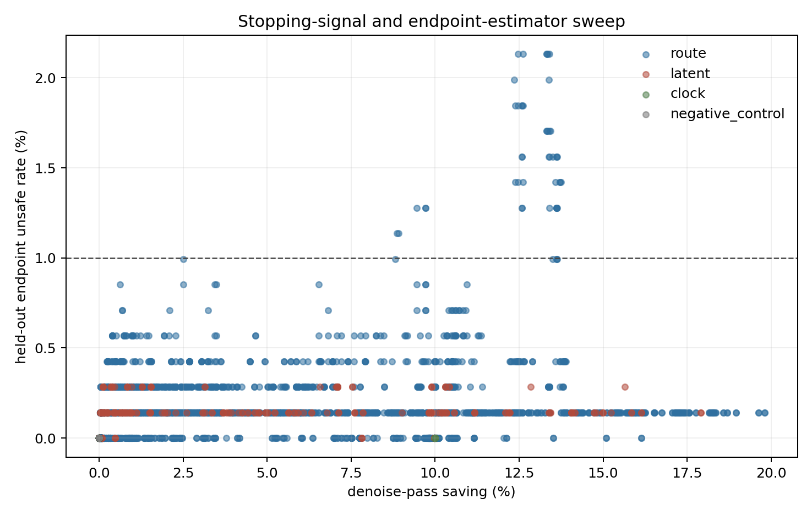

# 每次推理内去噪停止方法全量扫描

## 实验思路

- 单位是一次 policy query 内的一条完整 `x0→x10` 推理轨迹；每个 query 的停止器独立重置，不跨控制步。
- 数据为 `704` 条候选轨迹、`44` 个真实控制状态、`4` 条完整 rollout。所有阈值按完整 rollout 留一，测试折从不参与阈值选择。
- 不使用 reward/success。自监督真值只是同一次推理完整第 10 轮的动作；主安全线定义为预测动作与第 10 轮动作的相对 L2 误差 `<= 0.050`。
- 共扫描路由概率距离、top-k/去重集合、熵与集中度、两/三轮连续规则、latent 更新/曲率、固定轮数，以及 10 种停止后输出方式；其中 7 种无训练输出器与停止信号做完整笛卡尔组合，3 种自监督输出头单独做 rollout 留出。
- 这里的“全量”指当前前向过程可直接读取的有限方法网格，不声称穷尽数学上无限多的函数。完整 `24192` 行结果保存在 `signal_sweep.csv`。

| 信号族 | 实际扫描内容 |
|---|---|
| 路由概率 | Hellinger、TV、JS、cosine、L2；token 均值/最大值、先聚合 token 再比较 |
| 专家身份 | top-1 切换、token top-4 Jaccard、逐层去重集合 Jaccard、加权 Jaccard、去重数量 |
| 路由形状 | entropy、top-1 mass、top1-top2 margin、top-4 mass、活跃专家数的绝对值与相邻变化 |
| 时间规则 | 当前一轮、最近两/三轮 max 与 mean；最早第 4/6/8 轮；阈值正反方向 |
| latent | 更新 RMS/最大值、平移/旋转/gripper、相对更新、加速度、转向、外推终点自洽性 |
| 零对照 | state-token 路由变化、恒定 AS 路由；必须退化为固定轮数，不能产生候选判别 |
| 输出器 | 当前 latent、常速度、两轮平均速度、常加速度、3/4 点线性、3 点二次，以及 3 个 x10 自监督速度头 |

## 先看天花板

直接输出当前 latent 的事后 oracle 也只能节省 `0.0%`；常速度外推的 oracle 可节省 `48.5%`。这说明问题的关键首先不是如何识别稳定，而是停止后不能直接返回未积分到 `t=0` 的 `x_s`。

| 输出方式 | 轮数 | 节省 | 中位相对误差 | P90 | 超过安全线 | gripper 符号变化 |
|---|---:|---:|---:|---:|---:|---:|
| 直接输出当前 latent | 4 | 60.0% | 0.8455 | 1.1183 | 100.0% | 97.4% |
| 直接输出当前 latent | 6 | 40.0% | 0.5691 | 0.7511 | 100.0% | 75.3% |
| 直接输出当前 latent | 8 | 20.0% | 0.2890 | 0.3823 | 100.0% | 1.6% |
| 直接输出当前 latent | 9 | 10.0% | 0.1447 | 0.1929 | 100.0% | 0.0% |
| 最近速度外推 | 4 | 60.0% | 0.0531 | 0.0842 | 59.5% | 0.0% |
| 最近速度外推 | 6 | 40.0% | 0.0424 | 0.0681 | 29.4% | 0.0% |
| 最近速度外推 | 8 | 20.0% | 0.0288 | 0.0456 | 4.1% | 0.0% |
| 最近速度外推 | 9 | 10.0% | 0.0187 | 0.0295 | 0.0% | 0.0% |
| 最近两轮平均速度外推 | 4 | 60.0% | 0.0562 | 0.0870 | 65.3% | 0.0% |
| 最近两轮平均速度外推 | 6 | 40.0% | 0.0443 | 0.0708 | 34.1% | 0.0% |
| 最近两轮平均速度外推 | 8 | 20.0% | 0.0307 | 0.0497 | 9.7% | 0.0% |
| 最近两轮平均速度外推 | 9 | 10.0% | 0.0206 | 0.0325 | 0.0% | 0.0% |
| 常加速度外推 | 4 | 60.0% | 0.0587 | 0.0927 | 83.4% | 0.0% |
| 常加速度外推 | 6 | 40.0% | 0.0415 | 0.0645 | 27.6% | 0.0% |
| 常加速度外推 | 8 | 20.0% | 0.0271 | 0.0392 | 0.3% | 0.0% |
| 常加速度外推 | 9 | 10.0% | 0.0175 | 0.0279 | 0.0% | 0.0% |
| 最近 3 点线性拟合 | 4 | 60.0% | 0.0564 | 0.0872 | 65.8% | 0.0% |
| 最近 3 点线性拟合 | 6 | 40.0% | 0.0445 | 0.0711 | 34.2% | 0.0% |
| 最近 3 点线性拟合 | 8 | 20.0% | 0.0311 | 0.0504 | 10.7% | 0.0% |
| 最近 3 点线性拟合 | 9 | 10.0% | 0.0213 | 0.0337 | 0.0% | 0.0% |
| 最近 4 点线性拟合 | 4 | 60.0% | 0.0592 | 0.0903 | 72.4% | 0.0% |
| 最近 4 点线性拟合 | 6 | 40.0% | 0.0464 | 0.0738 | 40.1% | 0.0% |
| 最近 4 点线性拟合 | 8 | 20.0% | 0.0332 | 0.0544 | 15.1% | 0.0% |
| 最近 4 点线性拟合 | 9 | 10.0% | 0.0238 | 0.0381 | 0.0% | 0.0% |
| 最近 3 点二次外推 | 4 | 60.0% | 0.0587 | 0.0927 | 83.4% | 0.0% |
| 最近 3 点二次外推 | 6 | 40.0% | 0.0415 | 0.0645 | 27.6% | 0.0% |
| 最近 3 点二次外推 | 8 | 20.0% | 0.0271 | 0.0392 | 0.3% | 0.0% |
| 最近 3 点二次外推 | 9 | 10.0% | 0.0175 | 0.0279 | 0.0% | 0.0% |
| 自监督单速度系数 | 4 | 60.0% | 0.0505 | 0.0846 | 52.0% | 0.0% |
| 自监督单速度系数 | 6 | 40.0% | 0.0403 | 0.0672 | 26.8% | 0.0% |
| 自监督单速度系数 | 8 | 20.0% | 0.0284 | 0.0447 | 3.1% | 0.0% |
| 自监督单速度系数 | 9 | 10.0% | 0.0187 | 0.0294 | 0.0% | 0.0% |
| 自监督双速度系数 | 4 | 60.0% | 0.0490 | 0.0819 | 46.2% | 0.0% |
| 自监督双速度系数 | 6 | 40.0% | 0.0387 | 0.0626 | 23.0% | 0.0% |
| 自监督双速度系数 | 8 | 20.0% | 0.0270 | 0.0390 | 0.1% | 0.0% |
| 自监督双速度系数 | 9 | 10.0% | 0.0171 | 0.0272 | 0.0% | 0.0% |
| 自监督逐维双速度系数 | 4 | 60.0% | 0.0459 | 0.0829 | 37.8% | 0.0% |
| 自监督逐维双速度系数 | 6 | 40.0% | 0.0369 | 0.0632 | 24.1% | 0.0% |
| 自监督逐维双速度系数 | 8 | 20.0% | 0.0261 | 0.0389 | 0.4% | 0.0% |
| 自监督逐维双速度系数 | 9 | 10.0% | 0.0164 | 0.0276 | 0.0% | 0.0% |

## 停止信号

下表的阈值只在训练 rollout 上选择，要求训练折零危险漏停，然后在整条留出 rollout 上评价。排名先要求留出危险率不超过 1%，再比较节省率。相同信号同时扫描正/反方向、最早第 4/6/8 轮和单轮/连续两轮规则，因此这里是探索性排序，不是确认性显著性结论。

| 对照/方法 | 留出或 shadow 节省 | 危险率 | 说明 |
|---|---:|---:|---|
| 固定第 9 轮 + 常速度外推 | 10.0% | 0.0% (0 行/0 query) | 无动态信号 |
| 固定第 8 轮 + 常加速度外推 | 20.0% | 0.3% (2 行/2 query) | 无动态信号，探索后选中 |
| rollout 留出 clock 规则 + constant_acceleration | 10.0% | 0.0% (0 行/0 query) | 只看已完成轮数 |
| 最佳路由规则 + constant_acceleration | 19.8% | 0.1% (1 行/1 query) | 从全部路由规则探索选中 |
| 最佳 latent 规则 + constant_acceleration | 17.9% | 0.1% (1 行/1 query) | 从全部 latent 规则探索选中 |

在开发集上，固定第 8 轮常加速度外推有 `2` 个坏候选；最佳路由过滤后为 `1` 个，只少了 `1` 个，同时节省从 20.0% 降到 `19.8%`。这个计数太小，只能叫弱线索，不能叫路由增益。

### 路由信号前列

| 信号 | 停止后输出 | 方向 | 最早轮 | 留出节省 | 留出危险 | P95 相对误差 |
|---|---|---|---:|---:|---:|---:|
| active_expert_count_level__three_round_max | constant_acceleration | le | 8 | 19.8% | 0.1% (1 行/1 query) | 0.0423 |
| active_expert_count_level__three_round_max | quadratic_fit_3 | le | 8 | 19.8% | 0.1% (1 行/1 query) | 0.0423 |
| active_expert_count_level__three_round_mean | constant_acceleration | le | 8 | 19.6% | 0.1% (1 行/1 query) | 0.0420 |
| active_expert_count_level__three_round_mean | quadratic_fit_3 | le | 8 | 19.6% | 0.1% (1 行/1 query) | 0.0420 |
| active_expert_count_level__two_round_mean | constant_acceleration | le | 8 | 19.0% | 0.1% (1 行/1 query) | 0.0397 |
| active_expert_count_level__two_round_mean | quadratic_fit_3 | le | 8 | 19.0% | 0.1% (1 行/1 query) | 0.0397 |
| active_expert_count_level | constant_acceleration | le | 8 | 18.7% | 0.1% (1 行/1 query) | 0.0394 |
| active_expert_count_level | quadratic_fit_3 | le | 8 | 18.7% | 0.1% (1 行/1 query) | 0.0394 |

### Latent/更新信号前列

| 信号 | 停止后输出 | 方向 | 最早轮 | 留出节省 | 留出危险 | P95 相对误差 |
|---|---|---|---:|---:|---:|---:|
| update_rms | constant_acceleration | ge | 8 | 17.9% | 0.1% (1 行/1 query) | 0.0390 |
| update_rms | quadratic_fit_3 | ge | 8 | 17.9% | 0.1% (1 行/1 query) | 0.0390 |
| update_turning | constant_acceleration | le | 8 | 16.1% | 0.1% (1 行/1 query) | 0.0367 |
| update_turning | quadratic_fit_3 | le | 8 | 16.1% | 0.1% (1 行/1 query) | 0.0367 |
| relative_update | constant_acceleration | le | 8 | 15.8% | 0.1% (1 行/1 query) | 0.0348 |
| relative_update | quadratic_fit_3 | le | 8 | 15.8% | 0.1% (1 行/1 query) | 0.0348 |
| update_rms | constant_velocity | ge | 8 | 15.6% | 0.3% (2 行/1 query) | 0.0375 |
| rotation_update_rms | constant_velocity | ge | 6 | 15.2% | 0.1% (1 行/1 query) | 0.0403 |

## 结论

1. `变化小就直接输出` 被 oracle 门否决：flow matching 的每轮更新没有趋于零，路由稳定也不等于动作已经到终点。
2. 真正有用的方向是数值外推：完成当前 MoE 前向后，用最后速度把剩余 flow 时间一次积分完。它不需要任务标签，也不需要额外 head。
3. 动态停止信号是否优于固定轮数，必须看上面留出表；即便 endpoint shadow 过线，也还需要困难任务在线配对才能声称成功率不降。

## 困难任务压力测试

- 数据：`hard-task holdout`，181 条轨迹、4 条 rollout。Goal 上冻结的阈值原样迁移。
- 固定第 9 轮 + 常速度外推：节省 `10.0%`，危险率 `2.2% (4 行/4 query)`。
- 固定第 8 轮 + 常加速度外推：节省 `20.0%`，危险率 `28.2% (51 行/51 query)`。
- 最佳冻结路由规则：节省 `19.3%`，危险率 `26.0% (47 行/47 query)`。
- 最佳冻结 latent 规则：节省 `14.3%`，危险率 `12.7% (23 行/23 query)`。

### Long 内部诊断（不是迁移结果）

这里允许用 Long 自己的 3 条 rollout 校准 x10 误差，再留第 4 条；它只能回答任务内是否存在弱信号，不能用于声称新任务零样本早停。

- clock/固定轮数在训练折零危险约束下：节省 `0.0%`，危险 `0.0% (0 行/0 query)`。
- 最佳路由规则 `prob_site_js_mean + constant_acceleration`：节省 `8.3%`，危险 `0.6% (1 行/1 query)`。
- 最佳 latent 规则 `update_rms + constant_acceleration`：节省 `6.3%`，危险 `0.6% (1 行/1 query)`。
- 任务内最优路由信号变成了 JS 概率变化，而 Goal 上是活跃专家数量；信号定义和阈值都没有稳定迁移。

## 适用边界与最终裁决

- Goal 与 Long 都走同一 CPU 推理数值路径，比较内部一致；CPU/GPU 的 top-k 边界可能不同，因此这里不证明 GPU 延迟或逐位一致性。
- endpoint 误差是执行完整第 10 轮得到的自监督标签，不是任务成功标签；Long 基线 4 条 rollout 为 2 成功/2 失败，但成败未用于方法选择。
- 新任务主端点是 Goal 冻结后直接迁移到 Long。路由、latent、固定第 8 轮和固定第 9 轮全部未过 `<=1%` 危险率门，因此不进入在线 A/B。
- 当前结论：可以看到任务内弱停止信息，但没有得到可零样本迁移的无监督 MoE 停止器。继续扫同类阈值没有依据。
