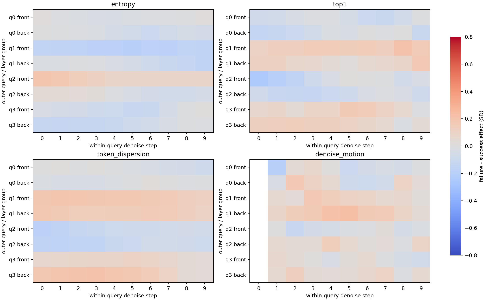
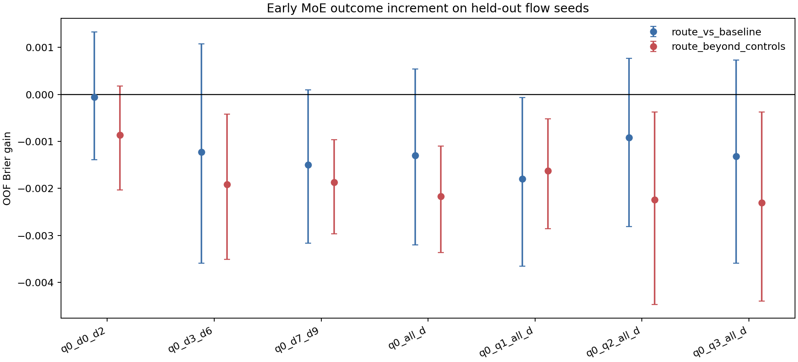

# 前四个 chunk 的 MoE 去噪轨迹与最终超时

## 直接结论

**最像“模型在第一次推理里读到了难度”的线索，确实落在 q0 的早期去噪；但它只在探索数据中出现，没有通过后续冻结验证。action-token 路由也有小差异，却没有形成跨初态、跨任务、跨 worker 的稳定超时信号。**

严格区分后，答案分成两半：rolling-star 的 q0 state-token 前层 d0-d3 有过一个很像你直觉的 discovery 峰；旧五任务里可跨数据比较的 action-token 路由则没有“d0-d2 稳定优于后段”的顺序。加入 q1-q3 后也没有带来折外收益；此时即使有差异，也已经混入执行后的状态分叉。

## 数据和口径

- 旧五任务：2560 rollout，其中有成败变化的四任务共 2048 条、307 次超时；每个 task x initial-state 有 32 个 flow seeds。
- 同初态成败主检验：1280 条、40 个 mixed task x init strata。
- rolling-star：总共 352 条分支；主 sibling 对照只用 240 条、15 个成败混合快照。
- 只使用共同绝对 q0-q3，以及每个 query 内 d0-d9 的 soft action routing；不使用 episode length、remaining time、相对尾段或 hard expert ID。
- state token 在 denoise 轴最大差异为 old `0.00000000`、rolling `0.01099527`。旧语料的 state 路由在 d 轴完全退化，所以跨语料的去噪定位只能比较 action token；rolling 的 state 结果单列。

## 最像直觉的 state-token 线索

rolling-star 既有的快照内四分位扫描中，最强 q0 state cell 是 `state / front_2_5 / d0 / top1_mass`：高值四分位最终超时率 61.7%，低值四分位 38.3%，差 23.3 个百分点；全 280-cell max-T `p=0.0572`。

这条峰的位置支持“前层、q0、早期 d”的定位，但统计强度只到边缘。更关键的是，当时冻结的同族 `q0 state / front / d1 / top1` 在后来 5 个快照上，高低四分位超时率分别为 41.7% 和 41.7%，差值 0.0 个百分点，Bonferroni `p=1.0000`。所以它是一个没有复现的线索，不是已成立的早期难度读数。

## action-token 的 q0 去噪带

Brier gain 为正才有用。`heldout_seed` 已知道初态的训练难度先验；`heldout_init` 完整留出初态。

| window | route vs initial-state prior | route beyond state/action controls | route on unseen init vs task prior |
| --- | ---: | ---: | ---: |
| q0_d0_d2 | -0.00006 [-0.00139,+0.00133] | -0.00086 [-0.00203,+0.00018] | +0.00134 [-0.01279,+0.01504] |
| q0_d3_d6 | -0.00123 [-0.00359,+0.00107] | -0.00192 [-0.00351,-0.00042] | +0.00275 [-0.01265,+0.01874] |
| q0_d7_d9 | -0.00150 [-0.00316,+0.00009] | -0.00187 [-0.00296,-0.00096] | -0.00639 [-0.02241,+0.00987] |
| q0_all_d | -0.00130 [-0.00320,+0.00054] | -0.00217 [-0.00337,-0.00110] | -0.00069 [-0.01684,+0.01572] |

如果直觉成立，最早的 d0-d2 应稳定优于中后段，并在 unseen init 上保留正增量。实际没有看到这个顺序。

## 加入前几个 chunk

| prefix | route vs initial-state prior | route beyond state/action controls |
| --- | ---: | ---: |
| q0_all_d | -0.00130 [-0.00320,+0.00054] | -0.00217 [-0.00337,-0.00110] |
| q0_q1_all_d | -0.00180 [-0.00365,-0.00007] | -0.00163 [-0.00286,-0.00052] |
| q0_q2_all_d | -0.00092 [-0.00281,+0.00077] | -0.00224 [-0.00448,-0.00037] |
| q0_q3_all_d | -0.00132 [-0.00359,+0.00073] | -0.00230 [-0.00440,-0.00037] |

q1-q3 已经执行过前面的动作块，因此这里若出现信号，只能叫早期轨迹读出。必须看 `route beyond controls`，不能把 route-only 的改善直接解释成模型内部提前知道难度。

## 单特征差异与跨数据复现

| query | old pooled max | old global p(min) | rolling max | rolling global p(min) | Long-old vs rolling effect rho |
| ---: | ---: | ---: | ---: | ---: | ---: |
| q0 | 0.235 | 0.6812 | 0.456 | 0.9405 | -0.161 |
| q1 | 0.227 | 0.7701 | 0.375 | 1.0000 | -0.253 |
| q2 | 0.273 | 0.2839 | 0.659 | 0.1289 | -0.281 |
| q3 | 0.207 | 0.9285 | 0.519 | 0.7116 | +0.265 |

从旧 Long 每个 q 冻结三个最强 cell（共 12 个）到 rolling-star：方向一致 5/12，Bonferroni 后通过 0/12。这个验证优先于任一数据集里事后挑出的漂亮 cell。

## 初态难度，而不是单条 rollout 命运

这里避免同批噪声泄漏：前 16 个 seeds 的 q0 特征只预测后 16 个 seeds 的失败率。下面是真正 leave-one-initial-state-out 的 MSE；`moe_single` 只用前半固定第一条的一次 q0，`moe_cloud` 使用前半 16 个 q0 的均值和方差。

| model | task-macro MSE |
| --- | ---: |
| task_mean | 0.04539 |
| geometry | 0.05038 |
| moe_single | 0.04713 |
| moe_cloud | 0.04871 |
| action_cloud | 0.04932 |
| geometry_action | 0.05073 |
| geometry_moe | 0.05823 |
| geometry_action_moe | 0.05372 |

前 16 个 q0 预测后 16 个结果时，最强 cell 是 `q0|action|back_12_15|top1|d5`，task-residual correlation `+0.320`，全 q0 max-T `p=0.0835`，再校正 4 种 representation 后 `p=0.3338`；在 3/4 个有难度变化的任务里方向为正。反向用后 16 预测前 16 时，最强 cell 变为 `q0|action|back_12_15|top1|d5`，correlation `+0.367`，max-T `p=0.0200`，四重校正 `p=0.0800`。
固定只看一次 q0、并用其余 31 条估计难度时，前半 canonical 的最强 cell 是 `q0|action|back_12_15|top1|d6`，correlation `+0.315`，max-T `p=0.0940`，四重校正 `p=0.3758`；任务内方向为正 3/4。换成后半 canonical 后，最强 cell 为 `q0|action|back_12_15|top1|d5`，correlation `+0.351`，max-T `p=0.0435`，四重校正 `p=0.1739`。单次形式才对应在线可用口径。

预测门槛更直接：`moe_single` 相对 task mean 的 task-macro MSE 改善为 `-0.00175`，`moe_cloud` 为 `-0.00333`（正数才有用）。在 Long moka-pot 单任务里 `moe_single` 从 `0.15512` 降到 `0.15163`，但其他任务的退化抵消了它。

最重要的区分：同一个 `q0|action|back_12_15|top1|d5` 对 Long 初态难度的正反 half 相关分别为 `+0.645`、`+0.717`，但在同一初态/快照内比较“这一条最终超时还是成功”时，old effect 只有 `-0.034 SD`、rolling effect `+0.015 SD`，两边全局 max-T 都是 `p=1.0`。所以它目前读到的是初态/任务难度，不是单条 branch 的命运。

## 判断

1. 有一个位置上很符合直觉的线索：rolling q0 state-token、前层、d0-d3；但 frozen validation 明确没有复现。
2. q0 action routing 在最终成功/超时之间有小而任务依赖的差异；没有证据说明信息稳定集中在 d0-d2。
3. q1-q3 没有增加折外预测收益；即使未来看到差异，也应先解释为执行后状态/动作分叉。
4. 多次平均后的初态难度相关，不等于一次推理能读出；而且正反 half 必须复现。当前单次 q0 没有跨任务胜过 task mean。
5. 没有稳定单 expert 结论；本分析只使用 expert-permutation-invariant soft-routing summaries。

## 解释限制

- 旧语料的同一个 flow seed 同时影响 q0 和后续 replanning；这是预测关联，不是 q0 action 的因果 value。
- `moe_cloud` 需要 16 次 q0 forward，不能冒充一次推理即可得到的信号。
- rolling-star 有 352 条 branch，但独立 worker 只有 4 个；snapshot 内 sibling 通过分层处理，不能当成 352 个独立初态。
- 本分析在既有数据上提出，属于探索性定位。确认实验应冻结一个窗口和一个分数，再收新 worker/初态。

## 工件

- `old_effects.csv`、`old_task_effects.csv`、`rolling_effects.csv`：逐 cell 差异。
- `prediction_metrics.csv`、`prediction_deltas.csv`、`predictions.csv.gz`：折外预测。
- `difficulty_effects.csv`、`difficulty_task_correlations.csv`、`difficulty_model_metrics.csv`：单次/云平均初态难度分析。
- `rolling_prior_state_q0_effects.csv`、`rolling_prior_state_frozen_validation.csv`：既有 state-token discovery 与冻结验证。
- `frozen_validation.csv`：旧 Long 到 rolling-star 的冻结验证。
- `summary.json`、`checksums.sha256`：审计与校验。

