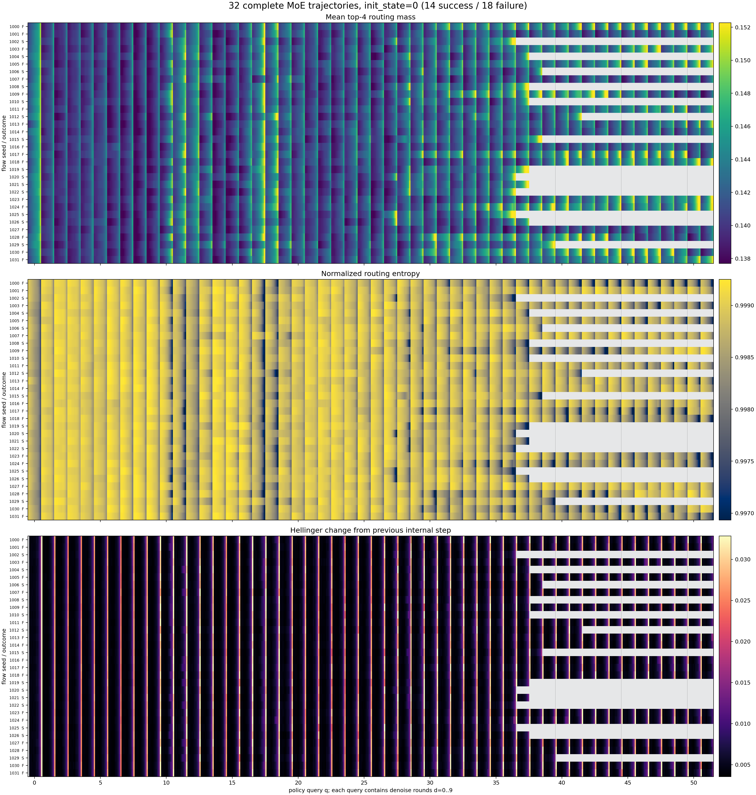
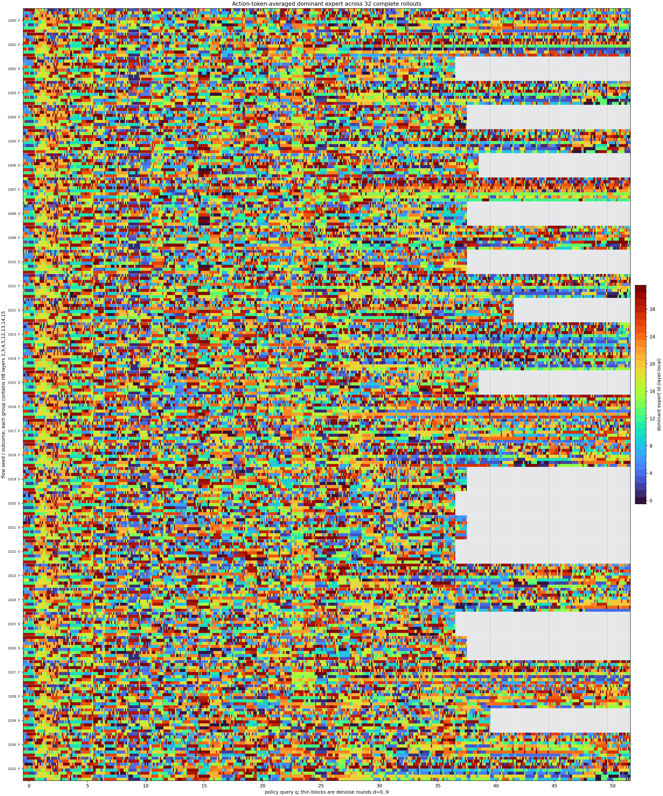
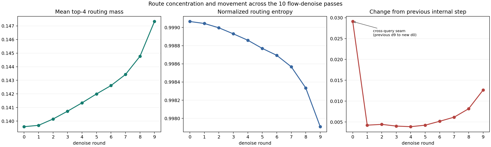
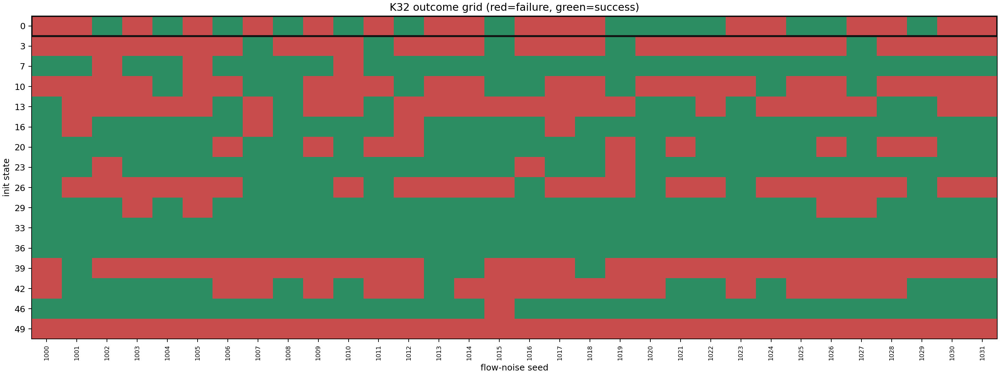

# K32 完整 rollout 的 MoE 激活轨迹

## 实验思路

- 选择 long/moka 的同一初始状态 `0`，一次性使用 seed 1000-1031 的 32 条完整 rollout；不再拆 K8。
- 横轴严格拼接每条 rollout 的全部 policy query；每个 query 再展开为 10 个 denoise round。提前成功结束后的区域留白，不做时间拉伸。
- 每个路由概率先在 32 专家上重新归一化。图一显示 top-4 概率质量、归一化熵和相邻内部步 Hellinger 变化；图二保留 8 个 HB 层各自的主导专家编号。

## 结果

该状态 32 条 rollout 中 `14` 条成功、`18` 条失败，每条有 `37-52` 个 policy query。
同一次 query 内相邻 denoise 的平均路由变化为 `0.0059`；从上一 query 的 d9 跨到下一 query 的 d0 为 `0.0291`。这两种边界已在图中按真实顺序连接。
跨 query 的大跳变同时包含新观测和新动作初始噪声，不能只解释成环境状态变化。

10 轮内部存在稳定的收紧过程：top-4 概率质量从 d0 的 `0.1396` 增到 d9 的 `0.1473`，归一化熵从 `0.999066` 降到 `0.997909`；后一次内部更新的路由变化从 d1 的 `0.0042` 增到 d9 的 `0.0127`。

成功与失败整条轨迹的平均 top-4 mass 只差 `-0.000540`，平均变化速度只差 `-0.000214`；当前图没有显示一个可直接按成败分开的激活模式。

完整 long/moka 数据上，随机选 1 的成功率为 `0.578`，K8 偷看结果上限为 `0.812`，K32 偷看结果上限为 `0.938`。K32 仍不到 1，是因为 16 个状态中有 `1` 个状态的 32 条全部失败。
四个非天花板任务等权后，K8 偷看上限是 `0.949`，直接看 K32 后是 `0.984`。之前使用 K8 是为了固定 8 次候选推理预算；K32 用 4 倍候选推理换来了更高上限，做上限分析时应当看 K32。

## 10 次去噪是什么意思

是的。一次 policy query 先生成一个动作噪声，然后做 10 次 flow denoise；每次都会重新执行 action suffix 的 18 层 transformer，其中 8 层是 HB-MoE、4 层是 AS-MoE、6 层是 dense。也就是每次 query 有 `10 x 8 = 80` 次 HB 层级路由和 `10 x 4 = 40` 次 AS 层级路由。HB 每次还同时处理 1 个 state token 和 10 个 action token。AS 路由因为只看恒定 data mask，10 次结果相同，所以存储时折叠成一次。

它不是把同一个动作执行 10 次：这是模型内部把噪声动作逐步变成最终动作块的 10 次前向更新。环境只拿最终动作块执行。
