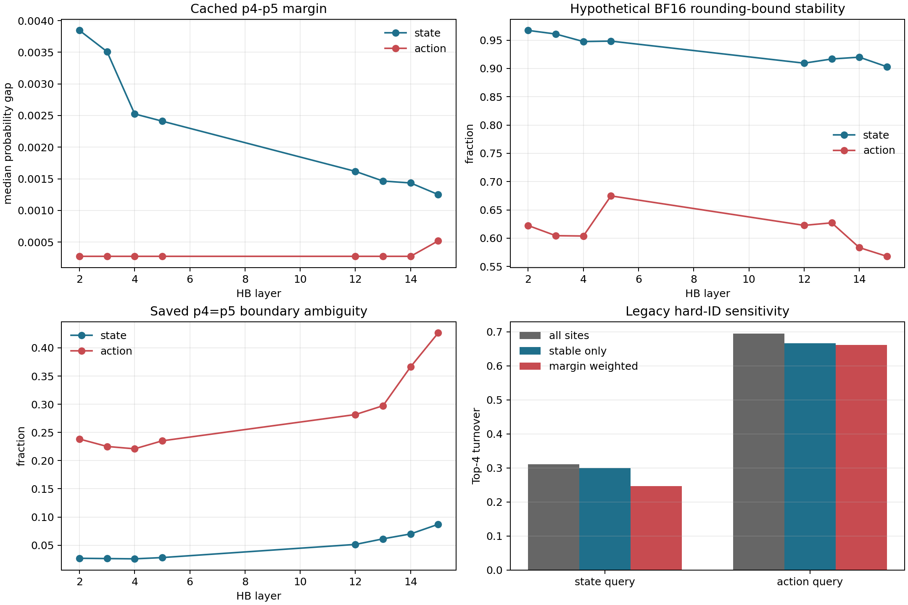

# Router 量化可识别性审计

## 结论

**对实际执行过哪些 expert 的事实记录是 Go；从缓存概率唯一重建 action Top-4、或把 hard-ID
变化直接解释成“策略改变”，都是 No-Go。**
缓存中的 `hb_expert_ids` 是 hook 直接取得的实际 Top-4，再转成 `uint8`；它不是从
`float16` 概率重建的。但若对保存概率施加 hypothetical BF16 output rounding，action router
的 p4-p5 边界有相当一部分不满足保守稳定界；所以 hard-ID 的变化不能自动等价为计算盆地
或策略改变。

六个互不重复的 canonical cache 共 54,929 个 control query、
48,337,520 个 HB routing site。action 的平均 p4-p5 gap 为
`0.000445574`，对保存概率施加 hypothetical BF16 rounding bound 的 stable fraction 为
**61.3%**；state 对应为
`0.00350483` 和 **93.4%**。
actual ID 与保存 fp16 概率的确定性 Top-4 集合在 canonical 数据上不一致率为
action **0.0%**、state
**0.0%**；但这不消除 tie 时的非唯一性。
缓存概率有 action **28.6%**、state **4.7%**
的 p4-p5 exact tie；所以即使 actual ID 已保存，仅凭概率也无法在这些 site 唯一确定 Top-4。
缓存值重新 cast 到 BF16 后，逐元素完全相等的比例只有 action
**12.5%**、state
**12.5%**，完整 32-way 向量相等率两者均为
**0.0%**。因此现有概率不是纯 BF16 网格值的无损副本；
历史 GPU softmax dtype 与 fp16 落盘前损失分别占多少，当前缓存无法分解。

## 旧 hard-ID 结论复核

旧报告的 action 相邻 query Top-4 更替率 `69.5%` 被逐位复现为
`0.694972399`（绝对误差
`0`）。只保留两端都通过 BF16 舍入界的 site 后为
`0.666`，覆盖原 pair-site 的
`36.4%`；用两端较小 p4-p5 margin 加权后为
`0.661`。这两个敏感版本仍然很高，因此近似平局
**没有解释掉大部分 69.5% turnover**；它说明 ID 确实频繁换，但 hard turnover 自身仍不说明
软分布变化有多大。state 的三项分别是
`0.311`、`0.300`、
`0.247`。

这里的 BF16 stable-only 是**对保存概率施加 hypothetical BF16 output rounding** 的保守
诊断，不是 deployed 稳定率，也不是 fp32 真值：条件为
`p4-p5 > halfULP(p4)+halfULP(p5)`。它只排除“单次输出舍入本身足以翻边界”的点，
不覆盖 BF16 `F.linear` 累积误差。

## 分层结果

| HB layer | state median gap | action median gap | state hyp-BF16-stable | action hyp-BF16-stable |
|---:|---:|---:|---:|---:|
| 2 | 0.00384521 | 0.000274658 | 96.7% | 62.2% |
| 3 | 0.00350952 | 0.000274658 | 96.1% | 60.4% |
| 4 | 0.00252533 | 0.000274658 | 94.8% | 60.4% |
| 5 | 0.00241089 | 0.000274658 | 94.8% | 67.5% |
| 12 | 0.00161743 | 0.000274658 | 90.9% | 62.3% |
| 13 | 0.00146484 | 0.000274658 | 91.7% | 62.7% |
| 14 | 0.00143433 | 0.000274658 | 92.0% | 58.3% |
| 15 | 0.00125122 | 0.000518799 | 90.3% | 56.8% |

完整 task/layer/token 明细见 `strata.csv`，role 汇总见 `role_summary.csv`。
margin、tie 和 cast 都直接作用在保存的 fp16 概率（读取后仅无损 upcast 到 fp32），不先
renormalize；只有熵为了消除逐元素落盘舍入造成的微小 sum error 才重新归一化。

## 数值链路：证据与缺口

1. upstream policy 在 `himoe-vla-cache/himoe-libero-bridge/cache/upstream/HiMoE-VLA/src/moevla/policies/policy.py:71` 的 CUDA 推理外层请求 BF16 autocast；HB gate
   源码依次执行 `F.linear -> softmax -> torch.topk`，中间没有显式 dtype cast。autocast 上下文
   本身不等于每个算子输出都是 BF16。
2. 独立 CPU-autocast runtime probe 记录 `scores.dtype=torch.bfloat16`，并在关闭 autocast 后
   计算 fp32 shadow（`himoe-route-capture/analysis/near-tie/summary.json:2`；探针实现见
   `himoe-route-capture/probe_near_tie.py:100`）。
   这是 CPU 运行证据，但不是历史 CUDA capture 的 dtype 元数据；不同 device 的 autocast
   operator policy 不能在无记录时视为相同。
3. recorder 从 gate 输出直接拿 `topk_idx`，前若干步用重算概率验证 Top-4 集合；canonical
   capture 都记录 480 次 verified call、0 failures。随后 IDs 显式转 `uint8`，full probs 显式
   转 `float16`。全部 10 个现有 full-prob cache 的 Zarr 元数据也分别验证为这两个 dtype。
4. **历史 capture 没有单独记录 logits dtype、softmax 输入/输出 dtype、TopK weight dtype、
   TopK index runtime dtype、或落盘前 full-prob dtype。** `runtime_numeric_chain.csv` 对每一段标明
   direct / mirror / unlogged，报告不靠猜测补齐。

## 三个旧数字的来源核对

- 相关的 action top-1 不是精确 `0.0369`，而是
  `0.037059549`，旧报告四舍五入为
  `0.0371`（`himoe-route-capture/analysis/post-error-adaptation-20260828/token_decomposition.md:32`）。仓库里
  精确文本 `0.0369` 出现在另一个 denoise-stop 指标表
  (`himoe-route-capture/analysis/denoise-stop-sweep/report.md:64`)，不能串成同一证据链。
- `0.9988` 的精确近邻来自 router audit 的 action layer0
  `H_token=0.998885453`
  (`himoe-route-capture/analysis/router-audit/summary.json:8`)；post-error 汇总的全 action
  normalized entropy 是 `0.998737581`。
- `69.5%` 来自前 2048 个 long-task query 的 action-token 相邻 query hard Top-4 turnover
  (`himoe-route-capture/analysis/post-error-adaptation-20260828/token_decomposition.md:39`)，本审计按原公式精确复现。

## 缓存范围

发现 10 个 full-prob cache：6 个 canonical
主样本、1 个重复 baseline、
3 个 pin intervention。所有 cache 都逐个计算并写入明细；总体数字只合并
canonical，避免把重复 baseline 和人为替换专家的 intervention 混入。pin intervention 的
actual ID 可以有意与未干预 router 概率冲突，因此不用于精度结论。

## 必须新采 fp32 logits 才能回答

- 全量历史 site 的 deployed Top-4 与**同 hidden/weight 的 fp32 shadow Top-4**究竟差多少；
- BF16 `F.linear` 累积误差与仅对输出概率做 cast 的误差各占多少；
- softmax 前 logit p4-p5 margin，以及概率近均匀是否掩盖了 logit 尺度；
- stable-only hard route-return AUC 是否仍为 0.733。现有缓存能严格复核 overlap/turnover，
  但没有旧 AUC 所需的逐事件 margin 和 fp32 counterfactual；
- GPU kernel 在 exact tie 上的跨硬件 tie-breaking 可重复性。

新 capture 至少要同时保存：实际 `topk_idx`、deployed logits/scores 及各自 runtime dtype、
关闭 autocast 后同 hidden/weight 的 fp32 shadow logits/scores，并在 cast 前保存。仅把现有
`float16` Zarr 数组 `.astype(float32)` 不会回答这些问题。

