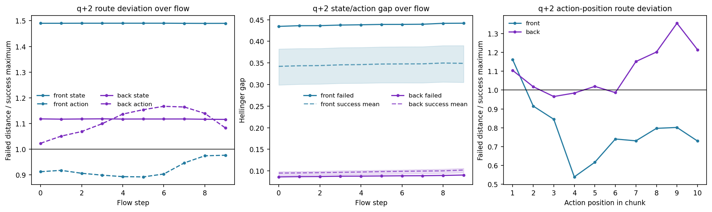
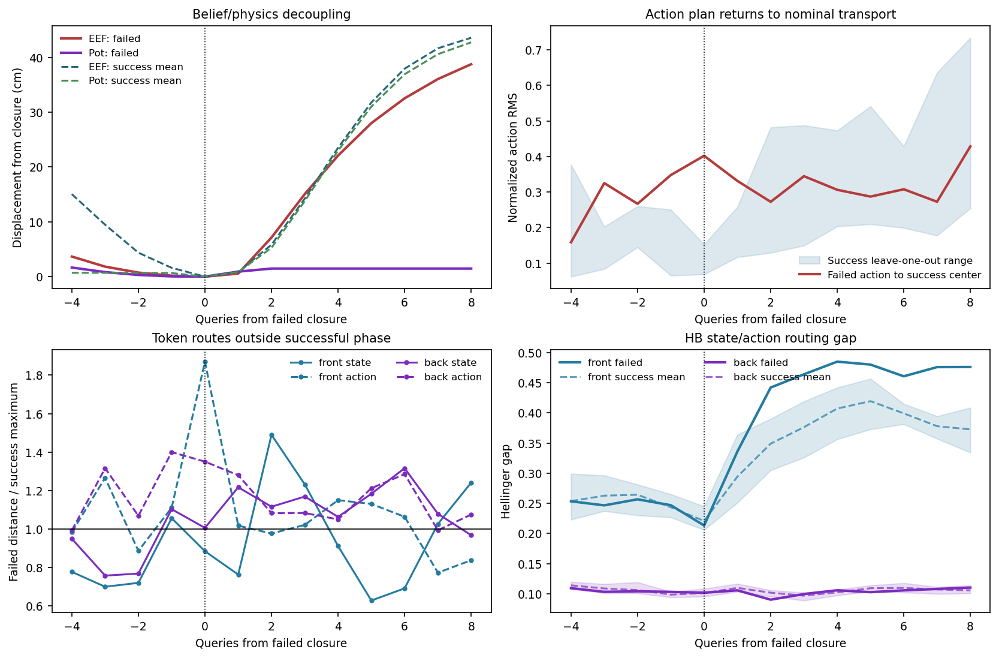

# 失败抓取后的 belief-state mismatch 与 MoE 路由分裂

> **后续证据修正（2026-09-04）：** 本文的 state/action 分裂是相对成功模板的观察性距离，不能推出新反馈在 action routing 前被截断。同噪声输入版本与 2x2 图像/状态反事实显示，抓空后的 `q+1/q+2` 中两种新反馈都强烈改变后层 action routing；因此下文的 `state updated / action stale` 只保留为历史行为解释，不再视为 causal feedback-blockage 结论。详见 [INPUT_VERSION_COUNTERFACTUAL_ZH.md](INPUT_VERSION_COUNTERFACTUAL_ZH.md)。

## 核心结论

`candidate_06 / episode 100000006` 可以操作性地归为 **belief-state trap**：机器人没有抓住 moka pot，但夹爪保持闭合，后续 action chunk 继续执行类似成功抓取后的抬升/搬运动作。这里的 `belief state` 不是模型中被直接读取到的显式变量，而是由“物体没有随末端运动，但策略仍按已抓住的阶段行动”推断出的行为状态。

MoE 的变化不是“整个网络都没发现异常”，也不是“某个 expert ID 代表没抓住”。更准确的结论是：

> **新的视觉/机器人状态与 action-facing HB routing 都发生了变化，但输出动作没有回到重新接近或重抓阶段。模板距离可以描述失败表型，不能证明路由中存在可直接解码的 stale grasp-success belief。**

最清楚的时刻是失败闭合后的第 2 次重规划 `q+2`：

| 证据层 | 失败轨迹 | 7 条同 snapshot 成功对照 | 关系 |
|---|---:|---:|---|
| 末端位移 | 7.14 cm | 均值 5.84 cm | 机器人已开始搬运 |
| pot 位移 | 1.47 cm | 均值 5.27 cm | pot 没有跟随 |
| 末端-pot 距离 | 17.08 cm | 6.62--7.35 cm | 物理耦合已明确断开 |
| gripper command 均值 | +1.011 | +1.006--+1.025 | 仍保持闭合 |
| action 到同阶段成功中心 RMS | 0.273 | LOO 0.129--0.482 | 重新落回成功搬运范围 |
| front state route 距离 | 0.1647 | LOO 0.0540--0.1105 | 高于全部成功对照，约成功均值 2.03x |
| front action route 距离 | 0.02131 | LOO 0.01672--0.02182 | 仍在成功范围内 |
| front state/action gap | 0.4420 | 0.3049--0.3902 | 高于全部成功对照 |
| back state route 距离 | 0.05583 | 0.03308--0.05002 | 高于全部成功对照 |
| back action route 距离 | 0.04262 | 0.02697--0.03936 | 高于全部成功对照 |

## 1. 实验定义

失败事件对齐到真实夹爪 aperture 在 control step 318 完成闭合的 query 31，记为 `q=0`。成功对照是同一个 simulator snapshot 下 7 条成功抓起同一 pot 的 sibling rollout。所有比较均为 train-free 统计：没有训练分类器、PCA 或 probe，也没有用失败标签拟合参数。

记录的 HB 张量是：

\[
R_{t,l,f,u,e},
\]

其中 HB 模型层为前层 2--5 和后层 12--15，`f=0,...,9` 为 10 个 flow step，`u=0` 是 state token，`u=1,...,10` 是 10 个 action positions，`e=1,...,32` 是 soft gate probability。失败轨迹到成功中心使用 Hellinger distance；成功范围由 7 个成功分支的 leave-one-out 距离构成，避免把样本自身放进其参考中心。

同一 query 的 10 个 flow step 共享固定的视觉前缀；下一次 query 会用新的 base/wrist Vision 和 robot state 重新推理。因此：

- flow 内变化反映固定观测条件下 action latent 的生成过程；
- chunk 间跳变反映新一轮 Vision、robot state 和 action noise 的联合响应；
- 当前数据不能把 HB 变化单独因果归因给 Vision，因为没有保存逐 query 的完整 base+wrist 原图和 hidden/expert output。

## 2. 规律一：错误形成时是“flow 内异常、chunk 间偏 stale”

在 `q=0` 生成失败抓取 chunk 时，机器人已经离 pot 9.42 cm；真实闭合时距离为 9.77 cm，而成功对照只有 6.16--7.04 cm。该 action chunk 的前两个 gripper token 仍是张开命令，后八个才要求闭合，因此错误动作计划在执行前已经形成。

此时前、后 HB 的完整 flow 指标都高于全部 7 条成功对照：

| HB 分组 | late-flow volatility | 相对成功均值 | route acceleration | 相对成功均值 |
|---|---:|---:|---:|---:|
| front 2--5 | 0.03673 | +9.3% | 0.01311 | +4.5% |
| back 12--15 | 0.03353 | +35.8% | 0.00933 | +29.8% |

但 `q=0` 相对上一 chunk 的整体 route jump 反而低于全部成功对照：front 0.04389，back 0.03320。也就是说，它不是在 chunk 边界突然切到一个新路由状态，而是从相对 stale 的状态出发，在 10 步去噪内部走出更异常、更弯曲的 action route。后层第 15 层的事件差异最大，前层以第 5 层最明显。

这部分是 **missed-grasp formation signal**，不能单独叫 belief mismatch；因为此时错误接触的物理后果还没有完全显现。

## 3. 规律二：新观测后的后层响应有 1--2 个 chunk 的转换期

在 `q+1`，front 和 back 的跨 chunk route jump 都高于全部成功对照：

| 相对 query | front jump | 成功范围 | back jump | 成功范围 |
|---:|---:|---:|---:|---:|
| +1 | 0.04563 | 0.03719--0.04371 | 0.04906 | 0.03611--0.04277 |
| +2 | 0.03478 | 范围内 | 0.04376 | 0.02893--0.03710 |
| +3 | 0.03378 | 范围内 | 0.03047 | 0.02277--0.02921 |

因此，抓空后的新输入确实使 HB 改变，且后层的整体转换持续到 `q+3`。这与“MoE 完全没有看到状态变化”不一致。

但是 route jump 只说明计算状态变了，不说明模型形成了正确的语义判断，更不说明变化提供了恢复方向。

## 4. 规律三：`q+2` 出现最清楚的 state/action 路由分裂

`q+2` 是第一个物理 mismatch 无歧义的 query：末端从闭合点移动 7.14 cm，pot 只移动 1.47 cm；末端-pot 距离已经增至 17.08 cm。成功对照中末端和 pot 的位移比均值为 0.901，失败轨迹只有 0.206。

与此同时，动作并没有转向重抓：

- gripper command 仍为约 `+1`；
- action chunk 到同阶段成功中心的归一化 RMS 为 0.273，落在成功 LOO 范围内；
- action 与同阶段成功中心 cosine 为 0.958；
-最近的成功动作阶段甚至是 `q+3`，即策略计划比当前成功对齐阶段还前进 1 个 query。

逐 token HB 给出一个非对称结构：

1. front state token 明显异常；
2. front action tokens 仍与成功搬运阶段相容；
3. front state/action gap 因而显著扩大；
4. 到 back HB 时，state 和 action routes 都已经偏离成功参考，但二者之间的 gap 本身不大。

这比“HB 发生变化”更具体。它意味着 front HB 中存在一种 **state updated / action stale** 的分裂；back HB 接收并传播了异常计算状态，却没有把输出动作拉回接近或重抓阶段。

## 5. 规律四：分裂贯穿完整 flow，而不是最后一步偶然抖动

在 `q+2` 对 10 个 flow steps 分别比较：

| 路由量 | 高于全部成功对照的 flow 数 |
|---|---:|
| front state route | 10/10 |
| front action route | 0/10 |
| front state/action gap | 10/10 |
| back state route | 10/10 |
| back action route | 10/10 |
| back state/action gap | 0/10 |

state token 的 route 在 flow 轴上不随 action denoising 改变，这是由其 attention/mask 位置决定的；关键不是它“后期变大”，而是新的 query 一开始就落到了不同 state route。front action routes 在所有 10 个 flow steps 都保持在成功范围，说明 stale action-side 模式不是 final-flow 采样偶然造成的。

逐 action position 看，front 只有第 1 个位置越过成功范围；back 有 7/10 个位置越界，集中包含第 7--10 个远期动作位置，最大为第 9 个位置的成功上界 1.35x。这表明异常在后层扩散到多数 action slots，尤其是 chunk 后段，但仍没有产生正确的恢复动作。



## 6. 规律五：front layer 5 持续承载 mismatch

front 分组的 state/action gap 从 `q+2` 到 `q+8` 连续高于全部成功对照。逐层定位为：

| HB 模型层 | 高于全部成功对照的 post-mismatch queries |
|---:|---|
| 2 | 无 |
| 3 | +2, +3, +4 |
| 4 | +2, +3 |
| 5 | +2, +3, +4, +5, +6, +7, +8 |

第 5 层是最稳定的局部载体。其 gap 在 `q=0` 还低于成功范围，在 `q+1` 仍处于范围内，到 `q+2` 才越界并持续。这条 onset 与物理耦合断裂的时间一致，比单独看 back route 是否异常更有辨识度。

到 `q+6`，末端已移动 32.54 cm，pot 仍只移动 1.47 cm，末端-pot 距离达到 42.27 cm；成功对照仍约为 7.13 cm。失败动作从 `q+2` 到 `q+8` 都在对应成功阶段的 LOO 范围内，而 layer-5 gap 同期持续越界。这构成该案例中最完整的 stale-belief persistence 证据。



## 7. AS 和 hard expert ID 为什么不是这里的信号

AS gate 输入是 24 维 `data_mask`，不是每个 query 的 Vision-conditioned hidden。整个 route store 的 16,180 行中，四个 AS 层的概率向量严格只有一种，最大跨度为 0。因此：

- AS router ID/probability 对这个 belief mismatch 没有响应；
- 这不代表 AS expert output 不变，因为被选 expert 仍处理不同 hidden；
- 当前可用的 belief-state signal 位于 HB soft routing，而不是 AS routing。

HB gate 概率存在近似并列，top-1/top-4 expert ID 会对很小的概率差敏感。本实验所以使用完整 32-expert soft distribution 的 Hellinger distance。现在没有证据支持“expert X 就是 belief-trap expert”这样的离散规律。

## 8. 可以尝试的 train-free 检查器

基于该案例，最值得继续验证的不是单一 route magnitude，而是一个时序 conjunction：

\[
\text{new-observation jump}
\rightarrow
\text{front state/action gap}
\rightarrow
\text{action remains in transport phase}.
\]

对应的 train-free 原型可以是：

1. back 或 front chunk jump 超过同阶段 healthy reference；
2. 随后连续至少 2 个 query，front layer-5 state/action gap 超过 healthy reference；
3. action route/action chunk 仍接近成功搬运阶段，而不是回到 approach/regrasp 阶段。

阈值可以只由成功/健康 calibration 数据确定；这属于阈值确认，不是训练 classifier。若部署时有物体跟踪或接触信息，再加入“末端运动而物体不跟随”会把它从内部异常检查器升级为可解释的 belief/physics consistency check。

但当前不能报告该规则的 AUROC、假阳性率或 lead time，因为只有 1 条明确失败轨迹和 7 条匹配成功轨迹。这里给出的是候选规律，不是已验证的通用 detector。

## 9. 跨案例证据边界

已有较大范围的旧实验没有支持强泛化主张：

- grasp-fail ladder 有 34 个可用事件、4 个初始状态 cluster；routing 相对 physical+action 的 AUC 增量仅 `+0.007`，95% CI `[-0.074,+0.188]`，全局 gate 为 FAIL；
- post-loss cohort 有 31 个最终失败、仅 2 个最终恢复，全局 gate 也为 FAIL；描述上失败后的 action-route similarity 为 0.962，恢复样本为 0.935，方向上符合“失败计划更持续”，但 2 个恢复样本不足以推断规律。

因此当前证据等级是：

> **同 snapshot 单案例中的强、连续、可定位机制现象；有旧描述性结果与 stale-plan 方向一致，但尚未跨初始状态和任务确认。**

## 10. 产物与复现

- `code/analyze_belief_state_mismatch.py`：物理、动作 phase、逐 layer/flow/token/position HB 比较；
- `configs/belief_state_mismatch.json`：冻结窗口和 action normalization；
- `results/belief_state_mismatch/summary.json`：机器可读核心关系与限制；
- `tables/belief_physics_alignment.csv`：末端/物体耦合和夹爪命令；
- `tables/action_phase_consistency.csv`：失败 action 与成功阶段的相似性；
- `tables/hb_token_match_to_success.csv`：final-flow state/action token 距离；
- `tables/hb_flow_token_match_to_success.csv`：逐 flow 的 state/action 距离；
- `tables/hb_flow_state_action_gap.csv`：逐 flow 的 state/action gap；
- `tables/hb_action_position_match_to_success.csv`：逐 action position 路由距离；
- `tables/hb_state_action_gap_layer.csv`：逐 HB 层的持续 gap；
- `tables/hb_cross_chunk_response.csv`：新观测后的跨 chunk route jump。

复现命令：

```bash
python himoe-vla_trap/code/analyze_belief_state_mismatch.py \
  --config himoe-vla_trap/configs/belief_state_mismatch.json
```
