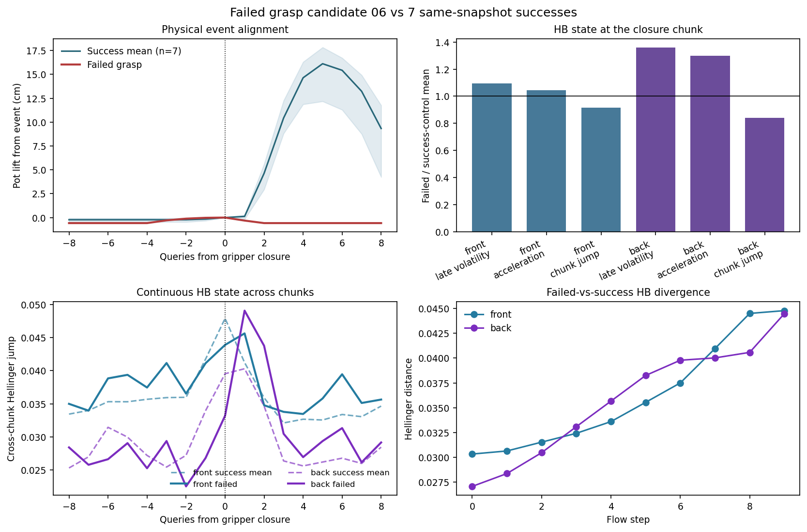
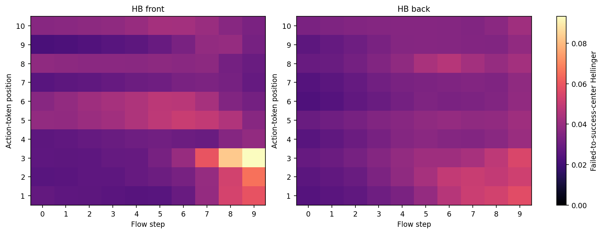
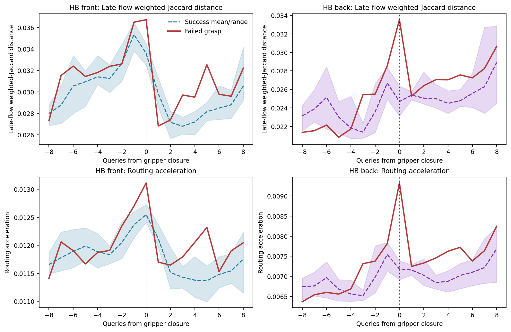

# 失败抓取前后的 AS/HB MoE 动力学

## 结论先行

`candidate_06 / episode 100000006` 不是 no-response Trap，也不是已经证实的 loop Trap。机器人持续运动并输出夹爪命令，但在离目标 moka pot 过远时才完成闭合，最终没有建立抓取耦合。更准确的标签是 **failed grasp / missed contact**。

这个个案支持以下受限结论：

1. **AS routing 完全不变。** 在本次 route store 的 16,180 个推理 chunk 上，四个 AS 层只有一条概率向量，失败 episode 内和全语料的最大概率跨度都严格为 0。
2. **HB routing 在失败闭合 chunk 内明显异常。** 前四个 HB 层和后四个 HB 层的 within-flow volatility、late-flow volatility、route acceleration 都高于 7/7 个同 snapshot 成功抓取对照，后层差异更大。
3. **事件 chunk 同时具有“flow 内更动荡、chunk 间更迟钝”的结构。** 它相对自身上一 chunk 的 HB 跳变低于全部成功对照；实际抓空后，后层 HB 在后续第 1、2 个 chunk 才大幅跳变。
4. **这不是独立的故障因果证据。** 失败轨迹在生成该 chunk 时已经具有不同的物体几何关系和不同的 action chunk。HB 很可能同时表征“离得更远”和“前两个 gripper token 仍张开”等计划差异。

因此最准确的表述是：

> 失败抓取在执行前的 HB 去噪路由中已有可见差异，尤其集中于后层和 late flow；抓空后的新观测又触发后层 HB 的延迟跳变。AS 路由本身不携带这类变化。

## 1. Vision 输入变了，MoE 为什么会变化

这里的 `V` 是每次重规划输入的 Vision：一张 224 x 224 主摄像头图像和一张 224 x 224 腕部图像。每个 query 都重新执行视觉前缀编码：

\[
V_t\rightarrow \operatorname{SigLIP}(V_t)\rightarrow KV_t^{vision/language}.
\]

同一个 query 内的 10 个 flow step 复用这份 prefix KV；环境和图像在去噪期间不会变化。action/state suffix 通过 attention 读取视觉 KV，得到 HB router 所见的 hidden：

\[
h_{t,l,f,u}=F_l(S_t,x_{t,f},f\mid KV_t^{vision/language}),
\]

\[
p^{HB}_{t,l,f,u}=\operatorname{softmax}(W_l h_{t,l,f,u}).
\]

因此需要区分两种变化：

- **chunk 内 flow 变化**：Vision 固定，变化的是 noisy action latent、time 和逐层 hidden；Vision 提供固定条件。
- **chunk 间变化**：输入新的 \(V_{t+1}\) 和 \(S_{t+1}\)，重新生成 prefix KV，HB routing 会对新的视觉/物理状态联合响应。

AS 的实现不同：

\[
p^{AS}_{t,l,u}=\operatorname{softmax}(W_l d_t),
\]

其中 gate 输入是 24 维 `data_mask`，随后沿 suffix token 维扩展；Vision 不直接进入 AS gate。选中的 AS expert 仍处理已经融合视觉条件的 hidden state，所以：

\[
\text{AS routing 不变}\not\Rightarrow\text{AS expert output 不变}.
\]

这批 NPZ 没保存每个 query 的原始主视角和腕部 Vision。MP4 只为部分 candidate 保存了有损压缩后的主摄像头画面，没有腕部画面。因此本实验检查的是**不同真实 Vision 输入下最终产生的 routing 状态**，但不能把 routing 差异单独归因给 Vision；robot state、noise/action latent 也同时不同。

## 2. 事件与匹配对照

失败事件自动定义为：夹爪 aperture 从 `>=0.05` 跨到 `<0.05`、末端距离 pot 小于 0.16 m，且之后 pot 没有上升 0.02 m。成功对照来自完全相同 simulator snapshot，要求相同近物闭合后 pot 上升至少 0.02 m。

| 项目 | 失败 candidate 06 | 7 条成功对照 |
|---|---:|---:|
| closure query | 31 | 29, 33, 30, 33, 32, 36, 33 |
| 闭合时末端到 pot 距离 | 9.77 cm | 6.16--7.04 cm |
| chunk 内实际闭合位置 | 第 8 个动作 | 第 3--5 个动作 |
| 闭合后最大抬升 | 0 cm | 12.15--17.90 cm |

在 query 31 开始、模型生成 action chunk 时，失败轨迹的末端到 pot 已为 9.42 cm；成功对照在对应事件 query 为 6.15--7.05 cm。物理差异不是执行后才出现。

失败 action chunk 的 10 个 gripper token 是：

```text
-1.012, -0.991, +0.994, +0.986, +0.989,
+0.942, +0.985, +0.947, +0.981, +0.993
```

也就是前两个 token 仍要求张开，之后才闭合；成功对照的 10 个 token 几乎全部约为 `+1`。因此这是一个主动但时机/几何错误的抓取计划，不是没有动作响应。

## 3. AS 前后层

AS 前层为模型层 0、1，后层为 16、17。全 store 审计结果：

| AS layer | 分组 | 选中 expert | 三专家概率 | episode span | corpus span |
|---:|---|---:|---|---:|---:|
| 0 | front | 2 | 0.2197 / 0.2480 / 0.5322 | 0 | 0 |
| 1 | front | 0 | 0.3333 / 0.3333 / 0.3333 | 0 | 0 |
| 16 | back | 0 | 0.3816 / 0.3342 / 0.2842 | 0 | 0 |
| 17 | back | 1 | 0.2379 / 0.4604 / 0.3018 | 0 | 0 |

所以 AS 在这个 capture 中既没有“瞬间切 expert”，也没有“连续 chunk 演化”。若要看 AS 对不同 `V/hidden` 的响应，必须记录 expert 输入/输出，而不是继续分析 AS router ID。

## 4. HB 闭合瞬间

HB 前层为模型层 2--5，后层为 12--15。指标均在 10 个 action token 上计算：

- `within_flow_wj`：完整 flow 0--9 相邻概率的 weighted-Jaccard distance；
- `late_flow_wj`：仅 flow 6--9 内部三个相邻转移；
- `route_acceleration`：概率平方根坐标的二阶 flow 差分；
- `chunk_jump_full_h`：当前 chunk 与上一 chunk 完整 flow 的 Hellinger distance；
- `event_to_success_center_h`：失败事件与 7 个成功事件均值的 Hellinger distance。成功对照用 leave-one-out 中心，避免自包含偏差。

| HB 分组 | 指标 | 失败值 | 成功均值 [min, max] | 失败位置 |
|---|---|---:|---:|---|
| front | within-flow | 0.02456 | 0.02360 [0.02306, 0.02430] | 高于 7/7 |
| front | late-flow | 0.03673 | 0.03359 [0.03251, 0.03448] | 高于 7/7 |
| front | acceleration | 0.01311 | 0.01255 [0.01241, 0.01273] | 高于 7/7 |
| back | within-flow | 0.02025 | 0.01606 [0.01536, 0.01666] | 高于 7/7 |
| back | late-flow | 0.03353 | 0.02470 [0.02315, 0.02635] | 高于 7/7 |
| back | acceleration | 0.00933 | 0.00718 [0.00692, 0.00739] | 高于 7/7 |

后层效应最大：late-flow volatility 比成功均值高 35.8%，route acceleration 高 29.8%。前层分别高 9.3% 和 4.5%。

失败事件对成功中心的距离也超出全部成功 leave-one-out 对照：

| 分组 | 失败 | 成功范围 | 失败/成功均值 |
|---|---:|---:|---:|
| front | 0.03618 | 0.02579--0.03004 | 1.30x |
| back | 0.03578 | 0.02036--0.02488 | 1.67x |

逐层看，模型第 15 层最明显：`event_to_success_center_h=0.05188`，成功对照最高仅 0.02225；其 late-flow volatility 为 0.04057，成功最高 0.02729。前层中第 5 层最明显。

从 flow 0 到 flow 9，失败到成功中心的逐 token 平均距离持续放大：front 从 0.0303 增至 0.0448，back 从 0.0271 增至 0.0445。差异不是某个离散 expert ID 的一次偶然翻转，而是在后期去噪逐渐累积。





## 5. 连续 chunk 状态

事件 query 记为 0。失败轨迹在 `-1` 时，front 的 late-flow volatility 和 acceleration 已略高于 7/7 成功对照；back 的 late-flow volatility 也略高于成功范围。`-3` 还出现过一次 back 异常，但 `-2` 回到成功范围，因此目前不能把它描述成稳定、单调的三 chunk 前兆。

更有辨识度的是下列状态转换：

| 相对 query | front chunk jump | back chunk jump | 相对成功范围 |
|---:|---:|---:|---|
| 0 | 0.04389 | 0.03320 | 两者均低于 7/7 成功对照 |
| +1 | 0.04563 | 0.04906 | 两者均高于 7/7 成功对照 |
| +2 | 0.03478 | 0.04376 | back 高于 7/7；front 在范围内 |
| +3 | 0.03378 | 0.03047 | back 仍略高于全部成功对照 |

解释上，事件 chunk 的 HB 不是“整体突然换状态”，而是从一个相对 stale 的跨 chunk 状态出发，在自身 10 个 flow step 内走出更弯曲、更不稳定的路径；抓空后的新观测到来后，后层 HB 才整体跳到新状态。



## 6. 能说什么，不能说什么

可以说：

- HB routing 对错误抓取的几何/动作计划有瞬时响应；
- 响应在后层和 late flow 更强；
- 同一失败事件有“执行前 flow 内异常”和“执行后跨 chunk 后层跳变”两个阶段；
- 这些量全部是直接统计，没有训练 classifier、PCA 或阈值。

不能说：

- AS 计算没有变化；我们只证明 AS routing 不变；
- HB 异常独立于 action token；失败 action chunk 本身已经明显不同；
- 这是一个跨任务可泛化 detector；当前是 1 个失败个案对 7 个匹配成功对照；
- HB 导致了抓取失败；这里是相关性分析；
- 已经隔离了 Vision 的因果贡献；当前 capture 没保存逐 query 的完整 base+wrist 图像，也没保存 hidden/expert output。

下一次若要直接回答 Vision 的作用，应在相同 snapshot 的失败/成功 replay 上保存每个 query 的 base+wrist 图像，并做固定 state、固定 flow noise 的 Vision swap：只替换 \(V\)，再比较 HB routing、HB gate input 和 action。与此同时开启 targeted `store_hidden`，只保留事件前后 3 个 chunk。这样才能把“Vision 使 router 改变”与 state/action latent 的贡献拆开。

## 7. 产物

- `code/analyze_failed_grasp_moe_dynamics.py`：事件检测、route 对齐、AS 全语料审计和 HB 多尺度统计；
- `configs/failed_grasp_moe_dynamics.json`：冻结的层、token、flow 和物理阈值；
- `results/failed_grasp_moe_dynamics/summary.json`：机器可读结论；
- `tables/physical_event_alignment.csv`：物理闭合/抬升真值；
- `tables/as_route_state.csv`：AS 前后层完整审计；
- `tables/hb_event_layer_metrics.csv`：逐 HB 层事件指标；
- `tables/hb_event_group_summary.csv`：前/后层成功范围比较；
- `tables/hb_instantaneous_expert_paths.csv`：逐层逐 flow expert path；
- `tables/hb_flow_token_distance.csv`：逐 flow × action-token 软路由距离；
- `tables/aligned_chunk_dynamics.csv`：事件前后连续 chunk 状态；
- `tables/action_token_event.csv`：逐动作 token 的动作对照。

复现命令：

```bash
python himoe-vla_trap/code/analyze_failed_grasp_moe_dynamics.py
```
