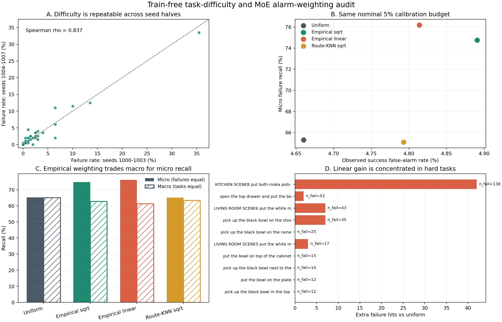

# 任务难度与 MoE 报警加权实验

## 直接结论

这组实验把三个容易混淆的问题分开了：

1. 当前策略下，不同任务的经验难度能否稳定测量？可以。
2. 第一个重规划的 MoE routing 能否直接推出一个任务有多难？当前证据不支持。
3. 已知任务的历史失败率能否用来调整 MoE 报警预算？能提高失败样本的 micro recall，但会牺牲按任务等权的 macro recall，而且收益高度集中在少数难任务。

因此，现阶段最稳妥的结构是：

```text
MoE dynamics -> 当前轨迹异常证据
历史 rollout outcome -> 当前策略/分布下的 task prior
utility / intervention cost -> 是否报警
```

不要把 task prior 说成 MoE 自己识别出的难度。

## 数据与隔离协议

- 37 个 LIBERO 任务，每任务 50 个 initial states x 8 个 flow-noise seeds，共 14,800 条轨迹。
- 487 条失败，14,313 条成功。
- 难度定义为固定 checkpoint、初始状态/noise 分布、controller 和 horizon 下的经验失败率，不是任务的固有属性。
- seeds 1000--1003 与 1004--1007 双向交换 calibration/evaluation。
- 第一个 query 的 MoE 特征和 `8 x 32` route embedding 在 outcome CSV 加载前先写盘。
- 没有梯度更新、分类器训练或基于 failure label 拟合 feature weights。
- 报警预算实验会使用另一半 rollout 的 outcome 来估计 task prior，因而属于 label-based calibration，不是纯 MoE-only。

冻结配置见 [task_difficulty_weighting.json](../configs/task_difficulty_weighting.json)，完整自动报告见 [REPORT_ZH.md](../results/task_difficulty_weighting/REPORT_ZH.md)。

## 结果一：难度可以操作性定义

两组互斥 noise seeds 上，37 个任务失败率的 Spearman 为 `rho=0.837`，去掉最难任务后仍为 `rho=0.823`。这说明“当前策略在当前 rollout 分布上的失败概率”是一个可重复的 operational quantity。

任务失败率从 `0%` 到 `34.5%`。最难的双摩卡壶任务占全部失败的 `28.3%`，前五个任务占 `60.2%`。平均 episode 长度与失败率只有 `rho=0.145, p=0.390`，所以不能用任务长短替代难度。

逐任务数值见 [task_difficulty.csv](../results/task_difficulty_weighting/task_difficulty.csv)。

## 结果二：MoE 强烈编码任务身份，但没有可靠难度轴

仅用第一个 query 的 HB MoE action-route embedding，最近任务中心在 held-out initial states 上识别具体任务的准确率为 `98.96%`，识别 suite 为 `100%`。这个结果说明 route 的任务条件性极强，也解释了为什么一套绝对阈值跨任务会失稳。

但“能认出是什么任务”不等于“知道这个任务有多难”：

- 15 个首 query route 标量中，没有一个在 5,000 次置换和 BH 校正后达到 `q<=0.05`；最强项 `back/front volatility ratio` 的 cross-fit 平均 `rho=-0.233, q=0.899`。
- 任务间 route distance 与失败率差的平均相关只有 `rho=0.120`，置换 `p=0.118`。
- route-KNN 的最好设置 `k=1` 仍得到 MAE `0.0317`，差于不看 route 的 leave-one-task median MAE `0.0281`；`k=3/5/10` 也全部更差。

所以对一个没有任何历史 outcome 的新任务，当前不能根据“它在 route 空间靠近哪个任务”可靠继承难度。

对应输入与预测见 [first_query_moe_features.csv](../results/task_difficulty_weighting/first_query_moe_features.csv)、[first_query_action_route_embeddings.npz](../results/task_difficulty_weighting/first_query_action_route_embeddings.npz) 和 [early_route_knn_predictions.csv](../results/task_difficulty_weighting/early_route_knn_predictions.csv)。

## 结果三：经验难度加权有明确但有限的作用

固定使用同一个无训练 MoE detector，并在 calibration successes 上分配名义 5% 报警预算：

| 分配方式 | 失败命中 | micro recall | 成功误报率 | precision | macro task recall |
|---|---:|---:|---:|---:|---:|
| 每任务均匀 5% | 318/487 | 65.3% | 4.66% | 32.3% | 65.2% |
| 经验难度平方根 | 364/487 | 74.7% | 4.89% | 34.2% | 62.8% |
| 经验难度线性 | 371/487 | 76.2% | 4.81% | 35.0% | 61.3% |
| route-KNN 难度平方根 | 317/487 | 65.1% | 4.79% | 31.6% | 63.4% |

线性经验先验相对均匀分配多命中 53 条失败，其中 42 条来自最难的双摩卡壶任务。去掉该任务后仍有 `+3.2` 个百分点，但按任务等权的 macro recall 下降 `3.8` 个百分点；task-cluster bootstrap 的 micro recall 差为 `+10.9` 个百分点，95% CI `[-1.4, +19.4]`，不能声称可泛化到新的任务集合。

两次交换方向的线性加权均提高命中：`153/250 -> 184/250` 与 `165/237 -> 187/237`。这支持它在当前 37 个固定任务上的 budget-allocation 作用，但不是新的 MoE failure signal。

纯 route-KNN 难度加权没有收益：`318 -> 317`，因此不能用 MoE task similarity 替代 outcome-calibrated prior。

汇总见 [weighting_summary.csv](../results/task_difficulty_weighting/weighting_summary.csv)，逐 fold 与逐任务贡献见 [weighting_fold_evaluation.csv](../results/task_difficulty_weighting/weighting_fold_evaluation.csv) 和 [weighting_task_evaluation.csv](../results/task_difficulty_weighting/weighting_task_evaluation.csv)。



## 应该怎么用

对已部署过、有稳定历史统计的任务，可以保留独立 task prior，并把它用于报警决策成本，而不是改写 MoE anomaly score。一个更清楚的决策形式是：

```text
alarm when P(failure | MoE dynamics, task prior) * C_miss(task)
           > P(false alarm | calibration) * C_intervention(task)
```

当前实验只验证了更简单的分位数预算分配。上线前仍需要：逐 query 在线回放、固定 intervention cost、按 failure type 分层，以及新的任务/场景验证。

对无历史数据的新任务，先使用保守的统一阈值；不要根据 route-neighbor 猜难度。任务指令本身已经已知，用 MoE 重新识别 task ID 没有部署收益，MoE 真正有价值的部分仍是轨迹运行中的动态异常。

## 复现

从工作区根目录运行：

```bash
OPENBLAS_NUM_THREADS=1 OMP_NUM_THREADS=1 MKL_NUM_THREADS=1 \
python himoe-vla_trap/code/analyze_task_difficulty_weighting.py \
  --bootstrap 5000 --permutations 5000
```

首 query MoE-only 文件已存在时可加 `--reuse-early`。主脚本见 [analyze_task_difficulty_weighting.py](../code/analyze_task_difficulty_weighting.py)，机器摘要见 [summary.json](../results/task_difficulty_weighting/summary.json)。
