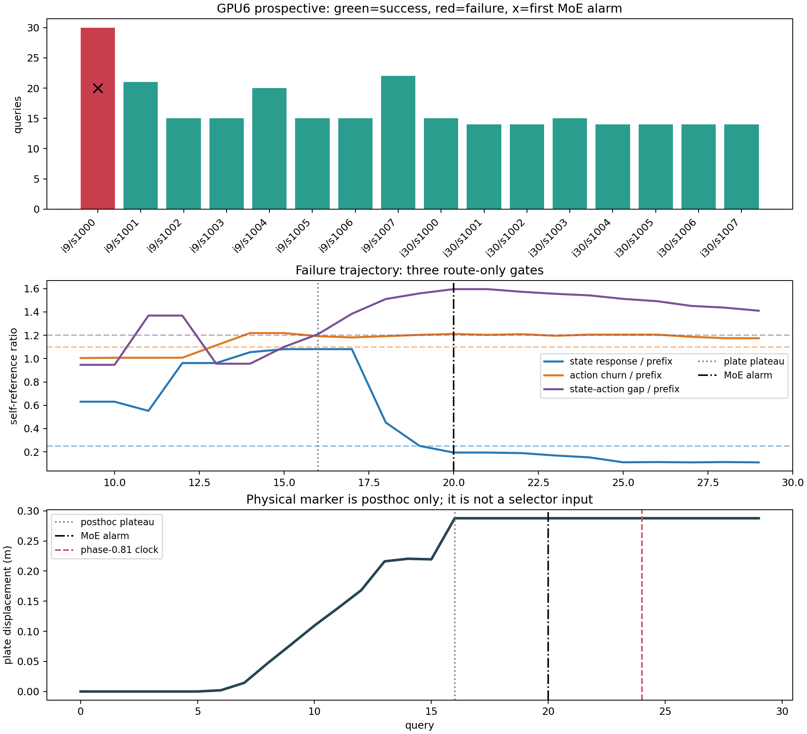

# 无任务先验的 MoE 自参照报警

## 结论先行

`self_reference_coupling_collapse_v3` 不识别任务，也不估计“任务难度”。它把每条新轨迹最初 6 次路由变化作为该轨迹自己的坐标系，随后寻找一种更深层、可跨任务表达的内部失配：

1. 前层 state-token 的跨 chunk 路由响应突然冻结；
2. 后层 action-token 在完整 10 步去噪中的路由加速度仍升高；
3. 前层 state/action 路由间隙同时扩大。

三项同时成立才报警。运行时只读取当前 episode 的 `HB router probabilities` 和自身历史前缀；不读取任务 ID、正常轨迹、动作数值、机器人/仿真状态、物理距离、reward、success 或 timeout。

严格排除阈值开发任务后，39 个任务、15,600 条轨迹上的结果为：

- failure recall：`78/530 = 14.72%`
- success FPR：`35/15070 = 0.232%`
- precision：`78/(78+35) = 69.03%`
- 被检出失败的中位提前量：`8.5 queries`

因此它不是通用 detector，而是一个低误报、低召回的 **internal response-collapse phenotype head**。报警表示捕捉到一种较窄的内部异常；不报警不能证明轨迹健康。

## 规则

对第 `t` 个 query 的 HB 路由 `R_t`，计算三个标量：

```text
c_t = 后四层 action tokens 的完整 flow route acceleration
g_t = 前四层 final-flow state/action Hellinger gap
r_t = 前四层 final-flow state route 对上一 query 的 Hellinger jump
```

用 `q1--q6` 的中位数建立当前 episode 自身基线 `c0, g0, r0`，最近 3 个 query 也取中位数。报警条件为：

```text
r_recent / r0 <= 0.25
c_recent / c0 >= 1.10
g_recent / g0 >= 1.20
```

实现见 [moe_self_reference_selector.py](../code/moe_self_reference_selector.py)，冻结配置见 [self_reference_coupling_collapse_v3.json](../configs/self_reference_coupling_collapse_v3.json)。阈值是查看开发任务两条失败与四条成功后选取的圆整 effect-size gate，没有梯度训练或数值寻优；所以它是 train-free、runtime reference-free，但不是开发阶段 label-free。

## GPU6 前瞻在线结果

固定两个 init state，各运行 flow-noise seed `1000--1007`，共 16 条。规则在 rollout 前冻结，报警不终止或改变 action chunk。

| 结果 | 数量 | 报警 |
|---|---:|---:|
| 成功 | 15 | 0 |
| 失败 | 1 | 1 |

唯一失败为 `init=9, seed=1000`。首次报警在 `q20`，此后继续执行 100 个 control steps，到 300-step horizon 仍未成功。首次报警三个比率为：

```text
state response = 0.194 <= 0.25
action churn   = 1.211 >= 1.10
state/action   = 1.596 >= 1.20
```

这个 1/1 不能解释成总体 recall 100%；它只是在线实现、输入隔离和一个真实阳性案例的 sanity check。



## 物理时序与时钟负控

事后读取仿真状态做解释，不让它进入 selector。按“盘子已离初始位置至少 5 cm，且此后总 excursion 不超过 1 mm”定义物体 plateau：

```text
q16: 盘子进入 plateau
q20: MoE 首次报警
q24: phase-0.81 固定时钟报警
```

所以对这条轨迹，MoE 比简单时钟早 4 个 query，却晚于物理 plateau 4 个 query。当前证据支持“错误物理状态稳定后出现内部响应塌缩”，不支持“在错误发生前预测失败”。plateau 也只是可重复的运动学 marker，不等价于严格 semantic failure onset。

大规模 held-out endpoint 评价中，phase-0.81 固定时钟以约 `0.206%` FPR 检出 `530/530` 个最终失败。原因是失败通常跑满 horizon，而成功提前终止。由此得到一个硬边界：**最终 success/timeout 不能继续作为 MoE early-warning 的主证据；必须用物理或语义事件 onset 做事后标签。**

## 同 seed 跨 GPU 的复现边界

旧 GPU3 数据中的两个失败条件 `init9/seed1007`、`init30/seed1003` 在 GPU6 上均成功。两端 checkpoint SHA、上游 commit、working-tree diff 和 wrist layout 一致，q0 policy state 与 sim state 逐值相同，但 q0 已出现：

- action MAE：`0.000690--0.000813`
- route MAE：`0.000106--0.000109`

接触闭环放大了这些小差异并改变 outcome。因此该实验只能称为 `same-seed cross-GPU divergence audit`，不能称为旧失败的精确重放。这也说明真实在线 detector 的评价必须依赖新生成的 prospective rollout，不能假定换卡后 episode identity 不变。

## 视频与数据

- [干净完整视频](../results/task_free_self_reference_selector/gpu6_prospective_init09_seeds1000_1007/episode_000_init_09_flowseed_1000/videos/alarm_clean_full.mp4)
- [带报警标注的完整视频](../results/task_free_self_reference_selector/gpu6_prospective_init09_seeds1000_1007/episode_000_init_09_flowseed_1000/videos/alarm_annotated_full.mp4)
- [报警前后短视频](../results/task_free_self_reference_selector/gpu6_prospective_init09_seeds1000_1007/episode_000_init_09_flowseed_1000/videos/alarm_annotated_clip.mp4)
- [GPU6 机器可读审计](../results/task_free_self_reference_selector/gpu6_audit/summary.json)
- [GPU6 自动生成报告](../results/task_free_self_reference_selector/gpu6_audit/REPORT_ZH.md)
- [40-task 离线报告](../results/task_free_self_reference_selector/REPORT_ZH.md)

三个因 EGL 环境或 flow-noise shape 配置错误而在推理前终止的启动尝试被明确排除；它们没有 episode outcome，也不计入 16 条在线结果。

## 复现

离线 40-task 扫描：

```bash
PYTHONPATH=himoe-vla_trap/code \
python himoe-vla_trap/code/evaluate_moe_self_reference_selector.py
```

GPU6 产物与跨 GPU 差异审计：

```bash
python himoe-vla_trap/code/audit_self_reference_gpu6.py
```

规则单元测试：

```bash
PYTHONPATH=himoe-vla_trap/code \
python -m pytest -q himoe-vla_trap/code/test_moe_self_reference_selector.py
```

下一步需要冻结物理事件定义后做跨任务 prospective rollout，比较 `MoE alarm - event onset`，而不是继续扩大 endpoint timeout 数据。
