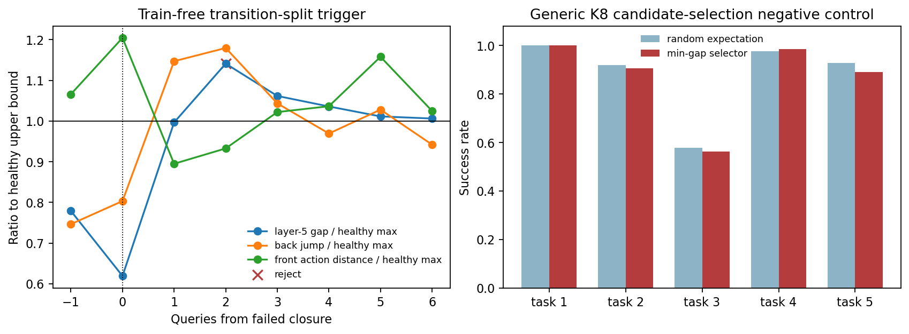

# Train-free belief-state selector

> **解释更新（2026-09-04）：** 后续同噪声反事实证明抓空后的视觉与本体反馈已经强烈进入 action routing，所以本规则应视为开发个案上的 `transition-split` 表型 rejector，而不是已验证的 belief decoder。规则的历史数值不变；因果边界见 [INPUT_VERSION_COUNTERFACTUAL_ZH.md](INPUT_VERSION_COUNTERFACTUAL_ZH.md)。

## 结论

可以做成 train-free 选择器，但当前证据支持的是 **动作接受/拒绝选择器**，不是已经验证的“从 K 个随机 action chunks 中选出成功恢复动作”的价值选择器。

已实现的 `transition_split_v1` 在每次重规划时输出：

\[
\operatorname{SELECT}(R_t)
\in
\{\texttt{ACCEPT},\ \texttt{REJECT\_STALE\_CHUNK}\}.
\]

在失败抓取案例中，它只在物理 mismatch 首次明确的 `q+2` 拒绝当前 chunk；对 7 条同 snapshot 健康轨迹的 56 个 leave-one-out 决策没有触发。它没有训练 classifier、PCA、聚类或线性权重，三个阈值都来自 phase-matched 健康 reference 的经验上界。

但是，将同一个信号直接用成通用 K8 候选 ranker，即选择 layer-5 state/action gap 最小的 action chunk，在独立 5 任务网格上比随机期望低 1.13 个百分点。因此当前正确的工程边界是：

> **MoE mismatch 可以拒绝一个 stale plan；它还不能单独告诉我们应该执行哪个恢复 plan。**

## 1. Train-free 规则

对当前路由张量：

\[
R_t\in\mathbb R^{8\times10\times11\times32},
\]

定义三个量。

### Layer-5 state/action gap

模型第 5 层对应 capture 的 stored layer axis 3：

\[
G_t
=
\frac1{10}
\sum_f
H
\left(
R_{t,5,f,state},
\frac1{10}\sum_{u=1}^{10}R_{t,5,f,u}
\right).
\]

它检测新的 state-facing route 是否已经与 action-facing route 分离。

### Back-layer chunk jump

\[
J_t
=
\operatorname{mean}_{l\in12:15,f,u\in action}
H(R_{t,l,f,u},R_{t-1,l,f,u}).
\]

它要求新一轮 Vision/state 输入确实引起后层 HB 计算状态变化，避免只因 layer-5 固有 gap 而报警。

### Front action nominality

\[
D_t^A
=
H
\left(
R^{action}_{t,2:5},
\bar R^{action,healthy}_{phase(t),2:5}
\right).
\]

它检查 action route 是否仍停留在同阶段健康计划附近。belief mismatch 的关键不是动作 route 单独异常，而是状态已经改变、动作仍像旧的成功搬运阶段。

健康 reference 给出三个上界：

\[
\tau_G=\max G^{healthy},
\qquad
\tau_J=\max J^{healthy},
\qquad
\tau_A=\max D_{LOO}^{A,healthy}.
\]

最终规则为：

\[
\boxed{
\texttt{REJECT}
\iff
G_t>\tau_G
\land
J_t>\tau_J
\land
D_t^A\leq\tau_A
}
\]

这三个比较没有可学习参数。阈值确认属于 healthy calibration，不是 predictor training。

## 2. 失败抓取上的决策

事件 query 记为 0。选择器在 `-1...+6` 的结果为：

| query | layer-5 gap / 上界 | back jump / 上界 | front action distance / 上界 | 决策 |
|---:|---:|---:|---:|---|
| -1 | 0.779 | 0.746 | 1.066 | ACCEPT |
| 0 | 0.619 | 0.803 | 1.204 | ACCEPT |
| +1 | 0.996 | 1.147 | 0.895 | ACCEPT |
| +2 | **1.141** | **1.179** | **0.933** | **REJECT** |
| +3 | 1.062 | 1.043 | 1.022 | ACCEPT |
| +4 | 1.036 | 0.969 | 1.036 | ACCEPT |
| +5 | 1.011 | 1.028 | 1.158 | ACCEPT |
| +6 | 1.006 | 0.942 | 1.025 | ACCEPT |

`q+1` 已有新观测 jump，但 layer-5 gap 尚未超过健康上界；`q+2` 三项首次同时成立，此时末端已经移动 7.14 cm、pot 只移动 1.47 cm，而 action 仍属于正常搬运模式。`q+3` 以后 action route 本身也离开健康阶段参考，所以该规则不会把一般的“整体异常”重复解释成 stale-belief conjunction。

对每条成功轨迹，把它完全留出并只用剩余 6 条成功轨迹做 reference。在 7 条轨迹乘 8 个 query 的 56 次决策中：

- 报警数：0；
- 出现过报警的成功轨迹：0/7；
- 失败轨迹报警：`q+2`，1 次。

这是开发案例内部的 leave-one-out sanity check。规则是在看过该失败案例后形成的，所以 0 次健康误报不是独立测试集 specificity，不能报告为泛化性能。

## 3. 为什么没有直接选择 gap 最小的随机候选

对于同一个观测生成 K 个候选时，state token route 在候选间严格相同；不同的是 action-token route。因此一个自然的无训练候选分数是：

\[
s_k=G(R_t^{(k)}),
\qquad
k^*=\arg\min_k s_k.
\]

该规则已在与 belief 案例独立的 `5 tasks x 16 states x 4 K8 pools = 320` 个同观测池上评估。selector 只读取完整 10-flow HB routing，success 只在选择完成后用于评价。

| 任务 | min-gap 选中成功率 | K8 随机期望 | 差值 |
|---|---:|---:|---:|
| goal / middle drawer | 1.000 | 1.000 | +0.000 |
| goal / top drawer+bowl | 0.906 | 0.918 | -0.012 |
| long / moka pots | 0.562 | 0.578 | -0.016 |
| spatial / ramekin | 0.984 | 0.977 | +0.008 |
| spatial / stove | 0.891 | 0.928 | -0.037 |
| task macro | **0.869** | **0.880** | **-0.011** |

task/state cluster bootstrap 95% CI 为 `[-0.0309,+0.0063]`，改善方向的 permutation `p=0.8688`。320 个池中只有 86 个同时包含成功和失败候选，但无论点估计还是区间都不支持通用 min-gap ranker。

这个负结果很重要：

- state/action 一致不等于任务正确；模型可以 state/action 一致地执行错误计划；
- gap 是 belief mismatch 的条件诊断量，不是无条件 action value；
- 选择器必须先由 mismatch trigger 激活，不能在所有正常 query 上始终选最小 gap。



## 4. 当前可部署的结构

```text
当前 Vision/state + 当前 action route
                  |
          transition_split_v1
            /              \
         ACCEPT      REJECT_STALE_CHUNK
            |                |
       执行当前 chunk      调用外部 fallback
                             |
                    short chunk / retract /
                    explicit regrasp policy
```

当前 selector 只决定是否执行当前 chunk。fallback 必须是有独立安全语义的动作，例如缩短 chunk、回撤到预抓位置、打开夹爪并重新接近；不能默认使用尚未通过验证的 min-gap noise candidate。

## 5. 要证明 action chooser，还缺什么

需要在失败轨迹的精确 `q+2` simulator state 上做 Snapshot-Fork：

1. 固定完整 MuJoCo/controller state 和 Vision/state 输入；
2. 生成 K 个不同 flow-noise action chunks，并保存完整路由；
3. 用固定的 min-gap 或其他预注册 train-free score 选择 1 个；
4. 从同一状态分别执行 selected、random、anti-selected；
5. 后续使用 common random numbers；
6. 比较重新接触率、pot/EEF coupling、最终成功率和安全约束。

当前原始轨迹只直接保存了初始 full state；`q+2` 需要先从初始状态确定性 replay 后再保存完整 snapshot。现有 episode-start K8 网格不能替代这个中途因果实验。

## 6. 产物

- `code/trainfree_belief_selector.py`：不依赖 outcome 的可复用 trigger 和 candidate score；
- `code/evaluate_trainfree_belief_selector.py`：1+7 trigger audit 和独立 5-task K8 负控；
- `configs/trainfree_belief_selector.json`：冻结规则、层、候选池和统计 seed；
- `results/trainfree_belief_selector/summary.json`：机器可读结论；
- `tables/trigger_decisions.csv`：64 个逐 query 决策；
- `tables/candidate_pool_choices.csv`：320 个 K8 pool 的选择结果；
- `tables/candidate_task_summary.csv`：逐任务选择收益。

复现：

```bash
python himoe-vla_trap/code/evaluate_trainfree_belief_selector.py \
  --config himoe-vla_trap/configs/trainfree_belief_selector.json
```
