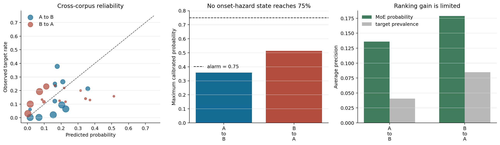
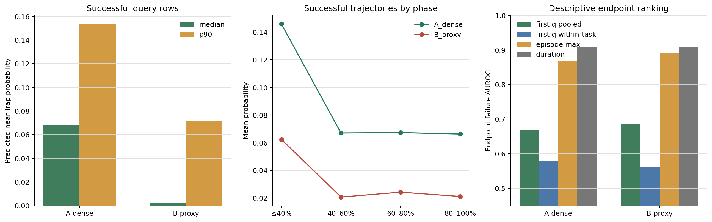
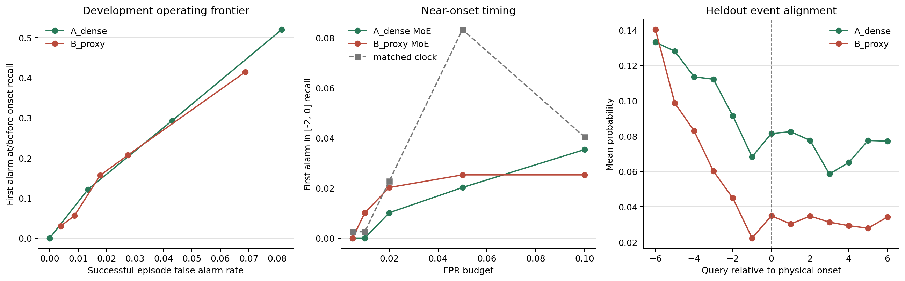

# Train-free Trap 概率报警实验

## 问题

目标不是继续扫描一个看起来好看的异常分数阈值，而是回答一个可部署的问题：

```text
仅凭当前 episode 的 MoE 路由历史，
P(当前到未来 2 次重规划内进入 loop/static Trap) 是否能可靠超过 75%？
```

这里的 `75%` 是事先固定的 precision-first 报警标准。结果允许为零报警。

## 方法

运行时只读取 HB MoE full-softmax routing，不读取任务 ID、action 数值、物理状态、reward、success 或最终 outcome。每条 episode 用自身 `q4--q11` 建立早期基线，得到三个自归一化量：

- late-flow volatility；
- route acceleration；
- lag periodicity。

三个量先用 source 语料的无标签经验 CDF 转为 percentile，再形成固定 phenotype：

```text
loop_score   = min(volatility_percentile, acceleration_percentile)
static_score = periodicity_percentile
trap_score   = max(loop_score, static_score)
```

`trap_score` 使用预先固定的 bins 和连续越界次数构成离散路由状态。source onset 标签只用于估计

```text
P(onset within H | route state)
```

采用 Jeffreys Beta-Binomial posterior `(events + 0.5) / (support + 1)`，小于 30 个样本的 cell 按固定层级回退。没有梯度优化、没有拟合特征权重、没有按 target 调阈值；但这一步明确属于**有标签概率校准**，不是无标签方法。

执行顺序也被物理隔离：先生成 route-only 中间量和 target 概率 CSV，写入哈希后，才加载 target onset 做评价。正式做 A→B 与 B→A 两个方向。

## 主结果

主目标只评价 onset 前风险集，正例表示当前为 onset 或未来两次 query 内出现 onset。

| 方向 | target 基率 | 最大预测概率 | 对应 target 实测 | AUROC | AP | Brier / 常数基线 | 75% 报警 |
|---|---:|---:|---:|---:|---:|---:|---:|
| A→B | 4.04% | 35.83% | 41/192 = 21.35% | 0.819 | 0.136 | 0.0436 / 0.0408 | 0 |
| B→A | 8.47% | 51.32% | 3/19 = 15.79% | 0.717 | 0.179 | 0.0787 / 0.0795 | 0 |

因此当前 phenotype 有一定排序信息：AP 分别约为 target 基率的 3.36 倍和 2.11 倍。但它不是校准良好的概率报警器：最高风险状态在 target 中明显低于 source 所声称的概率；A→B 的 Brier 甚至差于只输出 source 常数基率。



## 降低阈值不能解决问题

| 方向 | 阈值 | 报警精度 | 正例行召回 | 事件 episode 及时召回 | 无事件 episode 误报率 |
|---|---:|---:|---:|---:|---:|
| A→B | 25% | 21.35% | 7.08% | 21.24% | 23.82% |
| B→A | 25% | 15.97% | 3.70% | 6.70% | 7.75% |
| B→A | 50% | 15.79% | 0.48% | 1.44% | 0.70% |
| 两方向 | 75% | 无报警 | 0% | 0% | 0% |

所以失败点不是“75% 太保守”。降低阈值后，precision 和 episode recall 仍不足，且 A→B 的误报代价很高。

## 相位混淆压力测试

我们另做了一个宽松上限：从 `onset-H` 到 episode 结束全部标正。这个 absorbing proxy 不是真实 active-duration 标签，因为轨迹可能在 onset 后恢复。

- A→B/H2 最大预测为 72.56%，仍无 75% 报警；
- B→A/H2 有 47 个 75% 报警，其中 31 个为正，实测 precision 65.96%；
- 同一 proxy 上，query-index-only 时钟 AUROC 在 A→B 为 0.955，对应 MoE 为 0.838；B→A 为 0.774，对应 MoE 为 0.587。

这说明把 onset 后整段标正会强烈奖励“episode 已经进行得很晚”。它不能作为 MoE 特异性证据，也不能用 B→A 的 47 个报警声称达到 75% 可靠性。

## cache_new 40-task 压力测试

随后把 A/B 两张概率表完全冻结，直接应用到 `VLA_MUI_HUB/cache_new` 的 40 个完整任务：16,000 条轨迹、253,722 次推理，其中最终成功 15,468 条、失败 532 条。预测阶段只打开 HB routing；75,159 行逐 query 概率写盘并记录 SHA256 后，才加载 endpoint outcome。

`cache_new` 没有统一的 query-level Trap onset，因此这里不能评价 `P(未来两 query 内 Trap)` 的校准，只能检查最终成功轨迹沿途的背景值和概率对 endpoint outcome 的描述性关联。

| source 概率表 | 可评分成功 / 全部成功 | 成功 query 中位 / p90 / max | 成功 episode-max 中位 / p90 | q12 pooled / 同任务 AUC | episode-max AUC |
|---|---:|---:|---:|---:|---:|
| A dense | 9,010/15,468 | 6.86% / 15.33% / 35.83% | 6.86% / 20.38% | 0.670 / 0.578 | 0.868 |
| B proxy | 9,010/15,468 | 0.27% / 7.17% / 51.32% | 0.27% / 11.19% | 0.685 / 0.561 | 0.890 |

当前规则需要 `q4--q11` 建自身基线，所以 q12 才能输出。6,458 条成功轨迹在此之前已经完成，不能把它们计为“低概率且预测正确”。pooled q12 AUC 在同任务比较后降到 `0.578/0.561`，说明相当一部分早期分离来自任务构成。episode-max AUC 很高，但失败轨迹通常跑满 horizon，时长本身 AUROC 为 0.910；同任务 duration AUC 接近 1。

B 表的 50% 阈值命中 `133/532` 个最终失败，并在全部成功中报警 `61/15468`，表面 endpoint precision 为 68.6%。但首次报警中位已到 horizon 的 82.4%；相同或更低成功误报率的 phase-0.79 固定时钟命中 `532/532`，且略早。排除与 source 相同的 moka-pot 任务后，B-50% 仍只有 23.6% failure recall、62.8% endpoint precision。它不是可部署 detector。



## 阈值必须按 onset 时序选择

75% 不是必须条件。更合理的规则是先指定成功轨迹可接受误报率，再从开发数据选择最低可用概率阈值，并在独立任务上评价首次报警相对物理 onset 的位置。

我们用 `cache_new` 的逐 query simulator state 事后构造了 260 个 query-boundary onset：stagnation、goal regression、goal approach-leave 或 subtask undo 的最早事件。物理量只构造真值，不进入报警。当前规则从 q12 才可用，因此其中 222 个 onset 可评价。较早完成的 37 tasks/198 events 用于阈值确认，之后完成的 3 tasks/24 events 完全留出。

| 概率表 | 开发成功 FPR 预算 | 阈值 | 留出成功 FPR | 留出首次报警不晚于 onset | 留出首次报警位于 [-2,0] | 及时命中中位提前量 |
|---|---:|---:|---:|---:|---:|---:|
| A dense | 2% | 35.83% | 2.86% | 5/24 = 20.83% | 0/24 | 7 queries |
| A dense | 5% | 21.00% | 9.35% | 13/24 = 54.17% | 2/24 = 8.33% | 9 queries |
| B proxy | 1% | 37.12% | 1.30% | 7/24 = 29.17% | 1/24 = 4.17% | 13 queries |
| B proxy | 2% | 22.62% | 3.20% | 11/24 = 45.83% | 1/24 = 4.17% | 10 queries |

“不晚于 onset”看起来尚有召回，但首次报警通常早 7--13 queries；它更像长任务/早期状态标记，不是 onset 附近抬升。留出事件对齐后，B-table 的均值反而从 `t=-6` 的 14.03% 降到 `t=-1` 的 2.23%，onset 时仅 3.49%。B-37.12% 与开发集等预算固定 q39 时钟在留出集都及时命中 7/24；时钟的近 onset 命中还是 2/24，高于 MoE 的 1/24。

开发误报预算不超过 5% 的所有 operating point 中，首次报警位于 `[-2,0]` 的最好结果也只有开发 `5/198`、留出 `2/24`。因此失败点不是 75% 过高，而是当前概率标量没有稳定的 onset-localized operating point。完整审计见 [自动报告](../results/trainfree_trap_probability/timing_constrained_alarm/REPORT_ZH.md)。



## 结论边界

这项实验没有推翻先前的组级结论：loop onset 前两次重规划，late-flow volatility 和 route acceleration 在 A/B 中同方向复现。它补充的是更严格的一层：

```text
组均值有前兆信号 != 单个 query 的 posterior 足以报警
```

现阶段可以证明 MoE phenotype 对近 Trap 风险有有限排序信息；不能证明一条随机轨迹出现 `P>75%` 时可可靠报警，因为正式跨语料测试根本没有这样的 hazard state。下一步应增加互补且有机制依据的 phenotype，再在带物理 onset 的新 capture 上独立审计 calibration，而不是从现有结果中继续调低阈值。

## 产物

- 配置：`configs/trainfree_trap_probability.json`
- 实现：`code/analyze_trainfree_trap_probability.py`
- 自动报告：`results/trainfree_trap_probability/REPORT_ZH.md`
- 机器摘要：`results/trainfree_trap_probability/summary.json`
- 标签加载前预测：`results/trainfree_trap_probability/predictions_label_free/`
- 宽松 proxy 预测：`results/trainfree_trap_probability/predictions_label_free_absorbing/`
- 逐阈值审计：`results/trainfree_trap_probability/tables/primary_probability_threshold_sweep.csv`
- 逐 episode 审计：`results/trainfree_trap_probability/tables/primary_episode_alarm_audit.csv`
- cache_new 自动报告：`results/trainfree_trap_probability/cache_new_40task/REPORT_ZH.md`
- cache_new 标签隔离概率：`results/trainfree_trap_probability/cache_new_40task/cache_new_probabilities_label_free.csv.gz`
- cache_new 逐 episode 解盲审计：`results/trainfree_trap_probability/cache_new_40task/tables/episode_outcome_audit.csv`
- 时序约束阈值报告：`results/trainfree_trap_probability/timing_constrained_alarm/REPORT_ZH.md`
- 40-task 物理 onset：`results/trainfree_trap_probability/timing_constrained_alarm/tables/physical_onset_labels.csv`
- operating points 与时钟负控：`results/trainfree_trap_probability/timing_constrained_alarm/tables/operating_points.csv`
