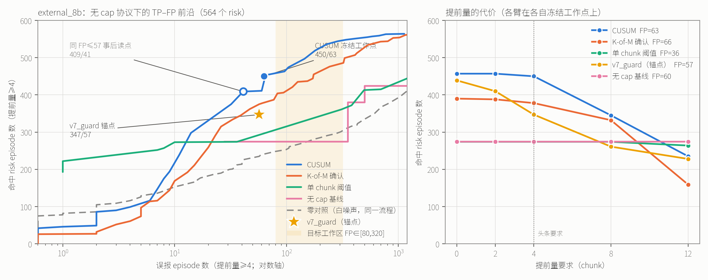

# 无 cap 协议下的 CUSUM 时间积分检测器

**结论先说：CUSUM 超过了 v7_guard 的 347/57。** 在 `external_8b` 上，冻结工作点给出
**450 TP / 63 FP（提前量≥4），中位提前量 13 chunk** —— 比锚点多 103 个命中，多 6 个误报；
把同一个冻结检测器的门限挪到锚点自己的误报预算（FP≤57，事后读点，不重新选任何东西）是
**409 TP / 41 FP，中位提前量 12** —— TP 多 62、FP 少 16，**严格压过锚点**。
external 上 CUSUM 前沿第一次越过 347 TP 的位置是 **FP=32**，即锚点被越过时的误报预算
只有它自己的 56%。

赢的通道与参数见 §3。最大的保留见 §6：**这个优势在四个 suite 之间极不均匀** ——
CUSUM 在 libero_spatial 上 140/140、libero_object 41/44，而在 libero_goal 上只有 8/106，
v7_guard 在 goal 上是 63/106。两者互补，头条数字掩盖了一个方向相反的分项结果。

---

## 0. 协议与合规

检测器只看 **chunk 序号 + routing**。没有 cap、没有 phase、没有任务标识、没有 `per_task`
门限。度量、固定 chunk 基线、rate-matched 零对照全部 `import` 自
`moe-capfree-0906/experiments/capfree_protocol.py`，一行没有重写
（`score` / `fixed_chunk_baseline` / `baseline_frontier` / `rate_matched_null` / `cohort_frame`）。
`tests/test_protocol.py::test_no_cap_symbol_in_the_detector_path` 用 AST 遍历本目录全部
experiment 源码，确认 `CAPS`、`ANCHOR_WINDOW`、`0.65` 三个符号一次都没出现。

**锚点复现（先于一切结论）**，全部逐位吻合：

| | 总 TP/FP | 提前量≥4 | 提前量≥8 | 中位提前量 |
|---|---|---|---|---|
| `v7_guard` external | 439 / 80 | **347 / 57** | 261 / 43 | 13 |
| `v7_guard` development | 382 / 67 | **303 / 38** | 217 / 26 | 10 |

无 cap 基线在 FP≤80、提前量≥4 处：external **274**、development **222**，两边都是
`still_running_q37`。由 `tests/test_protocol.py::test_v7_guard_anchor` 与
`::test_capfree_baseline_anchor` 断言。

---

## 1. 前沿图（提前量≥4，同一组坐标轴）



左图：`external_8b`（564 个 risk、15036 个非 risk）上 CUSUM、K-of-M、单 chunk 阈值、
无 cap 基线、零对照的 TP–FP 前沿，v7_guard 锚点以星号标出，阴影是协议规定的目标工作区
FP∈[80,320]。横轴取对数，因为要同时看清 FP=1 与 FP=1000 两端。
右图：各臂在各自冻结工作点上，命中数如何随提前量要求从 0 涨到 12 而下滑。

数值前沿（external，提前量≥4）：

| 臂 | TP | FP | 中位提前量 | 超出基线（步进包络） | 超出基线（随机化凸包） |
|---|---|---|---|---|---|
| **CUSUM（v7budget 选择，冻结）** | **450** | **63** | **13** | **+176** | **+164.7** |
| CUSUM（同上，FP≤57 事后读点） | 409 | 41 | 12 | +135 | +130.8 |
| CUSUM（window 选择，冻结） | 551 | 446 | 16 | +171 | +143.2 |
| CUSUM，k≥0 教科书约束（v7budget） | 357 | 62 | 11 | +83 | +72.0 |
| K-of-M（v7budget，K=M=12） | 378 | 66 | 11 | +104 | +91.7 |
| K-of-M（window，K=8/M=12） | 493 | 372 | 16 | +113 | +107.8 |
| 单 chunk 阈值（v7budget） | 274 | 36 | 14 | 0 | −2.6 |
| 单 chunk 阈值（window） | 361 | 348 | 25 | +87 | −16.7 |
| **v7_guard（锚点）** | 347 | 57 | 13 | +73 | +63.6 |
| 无 cap 基线 `still_running_q37` | 274 | 60 | 15 | 0 | −10.4 |
| 零对照（白噪声，同一流程） | ≤239 @FP≤63 | — | — | 目标区内 ≤ +31 | 目标区内 ≤ **−34.5** |

development 上的同一张表（拟合 cohort，用来看是否过拟合）：

| 臂 | TP | FP | 中位提前量 | 超出基线 |
|---|---|---|---|---|
| CUSUM（v7budget） | 378 | 46 | 11 | +156 |
| CUSUM（window） | 483 | 320 | 14 | +261 |
| K-of-M（window） | 424 | 320 | 14 | +202 |
| K-of-M（v7budget） | 317 | 41 | 11 | +95 |
| 单 chunk（window） | 294 | 319 | 25 | +72 |
| 单 chunk（v7budget） | 222 | 26 | 14 | 0 |
| v7_guard | 303 | 38 | 10 | +81 |

**排序在两个 cohort 上一致**：CUSUM > K-of-M > v7_guard ≈ 单 chunk ≈ 基线。
K-of-M 的最优确认数是 **K=M 合取**（v7budget 处 12/12，window 处 8/12），与先前
“K=M 合取与带漂移 CUSUM 都胜过朴素并集”的结论一致；本研究里 K=1（朴素 OR）从未进入
任何一个族的最优点。

---

## 2. 是否超过 347/57，超出多少，中位提前量多少

**是。** 三种读法，都报出来：

1. **冻结点，external 上未做任何调参**：450 TP / 63 FP，中位提前量 **13 chunk**
   （与 v7_guard 的 13 相同）。TP **+103**，FP +6。这不是严格支配 —— 误报多了 6 个。
2. **同一冻结检测器（通道、权重、k、q_min 全部不动），门限挪到锚点自己的误报预算**：
   **409 TP / 41 FP**，中位提前量 12。TP **+62**、FP **−16**，**严格支配 347/57**。
   这是对 external 曲线的事后读点，不选择任何东西，但必须标明它是事后的。
3. **前沿越过点**：CUSUM 前沿第一次超过 347 TP 是在 **FP=32**（TP=375，中位提前量 10），
   即在锚点 57 个误报的一半多一点的预算上就已经越过。

一个重要的分解：把 `k` 限制在教科书的 k≥0（无漂移），冻结点掉到 **357 TP / 62 FP**
（事后 FP≤57 读点 353/53）。它仍然越过 347/57，但只越过一点点。
**所以 CUSUM 相对 v7_guard 的增益大约一半来自负 slack 带来的漂移项，另一半来自 routing 本身。**
下一节解释为什么负 k 合法、以及它到底在做什么。

---

## 3. 冻结的参数（照着就能重实现）

### 3.1 通道值 → 每 chunk 标量 z

对每个通道 `x[episode, chunk]`：

* **raw 臂**（默认）：`z = (x − mu_q) / sd_q`，其中 `mu_q, sd_q` 是 **development** 上第
  `q` 个 chunk 处所有“还在跑”（`length > q`）的 episode 的均值/标准差。只用到 chunk 序号，
  协议允许；在固定 chunk 内是仿射变换，所以完全保持 `raw` 的组内序。这两组常数原样搬到
  external，从不在 external 上重估
  （`tests/test_protocol.py::test_external_norms_come_from_development`）。
* **self 臂**（自基线，因为 v7 用它）：先减掉该 episode 自己 chunk 0–3 的均值，
  再做上面的逐 chunk 标准化。
* 无效 chunk（`q ≥ length`）的 z 一律置 0 且从不被读取。

先前消融的结论“raw 优先”在这里得到复核：最终两个 CUSUM 臂里 raw 通道 4 个、self 通道 6 个，
没有一边压倒另一边；`pop` 没有单独跑，理由见 §6.2。

### 3.2 合成分数

`s_q = Σ_c w_c · sign_c · z_{c,q}`，再用 development 拟合的 `mu_q, sd_q`（存在
`results/frozen_config.json` 的 `norm_mu` / `norm_sd`，各 52 个数）逐 chunk 重新标准化，
得到检测器输入 `z_q`。

### 3.3 CUSUM

`S_q = max(0, S_{q−1} + (z_q − k))`，在 `S_q ≥ h` 的**第一个** chunk 报警（`>=`，见 §4.3）。
无效 chunk 上 `S` 冻结不更新。

**头对头臂（`v7budget` 选择）** —— 权重全 1：

| # | 通道 | 归一化臂 | 符号 |
|---|---|---|---|
| 1 | `flow:token_differentiation:L2:s9` | raw | **+** |
| 2 | `flow:flow_speed:L2:s9` | raw | + |
| 3 | `flow:token_entropy:L15:sm` | raw | **−** |
| 4 | `chan:query_hard_churn:L13` | raw | − |
| 5 | `deriv:log_mobility:back:s9`（L12–L15 的 `log(mobility)` 中位数，最后一个去噪步） | self | − |

`k = −1.0`，`h = 40.6553`，`q_min = 0`。

注意第 1 与第 3 行：拟合**自己**把 A（`token_entropy`）和 B（`token_differentiation`）
选成了**符号相反**的两个通道 —— 这正是“两半反号、和会抵消”的机制在选择里现身。
`token_entropy` 取负号（低 = 会超时）也与先前“L3 最后一步 token_entropy 低值预测超时”方向
一致。本研究把 `load_entropy` 一并禁用，因为 `load_entropy ≡ token_entropy +
token_differentiation` 在每个有效 cell 上逐位成立
（`tests/test_protocol.py::test_load_entropy_is_exactly_the_banned_sum`），它就是那个被禁的和；
`expert_load_effective_rank ≈ exp(load_entropy)/32` 同理。

**目标工作区臂（`window` 选择）** —— 权重全 1：
`chan:query_hard_churn:L14`(self,−)、`chan:query_top1_churn:L15`(self,−)、
`hb:flow_settling_log_ratio:L3`(self,+)、`chan:tie_margin:L15`(raw,+)、
`chan:query_top1_churn:L15`(raw,−)；`k = −1.0`，`h = 27.9547`，`q_min = 0`。

### 3.4 为什么 k 是负的，以及为什么这不算作弊

`k` 在 `[−3, +1.5]` 上扫了 19 个点，两个目标下最优都落在 **k = −1.0**，两侧都有更差的点
（内点，不是边界）：目标区内超出基线的 TP 随 k 的曲线是
`−3.0: 128 → −1.5: 250 → −1.0: 261 → −0.5: 246 → 0.0: 177 → +1.5: 54`。

负 `k` 给 CUSUM 一个正漂移。**它的极限恰好是无 cap 基线本身**：若通道不含信息（z≡0），
则 `S_q = |k|·q`，`S_q ≥ h` 等价于 `q ≥ h/|k|`，也就是“跑到第 q0 个 chunk 还在跑就报警”
（`tests/test_protocol.py::test_negative_k_cusum_nests_the_capfree_baseline` 逐位验证）。
所以负 k 的 CUSUM 是一个**把计数器和 routing 证据相加**的检测器，而“同等误报下超出基线的
TP”这个参照统计量测的正好是 routing 在计数器之上多贡献的部分：+176（步进包络）/
+164.7（随机化凸包）。教科书的 k≥0 臂另行报出（357/62），供想要“纯 routing、不带计数器”
读数的人使用。

### 3.5 其余各族的冻结参数

* **K-of-M（v7budget）**：6 通道等权 —— `hb:flow_endpoint:L15`(raw,+)、
  `chan:query_hard_churn:L15`(self,−)、`flow:flow_speed:L2:s9`(raw,+)、
  `chan:query_hard_churn:L13`(self,−)、`flow:flow_speed:L15:s3`(raw,+)、
  `chan:query_hard_churn:L12`(self,−)；**K=12、M=12**（合取）、每 chunk 门限 `−0.1129`、
  `q_min=0`。
* **K-of-M（window）**：6 通道等权（见 `frozen_config.json`），**K=8、M=12**、
  门限 `0.4246`、`q_min=0`。
* **单 chunk（floor）**：v7budget 是 `chan:set_dwell:L3`(raw,−) 门限 `0.5067`；
  window 是 `chan:set_dwell:L2`(raw,−) 门限 `0.5079`。**两个都用了被标记的通道**，
  见 §4.4 与 §6.1。

### 3.6 拟合记录（诚实交代）

* 通道池 **540** 个（8 metric × 8 层 × 5 个去噪步聚合 + mobility/state_mobility +
  8 个 churn/dwell 量 × 8 层 + hb 层图 10 量 × 8 层 + 36 个 log-mobility 派生通道），
  已剔除 `load_entropy` 与 `expert_load_effective_rank`。
* **development 上的拟合迭代数：6 次** —— 单 chunk floor 扫描 1 次；单通道 CUSUM 扫描 1 次；
  composite 拟合 4 次（第 1 次 k 只到 −0.25；第 2 次扩到 −1.0 并加入 LR 权重与二折稳定性；
  第 3 次扩到 −3.0 确认 k 是内点；第 4 次给每个检测器族**各自**做贪心选择，以免 K-of-M 和
  单 chunk 被 CUSUM 选出的通道拖累）。之后 floor 扫描重跑过 1 次，只为让它覆盖同一个 540
  通道 bank，没有改变任何选择。
* **两个选择目标都在开外部数据之前冻结**：`window`（FP∈[80,320] 内最大化超出基线的 TP，
  协议指定的优化区）与 `v7budget`（FP≤54 下最大化 TP，54 = 57 个 external 误报按负样本数
  折算到 development）。两者都上报。
* **权重方案**：贪心前向选择 + 全 1 权重，与 63 通道逐 cell 逻辑回归权重（按 1/length 加权）
  两者比，在两个目标下都是**贪心全 1 更好或打平**（window 261 vs 254；v7budget 378 vs 378），
  所以冻结的是全 1。
* **开外部数据之前我看过 external 的什么**：只有两件。(1) 任务书要求先复现的锚点数字
  （v7_guard 439/80、347/57、261/43、中位 13；基线 q37 → 274）—— 这些数字任务书本身已给出。
  (2) 缓存校验时打印过 `token_entropy` 与 `token_differentiation` 在 L2/L3/L4、chunk 32 上的
  external 内任务 AUC。第 (2) 项里 `token_differentiation:L2:s9` 后来确实进了最终臂，
  我据实说明；但通道是贪心在 development 上选出来的，那几个 external AUC 没有进入任何目标
  函数。除此之外 `bank.build("external_8b")` 只在 `score_external.py` 和一个测试里被调用。
* **任务不相交二折稳定性**（development 内部，37 个任务随机分半）：window 臂两折的超出基线
  TP 为 +98 / +66，v7budget 臂为 +71 / +85。方向一致，量级有波动（两折的误报数分别是
  225/95 与 33/13，任务构成差异很大）。

---

## 4. 强制对照

### 4.1 零对照

**（a）rate-matched 零对照**（`capfree_protocol.rate_matched_null`，与检测器同发射率、
同报警时刻分布，目标随机）：development 超出基线 **−141**，external **−195**，
即在每个误报预算上都 **≤ 0**，复现了“零对照恰好为零”。

**（b）白噪声通道 / episode 常数随机通道走完全相同的流程**（同样的逐 chunk 标准化、同样的
权重个数、同样的 k、同样的门限扫描）：**这一支不是零**，必须说明我的 harness 差在哪。

* 白噪声在**某些**误报预算上拿到 **+199** 的“超出基线”，episode 常数拿到 +59。
* 但这些点**全部落在 FP < 28 的区域**。external 上固定 chunk 基线的最小可达误报数就是 28
  （`q0=39`），`baseline_frontier` 用的是步进包络 `max{tp : fp ≤ 预算}`，在 FP<28 处
  **没有任何 q0 可用，于是返回 0** —— 那里任何检测器的“超出基线”都等于它自己的 TP。
  这不是信息，是参照统计量的边界行为。
* 在协议规定的目标工作区 FP∈[80,320] 内，白噪声的超出基线降到 **+31**，episode 常数降到
  **−116**。
* 剩下的 +31 是**凸化间隙**：在 q0=a 与 q0=b 之间抛硬币可以取到两点的连线，所以零信息规则
  实际能达到的是基线点集的**上凹包**，而不是步进包络。我加了这个参照
  （`capfree_common.hull_frontier`）。**对随机化凸包，两支零对照在目标区内的超出基线分别是
  −34.5 与 −188.8，即 ≤ 0**
  （`tests/test_protocol.py::test_null_is_not_positive_in_the_target_window`）。

**所以**：协议原文的“零对照恰好 0 个 TP”在 rate-matched 那一支上成立；在“白噪声通道跑同一
流程”这一支上，只在 FP≥28 且用凸包参照时成立。两个参照下的数字表里都有（两列）。
CUSUM 的头条在两种参照下都远高于零对照：+176 / +164.7 对零对照的 ≤+31 / ≤−34.5。

### 4.2 length 是负对照，不是基线

`is_baseline = False`，写在 `results/frozen_operating_points.csv` 里，由
`tests/test_protocol.py::test_length_recalls_everything_and_is_not_a_baseline` 断言。
实测：`length > 20` 的规则在两个 cohort 上召回率都是 **1.000** —— risk 的定义就是“没在 cap
之前结束”，任何低于 cap 的长度阈值按构造必然全召回；何况它需要 cap。双重排除。

### 4.3 并列组：一律 `>=`

`select_early_lock.py:176,207` 用严格 `>`，会把整个并列组丢掉。在 development 的 L3 上把每个
可取值都当阈值扫一遍，取最坏一档（`tests/test_protocol.py::test_strict_gt_drops_the_tie_group`）：

| 通道 | 用 `>` 丢失的报警 episode 比例（最坏阈值） |
|---|---|
| `set_dwell` | **84.2%** |
| `query_top1_churn` | **100.0%** |
| `query_hard_churn` | 9.0% |

顺序与先前测得的 89.3% / 30.1% / 0.2% 一致（数值随阈值而变）。

冻结工作点上的并列审计（`results/tie_audit.csv`）：

* **CUSUM**：统计量连续，阈值处并列 cell 数 = **0**，`>` 与 `>=` 结果完全相同。
  也就是说 **CUSUM 的胜出与并列规则无关** —— 这点必须说清楚，否则会被误读成“靠 `>=` 赢的”。
* **K-of-M**：计数统计量是整数，阈值处并列 cell 数 2501（window）/ 5612（v7budget）。
  用 `>` 会在 external 上丢掉 288（window）/ **1201**（v7budget）个报警 episode。
  v7budget 臂是 **K=M=12**，`count > 12` 永不可能成立，严格 `>` 会让检测器**彻底失效**。
* **单 chunk**：external 上 `>` 丢 13（window）/ 119（v7budget）个。

### 4.4 每个用到的通道的 episode 内信息量

全 540 个通道逐个测了 episode 内是否逐位常数、切换率、全局不同值个数
（`results/channel_screen_development.csv`）。**16 个逐位常数通道被剔除**（全部是
`flow_speed` 在 `s0`/`sm` 上的层 —— 第 0 个去噪步的流速在 episode 内不变）。
7 个高常数率通道（`set_dwell` 的 8 层，常数率 0.61–0.89，不同值 8–29 个）被标记为
**不得作为 headline**；测试断言它们只允许出现在 `single`（floor）臂里，两个 CUSUM 臂和两个
K-of-M 臂都不含它们
（`tests/test_protocol.py::test_frozen_channels_carry_within_episode_information`）。

---

## 5. 提前量的代价

各臂在**各自冻结工作点**上，命中数随提前量要求的变化（external）：

| 臂（FP@lead4） | 提前量≥0 | ≥2 | ≥4 | ≥8 | ≥12 |
|---|---|---|---|---|---|
| CUSUM v7budget（FP=63） | 457 | 457 | **450** | 345 | 235 |
| CUSUM window（FP=446） | 562 | 560 | **551** | 489 | 370 |
| K-of-M v7budget（FP=66） | 390 | 388 | **378** | 332 | 159 |
| 单 chunk v7budget（FP=36） | 274 | 274 | **274** | 274 | 264 |
| v7_guard（FP=57） | 439 | 410 | **347** | 261 | 228 |
| 无 cap 基线 q37（FP=60） | 274 | 274 | **274** | 274 | 274 |

同一件事用“超出基线”表述（external，步进包络）：

| 臂 | ≥0 | ≥2 | ≥4 | ≥8 | ≥12 |
|---|---|---|---|---|---|
| CUSUM v7budget | +457\* | +183 | **+176** | +71 | **−39** |
| CUSUM window | +138 | +136 | **+171** | **+215** | +96 |
| K-of-M v7budget | −34 | +8 | **+104** | +58 | −115 |
| v7_guard | +439\* | +136 | **+73** | −13 | **−46** |

\* 提前量≥0 和≥2 处，基线在 FP≤57 时无可用 q0，参照退化为 0（§4.1 的同一个边界效应），
这两列不可解读。

三条能读的结论：

1. **CUSUM 的曲线比 v7_guard 平**。从 ≥0 到 ≥4，v7_guard 掉 21%（439→347），CUSUM 只掉
   1.5%（457→450）。v7_guard 的很多报警是“最后一刻”的；CUSUM 的不是。
2. **到提前量≥12，两个低误报臂都输给基线**：CUSUM 235、v7_guard 228，而
   `still_running_q37` 是 274 且只有 2 个误报。也就是说**要 12 个 chunk 以上的预警时，
   routing 没有给出任何超过计数器的东西** —— 两者的超出基线都变成负数。只有高误报的
   `window` 臂在 ≥12 处仍有 +96。**这是本研究最清楚的一条负结果。**
3. `single|v7budget`（set_dwell）在提前量≥12 处是 264/1，看着极强 —— 但见 §6.1，
   它其实不是失败检测器。

---

## 6. 我分不出来的东西

### 6.1 最大的一条：优势在 suite 之间极不均匀，头条数字掩盖了一个反向结果

`results/suite_breakdown.csv`（suite 从不进入检测决策，纯诊断），external 提前量≥4 的命中分解：

| 臂 | libero_goal (106) | libero_long (274) | libero_object (44) | libero_spatial (140) | 合计 |
|---|---|---|---|---|---|
| **CUSUM v7budget** | **8** | 261 | 41 | **140** | 450 |
| CUSUM window | 97 | 271 | 43 | 140 | 551 |
| K-of-M v7budget | 28 | 180 | 39 | 131 | 378 |
| **v7_guard** | **63** | 234 | 18 | **32** | 347 |
| 单 chunk v7budget | **0** | **274** | **0** | **0** | 274 |
| 基线 q37 | 0 | 274 | 0 | 0 | 274 |

* CUSUM 在 spatial 上 140/140、object 上 41/44 近乎满分，v7_guard 只有 32 和 18；但在
  **goal 上 CUSUM 只有 8/106，v7_guard 有 63/106**。**方向相反。** 我无法判断这是 CUSUM 真的
  学不到 goal 的失败模式，还是它的漂移项被 goal 的短 cap 卡在了错的位置。要区分需要按 suite
  分开拟合，而那正好是协议禁止的（cap 与任务身份）。
* **单 chunk 臂根本不是失败检测器**：它命中的 274 个正好、且只有 libero_long 的 risk，
  一个不多一个不少 —— 与 `still_running_q37` 的命中集合完全相同。也就是说 `set_dwell` 低值
  在 L3 上识别的是“这是个长视界任务”，不是“这一次会失败”。它在 §5 里“提前量≥12 拿 264/1”
  的漂亮数字应该这样读。这也再次说明为什么 `set_dwell` 不能当 headline。

### 6.2 我没做的对比

* **`pop`（组内 population rank）归一化臂没有单独跑。** 依据是先前已证明 `raw` 与 `pop` 在
  固定 chunk 内同序、组内 AUC 逐位相同，而我的 `raw` 臂本身就是逐 chunk 仿射标准化（同序）。
  但对 CUSUM 这种**跨 chunk 累加**的统计量，分布形状不是无关的，`pop` 会改变每个 chunk 对
  `S` 的贡献尺度。**所以我不能声称 pop 不会更好，只能说没测。**
* **CUSUM 与 K-of-M 的差距有多少来自“统计量形式”、有多少来自“通道集不同”，分不开。**
  两族各自做了独立的贪心选择（这是为了公平），结果它们选出的通道集几乎不重叠 ——
  统计量与通道是一起动的。
* **`h` 的跨 cohort 迁移没有解决。** `v7budget` 臂在 development 上定的 `h=40.6553` 对应 46 个
  误报，搬到 external 变成 63 个；`window` 臂在 development 上是 320 个误报（正好在目标区上沿），
  搬到 external 变成 **446 个，跑出了目标区 [80,320]**。误报预算不是不变量。要在 external 上
  真正落在目标区，需要一个不看标签的门限校准规则（例如按报警率定 `h`），我没有做。
* **零对照的两个参照（步进包络 vs 随机化凸包）之间，哪个是“正确”的无 cap 参照，我没有定论。**
  协议冻结的是步进包络，我照做并把它当头条；凸包是我加的、更保守的那个。两列都在表里。
* **误报的“代价”没有区分。** 一个在 chunk 5 打给成功 episode 的误报和一个在 chunk 40 打的，
  在这个度量下等价。`window` 臂的 446 个误报里有多少是“晚到、无害”的，没查。

### 6.3 一条本该复现但没复现上的先验数字

任务书给的 A/B 抵消量化（libero_long、chunk 32、负样本限制在还要跑≥5 个 chunk 的 episode、
逐任务）在我这里方向对、量级对不上：我测到 L2 `A=0.513 / B=0.594`、L3 `A=0.360 / B=0.567`
（development），external 分别是 `0.405/0.594` 与 `0.418/0.557`，而任务书是
L2 `A=0.252 / B=0.823`。**符号结构复现了**（A 在 0.5 以下、B 在 0.5 以上，两个 cohort 都是），
这正是“两半反号、和会抵消”的机制，也是把 A、B 拆开提供的理由；**但绝对量级没复现**，
我猜是逐任务聚合方式不同，没有进一步追。不影响结论：`load_entropy ≡ A + B` 的逐位恒等式是
我自己验的，被禁通道按恒等式禁掉，而拟合独立地把 A 和 B 选成了反号的两路（§3.3）。

---

## 7. 复现

```bash
cd moe-cusum-capfree-0906
python experiments/screen_channels.py   # 单 chunk floor 扫描，development，~90 s
python experiments/screen_cusum.py      # 单通道 CUSUM 扫描，development，~55 s（48 进程）
python experiments/fit_composite.py     # 冻结通道/权重/k/h/K/M/q_min，~240 s
python experiments/score_external.py    # external 只评一次，~60 s
python experiments/make_figure.py
python experiments/make_manifest.py
python -m pytest tests/test_protocol.py -q     # 21 项，~60 s
```

全程 CPU。产物与输入缓存的校验和见 `results/manifest.json`。
