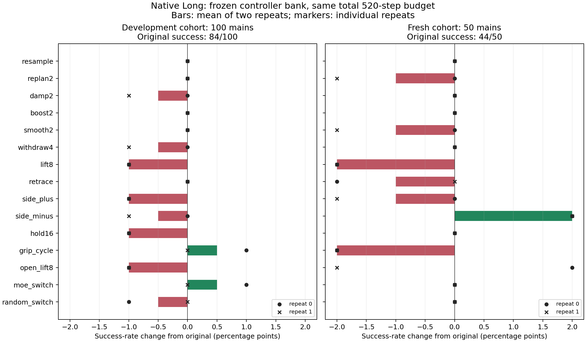
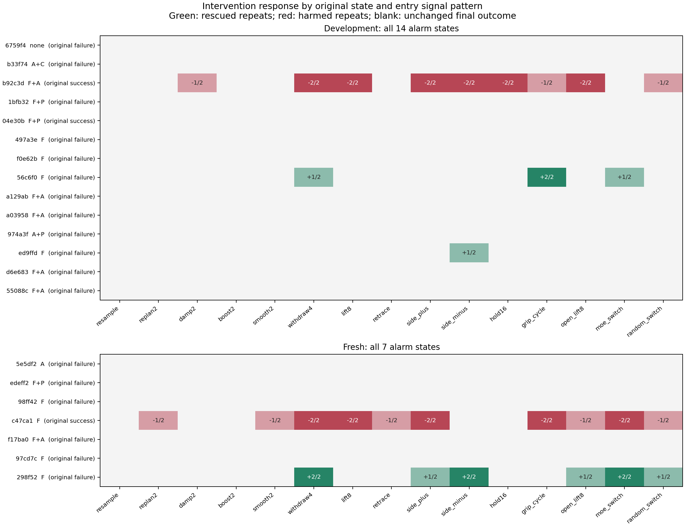

# 原生 Long：多控制器在线实验

实验日期：2026-09-09。全部采集、独立数据审计、651 条后缀的物理重执行与服务健康检查均已完成并通过。

## 本轮回答的问题

先建立输出反馈、有限时域、输入饱和与监督切换模型，再冻结 15 类控制方式，完成 GPU 在线干预。推导、参数及各操作含义见 [冻结理论与协议](CONTROL_BANK_THEORY.zh.md)。这不是仅在保存的 MoE 特征上算分数：恢复命令实际进入 `env.step`，后续模型重新读取干预后的图像和本体感知。

原生 LIBERO Long 的旧 100 条主轨迹作为开发队列；另采集各任务官方初始化 10–14 的 50 条新主轨迹，与旧队列的 0–9 不重叠。控制器参数在新队列产生结果之前已冻结。原样主轨迹结束后完成全长 C0，从 v8.2 首次报警的下一查询前恢复状态并干预。所有主轨迹与干预都使用原来的 520 个环境步总预算，成功即停止。

报警、checkpoint、归一化和参考分布均沿用冻结版本，不重新拟合。保留原本成功的报警轨迹用于统计损害。不读取物体真值位置来选择控制，不采集 hidden activation。每种方法两个配对噪声重复，另加一次原样后缀，共 31 个分支。

## 完整结果

| 队列 | 主轨迹数 | 原始成功 | 可干预报警 | 报警中的原失败 / 原成功 |
| --- | ---: | ---: | ---: | ---: |
| 开发 | 100 | 84 | 14 | 12 / 2 |
| 新样本 | 50 | 44 | 7 | 6 / 1 |

下表成功数包含未报警主轨迹的原始结果。`r0 / r1` 是两次重复各自的完整队列成功数；救回 / 损害列是两次重复的分支总数，不能当作独立主轨迹数。不能选择更好的那次重复作为方法成绩。

| 方法 | 开发成功 r0 / r1，分母 100 | 新样本成功 r0 / r1，分母 50 | 开发救回 / 损害，跨重复 | 新样本救回 / 损害，跨重复 |
| --- | ---: | ---: | ---: | ---: |
| resample：只重新采样 | 84 / 84 | 44 / 44 | 0 / 0 | 0 / 0 |
| replan2：短 chunk | 84 / 84 | 44 / 43 | 0 / 0 | 0 / 1 |
| damp2：动作减幅 | 84 / 83 | 44 / 44 | 0 / 1 | 0 / 0 |
| boost2：动作增幅 | 84 / 84 | 44 / 44 | 0 / 0 | 0 / 0 |
| smooth2：动作平滑 | 84 / 84 | 44 / 43 | 0 / 0 | 0 / 1 |
| withdraw4：抬高后回撤 | 84 / 83 | 44 / 44 | 1 / 2 | 2 / 2 |
| lift8：抬高 8 cm | 83 / 83 | 43 / 43 | 0 / 2 | 0 / 2 |
| retrace：历史位置回溯 | 84 / 84 | 43 / 44 | 0 / 0 | 0 / 1 |
| side_plus：正侧绕行 | 83 / 83 | 44 / 43 | 0 / 2 | 1 / 2 |
| side_minus：负侧绕行 | 84 / 83 | 45 / 45 | 1 / 2 | 2 / 0 |
| hold16：等待 | 83 / 83 | 44 / 44 | 0 / 2 | 0 / 0 |
| grip_cycle：夹爪切换再恢复 | 85 / 84 | 43 / 43 | 2 / 1 | 0 / 2 |
| open_lift8：开夹爪再抬高 | 83 / 83 | 45 / 43 | 0 / 2 | 1 / 1 |
| moe_switch：内部组合选控制器 | 85 / 84 | 44 / 44 | 1 / 0 | 2 / 2 |
| random_switch：随机选控制器 | 83 / 84 | 44 / 44 | 0 / 1 | 1 / 1 |

新样本中 `side_minus` 两次都是 45/50，相比原来的 44/50 提高 2 个百分点；两个重复救回的是同一个主轨迹。它在开发队列上平均为 83.5%，低于原来的 84%。这只是新样本上的一个正向候选，不能据此宣称已获得稳健优于基线的策略。

`moe_switch` 在开发队列上平均为 84.5%，随机选择为 83.5%；但在新样本上两者都为 88%，与原始成功率相同。MoE 规则在新样本上每次救回一个、也损害一个。目前没有验证出内部组合选择器在新样本上的净收益。



随机选择器在同一个六操作库中均匀选择，使用独立选择随机流，动作模型噪声仍逐父轨迹、逐重复配对。随机选择与 MoE 选择的操作频数、物理步数和查询成本并不完全相同；这不是等成本或匹配操作频数的随机对照。它比较两个具体选择规则的最终表现，还不能独立证明“模式语义”带来了增益。

## 恢复案例与反例

共有 **3 个不同的原失败主轨迹**被至少一种方法救回，均来自“双摩卡壶放炉灶”任务。其中一个旧案例上一轮已经救回，本轮增加了另一个旧队列案例和一个新队列案例。多方法的成功并集不等于可部署的单一策略成功率。

| 主轨迹 ID | 队列 | 干预前组合 | 成功的固定控制器及完成步 |
| --- | --- | --- | --- |
| `56c6f0e5e5315558c7e8e412` | 开发，已有恢复案例 | F | withdraw4 r0：517；grip_cycle r0/r1：500/478 |
| `ed9ffd290c5843f7fa2b77d7` | 开发，本轮新增恢复案例 | F | side_minus r0：516 |
| `298f5266a1cc483eb72131a9` | 新样本，本轮新增恢复案例 | F | withdraw4 r0/r1：503/480；side_plus r0：517；side_minus r0/r1：512/514；open_lift8 r0：508 |

三个案例的配对 `resample` 两次均失败。新样本上 `random_switch` 的一次恢复恰好选择了 `side_minus`；`moe_switch` 的恢复来自选择 `withdraw4`。审计验证两个选择器的整段执行与相应固定控制器分支完全一致。

两个不同的原成功主轨迹被部分方法破坏：

- 开发队列 `b92c3d7e25fbe93b35edbfcc`，黑碗放入抽屉再关闭，组合 F+A。多种物理恢复均有损害；MoE 规则选平滑，两次均保留成功。
- 新队列 `c47ca1f98b83891cf444d35a`，白杯放盘子并摆放布丁，组合 F。MoE 规则选回撤，两次都将原成功改为失败；`side_minus` 和 `resample` 两次均保留成功。



## 控制论解释与模式假设

本轮采用的局部位置控制是 `delta = -alpha (p-p*)`，单步名义平移不超过 1 cm；目标由已观测末端位置与历史构造。在理想位置积分器上，固定目标的平方距离会收缩。实际接触系统不满足这个简化模型，所以同时保存每一步的名义预测误差和目标误差，不能把局部收缩直接等同于任务完成。

实测 `lift8` 的 980 个恢复步中，99.59% 缩小或保持了目标距离，但最终没有救回任何原失败；其单步名义位置预测误差的平均范数为 7.56 mm。正、负侧绕行的目标距离不增加比例同为 99.59%，最终任务结果仍明显不同。局部目标跟踪指标不能代替任务层评价。`hold16` 和 `grip_cycle` 只有零运动命令，未实现位置反馈收缩，不纳入上述稳定性解释。

`F/A/P/I/C` 分别表示路由冻结、路由加速度、周期性、前后段反转、曲率特征。它们是内部信号组合，没有经过物理失败类型的标注确认。例如 F 越界并不能直接解释为夹住、碰撞或需要松手。

假设真实状态 x 经过特征映射形成组合 z。对一个只看 z 的控制器，能够利用的是该组的平均干预收益。一般有：

```text
max_u E[Delta success(x,u) | z]
    <= E[max_u Delta success(x,u) | z]
```

同一个组合里若混合了需要不同干预的状态，逐状态选最佳干预的事后并集就会高于真正能部署的组合规则。本轮 F 同时包含“回撤救回”和“回撤损害”的具体反例，说明当前组合分辨率不足；这不能靠只选择成功分支来修正。

本轮得到的方向是：

1. 物理执行过程值得继续研究。有效案例来自回撤、改变侧向路径或改变夹爪接触，而本轮减幅、增幅、平滑、短 chunk 和单纯重采样均没有救回原失败。
2. 更强不自动更好。8 cm 抬升没有救回，反而在两个队列都有损害；同样 4 cm 绕行，正负方向的结果也不同。
3. 后续应识别“对干预的响应模式”。保留原始五维信号、持续时间与趋势，再结合已经可见的末端运动和夹爪动作，解释哪些状态对哪个控制器有净收益。仅凭 F 越界不应固定推出回撤。
4. 优先在另一批未使用的初始化上确认冻结的 `side_minus`，同时保留 `resample`、原样对照与成功报警病例。基于本轮结果更改的规则必须作为新版本，在独立样本上检验，不能回填本轮成绩。

以上是小样本的探索发现。三条恢复轨迹都属于同一任务，两个重复也不是两个独立主轨迹；尚未证明跨任务泛化，也未证明失败检测分数是恢复收益或稳定性证书。

## 验证与资源

独立审计已验证 21 组全长 C0、651 个后缀、checkpoint 与冻结文件、因果报警位置、完整 HB/AS 路由、配对噪声、动作变换和选择器分派。每次策略查询同时保存原始生成动作与实际下发动作，物理恢复逐步保存前后状态。

采集阶段有 7,764 个恢复控制步，2,352 个实际变换的策略动作；所有后缀合计 94,754 个环境步。新主轨迹及其全长 C0 使用 2,840 次模型查询，控制器实验使用 11,925 次，共 14,765 次。控制器采集耗时约 647 秒，平均 18.43 次查询/秒，不含启动和独立复核。

完整策略的查询数包含未触发主轨迹、已执行前缀、一次入口探针和实际后缀，不包含用于研究复核的 C0。新队列中，原始策略为 1,420 次；`resample` 两次各 1,426 次；`side_minus` 各 1,414 次；`moe_switch` 为 1,449 / 1,447 次；`replan2` 为 1,474 / 1,492 次。物理恢复不调用策略模型，部分查询成本被物理控制步替代；这不意味着没有时间开销，且成功停止时间也会影响查询总数。

GPU 0–3 每卡 8 个独立 batch=1 副本。满配副本期间，各卡平均利用率分别为 91.1%、79.8%、83.0%、91.1%，平均功率为 217.0、238.6、238.9、208.1 W，峰值分别为 267.9、300.5、296.7、256.0 W。没有把峰值当作持续功率。GPU 6 未参与，临时模型和 MPS 已清理。

独立物理重执行覆盖全部 651 条后缀和 94,754 个环境步。每个恢复步、每个策略 chunk 的仿真状态及最终成功标志均精确一致，最大状态误差为 0。这项验证没有调用策略模型，而是重新执行保存的实际命令。控制器的 6 个聚焦单元测试及模型端、模拟端 Python 编译检查也已通过。

最终健康检查验证 GPU 0–3 上原有 20 个模型接口能够推理，仍由原进程 28531 提供服务；采集所有临时模型、worker 和 MPS 均已退出。另行验证的物理重执行 worker 也已正常结束。

## 文件

- [新样本事先冻结的计划](design/control_bank_fresh_cohort_20260909.json)
- [完整控制器实验计划](design/control_bank_plan_20260909.json)
- [独立数据审计](design/control_bank_audit_20260909.json)及[逐分支表](design/control_bank_audit_20260909.csv)
- [全部实际动作重执行](design/control_bank_physical_20260909.json)
- [汇总分析与配对结果](design/control_bank_analysis_20260909.json)
- [最终预加载服务检查](design/control_bank_posthealth_20260909.json)
- [归档校验与 SHA256](design/control_bank_archives_20260909.json)
- [控制器实现](control_bank.py)与[实际执行采集器](collect_control_bank.py)
- [新增原始数据归档目录](/home/jovyan/moe-control-data/control_bank_20260909)

新增原始数据包含新 50 条主轨迹、全长 C0、全部 651 条后缀与运行时源码快照。旧 100 条主轨迹继续引用既有 `design/native_long_v8_raw_20260909.tar.gz`。新增归档共 920,287,786 字节，放在工作盘以外的文件系统；两个新增归档已与原目录逐文件核对，原始目录仍保留。最后健康检查时工作盘空闲约 9.0 GiB。
