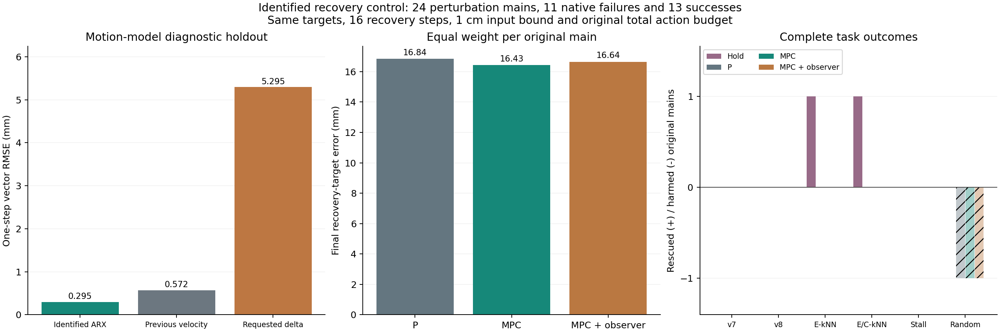

# 控制论视角的 MoE 恢复探索

日期：2026-09-08。协议：`moe_control.identified_recovery_mpc.v1`。

已完成首轮控制论试验并通过审计。MPC 对回撤目标的跟踪略有改进，完整任务救回没有增加；kNN 触发的暂停对照救回 1 条，随机时机的三种回撤控制都破坏了同一条原成功轨迹。当前证据支持继续研究恢复目标和时机，不能把名义稳定性或跟踪改善写成任务恢复能力提升。

## 研究问题

把 VLA、机器人、物体和环境共同视为被控系统。MoE 路由是部分观测，可以提供事件触发信号；恢复动作是控制输入；原任务成功是最终评价目标。失败风险、某种控制输入能否改变状态、改变之后能否完成任务，是三个需要分别验证的问题。

这轮首先检验：保持触发点、恢复目标和动作预算相同，加入动力学预测与扰动反馈，是否让同一种恢复更有效。然后在固定控制器下比较 v7、v8、欧氏 kNN、欧氏或余弦 kNN、行为停滞和随机时机。没有重新训练或校准报警器。

原来的回撤已经使用 `u = clip(target - observed_position)`，属于带限幅的 P 位置反馈。这轮比较的是 P 与 MPC，不能把原方法描述为完全没有反馈的开环动作。

## 三个时间尺度

1. 去噪迭代：一次策略推理中的 10 个 flow 步。
2. 策略查询：原生执行 chunk 为 10 个环境动作。
3. 环境动作：本轮物理 MPC 每执行一个动作就用新位置重新规划。

v8 的去噪曲率不是机械臂空间轨迹曲率。路由熵、专家切换量也没有被证明是任务进展或 Lyapunov 函数。降低这些量不能直接解释为脱离失败状态。

## 系统辨识

利用上一轮已审计的 `hold` 和 `withdraw` 物理控制数据，辨识末端位置的局部响应。单位使用 cm 和每环境步的 cm 位移：

\[
v_{t+1}=D_a v_t+D_b u_t+w_t,\qquad p_{t+1}=p_t+v_{t+1}.
\]

`u` 是送给底层 OSC 控制器的笛卡尔增量请求，不是假设机器人已经完成的位移。全局模型不依赖任务终局标签。每条原始主轨迹在拟合中权重相同，避免触发事件较多的轨迹支配结果。第一个物理动作没有已知的上一单步速度，因此不用于参数拟合。

共使用 29 条有物理控制记录的旧主轨迹、1,975 个转移。诊断阶段按基础任务固定哈希切分，留出 3 个基础任务，共 8 条主轨迹、588 个转移；完成诊断后再在全部旧物理数据上拟合部署模型。

| 留出诊断模型 | 单步向量 RMSE，mm |
| --- | ---: |
| 辨识 ARX 模型 | 0.295 |
| 沿用上一时刻速度 | 0.572 |
| 假设实际位移等于请求增量 | 5.295 |

表中 RMSE 按主轨迹等权。ARX 留出转移误差的 95 分位为 0.560 mm，最大观测误差为 1.349 mm；后两项按转移统计。这些是诊断误差，不是经过证明的最坏情况扰动界。

最终模型为：

\[
a=(0.787799,0.552636,0.474851),\qquad
b=(0.060827,0.111460,0.135665).
\]

这个模型说明响应有惯性和滞后，不能把 1 cm 指令当作即时到达 1 cm。它来自闭环观测数据，激励方向有限，没有识别物体、接触、夹爪或姿态动力学，也不构成无偏系统辨识的证明。

## 控制器

设 `e = p - target`，状态 `x = [e, v]`，则

\[
A=\begin{bmatrix}I&D_a\\0&D_a\end{bmatrix},\quad
B=\begin{bmatrix}D_b\\D_b\end{bmatrix},\quad
D=\begin{bmatrix}I\\I\end{bmatrix}.
\]

每个触发状态比较 5 个分支：

| 分支 | 物理恢复计算方式 |
| --- | --- |
| `native` | 从保存状态原样继续，完整后缀必须与主轨迹一致 |
| `hold` | 16 步零平移增量，保留原夹爪命令符号 |
| `withdraw` | 原先的限幅 P 控制 |
| `mpc` | 使用已辨识模型，滚动预测 6 步并优化动作 |
| `mpc_disturbance` | 同一 MPC，增加因果的运动残差扰动估计 |

MPC 目标函数为

\[
J=\sum_{k=0}^{5}u_k^TRu_k+\sum_{k=1}^{5}x_k^TQx_k+x_6^TPx_6,
\quad Q=\operatorname{diag}(1,1,1,0.25,0.25,0.25),\quad R=0.15I.
\]

`P` 由离散 Riccati 方程求得。每个未来动作要求 `||u_k||_2 <= 1 cm`。使用 SciPy 的 SLSQP 求解带二次球约束的凸优化问题，独立核对可行性与投影梯度残差。求解失败或残差超过冻结上限时，该步回退到原限幅 P 控制并记账。只执行计划的第一个动作，然后使用新观测重新计算。[滚动优化与约束控制依据](https://sites.chemengr.ucsb.edu/~jbraw/mpc/MPC-book-2nd-edition-6th-printing.pdf)，[SLSQP 接口](https://docs.scipy.org/doc/scipy/reference/optimize.minimize-slsqp.html)。

扰动估计为

\[
\hat w_{t+1}=\Pi_{\|w\|\leq0.5}\left[0.5\hat w_t+0.5(v_{t+1}-D_av_t-D_bu_t)\right].
\]

在动作 `t` 的优化中只允许使用 `hat_w_t`。新观测产生的 `hat_w_(t+1)` 留给下一个动作。扰动限幅单位为 cm/环境步。这是扰动补偿 MPC；没有实现稳态目标优化，因此不称为具有零稳态误差保证的完整 offset-free MPC。

所有物理分支保持同一预算：先朝上方 4 cm 的目标执行 8 步，再朝历史位置方向水平回撤最多 4 cm，执行 8 步；旋转增量为零，夹爪符号来自上一原生动作。总环境预算仍为 520 步，干预占用其中的步数。MPC 在当前相位使用定目标预测，没有提前规划相位切换或向 VLA 的交接。

## 稳定性结论的范围

名义线性模型可控性与位置输出可观性矩阵的秩均为 6。令

\[
K=(R+B^TPB)^{-1}B^TPA,\quad V(x)=x^TPx,
\]

在定目标、零扰动、无约束 LQR `u=-Kx` 下，

\[
V(x_{t+1})-V(x_t)=-x_t^T(Q+K^TRK)x_t<0\quad(x_t\ne0).
\]

数值检查得到 `rho(A-BK)=0.722487`，`lambda_min(P)=0.518846`，Riccati 恒等式最大残差为 `3.66e-15`。[LQR 依据](https://ee363.stanford.edu/archive/lectures/dlqr-ss.pdf)，[离散 Lyapunov 依据](https://ee363.stanford.edu/archive/lectures/lq-lyap.pdf)。

这个证书只适用于上述已辨识的六维名义模型。实际控制包含动作限幅、估计误差、接触、相位切换、16 步后交回 VLA，没有终端不变集证明，因此不声称整个任务闭环稳定、安全或一定成功。一次触发避免重复介入，但不是混杂系统稳定性证明。

采集中同时记录实际 `V_after - V_before`，前后使用同一个当前相位目标，避免把目标切换误算为误差增长。这个值仍然是局部跟踪诊断；错误目标附近的稳定状态可能仍是任务失败。

## 配对试验设计

从原来的 120 条已审计 Long 主轨迹中排除全部 36 条辨识开发轨迹，再按基准和类别固定哈希抽取每组 2 条，共 24 条。选择不使用报警或成功标签，保留没有有效报警的轨迹。这里是状态与辨识数据分离的探索性评估；历史总体及报警此前已经被查看，不是全局盲测或官方基准成功率。

共冻结 44 个不同触发状态，每个状态运行上述 5 个分支，共 220 条完整后缀。不同检测器共享同一状态时复用分支，不能把它们当作独立救回证据。

严格沿用“报警查询 q 原样执行，结束之后在 q+1 前介入”的时机。先完整重放主轨迹得到 C0，再从完整快照恢复每个分支。策略随机流按原查询序列匹配；环境随机流按绝对环境步匹配，超出原终局的部分使用预定公共扩展。每条主轨迹一个原生策略随机流。

主要评价单位是原始 `main_id`。先在相同触发规则下比较控制器，再固定控制器比较触发规则，统计救回原失败、破坏原成功、全体轨迹净成功变化、计算与动作开销。触发覆盖率不同，不能称为等干预次数的纯时机比较。

再次停滞采用既有行为代理：恢复后的连续 6 次策略查询位置直径不超过 5 mm；只有先观测到完整非停滞窗口、随后再停滞才计为再次陷入。没有完整窗口的分支作为删失，不能计作没有再次停滞。持续锁存的报警标志不作为新的报警事件。

## 结果与审计

24 条评估主轨迹均为扰动任务：Pro 10 条，原成功 3、失败 7；Plus 14 条，原成功 10、失败 4。合计原成功 13、失败 11。这轮未生成新的原始主轨迹，而是在未参与辨识的旧主轨迹状态上生成了新的干预结果。

下表每格为“救回 / 损害”，以原始主轨迹计数。“失败 / 成功触发数”指在原终止前确实能够介入的覆盖数，不是整个历史数据集的报警精度或误报率。

| 触发规则 | 失败 / 成功触发数 | 暂停 Hold | 原 P 回撤 | MPC | MPC + 扰动估计 |
| --- | ---: | ---: | ---: | ---: | ---: |
| v7 | 8 / 1 | 0 / 0 | 0 / 0 | 0 / 0 | 0 / 0 |
| v8 | 9 / 1 | 0 / 0 | 0 / 0 | 0 / 0 | 0 / 0 |
| 欧氏 kNN | 11 / 3 | 1 / 0 | 0 / 0 | 0 / 0 | 0 / 0 |
| 欧氏或余弦 kNN | 11 / 4 | 1 / 0 | 0 / 0 | 0 / 0 | 0 / 0 |
| 行为停滞 | 7 / 0 | 0 / 0 | 0 / 0 | 0 / 0 | 0 / 0 |
| 随机时机 | 11 / 3 | 0 / 0 | 0 / 1 | 0 / 1 | 0 / 1 |

两种 kNN 的暂停救回是同一条轨迹，不是两条。对应全体 24 条上的成功数为 14/24；其它确定性触发配置为 13/24，随机回撤的 P、MPC、扰动 MPC 均为 12/24。P、MPC 和扰动 MPC 的任务成功标签在所有 44 个事件上完全相同，尚无 MPC 优于 P 的任务级证据；小样本相同结果也不是等效性证明。

相对于欧氏 kNN，加入余弦 OR 在这批数据上增加了 1 次原成功轨迹的介入，没有增加原失败覆盖或救回。v8 比 v7 多覆盖 1 条原失败，但三种回撤都未救回它。不能据此推广为总体性能排名。

| 跟踪指标 | 原 P | MPC | MPC + 扰动估计 |
| --- | ---: | ---: | ---: |
| 全部事件的终止目标误差，按主轨迹等权，mm | 16.837 | 16.428 | 16.642 |
| 全部事件的过程跟踪 RMSE，按主轨迹等权，mm | 29.323 | 29.222 | 29.312 |
| v8 触发后完成 16 步的平均终止误差，mm | 4.278 | 3.792 | 3.916 |
| v8 下再次停滞 / 可观测分支 | 4/9 | 4/9 | 4/9 |

全部事件指标在有物理分支的 16 条主轨迹内先按事件平均，再按主轨迹等权；成功提前结束时计入实际终止误差，因此不是固定时长的纯调节实验。v8 的 10 个分支均完成 16 个物理动作，之后有 1 条缺少完整停滞观察窗口。MPC 的 v8 目标误差下降约 11.4%，但救回仍为 0，过程 RMSE 基本相同。扰动估计没有显示出一致优势。

三种回撤各有 679 个实际物理动作，只有 4 步出现同目标下二次型误差增长，完整任务仍没有救回。这直接展示了局部跟踪下降与任务成功的区别。动作约束相同，但实际控制能量不完全相同，例如 v8 下平均输入范数从 P 的 0.951 cm 升至 MPC 的 0.967 cm；不能称为等控制能量比较。

两个有终局变化的案例都来自 Plus 的“把黑碗放进底层抽屉并关闭抽屉”任务：

- `bbaed89ae657dab32ebc9f21`，语言扰动：原生到 520 步失败；kNN 在查询索引 19 开始的暂停分支于 266 步成功。相同状态的三种回撤均失败。查询索引 25 的随机暂停、索引 32 的 MoE 暂停也失败。这提示该例的介入内容和时机都有影响，但一个案例不足以确定机理。
- `301c74f1ab2de8c5e673c3b0`，物体布局扰动：原生 227 步成功；随机索引 13 的暂停在 238 步成功，而三种回撤都到 520 步失败。回撤的几何目标可能与当前子任务不相容，需要进一步检查交互状态，不能单凭末端误差诊断原因。

MPC 共求解 679 次，其中 17 次回退 P；扰动 MPC 为 9/679。接受和回退均依照冻结标准记录，没有看到结果后修改求解阈值。实际求解计时合计分别为 1.253 和 1.245 秒，约 1.84 和 1.83 ms/步；这是求解计时范围，不包含创建控制器、全部记录或环境执行开销。

全量审计确认 24 个完整 C0、44 个完整原生后缀逐项一致；220 条分支均执行到成功或 520 步。检查了动作尺度和约束、原模型身份、随机流、MoE 路由结构、因果触发、MPC 计划的预测与目标函数、独立反向计算的投影梯度残差、扰动估计时序、状态链和前向计数。未记录 hidden 层。

源码审计另有一项明确记录：本轮开始于 `16:52:42 UTC`，工作区 `run_collection_preflight.py` 在 `16:52:55 UTC` 出现并行修改，增加另一个 repair 调度入口。本轮归档源码的哈希全部保持一致。AST 比较确认改变仅在本轮未调用的 `run(args)` 和命令行入口，所有导入工具函数及模块初始化保持一致；审计保存了新旧哈希和所用导入项。没有撤销该修改，也没有把当前工作区所有文件都描述为字节一致。

采集使用物理卡 0–3，各 8 个独立 batch=1 推理副本；卡 6 未使用。有效采集耗时 324.51 秒，891 次完整 C0 查询加 4,741 次分支查询，共 5,632 次，平均 17.36 次/秒。启动等价检查另有 72 次请求，结束健康检查另有 20 次，总计 5,724 次模型请求。运行目录数据约 0.346 GiB。

| 物理卡 | 采集全程平均利用率 | 8 个任务活跃时平均利用率 | 观测峰值功率 |
| --- | ---: | ---: | ---: |
| 0 | 88.8% | 98.5% | 269.8 W |
| 1 | 69.0% | 89.0% | 292.5 W |
| 2 | 72.8% | 87.9% | 292.5 W |
| 3 | 85.3% | 95.9% | 263.9 W |

功率没有持续达到 300 W。临时推理、环境进程和私有 MPS 已清理；原预加载进程 PID 28531 的卡 0–3 上 20 个模型端点全部完成推理健康检查。原主轨迹及冻结报警文件校验通过。

## 后续的 MoE 控制问题

本轮通过物理动作执行恢复，MoE 负责触发，尚未证明能够直接闭环调控 MoE 而提升任务成功。已有强度试验中，路由大幅改变时动作响应仍小，提示应先估计内部干预到实际动作的传递关系。

下一阶段可以在同一保存状态、同一噪声下，对预先选定的门控方向施加正负小扰动，估计 `Delta routing -> Delta action -> Delta observed state` 的局部响应。利用奇异值、条件数和有限时域可控 Gramian 检查哪些干预方向能改变实际行为，再决定是否在那些方向上构建内部 MPC。门控概率位于单纯形，建模时需要去掉冗余维度；名义矩阵满秩不代表接触任务全局可控。

恢复目标的设计也需要独立验证。若目标跟踪改进而成功没有增加，下一步应研究任务进展、接触模式和可恢复状态集合，不能仅继续增大路由偏置或追求更低的报警分数。

## 产物

- [已冻结动力学与辨识证据](design/recovery_dynamics_20260908.json)
- [冻结试验计划](design/mpc_recovery_plan_20260908.json)
- [控制器实现](recovery_mpc.py)
- [采集实现](collect_mpc_recovery.py)
- [独立审计](audit_mpc_recovery.py)
- [配对分析](analyze_mpc_recovery.py)
- [完整分析与逐事件终局](design/mpc_recovery_analysis_20260908.json)
- [全量审计结果](design/mpc_recovery_audit_20260908.json)
- [采集运行与资源记录](design/mpc_recovery_experiment_20260908/summary.json)
- [预加载模型健康检查](design/mpc_recovery_final_health_20260908.json)
- [可导出 PDF 图](design/mpc_recovery_results_20260908.pdf)

原始主轨迹、冻结报警参数和参考库校验通过；本轮新增独立运行文件，不保存 hidden 层。通用调度文件的并行修改及审计处理见上文。
