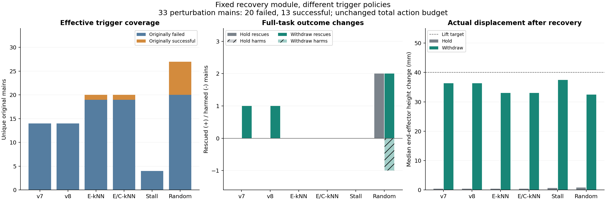

# 固定恢复模块与触发时机实验

2026-09-08。36 条完整 C0、67 个不同触发状态、201 条完整配对后缀均已完成并通过全量审计。原有模型服务健康检查通过。

本轮将风险检测与恢复收益分开：固定实际恢复动作，只比较触发策略，同时设置同样步数的停留对照。结果出现少量救回，也出现误伤；当前数据没有证明 MoE 触发优于随机时机。

## 固定模块

`withdraw` 的定义在采样前冻结，各检测器完全共用：

1. 保持最后一个已执行夹爪指令的符号，旋转增量为零。
2. 前 8 个环境步，闭环控制末端向当前高度上方 4 cm 移动。
3. 后 8 个环境步，在该高度向 3 次查询前的末端水平位置回撤，水平目标距离最多 4 cm。
4. 单步平移目标增量的欧氏范数最多 1 cm，按照实际 OSC 控制器的缩放转换成动作；随后恢复原 Long 策略，chunk 仍为 10。

每条策略最多干预一次。成功或原有 520 个环境步预算耗尽立即结束，所以部分晚期事件不足 16 个恢复步。4 cm 是目标，是否实际到达另行测量。若近期末端没有水平移动，模块仍执行抬升。

`hold` 对照执行同样最多 16 步、同样夹爪指令与零旋转增量，但平移增量为零；残余速度、接触和重力仍可能造成实际位移，不能称为模拟器冻结。`native` 不插入任何动作，完整后缀必须精确复现原始轨迹。

恢复动作在真实模拟器中逐步执行，没有调用 `set_state` 回滚环境作为恢复手段。快照恢复只用于让配对实验从共同起点开始；模块不读取未来结果、物体特权状态、报警之后的原始轨迹或 hidden。

与上一轮相比，上一轮将真实 gate 偏置放大到 16 倍、持续至多 20 次查询，384 条后缀仍未救回；详见 [幅度实验](V8_STRENGTH_EXPERIMENT.zh.md)。本轮直接检验一个可观察的物理恢复动作。

## 样本与触发

从首批 120 条完整 Long 主轨迹中，在 12 个 benchmark/category 分层各按固定哈希抽 3 条，共 36 条：Pro 15、Plus 21，原始失败 21、成功 15。选择不使用成败或是否报警，无有效触发的轨迹保留原生结果，计入策略总体分母。

主分析排除 3 个未改变场景的 Pro 对照，剩余 **33 条扰动轨迹：20 失败、13 成功**。其中 Pro 12 条、Plus 21 条。本轮没有新增主轨迹覆盖，每条只有一个原始策略噪声流；相同状态供不同方法共享，不重复算独立证据。

| 触发器 | 冻结规则 | 主分析有效触发：原失败 / 原成功 |
| --- | --- | ---: |
| v7 | 原全局 profile 与锁存逻辑 | 14 / 0 |
| v8 | 原 v7 加两种 v8 特征头，原阈值、窗口和确认次数 | 14 / 0 |
| kNN 欧氏 | 原全局成功参考库、20 邻居和阈值 | 19 / 1 |
| kNN 欧氏 OR 余弦 | 两种原阈值的并集 | 19 / 1 |
| 行为停滞 | q>=7，最近 6 次查询的末端位置最大两点距离不超过 5 mm | 4 / 0 |
| 随机时机 | 每条主轨迹提前固定一次 q，均匀取自 8..39；若已经终止则不干预 | 20 / 7 |

所有信号在原生查询 q 可得，执行完原生 q 的动作，再于 q+1 前启动恢复；q 从 0 开始。行为停滞只使用位置历史，不是任务进展评价器，可能漏掉“持续运动但做错事”的状态。

各策略的上限都是一次干预，实际触发次数不同。本轮测量的是完整触发策略的收益，包括覆盖与时机，不能声称已经严格匹配实际干预次数。另报告双方都触发的共同子集。

## 主要结果

下表使用全部 33 条主分析轨迹作为统一分母；救回分母为原失败 20 条，误伤分母为原成功 13 条。

| 时机与操作 | 实际干预轨迹 | 救回 | 误伤 | 总成功 | 相对原生净变化 |
| --- | ---: | ---: | ---: | ---: | ---: |
| 原生 | 0 | 0 / 20 | 0 / 13 | 13 / 33 | 0 |
| v7 + 回撤 | 14 | 1 / 20 | 0 / 13 | 14 / 33 | +1 |
| v8 + 回撤 | 14 | 1 / 20 | 0 / 13 | 14 / 33 | +1 |
| 欧氏 kNN + 回撤 | 20 | 0 / 20 | 0 / 13 | 13 / 33 | 0 |
| 欧氏 OR 余弦 kNN + 回撤 | 20 | 0 / 20 | 0 / 13 | 13 / 33 | 0 |
| 行为停滞 + 回撤 | 4 | 0 / 20 | 0 / 13 | 13 / 33 | 0 |
| 随机时机 + 回撤 | 27 | 2 / 20 | 1 / 13 | 14 / 33 | +1 |
| 随机时机 + 停留 | 27 | 2 / 20 | 0 / 13 | 15 / 33 | +2 |

其余信号触发的停留对照均为 0 救回、0 误伤。所有救回和误伤都发生在 Plus；Pro 本轮没有结局变化。纳入场景对照后，完整 36 条的原生成功为 15，v7/v8 回撤与随机回撤为 16，随机停留为 17，救回和误伤数不变。

v7/v8 在本批触发位置完全相同，救回的是同一个状态，不能算成两次独立收益；两种 kNN 版本也完全相同。v8 与随机回撤在 33 条上的配对比较为 **2 赢、2 输，净差为 0**；双方都触发的 14 条上为 **1 赢、1 输**。这一批不能区分 v7 与 v8 的附加价值，也没有证明 MoE 时机优于随机时机。

v8 回撤相对原生的描述性净变化为 +3.03 个百分点，按主轨迹 bootstrap 的 95% 区间为 [0,9.09]；相对随机回撤为 0，区间 [-12.12,12.12]。样本和噪声重复数有限，这些区间不构成验证性结论。全部配对差相同时记空区间，不用 `[0,0]` 声称等效。

v7/v8 在这批没有实际干预任何原成功轨迹，因此 0 误伤不构成模块安全性的证据。主分析 kNN 只干预了 1 条原成功轨迹；随机时机干预了 7 条，其中回撤破坏了 1 条。

图中的 E-kNN 为欧氏 kNN，E/C-kNN 为欧氏 OR 余弦。

## 配对案例

所有位置均为事先由各触发策略确定，以下解释属于事后分析，不能用来反向选取“最佳报警时刻”。

| 主轨迹 | 场景 | 同一模块在不同时机的结局 |
| --- | --- | --- |
| `07f45d22b8b575f1c84a45ab` | Plus / Objects Layout；把两只摩卡壶放上炉灶 | 随机 q10 开始回撤失败；kNN q12 失败；v7/v8 q15 回撤成功，总共 488 步。q15 的停留对照失败 |
| `7439f716b39583c51883cb66` | Plus / Background Textures；把黑碗放进底部抽屉并关上 | 随机 q14 回撤成功，总共 359 步；kNN q26、MoE q27、停滞 q28 回撤均失败 |
| `5162309df5fa803c415c327a` | Plus / Sensor Noise；将两只杯子分别放到盘子上 | 随机 q12 停留后 270 步成功，回撤后 291 步成功；kNN q35 两种操作均失败；v7/v8 未报警 |
| `d2994f8892a45bf09c356a77` | Plus / Sensor Noise；把两只摩卡壶放上炉灶 | 随机 q9 停留后 388 步成功，回撤失败；其余信号未形成有效触发 |
| `586544de8f4a24cca68c504a` | Plus / Light Conditions；开炉灶并放上摩卡壶 | 原生 237 步成功；随机 q18 停留后 252 步成功，回撤到 520 步失败 |

这些对比说明“越早越好”也不成立。另一方面，停留组的收益不能自动归因于相机噪声改善、物体稳定或特定空间机制，因为本轮未把这些原因逐项隔离。可以确认的是：部分恢复不需要回撤，过大的物理动作也可能破坏正常执行。

## 实际动作、复发与成本

主分析中，v8 回撤后观测到的末端高度变化中位数为 **36.3 mm**，停留为 **0.42 mm**；kNN 回撤为 33.0 mm，随机回撤为 32.5 mm。因此这轮确实改变了机器人所处状态，并非仅改变记录下来的分数。

再次停滞使用一个独立、可复算的行为代理：恢复后至少取得 6 次新查询的位置，再判断该窗口直径是否 <=5 mm；至少先出现一个非停滞完整窗口，随后再出现停滞窗口，才计作“解除后再次停滞”。没有完整窗口的分支记为观察不足，不记为没有复发。锁存的 v7/v8 报警标志不用于数新事件。

| 回撤触发器 | 有足够观察的分支 | 解除后再次停滞 | 观察不足 |
| --- | ---: | ---: | ---: |
| v7/v8 | 12 | 4 | 2 |
| kNN 两版 | 19 | 4 | 1 |
| 行为停滞 | 4 | 2 | 0 |
| 随机时机 | 25 | 3 | 2 |

这些分母包括最终失败的分支，不是“已经救回之后又失败”的比例，也不等价于任务语义上的 trap 识别。

物理模块本身不增加模型调用，但消耗动作预算，可能挤占后续规划。主分析 v8 回撤共插入 218 个物理步，随机回撤插入 432 步；这些步骤的实际模拟耗时合计分别为 4.60、10.58 秒。全程模型查询相对各自原生轨迹分别减少 17、32 次，这也包含早成功和预算占用的影响，不能单独称为效率改善。并发运行中的后缀耗时保存在审计数据中，不作为串行部署延迟承诺。

## 对研究设计的影响

应该分别建模 `P(原生继续失败 | 历史)` 和 `E[干预后的完整成功 - 原生完整成功 | 历史, 操作]`。本轮已经保存每个时间点的 `native / hold / withdraw` 配对结局；单个 0/1 配对差是一次实验标签，不是已经估计准确的成功概率。

下一阶段值得围绕这些收益标签验证：保持恢复模块固定，在新的主轨迹及更多噪声重复上比较触发策略；把当前病例用作开发案例，不能再称为留出验证。特征可以包含已有 MoE 动态量、末端运动和夹爪历史，但不能用干预后的特征变化或未来结果决定在线介入。任务阶段和物体进展尚未被该模块识别，所以它不是通用恢复技能。

当前先得到一个有限结论：固定模块在部分状态有效，触发覆盖更广没有自动转化为更多救回；MoE 的独立时机收益仍需证据。本轮没有接入用户提到的论文方法，也没有将本地 v7/kNN 对照冒称为那些外部恢复系统。

## 完整性与文件

- 4 项恢复动作边界、静止回撤目标、随机状态含高斯缓存往返、停滞窗口测试通过；32 个 batch=1 副本的启动原生等价检查通过。
- 36 条 C0 与原主轨迹全量逐字段一致，包含动作、路由、观测摘要、物理状态、完整结局；每个环境步均记录原始 Python/NumPy RNG 状态。
- 分支按绝对环境步共享 C0 RNG 记录；超过原成功轨迹终止点时使用事先固定的共同扩展规则。策略 RNG 按原查询编号继续。RNG 记录仅用于控制实验随机性，不作为控制器输入。
- 67 条无干预后缀再次完整复现原轨迹；134 条物理分支的状态链、实际动作、16 步上限、固定目标、原 horizon、全量路由与结局均通过审计。派生目标几何复算允许 1e-15 米浮点容差，原生等价性仍要求精确一致。
- 采样账本：完整 C0 1,455 次 + 后缀 4,332 次 = **5,787 次模型前向**；启动检查 72 次、最终健康检查 20 次，共 5,879 次请求前向。采样 332.44 秒，即 **5.54 分钟**，平均 17.41 次前向/秒，数据约 **0.365 GiB**。
- 仅使用 GPU 0–3，每卡 8 个 batch=1 副本及私有 MPS。全程平均利用率 85.4%、74.8%、72.9%、82.4%；每卡有 8 个活跃任务时分别为 95.4%、87.7%、87.4%、94.8%。峰值功率分别为 261.4、291.1、292.2、263.2 W，没有持续达到 300 W。
- 全部临时模型、环境和私有 MPS 已退出；原 PID 28531 的 20 个端点通过真实推理检查。GPU6 未使用，不采集 hidden，报警参数和模型 checkpoint 未改动。

文件：[冻结计划](design/fixed_recovery_plan_20260908.json)、[完整分析与配对收益标签](design/fixed_recovery_analysis_20260908.json)、[全量审计](design/fixed_recovery_audit_20260908.json)、[采样记录](design/fixed_recovery_experiment_20260908/summary.json)、[健康检查](design/fixed_recovery_final_health_20260908.json)、[PDF 图](design/fixed_recovery_results_20260908.pdf)。

实现：[固定模块及因果触发](fixed_recovery_control.py)、[C0 与物理分支采集](collect_fixed_recovery.py)、[就绪事件调度](run_fixed_recovery.py)、[独立审计](audit_fixed_recovery.py)。
