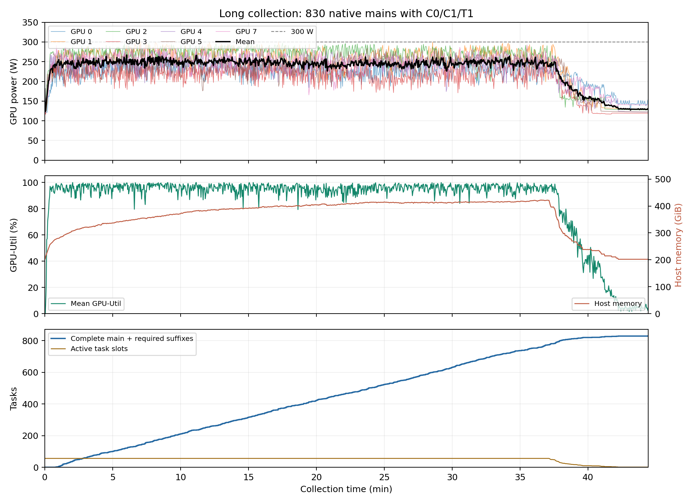

# Long 大规模采集记录

2026-09-08，08:33 UTC 启动，09:19 UTC 完成采集。状态：**830 条全部完成并通过独立审计及冻结报警复算**。本轮新增模型、模拟器和 MPS 已退出，原 35 个服务健康检查通过。随后追加的 **1,200 条也已全部完成并通过审计**，见 [追加批次记录](NEXT_BATCH_EXPERIMENT.zh.md)。

## 目标与清单

本轮执行原冻结 P1 初筛清单中全部未完成 Long 主轨迹，共 **830 条：Pro 200、Plus 630**。其中 810 条为扰动样本、20 条为 Pro 原场景对照。与之前已审计的 120 条合并后，已核对恰好覆盖 Long 初筛全部 **950 个 main ID：Pro 250、Plus 700**，没有重复或遗漏，其中原场景对照 25 条，主要扰动分析 925 条。

选样仅依据冻结清单及完成索引，不依据第一批成功/失败结果筛选任务。沿用原始 variant、init index、noise seed；固定哈希只决定调度顺序。不把重放或分支当作新主轨迹。

- [本轮冻结计划](design/experiment_long_scale_plan_20260908.json)，SHA-256：`290394d2568641ad57026e227883a7b912a3636e117745513d6aab397381ef95`。
- 原任务 CSV SHA-256：`4ebe63a918a48202d628fb428f0fe5998fdfef1a832faa40db6597796ca57767`。
- 冻结报警参数 SHA-256：`f4e65d359411309756b008423d14d8f3e5d6bf604ee71b63ae8a7e510c5f8216`。
- [启动前检查](design/experiment_long_scale_before_health_20260908.json)：原 35 个端点的实际推理、checkpoint 和归一化检查通过；仍属于 PID 28531，没有上一批残留采集进程。

## 实际采集结果

| 指标 | 本轮 830 条 | 两轮 Long 初筛合计 |
|---|---:|---:|
| 原生成功 / 失败 | 503 / 327 | 569 / 381 |
| 在线 v7 首次报警状态 | 225 | 264 |
| 完整 C0，通过 / 总数 | 830 / 830 | 950 / 950 |
| C1/T1 后缀，不含 C0 | 1,800 | 2,112 |
| 主轨迹 query | 29,795 | 34,225 |
| C0 query | 20,466 | 23,424 |
| C1/T1 query | 42,381 | 49,780 |
| 总 query | 92,642 | 107,429 |
| 轨迹文件逻辑字节 | 6,738,942,000，约 6.276 GiB | 7,802,341,404，约 7.266 GiB |
| 采集时间，不含加载/独立审计 | 44.44 分钟 | 54.06 分钟 |
| 完整吞吐 | 34.74 query/s | 33.12 query/s |

本轮无运行失败、恢复不一致或配额截停；225 个报警状态全部产生计划内 8 条配对后缀。独立审计核对所有 chunk 校验和、原生结局、完整 C0、分支前缀身份、实际输入、噪声配对、剩余步数、实际替换和无 hidden。900 对 C1/T1 首 query 动作全部有数值变化，每条 T1 恰好替换 400 个规定的路由槽位。

[完整审计](design/experiment_long_scale_audit_20260908.json)、[本轮分析](design/experiment_long_scale_analysis_20260908.json)、[运行统计](design/experiment_long_scale_20260908/summary.json)、[Long 全部初筛合并验证](design/experiment_long_screen_summary_20260908/verification.json) 均已保存。审计 SHA-256：`f4cdb61d4b581a65bf32a56c8c3e4036b4bd14587f995cd7144532250fbacf55`。

## 冻结报警比较

下表统一使用两批 **950 条未干预主轨迹**的最终成功/失败，误报率为 `FP / 569`，召回率为 `TP / 381`，精确率为 `TP / (TP + FP)`。未重调阈值、距离参考库或按 suite 分别拟合。

| 方法 | TP | FP | 精确率 | 召回率 | 误报率 |
|---|---:|---:|---:|---:|---:|
| v7 | 254 | 10 | 96.21% | 66.67% | 1.76% |
| v8 | 276 | 10 | 96.50% | 72.44% | 1.76% |
| v8.2 | 308 | 10 | 96.86% | 80.84% | 1.76% |
| 欧氏 kNN，k=20 | 365 | 73 | 83.33% | 95.80% | 12.83% |
| 余弦 kNN，k=20 | 4 | 6 | 40.00% | 1.05% | 1.05% |
| 欧氏 OR 余弦 | 365 | 79 | 82.21% | 95.80% | 13.88% |
| k-means 32 簇联合半径 | 351 | 40 | 89.77% | 92.13% | 7.03% |

剔除 25 条原场景对照后的主要扰动口径为 925 条：v7/v8/v8.2 的误报率均为 1.83%，召回率分别为 66.49%/72.30%/80.74%；欧氏 kNN 召回 95.78%、误报 13.00%。余弦 OR 在该冻结配置下没有增加失败召回，仅增加 6 个误报。全部 11 种方法、Pro/Plus 分项、TP/FP/FN/TN 见 [合并指标](design/experiment_long_screen_summary_20260908/metrics.csv)。

本轮离线复算逐 query 精确复现 29,795 次在线 v7 分数与报警，并独立验证 v8/v8.2 确认逻辑、距离计算以及前缀/顺序不变性。[复算验证](design/experiment_long_scale_alarm_comparison_20260908/verification.json) 和 [逐轨迹报警位置](design/experiment_long_screen_summary_20260908/first_alarms.csv) 已保存。以上为本实验抽样结果，不是完整 benchmark 分数。

## 干预结果

以 925 条主要扰动样本中的 262 个报警状态为单位，先平均状态内四次重复，再跨状态汇总：C1 报警状态成功率 3.44%，T1 为 3.82%，差值 **+0.382 个百分点**。这是描述性差值，尚未提供按原始任务聚类的置信区间，不能据此宣称稳定收益。

252 个原生失败报警状态的平均救回率分别为 C1 0.40%、T1 0.79%；10 个原生成功报警状态的平均破坏率两者均为 20%。本轮出现少量恢复及破坏案例，因此不能把此前 120 条“未观察到恢复”延用到整个数据集。固定 `swap1_near` 的增量差异全部来自 Plus，Pro 的配对增量仍为 0；没有根据这些结果更改操作或报警参数。

## 实验规则

沿用 `moe_control.paired_swap1.v1`。主轨迹 batch=1、无干预，最多 520 环境步；在线触发仍为原冻结 v7。首次报警保存推理前的完整状态，原生主轨迹结束并提交后才开始分支，不按主轨迹结局挑选报警。

每条主轨迹均做完整 C0：有报警时从首次报警状态开始，无报警时从 q5/q0 开始作为质量检查。C0 必须在动作、路由、物理状态及整个后缀上精确一致。每个通过 C0 的报警状态再做 C1 四次和 T1 四次，保留相同剩余时限、配对 policy/environment 随机种子和原有 `swap1_near` 干预。状态内平均四次重复，不挑最优重复。

保存完整 HB/AS 概率、原生与实际执行专家 ID/合并权重、实际 proprio、噪声和物理状态。T1 首次 query 另存 FP32 路由概率用于验证实际替换。不保存 hidden。8 query/chunk，最多 2 个待写块，原子提交和校验和；分支只写后缀，通过父 main/event/commit 引用前缀。

全部主轨迹结束后已按同一冻结配置离线复算 v7、v8、v8.2、欧氏/余弦 kNN、k-means 及原有欧氏/余弦组合。在线 v7 报警点之外的离线报警位置没有新增配对干预，不能据此宣称这些检测器的控制收益。

## 负载与边界

物理 GPU **0/1/2/3/4/5/7**，每卡私有 MPS、8 个共享只读权重的独立推理进程、8 个任务位，共 56 路 batch=1。渲染使用 0/3/4/5/7。**GPU 6 不用于推理、渲染或 MPS**；保留原 35 个预加载服务。

不改变 batch 组成、模型算子、全局功率限制或时钟。大队列持续补充真实主轨迹和分支任务，以减少首批收尾时的闲置；功耗使用真实采集采样，不能用固定输入重复回放的功耗替代。本轮不承诺持续 300 W。

启动时可用磁盘 38.22 GiB；按首批实际分支比例和压缩量估算，本轮约需 6.85 GiB，加 15% 余量约 7.88 GiB。运行配额 24 GiB，磁盘底线 8 GiB；派发前还为在途任务保留最坏情况存储量。单任务时限 1,800 秒。错误或恢复不一致停止新派发，保留已有产物和原因。

实测全程平均 **233.54 W/卡、GPU-Util 86.29%**；七卡均有至少 8 个在途任务时平均 **246.16 W/卡、GPU-Util 94.95%**。最高采样功率 **301.33 W**，7,308 个逐卡采样点中仅 2 个达到 300 W，**没有持续达到 300 W**。约最后 7 分钟为长后缀收尾，拉低全程均值。峰值单卡显存 127,731 MiB，宿主内存峰值 422.15 GiB，平均约使用 47.63 个 CPU 核。



[曲线 PDF](design/experiment_long_scale_resources_20260908.pdf) 与 [来源及采样统计](design/experiment_long_scale_resources_20260908.json) 可复核。GPU-Util 不等于 FLOPs 利用率。结束时可用磁盘约 31.81 GiB；[最终健康检查](design/experiment_long_scale_final_health_20260908.json) 验证原 PID 28531 下 35 个端点实际推理正常，本轮无遗留模型、环境或 MPS 进程。

## 验收与复现

完整主轨迹/C0/分支独立审计、描述性分析、各报警方法冻结复算、两批唯一 ID 合并检查及原服务健康检查均通过。950 个唯一 main ID 已进入统一完成索引，覆盖原 Long 初筛集合恰好一次；此时 3,800 条初筛还剩 2,850 条，全部属于其他 suite。后续追加批次的扩展种子单列计数，不能减少这个初筛剩余数。

执行命令如下，重复执行须使用新的未完成任务计划及输出目录：

```bash
/home/jovyan/.cache/himoe-libero-bridge/envs/model/bin/python -u run_collection_preflight.py \
  --model long --gpus 0,1,2,3,4,5,7 --render-gpus 0,3,4,5,7 \
  --replicas 8 --workers-per-gpu 8 --mps --paired-branches \
  --plan design/experiment_long_scale_plan_20260908.json \
  --port-base 15000 --job-timeout 1800 \
  --storage-quota-gib 24 --disk-floor-gib 8 \
  --output design/experiment_long_scale_20260908
```

计划生成器：[prepare_remaining_experiment.py](prepare_remaining_experiment.py)。两批统计汇总：[summarize_screening_experiments.py](summarize_screening_experiments.py)。
