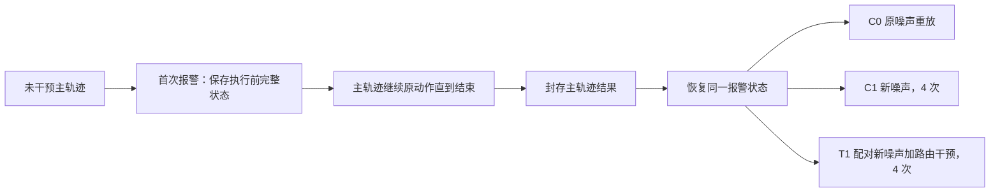

# MoE-Control：报警状态保存、事后分叉与 Pro / Plus 实验方案

执行更新：2026-09-08 已完成四个 suite 的 120 个唯一变体原生/C0 预检，以及 Long 的 12 条 MPS 配对预检。首批正式 Long 120 条已完成，含 39 个报警状态、120 条 C0 和 312 条 C1/T1 后缀，全部通过审计。执行规范、实际结果和更新预算见 [EXPERIMENT_RUN.zh.md](EXPERIMENT_RUN.zh.md)。下文为原设计与初始预算；其中吞吐、AS/C1/T1 接入状态和正式完成状态以执行报告为准。

日期：2026-09-08。状态：实验设计与预算，尚未启动正式 rollout 采集；已完成预加载模型检查、Pro/Plus 环境安装、完整任务资源读取检查及 48 个代表组合的短程模拟器验证，见 [加载报告](benchmarks/README.zh.md)。按此前要求，不采集 hidden 激活。

建议先做 **3,800 条主轨迹的因果初筛**：Pro 1,000 条，Plus 2,800 条；主轨迹正常结束后，从首次报警状态展开配对干预。报警器暂按现有 v7 IntrinsicGuard 冻结，K=4 可作为影子记录。若优先追求 benchmark 覆盖，可改用 **14,030 条主轨迹、每个 benchmark 抽取最多 300 个报警状态展开**的替代方案。

中档假设下，前者约 **13.3 GiB / 20.7 小时**，后者约 **24.3 GiB / 34.9 小时**，时间依赖整个集群达到 **4 query/s**。追加检查已确认允许使用的物理 GPU **0,1,2,3,4,5,7** 上 35 个预加载实例全部就绪，**GPU 6 排除**；但当前共享进程实测仅约 **2 query/s**，对应时间应先改为 **40.6 / 69.4 小时**。真实模拟器与完整 recorder 的吞吐尚待测量。详见 [预加载与七卡压测报告](GPU_PRELOAD_READINESS.zh.md)。

## 1. 实验要回答什么

1. 已有报警点是否存在可恢复的失败，以及干预是否会破坏原本能成功的轨迹。
2. 路由干预是否比单纯重新采样 flow noise 更有效。
3. 效果是否同时存在于 Pro、Plus，以及哪些扰动类型、难度、报警机制上有效。
4. 后续学习 MoE-Control 时，哪些报警状态和路由操作可提供有效监督。

本阶段研究一次报警后的单次干预。重复报警、连续在线控制、学习选择器均属于后续实验，不能由离线分叉结果直接声称已验证。

## 2. 核实过的任务规模

### LIBERO-Pro

固定官方提交 `eafdb809426b13153aa1e4c42d6601844217dfec`。四个基础 suite 各 10 个任务，标准单扰动注册项包括 Object、Position、Semantic、Task、Environment，共 **4 × 10 × 5 = 200 个条目**。这是当前标准注册表规模，不是所有自定义扰动组合的上限。[官方任务表](https://github.com/Zxy-MLlab/LIBERO-PRO/blob/eafdb809426b13153aa1e4c42d6601844217dfec/libero/libero/benchmark/libero_suite_task_map.py)

初筛每条目使用 5 个初始状态、1 个 policy noise seed：`200 × 5 × 1 = 1,000`。覆盖方案使用 10 个初始状态、2 个 seed：`200 × 10 × 2 = 4,000`。这是本实验的采样数，不冒充官方完整评测次数。

安装检查已确认 Pro 的 200 个标准注册条目各有 50 个可读取的初始状态，满足每条目选取 5 / 10 个状态的数量要求。其中 160 个条目使用官方预生成文件，40 个 Environment 条目由固定官方扰动器和 seed 7 本地生成，来源与哈希见加载报告。初始化后的长期物理有效性与快照恢复仍需实验预检。

Pro 的官方预生成及本地生成 BDDL/init 分别记录来源并冻结文件哈希。官方环境替换实现固定选择 `living_room_table`，导致 5 个原 living-room 条目的 BDDL 没有变化，必须单列为原场景对照。若主分析仅计其余 195 条，初筛为 Pro 975 + Plus 2,800 = **3,775** 条，覆盖为 Pro 3,900 + Plus 10,030 = **13,930** 条；原 3,800 / 14,030 条计划与预算仍作为保留原场景对照的上限。采集清单目前保持 planned，不自动把这些安装验证计作正式轨迹。单扰动独立评估；Task 扰动不与其他扰动混合。环境替换存在官方提示的物理异常，需要在预检单列检查。[官方评测说明](https://github.com/Zxy-MLlab/LIBERO-PRO#libero-pro-evaluation)

### LIBERO-Plus

固定官方提交 `4976dc30028e805ff8094b55501d532c48fec182`。实际解析了分类 JSON，并逐条与任务注册表核对名称、索引，**10,030 条全部匹配**；分类文件 ID 从 1 开始，代码任务索引从 0 开始。官方建议 `num_trials_per_task=1`。[官方评测协议](https://github.com/sylvestf/LIBERO-plus#-evaluation)

| Suite | 变体数 | 本方案 horizon，环境步 |
|---|---:|---:|
| Spatial | 2,402 | 220 |
| Object | 2,518 | 280 |
| Goal | 2,591 | 300 |
| Long，即 `libero_10` | 2,519 | 520 |
| 合计 | **10,030** | |

| 扰动类别 | 变体数 | Plus 初筛数 |
|---|---:|---:|
| Background Textures | 1,076 | 400 |
| Robot Initial States | 1,550 | 400 |
| Camera Viewpoints | 1,599 | 400 |
| Language Instructions | 1,537 | 400 |
| Sensor Noise | 1,601 | 400 |
| Objects Layout | 1,525 | 400 |
| Light Conditions | 1,142 | 400 |
| 合计 | **10,030** | **2,800** |

数量来自官方 [task_classification.json](https://github.com/sylvestf/LIBERO-plus/blob/4976dc30028e805ff8094b55501d532c48fec182/libero/libero/benchmark/task_classification.json)。其中难度 1/2/3/4/5 分别为 1,644/2,202/2,094/1,886/2,083，另有 **121 个 Light 条目难度为空**，保留为 unknown，不删除。所有变体均能唯一映射回 40 个原始任务。

初筛按 `suite × category` 每格抽 100 条，共 28 格。格内尽量每个原始任务 10 条，再按难度分层、固定哈希顺序无放回抽样。实际有 9 个 `base_task × category` 格不足 10 条，已在同 suite/category 内重新分配名额；没有重复补样。最终包含 38 个 unknown 难度条目。清单记录了各抽样层纳入概率，用于恢复总体加权估计。

Plus 的 horizon 暂沿用四个基础 suite 的 220/280/300/520 步，并要求预检与官方模型适配器核对；这不是从分类 JSON 读出的字段。Pro 的这些步数在官方示例中有明确映射。稳定使用 `task_order_index=0` 和任务名称核对，不能依赖随机任务排序。

## 3. 主轨迹和事后分叉



定义 `q` 为从 0 开始的策略推理编号，一次推理通常产生 10 个动作。`s` 是报警 query 之前已经执行的环境步数。报警用当前推理返回的路由计算，**在执行该 query 的动作前触发**。

1. 每个 query 推理前，暂存当前环境、观测、随机数和控制器状态，仅保留这一份临时快照。
2. 用原策略完成本次推理，得到动作和路由，更新 v7。首次 `alarm=false -> true` 时，持久化该 query 的推理前快照和报警证据。
3. 主轨迹照常执行原动作与原噪声序列，成功或达到原 horizon 后结束；不可根据报警改变动作、重置随机数或延长时限。
4. 主轨迹的终止记录和分块数据写入完成后，才允许启动其分支。
5. 所有分支恢复同一快照，从报警 query 重新推理。共享主轨迹前缀 `[0,q)`，分支后缀从 `q` 开始。原主轨迹的 query `q` 路由另作报警证据引用。
6. 分支剩余预算一律是 `H - s` 个环境步，成功则提前结束；不使用 `H` 重新计时，也不被主轨迹实际结束时刻截短。

这样既保留了未经干预的真实结局，又能比较同一报警状态下的不同操作。报警曾消耗的一次原推理，以及触发后重新推理的额外调用，均要计入计算成本。

v7 的报警标志是锁存状态。首次报警后的每个 query 都显示报警，并不代表新的独立报警事件。因此主实验每条轨迹只展开 **首次报警**；仍记录全部分数与机制变化。若以后扩展为最多 3 个事件，需另设事件去重规则，并按事件数增加预算。

### 必须保存的恢复信息

| 部分 | 内容 |
|---|---|
| 模拟器 | float64 的 sim state、控制器目标、插值器状态、环境时钟/计步/终止标记、solver warm-start |
| 扰动环境 | BDDL/XML/资源哈希、相机/光照/物体配置、传感器噪声 wrapper 的内部状态与 RNG |
| 策略输入 | 两路实际输入图像、proprio、有效指令、预处理配置；共享静态内容用哈希引用 |
| 随机性 | Python/NumPy/Torch CPU/CUDA 和环境 RNG；实际 flow noise 或可验证的固定调度 |
| 控制过程 | 已执行步数、剩余动作队列、推理编号、动作归一化配置、策略的任何持久推理状态 |
| 报警器 | 推理前 monitor 状态、原 query 的路由证据、分数、阈值、首次触发机制与版本哈希 |

可复用 [branch_snapshot.py](../himoe-route-capture/branch_snapshot.py)，其已覆盖控制器、插值器和 warm-start；Pro/Plus wrapper、随机数、策略与报警器状态需要补齐。现有 Hub 中 float32 `sim_state` 适合分析，但不足以作为精确分叉状态。恢复后不能再次执行初始化用的 settle/no-op 步，否则起点已改变。

传感器噪声恢复尤其需要检查：恢复过程中若重新取观测，应避免额外消耗噪声 RNG。首次分支输入直接使用保存的实际观测，并让后续 wrapper RNG 从相同位置继续。主轨迹成功后环境内部可能置 `done`，分支恢复必须覆盖该标志。

## 4. 报警器和干预组

默认使用 [IntrinsicGuardMonitor](../moe-v7-0905/method/intrinsic_guard_monitor.py) 及原 profile，阈值和状态机一起冻结。profile SHA-256 为 `a92c9d1103487ddf62e4b369c7f23b6637127730dffa8780f54423cf580e3054`。不在 Pro/Plus 上重新调阈值，不用未来成功/失败选择是否报警。

v7 输入仍需 HB 全概率 `[8,10,11,32]`，不能改为只有 top-4；这里的概率不是 hidden。K=4 规则如需比较，只做独立影子日志，后续比较需从双方报警状态的并集按同一规则取样。

| 组 | 每状态后缀数 | 操作 | 用途 |
|---|---:|---|---|
| C0：原噪声重放 | 1 | 无路由干预，使用主轨迹原后续噪声 | 检查状态恢复与主轨迹结局一致 |
| C1：噪声重采样 | 4 | 无路由干预，4 条预先固定的新噪声流 | 衡量重新采样本身的收益 |
| T1：噪声加路由干预 | 4 | 对应 C1 的同一噪声流，加一次 `swap1_near` | 测量路由干预的增量收益 |

每个报警状态共 **9 条分支后缀**，不是 9 条独立主轨迹。C1 和 T1 的第 r 次严格配对；环境噪声也配对。噪声种子以稳定的 `main_id / event_id / replicate / query` 派生，不能使用 Python 随机化的 `hash()`，也不让某组多一次随机调用影响其他组。

T1 的初始固定操作：只在首次分支推理的 HB 12/13/14/15 层、动作 token 1..10、全部 10 次 denoise 中，将实际原生 top-4 里概率最小的专家替换成最高概率的未选专家；并列按专家 ID 决定。**保留原返回槽位的 combine weight**，之后完全恢复原路由。保留 4 个不同专家。该定义与现有 `probe_expert_swap.py` 的近邻单专家替换思路一致，但不采集它的 hidden/MoE 输出。

必须同时记录每个 gate 在该分支输入下的原生概率、原生 IDs、执行 IDs 和 **实际返回的 combine weights**。下游 gate 的“原生概率”已经可能受上游干预影响，不应称为未干预主轨迹的反事实概率。旧 recorder 忽略实际返回权重后重新 gather 原生概率的做法不能用于本实验，详见 [数据审计](HUB_AUDIT_20260908.md)。

不把“new noise”和“resample 同一 chunk”设为两个重复组，也不在这一步加入人工 backoff。干预范围与时长先冻结，不能看完整测试结果后挑最好的层/token 配置再称为主结果。

## 5. 按主轨迹分 chunk 保存

区分两个概念：**动作 chunk = 一次推理最多执行 10 个环境步**；**存储 block = 8 次推理**。按主轨迹组织存储，每个分支只保存自己的后缀，前缀通过 ID 引用。

```text
run/
  run_manifest.json
  mains/<main_id>/
    episode.json
    blocks/000000...              # 8 queries/block，末块允许不足 8
    alarms/<event_id>/snapshot.npz + snapshot.json
    branches/<arm>/<replicate>/
      branch.json                # parent_main_id, parent_query, event_id
      blocks/000000...           # 仅分支实际执行的后缀
```

每个 query 保留 HB/AS 路由概率、原生与执行 IDs、实际合并权重、报警分数、state、sim state、预测动作、实际执行动作数量和 flow noise。最后一个动作 chunk 可能不足 10 步，必须有 `executed_action_count` / 有效掩码；不能把未执行的预测动作标成环境轨迹。图像默认只在报警快照保留；不保存全程 RGB/视频，不采 hidden。

建议沿用现有 Zarr 压缩方式，或同等的数值分块格式；快照用现有无 pickle 的 JSON + NPZ codec。每个 worker 最多缓存 2 个 block，报警快照写入后释放。按 80 KiB/query 估算，8-query 原始数据块约 640 KiB，双缓冲约 1.25 MiB；这是记录数据部分，不包含模型和模拟器内存。

分 chunk 降低的是缓存峰值。总磁盘的主要节省来自**分支不复制主轨迹前缀**、不采 hidden 和不存全程图像。它不会自动减少模型常驻显存，也不替代可用 GPU 资源的调度。

每个 block 先临时写入、校验后原子提交，并在 manifest 登记行数、query 范围和 SHA-256。主轨迹成功提交后标记 `main_complete`，所有计划分支结束后才标记 `complete`。断点续采按稳定 ID 去重；失败/缺失分支保留 `pending/error`，不当作成功或普通任务失败。不同 worker 不并发追加同一 Zarr。

服务器以 `main_id / branch_id / query / request_id` 隔离记录；同一 recorder 的 begin/infer/end 必须在同一请求锁内，或采用独立请求上下文，避免并发请求把路由串到别的 episode。

## 6. 采样和实验阶段

### P0：兼容性、恢复和吞吐预检

使用 96 条独立 pilot 主轨迹：Pro 的 `4 suite × 5 扰动` 每格 2 条，Plus 的 `4 suite × 7 扰动` 每格 2 条。pilot 使用独立种子，不计入效果表。在至多 3 个可到达的预定边界做 C0 恢复验证，额外强制检查接触、已关闭环境和带传感器噪声的情况；边界不可达要计数，不能假定所有 288 个点都采到。

在新环境实例中，从主轨迹结束前保存的状态恢复，验证首帧输入哈希、动作、路由、连续 sim state 和最终 success。验收优先采用原噪声逐项一致；如浮点实现不能逐位一致，应在 pilot 冻结误差容限，报告最大误差及轨迹分歧，不能仅凭结局相同通过。凡恢复不可靠的配置，在修复后重跑 pilot，再进入配对因果分析。

预检需实测 1/2/4 个客户端每 GPU 的吞吐与内存，选择实际效率最高的并发度；模型服务器、EGL 渲染与模拟器成本都包含。记录 main / suffix 平均及 P95 query 数、压缩后实际磁盘字节、快照大小、报警率、恢复耗时。表中全部预算用这些数据更新。P0 可先预留 1 GiB 数据和 2 小时可用集群时间，超出则据实追加，不能视为已经完成的测量。

### P1：建议优先的因果初筛

| Benchmark | 主轨迹 | 假设 30% 报警时状态数 | 9 后缀/状态 | 预计数据 | 预计时间 |
|---|---:|---:|---:|---:|---:|
| Pro | 1,000 | 300 | 2,700 | 3.50 GiB | 5.45 h |
| Plus | 2,800 | 840 | 7,560 | 9.80 GiB | 15.25 h |
| 合计 | **3,800** | **1,140** | **10,260** | **13.30 GiB** | **20.70 h** |

对每条主轨迹首次报警都展开，不按最终成败筛选。无报警也保留完整主轨迹与结果，以估计真实报警覆盖率和总体净收益。Plus 初筛是分层样本，不是完整 10,030 变体官方分数；同时报告加权总体估计与类别均值。

### 覆盖优先的替代方案

主轨迹扩大到 Pro 4,000 + Plus 10,030 = **14,030**。全部报警状态保存，但每 benchmark 分层无放回抽最多 300 个状态进行完整 C0/C1/T1，最多 **600 状态、5,400 条后缀**。

先在主轨迹结束后持久化待分叉队列；按整批 `suite × perturbation` 的实际报警数分层抽样，记录各层 `p = selected / eligible`，层内用冻结随机种子抽取，不看主轨迹结局。每层至少保留可行的最低名额，其余按报警数比例分配；不足 300 则全部展开。批次尚未完成时可保留 ready 状态，不能简单取时间上最先出现的 300 个报警。

| Benchmark | 主轨迹 | 展开状态上限 | 后缀上限 | 30% 报警下数据 | 时间 |
|---|---:|---:|---:|---:|---:|
| Pro | 4,000 | 300 | 2,700 | 7.81 GiB | 11.44 h |
| Plus | 10,030 | 300 | 2,700 | 16.47 GiB | 23.48 h |
| 合计 | **14,030** | **600** | **5,400** | **24.28 GiB** | **34.91 h** |

这是与 P1“全部报警都展开”不同的分支预算，须在开始前选定。主轨迹清单中 P1 是覆盖清单的子集，可以复用；但若 P1 已执行了超过 600 个报警状态的分支，不能事后按这个 24.28 GiB 总预算计数。已有分支、pilot 和其他实验占用均须累计。

若 14,030 条主轨迹全部展开报警分支，30% 报警下是 **37,881 条后缀、约 49.09 GiB / 76.41 h**，当前本地数据配额无法容纳。需要新增存储、分批转存，或减少实验规模。

## 7. 最多能采多少：可复算预算

### 本地证据

只读统计现有两批 32,000 条 LIBERO 主轨迹：508,023 次推理、路由文件 21,119,738,493 bytes，平均 **40.60 KiB/query**；全部逻辑文件平均 0.639 MiB/episode；文件系统实际分配 20.61 GiB。历史平均主轨迹 15.88 query，客户端计时相加后平均 36.81 秒/episode，约 2.318 秒/query，**这不等于集群整体吞吐**。[测量记录](design/local_evidence.json)

本次增加实际 combine weights、原生路由标记和恢复信息，因此取 **48 KiB/query 压缩规划值**，另给 **80 KiB/query 未压缩规划值**。它们都是待 pilot 验证的单价，不是字节数硬上限。新 OOD 轨迹可能更长，不能直接用历史 0.639 MiB/episode 乘以条数。

安装前磁盘可用约 50.8 GiB。现已完成安装：Plus 官方 `assets.zip` 为 6.4 GB，解压逻辑大小 8.34 GiB；两个 benchmark 连同代码和额外依赖实际占约 10.31 GiB，工作盘剩约 40 GiB。下载压缩包位于独立 `/tmp` 文件系统。[官方资源目录](https://huggingface.co/datasets/Sylvest/LIBERO-plus/tree/main)

暂取数据配额 `B=25 GiB`，实际必须用 `min(25 GiB, 资源安装后剩余空间 - 5 GiB)`；其他作业的增长还要扣除。预算不包含基准资产、环境安装、全程视频、hidden、pilot 和后续消融。接近配额时停止派发新主轨迹，先为已开始的主轨迹及已承诺分支保留空间，不能通过删除失败轨迹来腾空间。

### 公式与假设

设 N 为主轨迹数，a 为首次报警比例，M 为真正展开的报警状态数，K=4 个配对新噪声，b=1+2K=9 条后缀。默认主轨迹均值 Qm=25，后缀均值 Qb=15，快照 S=512 KiB，元数据每主轨迹 16 KiB、每后缀 8 KiB。

```text
M = a*N                         # 全部报警展开
M <= min(a*N, 600)              # 两个 benchmark 各限 300，须分别满足名额
queries = N*Qm + M*b*Qb
storage = 1.10 * (queries*bytes_per_query + a*N*S + N*16KiB + M*b*8KiB)
time_seconds = 1.15 * (queries/R + M*b*restore_seconds/restore_workers)
N_max = min(floor(B / 每主轨迹平均存储), floor(T / 每主轨迹平均时间))
```

时间默认整集群 R=4 query/s、恢复每分支 2 秒、8 个恢复 worker；恢复与推理相加作保守估算，另加 15% 调度余量。正式应按 Pro/Plus、suite 分别测量 `a, Qm, Qb, R` 后再相加；下面使用统一参数作规划情景。

| 报警比例 | 25 GiB 的主轨迹容量，48 KiB/query | 同配额，80 KiB/query | 24 h / 4 query/s 的计算容量 | 压缩情景同时满足空间和时间 |
|---|---:|---:|---:|---:|
| 0%，仅作无报警边界 | 19,598 | 11,821 | 12,020 | 12,020 |
| 10% | 12,396 | 7,554 | 7,627 | **7,627** |
| 30% | 7,145 | 4,387 | 4,406 | **4,406** |
| 60% | 4,369 | 2,693 | 2,697 | **2,697** |
| 100% | 2,878 | 1,778 | 1,778 | **1,778** |

因此“最多多少条”必须带报警率、后缀数、轨迹长度和可用时间条件。**中档假设下，25 GiB 可容纳约 7,145 条完整分叉的主轨迹；若还限定 24 小时和 4 query/s，则约 4,406 条。**后缀数和 query 数另算，不能充当独立主轨迹数。

P1 在 10%/30%/60% 报警下分别约 7.66/13.30/21.74 GiB，11.96/20.70/33.81 小时。若实际吞吐只有 2 query/s，推理部分耗时约翻倍；达到 8 query/s 则约减半。GPU 数和客户端数不能直接按线性比例换算成吞吐。

长轨迹压力检查：覆盖清单所有主轨迹都跑满上述 horizon 时，Pro 132,000 query、Plus 332,066 query，合计 **464,066 query**；再加 600 个状态的分支，即使 Qb 仍取 15，已约 **29.99 GiB / 43.96 h**，超过 25 GiB。极端代价模型取每条主/分支都 52 query、100% 报警、80 KiB/query，25 GiB 只够约 564 条主轨迹；这是偏保守的成本包络，不是预计产量。

## 8. 指标和统计口径

每个展开状态 i、配对种子 r，记原主轨迹结局 `Ymain_i`，C1/T1 结局分别为 `Ynoise_ir / Yroute_ir`。先对同状态的 4 个种子取平均，再聚合轨迹。不要把 4 个种子或几十个 chunk 当成独立任务。

| 指标 | 定义/解释 |
|---|---|
| 原成功率、报警率 | 所有主轨迹为分母，按 benchmark/suite/category 分层 |
| 路由增量收益 | 配对的 `mean(Yroute - Ynoise)`，隔离单纯换噪声的贡献 |
| 失败救回率 | 原主轨迹失败的报警状态中，分支成功的平均比例 |
| 成功破坏率 | 原主轨迹成功的报警状态中，分支失败的平均比例 |
| 全体净成功率变化 | `sum_i A_i * (mean_r Yroute_ir - Ymain_i) / N`；无报警贡献为 0 |
| 报警时机 | query、已执行环境步、剩余步数；horizon 信息仅作事后评价，不输入报警器 |
| 代价 | 新增推理数、环境步、总 wall time、成功一次的计算成本 |
| 恢复完整性 | C0 首动作、路由、轨迹、最终结局一致率及无效样本数 |

抽样展开分支时，每个被选状态按其 `1/p_i` 校正；Plus 初筛还要考虑变体分层纳入概率。分层缺失或恢复失败应单列，给出有效覆盖率和必要的敏感性分析，不应静默缩小分母。先抽样、后看结局；成功轨迹上的报警同样展开，才能测到伤害。

95% 区间按原始任务聚类 bootstrap，保留同一任务的变体、主轨迹和全部配对种子；报告 benchmark 内整体、7/5 类宏平均及 micro 平均。Pro/Plus 共享 40 个原始任务，跨 benchmark 汇总时也保留这种聚类。预先指定主比较 T1-C1，探索性子组结果单列。

300 个报警状态/benchmark 是初筛规模，不能保证检出 5 个百分点增益。例如在独立配对、结局不一致率约 30%、双侧 5% 显著性和 80% power 的近似下，5 pp 效应需要约 941 个有效独立状态，任务相关性还会提高需求；实际用 pilot 的配对方差做功效重估。

若 T1-C1 与全体净收益的区间下界均为正，可进入该操作的在线验证；若只有 C1 有收益，则证据支持噪声重采样；若区间覆盖零，则报告证据不足并按预先规定的开发集实验继续。某个路由操作没有救回效果，不足以推出报警器或所有 MoE-Control 操作都无效。

`best-of-4` 只能作为知道未来结局的离线上界，不能当作可部署策略成功率。主结果用平均单次分支收益；若学习在线分支选择器，必须在没有未来结局的条件下另测。

## 9. 后续 MoE-Control 实验

1. **干预位置消融**：前层 state token、后层 action token、最后一次 denoise、1 vs 2 query 干预。一次只改一个因素，使用开发集选择；每增加一个 4-seed 组，代价增加 `4 × 展开状态数 × 平均后缀 query`。
2. **报警时机对照**：在新采样主轨迹上预先指定随机 query 候选，保存无报警边界状态；按 task 与时间区间匹配，比较同样操作在报警/非报警位置的净收益。早结束而候选不可达的情况计为删失，不事后挑更有利的点。可先做每 benchmark 100 个有效对照点，额外约 27,000 后缀 query，预算单列。
3. **短 chunk 重规划对照**：首次 10 个环境步每次只执行 2 个动作，再回到 10。它增加推理次数，应同时报告固定环境步和计算代价，不能与只重采样一个 chunk 混为一组。
4. **学习控制器**：清单已按原始任务分成 5 个固定 fold，每 fold 8 个任务，Pro/Plus 同源任务使用同一 fold。可用 3 fold 训练、1 fold 验证、1 fold 最终测试，所有分支随 parent 进入同一 split。开发集之外不得用真实未来结局选动作。学习后重新采集未使用 seed 的在线测试主轨迹，验证单次及重复触发策略。

固定、未调参的当前干预规则可报告全清单效果；一旦用这些结果训练或选择控制规则，相关样本转为开发数据，不能继续冒充最终独立测试集。

## 10. 开始采集前的实现清单

- 复用 [delayed_fork_collect_v2.py](../trap-recovery-depth-20260904/code/delayed_fork_collect_v2.py) 的延迟分叉流程，替换其旧报警器；关闭按最终失败筛选和额外延长时限的选项。原代码逐 query 保存 `rewind` 全历史的逻辑改为单份临时快照与首次报警持久快照。
- 为 Pro/Plus 使用独立环境和配置目录，避免修改其他正在运行作业的 LIBERO 安装；验证有效指令、目标条件和资源加载，不复用 Hub 原任务 prompt 替代扰动后的指令。
- 核对 suite 对应的 HiMoE checkpoint、动作归一化、观测 key、图像预处理、gripper 语义；模型、配置、BDDL/init/资产和报警 profile 均记录版本哈希。
- 扩展快照保存与恢复；适配 sensor-noise 等 wrapper；先通过 C0，再启动效果比较。保留原/新噪声的配对和原 horizon。
- 修正干预后的 recorder，保存实际 gate 返回权重；验证 no-op hook 不改动作，T1 只改变指定层/token/时间范围且确有替换。
- 校验 `main_id/branch_id/query` 唯一性、连续性、shape/dtype、有限值、概率归一、top-k 合法性、动作执行掩码、文件校验和、快照哈希与终止状态；不能以“有文件”代替完成。
- 更新实际存储和吞吐预算，再由持久任务清单启动采集。预加载模型、Pro/Plus 资源与代表组合运行检查已完成；采集器的上述改造、完整恢复与控制 rollout 实验尚未执行。安装验证不替代 P0 的因果恢复和完整 recorder 吞吐测试。

## 11. 本次输出与复算

| 文件 | 用途 |
|---|---|
| [experiment_config.json](design/experiment_config.json) | 冻结报警、主/分支时序、干预操作、存储与采样定义；设计配置，尚非采集器可执行配置 |
| [collection_manifest.csv](design/collection_manifest.csv) | 14,030 条计划主轨迹；`screen=1` 的 3,800 条为首轮，含任务/初始状态/seed/fold/采样概率 |
| [benchmark_inventory.json](design/benchmark_inventory.json) | 200 + 10,030 个官方条目、固定提交、源文件哈希、名称和索引核验结果 |
| [sampling_counts.json](design/sampling_counts.json) | suite/category/difficulty 数量、分层抽样统计与 horizon query 合计 |
| [budget_results.json](design/budget_results.json) / [capacity.csv](design/capacity.csv) | 各报警比例、存储和时间情景的计算结果 |
| [local_evidence.json](design/local_evidence.json) | 历史数据大小、耗时统计、设备占用、冻结 profile 与快照代码哈希 |
| [moe_control_plan.py](moe_control_plan.py) | 离线生成采样清单与重算预算，不加载策略或模拟器 |
| [GPU_PRELOAD_READINESS.zh.md](GPU_PRELOAD_READINESS.zh.md) | 最新模型就绪、GPU 6 排除、七卡扩展性瓶颈与当前吞吐预算 |

```bash
python moe_control_plan.py
python moe_control_plan.py --data-gib 20 --hours 48 --qps 2 --out-dir /tmp/moe-control-budget-20g
python moe_control_plan.py --main-queries 33 --branch-queries 24 --out-dir /tmp/moe-control-budget-long
```

预算脚本已运行，官方条目与索引一致性、抽样总数、主轨迹唯一性及分层配额检查通过。所有清单行仍为 `planned_pending_preflight`，没有将尚未执行的 rollout 标记为完成。
