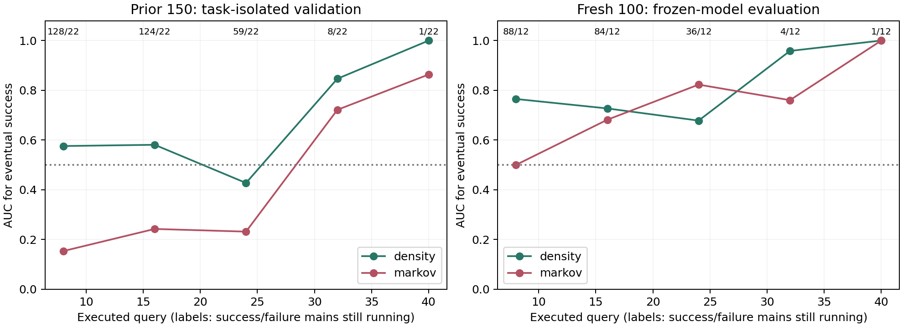
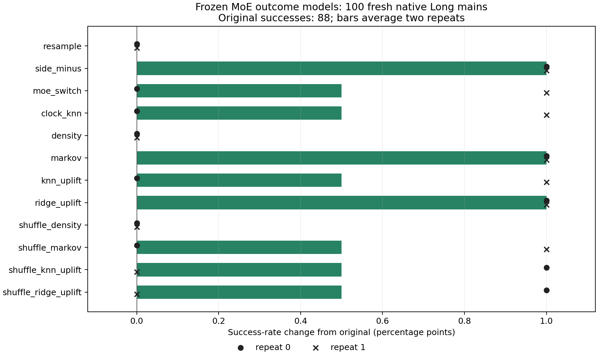
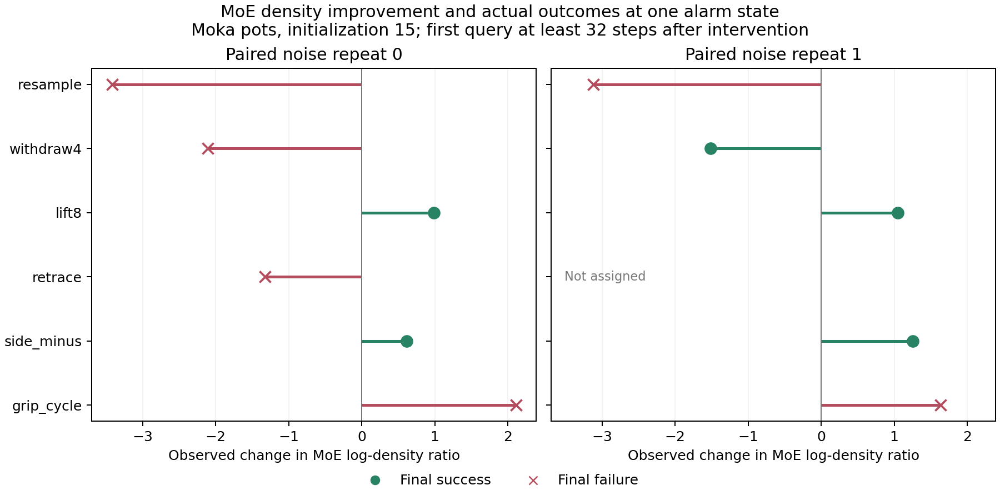

# MoE 成功与失败特征建模及原生 Long 在线实验

本轮已完成四种模型拟合、逐任务留一验证、100 条全新原生 Long 主轨迹、225 条在线后缀及全部动作的独立物理复执行。新队列原始成功率为 88/100；Markov、线性干预收益和固定侧绕在两个重复中均达到 89/100。各方法救回的是同一条新失败轨迹，没有发现额外的独立恢复案例。当前结果支持某些物理恢复动作有效，尚不能确认 MoE 自适应分配优于固定侧绕。

最直接的反例是：密度模型选择夹爪开合后，内部状态确实更接近成功样本，但两次都失败。同一报警状态下，抬升和侧绕两次都成功。因此，优化成功样本的内部相似度还不足以保证恢复任务。

## 1. 实验对象与冻结规则

- 仅原生 LIBERO Long，注册名 `libero_10`，10 个任务；没有在 Pro 或 Plus 上运行本轮实验。
- 原生 LIBERO commit：`8f1084e3132a39270c3a13ebe37270a43ece2a01`。
- 开发数据：旧 150 条主轨迹，128 成功、22 失败，初始化编号 0..14；其中 21 个可干预报警状态具有旧控制器库的配对结果。旧 50 条验证轨迹已纳入本轮开发集，不能继续作为本轮独立测试。
- 新验证：每个任务官方初始化 15..24，共 100 条，88 成功、12 失败。任务本身与开发集相同，初始化不同；这不是新任务泛化验证。
- 在采集新结果前冻结模型、特征、参数、算子和对照规则。没有根据新结果重新拟合模型或报警阈值。
- 沿用原 v8.2 报警；先完成原始无干预主轨迹及完整 C0，再恢复首次报警后下一查询的状态。总预算仍为 520 个环境步，恢复动作也占用该预算，成功立即停止。
- 每种策略两个配对噪声重复，分别报告，不取两次中的最好结果。不同策略若选择相同算子、同一父状态及重复，完整执行轨迹完全一致。
- 选择器使用截至当前的 MoE 路由及已执行步数，不输入任务 ID、物体真值、未来状态或结局。物理控制器使用当前及过去末端本体感知。
- 不采集 hidden activation，不训练策略网络，不改 checkpoint 或归一化。四个选择器使用旧结局标签拟合，因此并非完全 training-free；运行设置中继承的 `training=false` 不应解读为选择器未拟合，另有明确的 `selector_fitting=true`。

理论和公式见 [建模方案](MOE_OUTCOME_MODELS_THEORY.zh.md)。在线模型 SHA256 为 `55b9514e127fa18408a0659dbf3243f56c494c481be59ace90c872aea54fb099`。

## 2. 四种模型如何选动作

共同输入为 77 维因果特征：F/A/P/I/C 五个归一化风险分量、相邻变化、四查询均值、有效性指示、八层路由熵、去噪过程内变化、相邻查询变化、32 个专家的聚合软概率和时间进度。F/A/P/I/C 分别表示路由冻结、加速度、周期性、前后段倒置和曲率，均为内部信号名称，不是已确认的物理失败类别。

在每个训练折内重新拟合标准化和八维 PCA；每条父轨迹的窗口总权重为一，不按 chunk 随机拆分训练/验证集。选择器从旧库的 13 个固定算子中选择，包括重新采样、短 chunk、动作缩放/平滑、抬升、回撤、侧绕和夹爪动作。

| 模型 | 学习对象 | 在线选择准则 |
|---|---|---|
| 成功/失败密度 `density` | 成功与失败的收缩高斯密度，加上每个算子的局部仿射响应 | 预测干预后更接近成功分布的算子 |
| 吸收 Markov `markov` | 八个 MoE 聚类状态、到成功/失败的转移、算子条件转移 | 最大化预测的成功吸收势 |
| kNN 收益 `knn_uplift` | 近邻报警状态中，各算子相对重新采样的配对成功增益 | 五个近邻加权增益最大者 |
| 线性收益 `ridge_uplift` | MoE 状态到各算子配对成功增益的岭回归 | 预测增益最大者 |

增益不超过冻结的最小值时回退到重新采样。入口额外一次原噪声探针只用于选择，不执行、不推进历史；随后选一个控制器并执行完整后缀。本轮没有在线候选 rollout 搜索，没有逐查询重新挑选控制器，也没有实现“反复筛选直到全部候选低于阈值”的收敛过程。

密度差不等于任务价值函数；Markov 吸收势没有校准为真实成功概率。这里的建模并未建立 Lyapunov 稳定性或恢复成功保证。

## 3. 成功与失败的内部特征

### 同一查询位置的比较

数值为本轮新队列的均值；F/A 为相对固定阈值及 margin 的归一化数值。查询从 0 开始。固定查询之后，只比较仍在执行的主轨迹，因此同时给出样本数。

| 查询与特征 | 最终成功 | 最终失败 | 说明 |
|---|---:|---:|---|
| q8，F，88 成功/12 失败 | -5.474 | -4.231 | 失败组冻结分量更接近报警阈值 |
| q16，A，84 成功/12 失败 | -7.477 | -5.198 | 失败组加速度风险更高；旧集同方向 |
| q16，F | -5.514 | -5.357 | 此阶段 F 单独区分很弱 |
| q24，相邻查询 Hellinger 变化，36 成功/12 失败 | 0.04317 | 0.03580 | 成功组路由变化更强 |
| q32，相邻查询 Hellinger 变化，4 成功/12 失败 | 0.03155 | 0.03340 | 方向反转且成功样本很少，不能统一最大化这个量 |

按同时含成功/失败的任务分别求差，再对任务等权平均，q16 的 A 差为 -2.750，旧集为 -1.925，方向一致；但 q16 的路由变化差在新集反转为 -0.00246。说明全局均值混有任务构成和阶段差异，不能简单把“更多切换专家”当作恢复指令。完整的分任务差值已写入分析 JSON。

软概率平均熵接近归一化 1，聚合软分布的逆集中度约 31.98/32。这不等于实际 top-k 执行负载均匀，也不支持“失败就是所有专家塌缩到少数几个”的结论。选择特征只使用 HB 聚合量；AS 虽有采集但没有输入本轮选择器。

### 成功/失败预测与提前识别的区别

| 固定查询 | 旧集成功/失败数 | 旧集留任务 density AUC | 新集成功/失败数 | 新集 density AUC | 新集 Markov AUC |
|---|---|---:|---|---:|---:|
| 8 | 128/22 | 0.576 | 88/12 | 0.765 | 0.500 |
| 16 | 124/22 | 0.581 | 84/12 | 0.727 | 0.682 |
| 24 | 59/22 | 0.428 | 36/12 | 0.678 | 0.823 |
| 32 | 8/22 | 0.847 | 4/12 | 0.958 | 0.760 |
| 40 | 1/22 | 1.000 | 1/12 | 1.000 | 1.000 |

末尾三个查询的平均密度势 AUC，旧集为 0.981，新集为 0.991，但这是事后诊断。成功轨迹常较早结束，失败轨迹常执行到预算上限；末尾分布差异包含时长影响，不能当作提前报警精度。q40 两组各只剩一条最终成功轨迹，AUC=1 证据很弱。旧集逐任务留一结果与新集同任务新初始化结果也不代表相同的泛化难度。



## 4. 报警与在线结果

全 100 条主轨迹中，v8.2 曾报警 10 条：8 条最终失败、2 条最终成功；另有 4 条失败未报警。按主轨迹最终结局定义，precision=8/10=80%，recall=8/12=66.7%，FPR=2/88=2.27%。

其中一条成功轨迹在报警当个 chunk 就完成任务，没有下一查询可供干预。因此实际分叉为 9 条：8 条原始失败和 1 条原始成功。不能把这 9 条可分叉样本的 8/9 精度代替上述完整报警统计。

12 种策略各做两个重复，加原样后缀，共 `9 * (12 * 2 + 1) = 225` 条完整后缀；另复做 9 条全长 C0。以下成功数以完整 100 条主轨迹为分母，未触发干预者保留原始结局。

| 策略 | r0 成功数 | r1 成功数 | 救回数 r0/r1 | 损害数 r0/r1 |
|---|---:|---:|---|---|
| 原始执行 | 88 | 88 | 0/0 | 0/0 |
| 重新采样 `resample` | 88 | 88 | 0/0 | 0/0 |
| 固定侧绕 `side_minus` | 89 | 89 | 1/1 | 0/0 |
| 旧规则选择 `moe_switch` | 88 | 89 | 0/1 | 0/0 |
| 仅时间近邻 `clock_knn` | 88 | 89 | 0/1 | 0/0 |
| 成功/失败密度 | 88 | 88 | 0/0 | 0/0 |
| 吸收 Markov | 89 | 89 | 1/1 | 0/0 |
| kNN 干预收益 | 88 | 89 | 0/1 | 0/0 |
| 线性干预收益 | 89 | 89 | 1/1 | 0/0 |
| 密度选择的置换对照 | 88 | 88 | 0/0 | 0/0 |
| Markov 选择的置换对照 | 88 | 89 | 0/1 | 0/0 |
| kNN 选择的置换对照 | 89 | 88 | 1/0 | 0/0 |
| 线性选择的置换对照 | 89 | 88 | 1/0 | 0/0 |

置换对照在不看结局的情况下，打乱状态与所选算子的对应关系；每个重复的算子频数与对应模型完全相同。它检验状态分配是否有帮助，不是随机噪声候选选择，也不是随机报警时机实验。本轮没有改变报警器或比较触发时机。

Markov 和线性模型各仅比自身置换对照多一个成功分支，且来自同一个父状态；kNN 与自身置换对照平均相同，且与仅时间近邻的最终成功数相同。固定侧绕达到同样的 89/100。因此尚不能声称学到有效且可泛化的 MoE 模式到干预映射。

本轮没有破坏原本成功的轨迹，但真正接受干预的原始成功父轨迹只有一条；两个重复及多种算子不能增加独立父样本数。该结果不足以支持低误干预风险的结论。



旧 21 个报警状态的逐任务留一验证也未给出稳定增益。相对配对 resample，每次重复的胜/负分别为：density 1/2，Markov 0/1，kNN 0/1，线性收益 1/1，时间近邻 0/0。没有将这个不利结果隐藏或用新队列重新调参。

## 5. 实际恢复案例与代理目标反例

新案例：`602e14176414500f1f6f91d9`，原生 Long 的两个摩卡壶上灶任务，初始化 15。v8.2 在 q33 报警，q34 前、已执行 340 步处分叉；入口模式 F，其归一化 F/A/P/I/C 为 `[1.193, -5.197, -10.000, -3.316, -1.663]`。

原始执行及两次重新采样都在 520 步失败。实际算子效果如下，表中步数含原有 340 步前缀。

| 实际执行的算子 | 选择它的方法示例 | r0 | r1 |
|---|---|---|---|
| 上抬目标 4 cm、侧绕目标 4 cm、返回抬升点，共最多 24 步 | 固定侧绕、线性收益 | 480 步成功 | 494 步成功 |
| 上抬目标 8 cm，共最多 24 步 | Markov | 505 步成功 | 490 步成功 |
| 上抬目标 4 cm 后向近期末端位置回撤，共最多 16 步 | kNN、时间近邻、旧 F 规则 | 520 步失败 | 477 步成功 |
| 夹爪先反向 8 步、再原方向 8 步 | 密度模型 | 520 步失败 | 520 步失败 |

上述距离为控制目标，不声称机械臂恰好位移该距离。每步根据实际末端反馈计算有界命令，平移命令上限 1 cm，保存真实物理状态及目标跟踪误差。

同一个父状态中，干预后至少 32 个环境步的首个策略查询，观察到如下密度势变化 `V(after)-V(entry)`：

| 实际算子 | 观测密度变化 r0/r1 | 最终结局 r0/r1 |
|---|---|---|
| 重新采样 | -3.420 / -3.120 | 失败 / 失败 |
| 侧绕 | +0.615 / +1.258 | 成功 / 成功 |
| 抬升 | +0.990 / +1.048 | 成功 / 成功 |
| 回撤 | -2.111 / -1.515 | 失败 / 成功 |
| 夹爪开合 | +2.116 / +1.637 | 失败 / 失败 |

侧绕/抬升的观测点在干预后 34 步，回撤/开合为 36 步，重新采样为 40 步，均遵循预先规定的首个至少 32 步查询。此处不是严格相同时刻的瞬时比较。

夹爪开合的内部成功相似度提升更大，却没有完成任务；回撤的一个重复在相似度仍下降时最终成功。这个反例针对本轮拟合的密度势，不能自动推广为所有 MoE 信号均无用，也不能直接替代对原 v8.2 标量阈值的验证。



全部方法产生的 12 个救回分支，去重后仅一条原始失败轨迹；其中许多分支使用同一实际算子且执行完全相同，不能视为独立证据。其余 7 条可干预失败父轨迹没有被本轮分配到的算子救回。这不等于已穷举每个状态下全部 13 个算子。另有 4 条失败未触发干预。

## 6. 动态建模的薄弱环节

按父状态、算子和重复去重，得到 95 个有效的干预后响应点，来自 8 个父状态；提前结束而没有达到响应查询的分支不参与连续响应评估。学习的仿射响应模型平均潜变量 RMSE=0.619，直接预测状态不变的基线为 0.602；按父状态先平均再等权汇总，分别为 0.624 和 0.609。响应模型尚未优于这个简单基线。

79 个与 resample 都有响应点的算子配对中，67 个提升了观测密度势却没有提高最终成功结局。这些是相关分支、算子集合也由本轮策略选定，仅作为代理目标诊断，不能当作独立统计样本。

另有两项结构限制：成功/失败标签来自整条轨迹，不能把失败轨迹中的每个正常早期窗口都解释为物理失败；77 维特征又压缩到 8 维，且部分专家软概率跨层聚合，可能丢失有助于选择动作的层、token 或阶段信息。当前阴性结果检验的是这套表示和模型，不是 MoE 内部信息的上限。

## 7. 后续建模方向

以下为基于本轮结果提出的下一轮方案，尚未运行，不计入本轮成果。

1. **分阶段建模成功进展。** 先用成功轨迹的因果历史识别阶段或进展，再比较同阶段下的 MoE 残差；保留层和动作 token 的对应关系。通过去掉时间、仅用时间、保留完整分层信息的消融，区分耗时与真实内部状态。
2. **把“响应好看但任务失败”作为困难负例。** 保留成功密度作为观测量，学习 `Q(history, operator)` 的任务净收益。显式纳入本轮夹爪开合反例，以及旧数据中损害原始成功轨迹的案例。对样本少或效果不确定的状态保留拒绝干预机制。
3. **建模完整的干预后路径。** 用有时间和控制输入的多步状态模型，预测能否在剩余预算内到达成功，而不只预测 32 步后的一次密度势。先要求动态预测优于状态不变基线，再测试闭环控制；不预设风险分数单调下降。
4. **验证状态和动作的匹配。** 后续固定控制器库和触发器，继续保留相同算子频数的置换对照、时间近邻与固定侧绕。以新父轨迹上的配对净收益、原成功轨迹损害、额外计算和重复陷入失败为终点。新数据现在已被分析，不能再作为下一轮模型的独立确认集。

## 8. 执行、复核与资源

- 100 条新主轨迹及各自完整 C0 逐记录一致；9 条报警父轨迹额外完整 C0 通过。
- 225 条在线后缀的输入、原始噪声探针、MoE 路由、模型选择、算子频数、动作变换、物理目标、预算和成功停止条件全部审计通过；原样后缀与主轨迹逐项一致。
- 独立 MuJoCo 复执行全部 225 条后缀，共 34,115 次 `env.step`，最大状态误差 0。物理恢复动作累计 3,003 步，策略动作过滤累计改变 96 条实际命令。
- 冻结源文件共 94 个，完成后哈希均未改变；模型与 plan 哈希一致。
- 拟合在 CPU NumPy 2.5.1 环境；在线计划、选择和严格选择审计统一使用原模拟器 Python 3.8 / NumPy 1.22.4。单独的兼容性探测中，21 个旧报警状态最大特征差 `1.10e-6`、最大分数差 `5.20e-7`，所有算子选择一致。没有放宽在线特征一致性检查的 `1e-8` 容差。事后统计分析使用 CPU 环境，不改变已冻结在线选择。
- GPU 使用 0、1、2、3，每卡 8 个隔离 batch=1 模型副本。没有占用 GPU 6；4、5 上已有用户任务未动，7 的预加载服务保留。
- 记录的采集模型调用共 9,447 次，主轨迹/C0 阶段 5,552 次，在线分支阶段 3,895 次，不含前后健康探测。两个采集阶段记录耗时合计 612.46 秒，不代表包含拟合、服务启动、审计、物理复执行的总工作耗时。
- 主轨迹阶段吞吐 17.25 查询/秒；干预阶段 13.41 查询/秒。干预阶段每卡 8 个任务活跃时，GPU 0..3 平均利用率分别为 83.6%、69.6%、69.3%、83.0%，平均功率为 196.1、206.9、210.3、193.1 W；最高采样功率为 288.33 W，本轮没有持续达到 300 W。
- 结束后原 20 个预加载端点全部实际推理通过，原服务 PID 28531 保留，采集所属临时进程均已退出。
- 两份新增原始数据归档合计 625,759,726 字节，位于工作盘之外；均已与源目录 `tar -dzf` 比较并记录 SHA256。

## 9. 产物与复现入口

- [四种模型实现](moe_outcome_models.py)、[拟合与逐任务留一验证](fit_moe_outcomes.py)、[冻结模型](design/moe_outcome_models_20260909.json)、[特征缓存](design/moe_outcome_models_20260909.npz)。
- [新主轨迹计划](design/moe_outcome_fresh_cohort_20260909.json)、[在线分支计划](design/moe_outcomes_plan_20260909.json)、[在线控制执行](collect_moe_outcomes.py)、[GPU 调度入口](run_moe_outcomes.py)。
- [独立审计](design/moe_outcomes_audit_20260909.json)、[逐分支 CSV](design/moe_outcomes_audit_20260909.csv)、[全部动作物理复核](design/moe_outcomes_physical_20260909.json)。
- [完整统计和分任务特征](design/moe_outcomes_analysis_20260909.json)、[统计脚本](analyze_moe_outcomes.py)、[数值环境兼容性](design/moe_outcome_compatibility_20260909.json)。
- [归档索引与哈希](design/moe_outcomes_archives_20260909.json)、[完成后健康检查](design/moe_outcomes_posthealth_20260909.json)。

原始数据保留于 `/tmp/himoe_moe_outcome_mains_20260909` 和 `/tmp/himoe_moe_outcomes_20260909`；持久归档位于 `/home/jovyan/moe-control-data/moe_outcomes_20260909/`。重新拟合还需归档索引中列出的旧 150 条主轨迹与控制器库数据，新增两份归档只包含本轮在线验证数据。

复现统计：

```bash
OPENBLAS_NUM_THREADS=1 OMP_NUM_THREADS=1 /opt/conda/bin/python analyze_moe_outcomes.py \
  --audit design/moe_outcomes_audit_20260909.json \
  --physical design/moe_outcomes_physical_20260909.json \
  --output design/moe_outcomes_analysis_20260909.json
```
