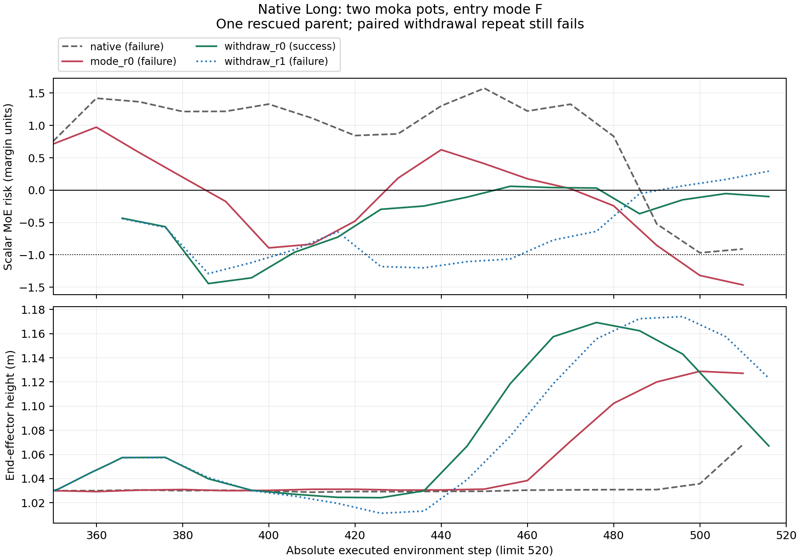

# 原生 Long 内部信号模式与干预实验

本轮 GPU 实验、独立数据审计和全部动作重执行均已完成。共 14 个报警状态、210 条干预/对照后缀，实际执行 9,353 次模型前向。回撤救回 1 个原生 Long 案例，但同一恢复在第二次噪声重复下失败；考虑误干预损害后，本批没有干预策略超过原始 84% 成功率。

模式选择器确实改变了实际动作，但未增加成功案例。当前支持继续检验“信号组合与干预响应的关系”，尚不支持直接使用本轮五分量代价作为有效恢复策略。

## 实验问题

检验 MoE 信号的组合是否对应不同的干预响应。这里的“模式”是内部信号的阈值组合，尚未被验证为抓取失败、碰撞、位置偏差等物理失败类别。

本轮使用原生 LIBERO `libero_10`，共用既有 100 条未干预主轨迹。纳入其中全部 14 个可在首次 v8.2 报警后继续执行的状态，包括原本失败的 12 条和原本成功的 2 条。其余 86 条保留原结局。本轮新增的是干预分支，不是新的独立主轨迹。

## 冻结协议

- 配置：`design/native_long_modes_plan_20260909.json`；协议 `moe_control.native_long_modes.v1`。
- 保留原 v8.2 参数、参考库、模型权重和归一化。没有重新拟合报警阈值。
- 先完成未干预主轨迹，再完成整条精确 C0 回放，随后在首次报警的下一次查询前分支。
- 分支从相同仿真快照启动；环境随机数按绝对动作步配对。
- 每个非原样分支使用由主轨迹、重复编号、查询编号和候选编号共同确定的噪声。各干预族共用这些噪声流；候选查询不推进实际执行历史。
- 总预算仍为 520 个环境动作步。短 chunk 增加的查询、停留和回撤占用的动作步均计入成本。
- GPU 0–3，每卡 8 个独立 batch=1 副本。排除 GPU 6，保留预加载服务。
- 保存 MoE 路由概率、实际专家 ID 和组合权重、动作、噪声、输入摘要及执行前后仿真状态；不采集 hidden activation。每 8 个查询写一块，原始数据在 `/tmp/himoe_native_long_modes_20260909`。

## 模式与选择器

完整向量为 `F, A, P, I, C`，分别对应 freeze、acceleration、periodicity、front/back inversion、curvature。F/A/P 使用严格大于阈值，I/C 使用大于或等于阈值。它描述当前分量的越界状态，和已经锁存的报警、连续确认条件分别记录。

每个分支在干预前用快照里的原始噪声额外查询一次，不执行动作、不推进监测器或策略随机数。这次查询的输入、路由和动作必须与原始主轨迹对应查询完全相同。它给出分组所用的 entry mode，避免用干预后的变化来定义干预前的组别。额外一次查询计入实际成本；部署时它是一个可执行的观测探针。

用冻结的绝对 margin 将五个分量归一化为 `r=(s-tau(q))/margin`。原有标量为：

```text
R = max(rF, min(rA, rP), rI, rC)
```

模式选择器在每次候选搜索时，先用该状态默认候选的信号确定 active mask。活动分量的目标为 `-1`，其余分量的目标为 `0`，选择以下代价最小的完整候选动作 chunk：

```text
J = sum_i max(r_i - target_i, 0)^2
target_i = -1 if default component i is active else 0
```

默认候选没有活动分量或存在缺失值时，模式选择器退回候选 0。此规则不需要训练，也不读取物体位置、任务成功谓词或未来轨迹。仿真状态仅用于恢复和验证；成功谓词仅用于停止与评价。

同时保存原始分量变化、阈值变化、归一化变化、当前组合和连续越界长度。v8.2 的 I/C 阈值每次查询移动 `-0.0015`；短 chunk 会改变单位环境步的查询频率，分析时必须同时看查询编号与动作步，不能把归一化分数变化直接当成原始信号改善。

## 实际比较

| 干预族 | 执行方式 | 重复 |
| --- | --- | --- |
| native | 原始噪声、原始 chunk，必须完整复现主轨迹后缀 | 1 |
| resample | 配对新噪声，每次执行 10 步 chunk | 2 |
| random | 前 5 次查询各生成 16 个候选，均匀随机选一个 | 2 |
| scalar | 与 random 相同预算，选择原有总风险 R 最低者 | 2 |
| mode | 与 random 相同预算，选择五分量模式代价 J 最低者 | 2 |
| short | 前 5 次查询只执行 chunk 的前 2 步，之后恢复 10 步 | 2 |
| hold | 保持上一夹爪命令，先执行 16 步零位移，再继续模型 | 2 |
| withdraw | 8 步抬高、8 步沿近期末端位置回撤，再继续模型 | 2 |

回撤复用既有模块：抬高目标 4 cm，历史方向的水平回撤至多 4 cm，单步平移至多 1 cm，保持夹爪命令和零旋转增量。所有组均在成功时立即停止。

一共 14 次 C0 和 210 条完整后缀，即 224 个任务。保守上界为 10,626 次模型前向和 2.25 GiB 原始记录。

## 评价与验证

报告各干预族两次重复的独立结果和均值；不取两次重复的最好结果作为策略成功率。按 entry mode 比较与 resample、random 的配对胜负，并分别统计救回、误干预损害和实际推理成本。候选组的预算一致；短 chunk、物理恢复的算力成本单独报告。

这 14 个状态仅适合探索。重复分支不是新的独立样本，不能据此声称已发现稳定的物理失败分类，或已验证可泛化的“模式到最佳干预”策略。

独立审计会从保存的路由重新计算候选分量和选择结果，检查完整候选池、原样 C0、噪声配对和实际下发动作。随后再在 MuJoCo 中重新执行全部后缀动作，检查每个记录点的状态和成功结果完全一致。

## 运行结果

每个重复都包含相同的 12 条原本失败轨迹和 2 条原本成功轨迹。下表的救回、损害分别以这两个集合为分母；完整队列成功率同时保留 86 条未触发轨迹的原结局。

| 干预族 | 救回数 (r0, r1)，每次 /12 | 损害数 (r0, r1)，每次 /2 | 完整队列成功率 (r0, r1) | 两次均值 |
| --- | --- | --- | --- | --- |
| 原样续跑 | 0，只有一次原样对照 | 0 | 84% | 84% |
| 配对重采样 | 0, 0 | 0, 0 | 84%, 84% | 84% |
| 随机候选 | 0, 0 | 1, 0 | 83%, 84% | 83.5% |
| 原有总风险选择 | 0, 0 | 0, 0 | 84%, 84% | 84% |
| 五分量模式选择 | 0, 0 | 1, 0 | 83%, 84% | 83.5% |
| 短 chunk | 0, 0 | 0, 0 | 84%, 84% | 84% |
| 停留 | 0, 0 | 1, 1 | 83%, 83% | 83% |
| 回撤 | 1, 0 | 1, 1 | 84%, 83% | 83.5% |

回撤的 1 次救回和其他方法造成的损害不能相互忽略。回撤相对配对重采样，在 28 对分支中为 1 胜、2 负；损害来自同一个原本成功的主轨迹在两个重复中均被破坏，因此也不能把它们当作两个独立主轨迹。

### 模式与干预响应

干预前探针产生 6 种组合：F+A 为 5 条，F 为 4 条，F+P 为 2 条，A+C、A+P、none 各 1 条。none 表示下一次查询已经没有当前越界分量，不表示此前的锁存报警不存在。

| entry mode | 独立主轨迹 | 原失败 / 原成功 | 回撤的配对胜 / 负，两次重复合计 |
| --- | --- | --- | --- |
| F | 4 | 4 / 0 | 1 / 0 |
| F+A | 5 | 4 / 1 | 0 / 2 |
| F+P | 2 | 1 / 1 | 0 / 0 |
| A+C | 1 | 1 / 0 | 0 / 0 |
| A+P | 1 | 1 / 0 | 0 / 0 |
| none | 1 | 1 / 0 | 0 / 0 |

这给出一个可以另行冻结验证的假设：在干预前探针为 F 的状态才尝试回撤，其他组合保持原策略。这个假设来自本批结果，不能再用本批数据宣称其有效。尤其 F 组没有原本成功的样本，无法估计该条件下的误干预损害；entry mode 也不能与上一查询的报警时刻模式混用。

本轮模式选择与标量选择并非相同行为：在 28 对共同起点候选池中，首个选择有 9 对不同；模式选择总共改变了 77 个实际执行 chunk，标量选择改变了 116 个。全局单次选择代价下降尚未转化为任务成功提升。

### 恢复案例

主轨迹 `56c6f0e5e5315558c7e8e412`，任务为 `KITCHEN_SCENE8_put_both_moka_pots_on_the_stove`。v8.2 在查询 34 报警；第 350 个动作步、查询 35 前的探针模式为 F。

原样、重采样、随机/标量/模式候选、短 chunk 和停留均失败。`withdraw_r0` 先执行 16 步物理恢复，再继续模型，在总第 517 步成功；`withdraw_r1` 从相同状态执行相同物理恢复，使用另一组配对策略噪声，执行至 520 步仍失败。故计为 1 个独立主轨迹的 1 次恢复，不计为稳定恢复策略。

同一案例中，失败的 `mode_r0` 最后一次查询的标量 R 为 -1.465，而成功的 `withdraw_r0` 最后一次查询为 -0.099。前者仍有 A 分量越界：标量中的 `min(A, P)` 可以掩盖单独 A 越界。因此“标量已经很低”不能推出所有分量都低，也不能推出物理任务已经恢复。这里的 R 都在对应动作查询时计算，未使用未来成功结果。



### 实际执行与成本

完整 C0 校验了 696 次查询。独立审计检查了 384 个未过滤候选池、6,144 个候选，以及全部 210 条完整后缀；随后在 MuJoCo 中重新执行 26,228 个动作步，每个记录点的仿真状态和成功结果完全一致，最大状态误差为 0。

采集阶段为 382.44 秒，吞吐为 24.46 次模型前向/秒；9,353 次前向包含 C0、每分支一次探针及全部候选，不含模型加载等价性与预加载健康探测。启动、审计、物理重执行和归档时间单独于采集耗时。

| GPU | 8 个分支同时活动时平均利用率 | 同期间平均功率 | 采集峰值功率 |
| --- | --- | --- | --- |
| 0 | 98.66% | 255.23 W | 291.65 W |
| 1 | 97.88% | 287.38 W | 316.97 W |
| 2 | 97.47% | 284.89 W | 310.85 W |
| 3 | 98.77% | 252.15 W | 278.44 W |

这些功率来自实际推理和仿真，没有额外压测。GPU 6 未使用。临时副本、MPS 和采集进程均已退出；原有 PID 28531 的 20 个预加载端点通过采集后的实际推理检查。

### 文件与可复查性

- [冻结计划](design/native_long_modes_plan_20260909.json)
- [完整数据审计](design/native_long_modes_audit_20260909.json) 与 [每条分支结果 CSV](design/native_long_modes_audit_20260909.csv)
- [全部动作重执行证明](design/native_long_modes_physical_20260909.json)
- [分组、候选差异及资源统计](design/native_long_modes_analysis_20260909.json)
- [预加载服务复查](design/native_long_modes_posthealth_20260909.json)
- [原始数据归档](design/native_long_modes_raw_20260909.tar.gz)，575,642,159 字节，SHA256：`637c6f1305b182b1e3f744d9aa4119ef0a6ef4998b2ad02fd898c4a896174bd4`

原始目录仍保留于 `/tmp/himoe_native_long_modes_20260909`；主轨迹来自既有 `/tmp/himoe_native_long_v8_20260909`，其持久归档为 `design/native_long_v8_raw_20260909.tar.gz`。本轮压缩归档与已审计目录进行逐文件内容比较。

采集时冻结的 JSON `entry_mode` 含固定宽度字节的尾部零填充。独立审计 `audit_native_long_modes_labels.py` 明确去除这部分填充；跨 NumPy 环境重算物理动作公式使用绝对容差 `1e-12`。实际存储的候选动作比较与 MuJoCo 重执行状态仍要求完全一致。两项审计修正均不修改采集运行时、原始记录、阈值或结果；冻结代码及其散列仍保留在原始归档中。
