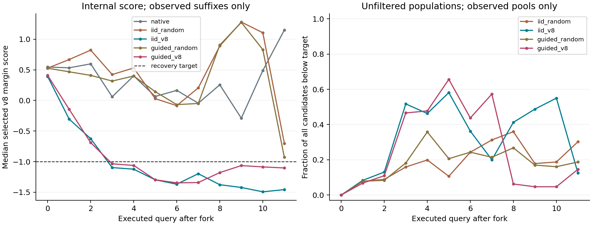

# 原生 LIBERO-Long 的 v8 动作选择实验

日期：2026-09-09。状态：采集、数据审计、独立物理重放和归档验证均已完成。

本轮确实在原生 `LIBERO/libero_10` 上新增采集了 100 条主轨迹。两种 v8 选择器均没有救回失败轨迹，也没有破坏原本成功的轨迹；整体成功率与原策略同为 84%。两种随机选择对照各破坏了同一条成功轨迹，整体为 83%。v8 已经实际改变动作并作用到物理环境，但这些结果尚未证明恢复能力。

## 环境与覆盖

上一批 `V8_CLOSED_LOOP_EXPERIMENT.zh.md` 使用 Long 模型，环境仍是 Pro/Plus；不能把它当作原生 Long 实验。本轮环境来源如下：

- 上游根目录：`/home/jovyan/.cache/himoe-libero-bridge/upstream/LIBERO`，实际路径已解析并逐进程检查。
- 上游 commit：`8f1084e3132a39270c3a13ebe37270a43ece2a01`，运行前后工作树均干净。
- 原版 `libero_10` 的全部 10 个任务，每个任务官方初始状态索引 `0..9`，共 100 条新主轨迹。任务 BDDL、初始状态文件及每条初始状态都固定哈希。
- 种子在结果产生前由任务、初始状态和固定实验标识计算；没有根据成功或失败挑选主轨迹。
- Long checkpoint SHA256：`cdc2b21f9ef657ab31049cfd2b1e2086ceb193a1b8c16af0cd6688925491a256`。
- `chunk=10`，最多执行 520 个动作步，初始化静置 10 步另计。候选搜索期间仿真时间暂停，推理成本单独统计。
- 只使用物理 GPU 0、1、2、3，每卡 8 个 batch=1 副本；渲染用 0、3。GPU 6 未使用。
- 保留预加载模型；没有训练、更新权重或采集神经网络 hidden activation。物理和控制器状态用于完整重放。

预注册清单：[native_long_v8_cohort_20260909.json](design/native_long_v8_cohort_20260909.json)。

## 实际干预

先完整执行全部原策略主轨迹，记录首次 v8 报警。随后对每条主轨迹从初始快照执行完整 C0 重放；观测哈希、噪声、动作、MoE 路由、物理状态和终止结果都必须与原记录一致。通过后，从首次报警查询 `q` 的下一次查询 `q+1` 启动分支。查询编号从 0 开始。

13 条轨迹有可用报警起点，分别为 11 条原失败、2 条原成功。其余 87 条在各策略的整体统计中保持原结果和原推理成本。每个报警起点执行下列五条完整后缀，共 65 条：

| 分支 | 候选生成 | 实际执行候选 |
|---|---|---|
| `native` | 原策略一次推理 | 原始完整 chunk |
| `iid_random` | 16 个高斯噪声候选 | 均匀随机选择 |
| `iid_v8` | 同样的 16 个候选 | 联合 v8 风险最低者 |
| `guided_random` | 8 个原高斯候选，再按前 4 个低风险候选做一次平滑 CEM 更新，生成另外 8 个 | 均匀随机选择 |
| `guided_v8` | 同样的引导候选生成 | 联合 v8 风险最低者 |

干预发生在**动作选择层**：MoE hook 为候选提供内部路由信号，选择器把选中的完整动作数组送入 `env.step`。同一状态下的候选采用私有监测器副本评分，只有最终选中并执行的候选才提交到在线历史。未通过修改计数器、重复更新同一个监测器或筛掉高分候选来制造收敛。

报警参数、参考库和恢复目标沿用上一批，未重新校准。五个连续分量为 freeze、acceleration、periodicity、frontback inversion、curvature。令 `r_j=(s_j-threshold_j)/margin_j`，联合风险为：

```text
R = max(r_freeze, min(r_acceleration, r_periodicity), r_inversion, r_curvature)
```

`R<=-1` 表示达到带裕量的联合恢复目标。这里保留原 v8 联合报警中的 AND/OR 关系，所以不等于五个分量各自都低于目标。旧报警布尔量有锁存行为；退出条件使用当前连续分数。

每个真实观测点搜索 16 个候选，最多干预 12 次查询。只有连续 3 个已执行查询状态中，全部 16 个未筛选候选都满足 `R<=-1-1e-6`，才记为 `population_confirmed`。达到预算或环境终止也会退出。若没有低于目标的候选，v8 组仍执行当前最低风险候选。因此这是有预算的实验版本，有限候选的确认不代表整个动作分布已收敛。

## 任务结果

| 策略 | 整体成功 | 报警失败救回 / 11 | 报警成功破坏 / 2 | 全体策略推理次数 | 相对原策略 |
|---|---:|---:|---:|---:|---:|
| 原策略 | 84 / 100 | 0 | 0 | 2,911 | 1.000 倍 |
| IID 随机选择 | 83 / 100 | 0 | 1 | 4,635 | 1.592 倍 |
| IID v8 选择 | 84 / 100 | 0 | 0 | 4,342 | 1.492 倍 |
| 引导采样后随机选择 | 83 / 100 | 0 | 1 | 4,588 | 1.576 倍 |
| 引导采样后 v8 选择 | 84 / 100 | 0 | 0 | 4,343 | 1.492 倍 |

全体原失败共 16 条，另外 5 条未报警。表中的推理成本按部署单一策略计算，包含未报警轨迹和报警前缀，排除研究用 C0 及其他对照组。仅在 13 条报警轨迹上计算，两种 v8 组分别需要原策略的 3.222、3.224 倍推理。

两种 v8 方法相对各自随机对照均为配对 1 胜、0 负，但胜出的都是同一条原本成功的轨迹，不是两次独立救回：`b92c3d7e25fbe93b35edbfcc`，任务为把黑碗放入下层抽屉并关上。随机选择把它变成失败，v8 选择保持成功。报警成功样本只有 2 条，这个差别还不足以证明普遍的保护效果。

全部失败中的 9 条集中在“两只摩卡壶放到炉上”任务，不能把它们视为 9 种独立失败机制。统计区间按任务分组；所有配对变化为零时，沿用现有统计代码返回空区间，不把 `[0,0]` 当作效果已确定。

## 报警与内部目标

按主轨迹最终是否失败定义正例，本轮的混淆矩阵为 `TP=11, FP=2, FN=5, TN=82`：

- 精度：`11 / 13 = 84.62%`。
- 召回：`11 / 16 = 68.75%`。
- 误报率：`2 / 84 = 2.38%`，分母是原成功轨迹。

这是新采样的这 100 条轨迹上的结果；参数与上一批保持一致。首次触发构成为 freeze 11 条、turbulence 1 条、curvature 1 条、inversion 0 条。多数触发仍来自 v8 联合报警保留的 v7 分支，不能据此证明 v8 新增特征的独立作用。

两种 v8 组各有 6 条后缀满足完整候选池的连续三次确认，其中同样的 4 条原失败轨迹最终仍失败，退出后也都未再次出现 `R>0`：

| 主轨迹 | IID v8 确认查询 | 引导 v8 确认查询 | 最终结果 |
|---|---:|---:|---|
| `b33f744e1932d63bed46d59e` | 49 | 49 | 失败 |
| `56c6f0e5e5315558c7e8e412` | 45 | 42 | 失败 |
| `974a3f409281e82cf8d3b126` | 43 | 43 | 失败 |
| `55088c735b76e0159ef012b8` | 43 | 45 | 失败 |

这直接限制了“候选都稳定低于 v8 阈值就说明已经恢复”的解释。它确认的是内部指标，不是任务目标。

同一观测下，v8 选中候选相对默认候选的联合分数平均下降 0.171、0.197 个裕量单位。引导 v8 的前 8 个与后 8 个候选低于目标的平均比例分别为 27.73%、26.82%，本轮没有显示这次 CEM 更新提高了低风险候选覆盖率。



图中不同横坐标的可观察后缀或候选池数量会变化，曲线不能直接解释为同一固定人群的因果效果。

## 干预核验

首先，数据审计检查了全部 100 条主轨迹、100 条完整 C0、65 条分支和 417 个完整候选池，共 6,672 条候选记录。选中候选的动作、噪声、路由和观测哈希必须与实际分发记录一致。

随后另外启动原版 MuJoCo 环境，直接从保存状态重新执行 13 个起点各自的原策略、IID v8、引导 v8 完整后缀。这一步不调用模型、不沿用采集时的环境实例：

- 共 39 条完整后缀、4,680 次 `env.step`。
- 每个 chunk 的前后物理状态与采集记录逐元素一致，最大状态误差为 0；终止成功标志也一致。
- 全部 26 条 v8 后缀都存在真实动作分叉，IID 与引导 v8 分别改变了 87、88 个已执行 chunk。
- 相对同一观测下的默认候选，已执行 6 维控制量的平均 RMS 差分别为 0.01425、0.01427；夹爪符号分别在 41、36 个动作步上不同。
- 例如 `b33f744e1932d63bed46d59e` 的查询 44，起始状态和观测相同，v8 动作 RMS 差为 0.02431，执行后状态向量的 L2 差为 0.46378。状态向量含不同量纲，不能把该数值解读为米。

因此可以确认动作确实执行并改变了仿真状态。没有救回的结果属于这套干预策略的实验结果，不能用“其实没执行”解释。

注意原有结果格式中的顶层 `success` 描述主轨迹，分支成功必须读取 `branches[].success` 或 `branch.json`。本报告和分析代码使用分支结果；候选成本使用审计后的真实推理次数，不使用继承的旧候选计数器。

## 启发与后续实验

1. **内部低风险不能直接充当任务恢复证明。** 本轮内部目标可以降低，也出现了连续低分但任务仍失败的完整轨迹。按控制论理解，目前还没有证据说明这个代价具有随任务进展下降的性质，不能把它直接称作经过验证的 Lyapunov 函数。
2. **候选选择与恢复动作的供给要分开检验。** v8 在一条成功轨迹上比随机选择保守，但没有产生新的成功。当前数据支持进一步检验它作为候选过滤条件的用途；恢复能力仍需候选本身包含能脱离错误模式的动作。
3. **时机可能限制可恢复性。** 5 条失败未触发，另有 4 条报警失败在介入时只剩 80、60、30、10 个动作步。这轮不能区分“候选没有恢复能力”和“已经错过窗口”的贡献。
4. **下一轮保持阈值固定，优先比较报警查询当步 `q` 与现有 `q+1` 的拦截。** 默认候选的内部信号在执行其动作前已经可得，可以先预判再选择当步动作。两组继续共用恢复模块、噪声和随机选择对照，检验一整个 chunk 的延迟是否造成差别。这项实验尚未运行。
5. **离线核验候选分数是否预测动作后果。** 从相同快照分别执行固定候选，再检查执行后观测上的风险和完整后缀成功，比较当前候选排序与真实效果的对应关系。仿真分支用于离线诊断；最终部署选择器仍只读可用的内部信号。这项实验尚未运行。

本轮未达到“相对原策略净救回为正，且胜过匹配随机选择”的扩大采样门槛。两种 v8 方法推理增加约 49%，成功率净增益为 0；不据此宣称恢复有效。

## 资源与产物

实际采集推理 12,901 次，其中新主轨迹 2,911 次、完整 C0 2,911 次、各分支共 7,079 次。采集用时 586.38 秒，22.00 次推理/秒，不含模型启动与后续独立物理重放。GPU 0–3 的全采集阶段平均利用率分别为 88.98%、83.81%、84.49%、87.80%；平均功率为 231.31、253.87、255.66、229.56 W。GPU 1 的最高采样功率为 317.11 W。候选搜索密集阶段接近满利用率，不能把峰值功率当作全程平均。

全部采集私有模型、环境进程和 MPS 已关闭。原来的 20 个模型端点仍由 PID 28531 提供并通过推理健康检查。

- [数据审计](design/native_long_v8_audit_20260909.json)
- [独立物理重放审计](design/native_long_v8_execution_audit_20260909.json)
- [结果与指标](design/native_long_v8_analysis_20260909/summary.json)
- [指标 CSV](design/native_long_v8_analysis_20260909/metrics.csv)
- [预加载模型健康检查](design/native_long_v8_health_20260909.json)
- [完整原始数据归档](design/native_long_v8_raw_20260909.tar.gz)
- [归档 SHA256](design/native_long_v8_raw_20260909.tar.gz.sha256)

运行目录为 `/tmp/himoe_native_long_v8_20260909`；完整归档已持久化到本项目 `design/`，且 `tar --compare` 与运行目录逐文件比对通过。归档中的绝对路径保留原始记录，复核需要对应版本的模型、LIBERO 和冻结参考资料。
