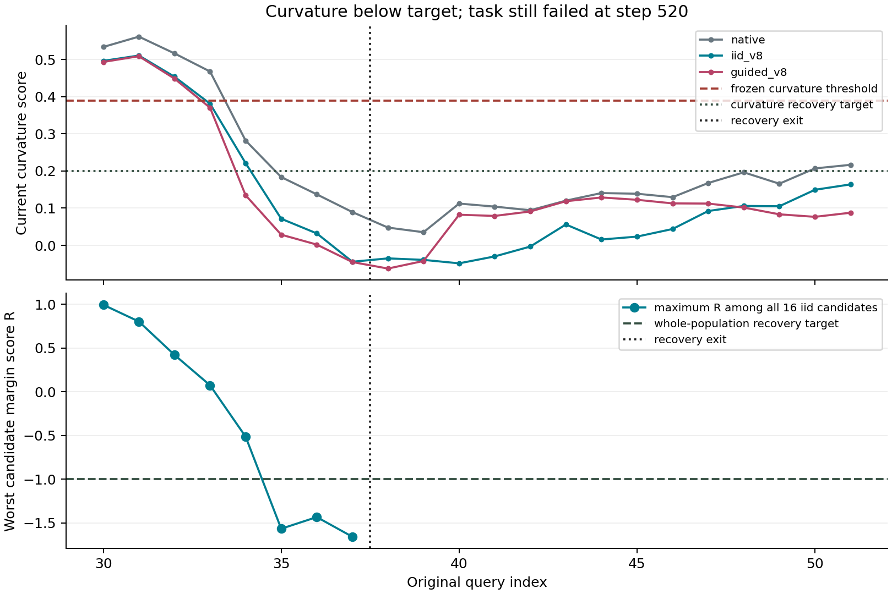
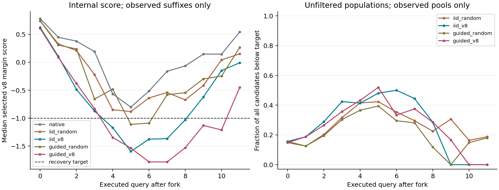

# v8 驱动的免训练闭环候选搜索

日期：2026-09-09。协议：`moe_control.v8_closed_loop.v1`。

首批真实实验及完整审计已经完成。两种 v8 选择都在 10/16 个状态达到连续三轮整池低分，但均救回 0/12 个原失败状态，并破坏了同一个原成功状态。当前冻结扩展条件未满足，确认批没有启动。

目标是检验：由既有 v8 报警触发后，持续选择内部低分候选，能否同时实现信号恢复和任务救回。规则及首批、确认批名单均在本次分支成败结果之前冻结。

## 实际结果

采集完成 16 次完整 C0、80 条完整后缀、548 个完整候选池，保存 8,768 个候选。实际模型查询 10,622 次，其中 C0 为 788 次。全部候选、执行历史、CEM 噪声、完整后缀和分支标签通过审计。

| 方法 | 救回 / 12 | 破坏 / 4 | 连续整池低分确认 / 16 | 确认后最终失败 |
| --- | ---: | ---: | ---: | ---: |
| iid_random | 0 | 1 | 7 | 5 |
| iid_v8 | 0 | 1 | 10 | 8 |
| guided_random | 0 | 1 | 7 | 5 |
| guided_v8 | 0 | 1 | 10 | 8 |

两种 v8 选择相对各自随机对照的配对赢数、输数均为 0。虽然低分确认次数从随机选择的 7 次增加到 10 次，但没有对应的任务收益。两种 v8 选择各有 7 个原失败状态完成低分确认，随后仍失败；这些不是被重复计数的新主轨迹。

Pro 包含 5 个原失败、1 个原成功，两种 v8 选择均为 0 救回、0 破坏。Plus 包含 7 个原失败、3 个原成功，两者均为 0 救回、1 破坏。首批触发头为 freeze 10 个、turbulence 4 个、curvature 2 个、inversion 0 个，对 v8 两个新增几何头的覆盖很有限。

两种选择实际更换了 119 和 118 个 chunk；相对于同观测默认候选，所选 R 平均下降约 0.127、0.139 个裕量单位。这是候选内的分数变化，不是成功概率变化。guided_v8 两轮候选达到恢复目标的比例均为 28.125%，本次 CEM 搜索没有显示出更好的目标覆盖。

一个具体反例是 Plus 的 `3e6466b66694b7b6325fa52e`，任务为将 alphabet soup 与 tomato sauce 都放入篮子。曲率在 q29 首次触发，q30 开始干预。iid_v8 在 q35、q36、q37 的整池最大 R 分别为 -1.568、-1.435、-1.660，全部 16 个候选连续三轮都低于 -1，执行到第 380 步后退出恢复。随后 R 没有再超报警边界，但任务在第 520 步仍失败。



这里降低的是当前连续分数，原锁存报警标志没有被清除。原生轨迹的曲率后来也自然下降，进一步说明单靠当前曲率低不能确认物理任务已经恢复。这个案例来自事后诊断，没有据此重调参数。

被破坏的共同状态为 Plus Objects Layout 的 `2cf90cb7367ffca37b82d322`，任务为将两只 moka pot 放到炉上。原生在第 495 步成功，四个搜索臂都在第 520 步失败。v8 两臂首次更换 chunk 时没有改变夹爪符号，因此不能直接把失败归因于打开夹爪；目前只有动作及信号差异证据，尚未定位具体物理原因。



上图按当时仍有观测的后缀或候选池汇总。已经成功或退出恢复的样本会退出相应统计，右图后段候选低分比例下降不能直接解释为所有已恢复状态再次恶化。

单条完整策略的模型查询成本：iid_v8 为 2,724/788=3.46 倍，guided_v8 为 2,717/788=3.45 倍原生基线。这是将公共前缀计入每个假想部署策略后的成本；实际采集复用公共前缀，不等于这些成本之和。

实际采集耗时 420.55 秒、吞吐 25.26 查询/秒，原始运行目录约 665.5 MB。四卡八个 worker 均活跃期间的平均利用率分别为 99.8%、98.3%、99.4%、99.2%，平均功率约为 279、303、294、255 W；GPU 1 峰值约 329 W。包含启动后的调度过渡和尾部作业时，全采集段平均利用率为 86.7%–93.1%。

GPU 6 未使用，未采集 hidden。临时模型、MPS 和环境 worker 已清理，卡 0–3 的 20 个原服务健康检查通过，原进程 PID 28531 保留。

当前结论是：这个有预算的闭环版本能够压低内部信号、增加协议意义上的低分确认，但没有显示任务恢复收益。确认批继续保留；不按本次已知结果放宽阈值或扩大候选数后挑选最优版本。后续控制目标需要增加能区分物理进展与单纯内部低分的证据，不能把 R 最小化本身当作恢复能力。

结果文件：[完整审计](design/v8_closed_loop_pilot_audit_20260909.json)、[指标与扩展判定](design/v8_closed_loop_pilot_analysis_20260909/summary.json)、[事后诊断](design/v8_closed_loop_pilot_diagnostics_20260909/summary.json)、[服务健康检查](design/v8_closed_loop_pilot_health_20260909.json)。

全部原始运行数据另已保存到工作区的 [tar 归档](design/v8_closed_loop_pilot_raw_20260909.tar)，附 [SHA-256 校验文件](design/v8_closed_loop_pilot_raw_20260909.tar.sha256)。归档已使用 tar compare 与原运行目录逐文件比较通过，不仅依赖临时目录保存。归档保留原始运行路径和账本，不改写历史元数据。

## 固定设计

使用 Long checkpoint，在 LIBERO-Pro 和 LIBERO-Plus 的已有完整主轨迹上分叉。主轨迹不干预，先完成精确 C0，再从首次 v8 报警 q 的下一查询 q+1 恢复。原生 chunk=10、总预算 520 个动作步保持不变。

首批 16 个报警状态：12 个原失败、4 个原成功，Pro 6 个、Plus 10 个。原成功样本用于检查误干预破坏。类别内使用固定哈希排序、跨 benchmark/category 轮流取样。确认批另外预留 16 个不重叠状态，也是 12 失败、4 成功。这是按原结果分层的报警后恢复试验，不估计总体部署成功率，也不是此前从未观察过的主轨迹。

每个状态比较五个完整后缀：

| 实验臂 | 候选生成 | 动作选择 |
| --- | --- | --- |
| native | 原始噪声流 | 原始动作，要求完整后缀精确复现 |
| iid_random | 两轮独立噪声 | 从全部 16 个候选均匀随机选一个 |
| iid_v8 | 同上 | 选择 v8 恢复分数最低的候选 |
| guided_random | 第一轮独立噪声，第二轮 CEM 噪声搜索 | 从全部 16 个候选均匀随机选一个 |
| guided_v8 | 同上 | 选择 v8 恢复分数最低的候选 |

四个搜索臂在活跃且证据完整的查询上都有相同的 16 次推理预算。实际总成本可能因提前成功、退出恢复或历史不足而不同。比较同一生成器内 random 与 v8 的差异，检验选择规则；比较生成器的差异，检验候选搜索的作用。guided_random 的生成器也使用 v8，因此它是随机选择对照，不是完全不使用内部信号的对照。

## 恢复分数

不重新拟合报警阈值，也不使用 kNN 作为选择约束。将五项连续信号换算成相对于原阈值的裕量：

```text
r_j = (s_j - T_j) / delta_j
R = max(r_freeze, min(r_acceleration, r_periodicity), r_inversion, r_curvature)
```

这保留了 v8 中 v7 部分“freeze OR (acceleration AND periodicity)”的组合关系。因此“所有候选通过”指所有候选的复合恢复分数通过，不要求加速度和周期性各自都低。原始锁存、确认和首次报警逻辑继续原样用于触发，R 只用于恢复控制，不能当作重新校准的 v8 概率。

| 分量 | 报警阈值 T | 恢复目标 T-delta |
| --- | ---: | ---: |
| freeze | 0.5740630627 | 0.4592504501 |
| acceleration | 0.1075074971 | 0.0860059977 |
| periodicity | 0.3749159276 | 0.2999327421 |
| front/back inversion | 0 | -0.1 |
| relative curvature | 0.3890000582 | 0.2 |

目标为 R<=-1，确认使用额外 1e-6 数值余量。前三项使用固定 20% 裕量，后两项使用上表的绝对目标。它们是本次固定控制超参数，不是经过数据证明最优的值。

v8 几何分数使用最近 6 次真实策略查询的路由统计；front/back 与 curvature 描述去噪过程中的路由变化，不是机械臂的物理曲率。

## 搜索与退出

每次真实决策先生成默认动作，其噪声来自原策略 RNG。若五项分数尚未全部可计算，则执行默认动作并记一次恢复查询；不得用不完整证据宣布恢复。

证据完整时，第一轮生成 8 个原采样分布候选，包含默认候选；第二轮再生成 8 个。iid 使用独立标准高斯。guided 用第一轮最低 R 的 4 个噪声样本更新对角高斯：

```text
mean = 0.5 * elite_mean
std = clip(sqrt(0.5 + 0.5 * elite_variance), 0.5, 1.5)
```

该搜索只更新本次查询的噪声采样参数，不训练网络，不修改 gate 或模型权重，也不把优化器状态跨物理状态延续。采用 [CEM 常见的精英样本分布更新思路](https://github.com/facebookresearch/mbrl-lib/blob/main/mbrl/planning/trajectory_opt.py)，在此对原策略的生成噪声做有界轮数搜索。

所有候选在同一图像、状态、指令输入上独立推理，batch=1。每个候选在真实已执行历史的私有副本上评分，只有选中并实际分发的动作才提交一次监测历史。额外候选 RNG 与原策略 RNG 分离，候选采样不会改变默认策略未来的噪声流。

执行选中的完整原生 chunk 后更新观测，再继续下一次选择。只有连续 3 个真实决策状态的全部 16 个未筛选候选都满足 R<=-1-1e-6，才以 population_confirmed 退出。第一轮仍包含 8 个原分布候选，因此不会仅靠把第二轮采样分布收缩到低分区域就宣布普通策略恢复。

恢复目标用于候选搜索和退出确认，不是每个动作的硬性执行许可。如果 16 个候选都未达标，v8 臂仍执行其中最低 R 的动作，再在新的真实状态继续搜索。本试验没有实现无限重采样直到找到低于目标的动作。

最长恢复窗口为 12 次查询。耗尽后恢复普通策略并记录未收敛；成功或原 520 步预算到期则终止。退出后继续记录当前分数再次超阈值与行为停滞，不做第二次干预。原 `v8_alarm` 是锁存标志，不用它作为解除条件。

保留全部候选，不采用先过滤高分候选再检查“全低”的做法。有限样本全低只构成此协议下的确认，不证明整个候选分布收敛，也不证明任务已恢复。

本次只选择完整的原生策略动作，检查数值有限。取消上一版的夹爪符号一致与候选池中位数半径限制，让候选可以包含不同抓放决策；相应风险由原成功状态的破坏率衡量。这不是物理安全保证。

## 采集与判定

使用 GPU 0–3，每卡 8 个隔离模型副本及最多 8 个活跃 worker，保持 batch=1；禁止使用 GPU 6，不采集 hidden，不修改用户预加载模型进程。采集前检查原服务及隔离副本的动作、top4 专家和并发完整路由一致性。

全程保存每轮的 16 个候选、噪声、动作、路由、分数、选择、优化器参数，以及每条实际执行后缀和全状态快照。候选按 8 条分片，实际后缀按已有分片机制存储，带原子提交和校验和。大型原始数据位于 `/tmp/himoe_v8_closed_loop_pilot_20260909`，工作区保存冻结计划、审计和汇总。

分别评价任务救回、原成功任务破坏、相对对应随机选择的配对收益、整池达标和连续确认、退出后再次超限、计算与资源成本。既不把内部低分视为成功标签，也不把原生模拟器状态用于候选评价。

只有当 iid_v8 或 guided_v8 同时满足以下冻结条件，才进入预留确认批：

1. 相对精确 native，救回数减破坏数大于 0。
2. 相对对应生成器的 random 选择，配对赢数减输数大于 0。

确认批保持五个实验臂及全部超参数，避免在首批标签上继续调参数。小批结果仍是探索性证据，不能据此声称普遍有效。

## 文件

- [控制规则](v8_closed_loop.py)
- [状态与随机流测试](test_v8_closed_loop.py)
- [首批冻结计划](design/v8_closed_loop_20260909_pilot.json)
- [确认批冻结计划](design/v8_closed_loop_20260909_confirmation.json)
- [采集器](collect_v8_closed_loop.py)
- [调度器](run_v8_closed_loop.py)
- [完整审计](audit_v8_closed_loop.py)
- [分析与绘图](analyze_v8_closed_loop.py)

控制模块 6 项测试通过，覆盖 v7 合取、零阈值裕量、缺失证据、整池连续确认、预算终止、私有历史和随机流配对。实际运行后的完整审计和服务健康检查均通过。原始候选计数以审计重算的分片和 `actual_model_queries` 为准，基类遗留的未使用候选计数字段不参与结果统计。
