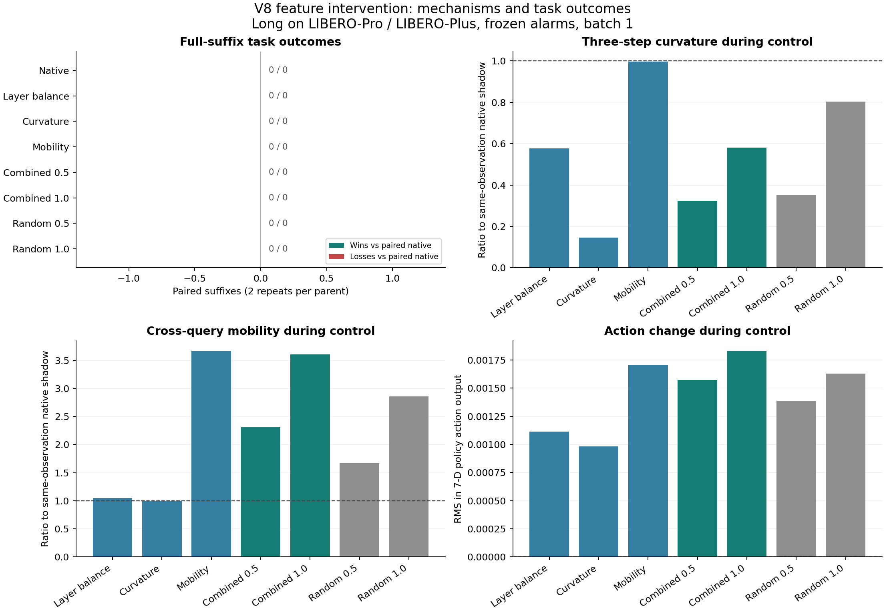

# V8 特征控制实验

2026-09-08。采样、全量审计、原有模型服务健康检查均已完成。

本轮已经直接改变 MoE gate 的实际执行，而不是修改保存下来的报警特征。结果是：三个目标量都能明显改变，但没有新增救回。当前这组“报警后 5 次查询的 gate 偏置”配置没有表现出任务恢复收益。

## 实验范围

- 复用已完成、已审计的 42 条 Long 主轨迹：LIBERO-Pro 29 条，LIBERO-Plus 13 条；原始结果为 40 失败、2 成功。
- 主分析排除 1 条未改变场景的对照，剩余 41 条扰动轨迹：Pro 28、Plus 13，其中 39 失败、2 成功。该对照保留在完整数据中。
- 选择依据是原生主轨迹存在可执行的 v8 报警；使用全部 42 个符合条件的状态，没有按干预结果筛选状态。
- 每个状态 8 组、每组 2 次配对重复，共 **672 条完整后缀**。同一主轨迹的重复不算新增独立案例，也不算新增主轨迹覆盖。
- 原生主轨迹始终无干预。完整 C0 精确重放通过后，从第一次 v8 报警 `q` 的下一次查询 `q+1` 前状态恢复。
- 每次执行 chunk 仍为 10。控制持续至多 5 次查询，随后完全撤销；所有后缀执行至成功或原有 520 步总预算耗尽。

本文 `q` 使用代码中的零起始查询索引；`q+1` 指下一次模型查询，不是一个环境动作步。

计划：[v8_feature_plan_20260908.json](design/v8_feature_plan_20260908.json)。本轮属于机制探索，不是独立留出验证。

## V8 特征与操作

原来的 v8 阈值、开局基线、平滑窗口和确认次数均保持不变。新增两个 v8 头之外，v8 还继承 v7 的冻结及湍流报警。42 个状态的首次报警来源为：冻结 33、湍流 5、前后层比例 2、三点曲率 2。

设 `s[l,k]` 为相邻去噪阶段之间、对动作 token 平均的路由 Hellinger 距离。

| 控制方向 | 原特征 | 本轮实际操作 |
| --- | --- | --- |
| 前后层比例 `balance` | 前四层路径长度与后四层路径长度之比的对数，6 次查询平滑；低于等于 0，连续确认 2 次 | 将后四层各去噪阶段的中心化 logit 向该查询的阶段均值收缩 40%，降低后层过大的路径长度 |
| 三点曲率 `curvature` | 后四层 `abs(s1 - 2*s5 + s9)` 的均值，相对原生开局 q1..q4 基线取对数，6 次查询平滑；阈值 `0.3890000581741333` | 按 Hellinger 路径弧长重新分配去噪阶段，保留目标路径的起点、终点及顺序，减少速度的不均匀变化 |
| 路由移动量 `mobility` | v7 冻结头：最终去噪路由的跨查询移动量相对开局基线降低，冻结分数阈值 `0.5740630626678467` | 沿当前与前一次原生 shadow 路由已有的变化方向放大，避免直接指定一个固定专家 |

每个控制查询先用当前观测、当前噪声执行一次原生 shadow 前向，再从路由构造偏置，执行一次受控前向。偏置在后四层 HB gate 的动作 token 上生效，实际重新计算 Top-4 专家和归一化混合权重。前四层、状态 token 的 gate 不直接施加偏置，AS gate 不直接干预，不保存 hidden。

偏置先去均值，每个位置的 RMS 上限为 0.35、绝对值上限为 1.0。组合控制将三个方向相加后限幅，分别测试 0.5 和 1.0 倍强度。两组随机对照将组合偏置的专家维度置换，保留每个位置的偏置幅度分布；第一查询的配对状态及幅度完全相同，后续各自在其当前观测上构造偏置，不声称分叉后整条轨迹的偏置范数仍完全一致。

完整 8 组：`native`、`balance`、`curvature`、`mobility`、`combined_half`、`combined`、`random_half`、`random`。

## 完整任务结果

以下为主分析的 41 条扰动轨迹。每组有 39 条原始失败轨迹的 78 次尝试，以及 2 条原始成功轨迹的 4 次尝试。

| 方法 | 原失败轨迹救回 | 原成功轨迹被破坏 | 相对配对 native：赢 / 输 |
| --- | ---: | ---: | ---: |
| 不干预 `native` | 0 / 78 | 0 / 4 | 0 / 0 |
| 前后层比例 | 0 / 78 | 0 / 4 | 0 / 0 |
| 三点曲率 | 0 / 78 | 0 / 4 | 0 / 0 |
| 路由移动量 | 0 / 78 | 0 / 4 | 0 / 0 |
| 组合 0.5 | 0 / 78 | 0 / 4 | 0 / 0 |
| 组合 1.0 | 0 / 78 | 0 / 4 | 0 / 0 |
| 随机方向 0.5 | 0 / 78 | 0 / 4 | 0 / 0 |
| 随机方向 1.0 | 0 / 78 | 0 / 4 | 0 / 0 |

纳入未改变场景的对照后，每组救回结果仍为 **0 / 80**，对应 **0 / 40 个不同的原始失败状态**。

主分析按 benchmark 拆分：Pro 每组 0/54，Plus 每组 0/24。按报警来源拆分，冻结 0/60、湍流 0/10、比例头 0/4、曲率头 0/4。早于或等于 q20 的报警也为 0/22，不能仅用“报警较晚”解释全部负结果；整个选中集合的报警查询中位数为 q31。

以上分组是描述性分析，不是新的报警规则。成功轨迹只有 2 条，不足以证明控制普遍无害。所有配对收益都为零时，普通 bootstrap 会退化成 `[0,0]`；分析文件将此类区间记为空，避免把它误解为已经证明两种方法等效。

## 特征确实改变了

下表先对每条分支的控制查询取均值，再跨主分析分支取中位数。特征比较使用同观测、同噪声的原生 shadow；这里的曲率是原始三点曲率，不是把平滑报警分数当作比例。

| 方法 | 前后层 log 比的增加 | 曲率 / shadow | 移动量 / shadow | 后四层 Top-4 集合变化的位置占比 | 7 维动作输出 RMS 差 |
| --- | ---: | ---: | ---: | ---: | ---: |
| 前后层比例 | +0.4100 | 0.578 | 1.046 | 47.5% | 0.00112 |
| 三点曲率 | +0.0126 | **0.146** | 1.000 | 53.3% | 0.00098 |
| 路由移动量 | -0.0062 | 0.996 | **3.666** | 99.0% | 0.00171 |
| 组合 0.5 | +0.2473 | 0.323 | 2.309 | 95.6% | 0.00157 |
| 组合 1.0 | +0.1756 | 0.581 | 3.606 | 99.2% | 0.00183 |
| 随机方向 0.5 | -1.7204 | 0.351 | 1.671 | 97.5% | 0.00139 |
| 随机方向 1.0 | -2.3913 | 0.804 | 2.854 | 99.7% | 0.00163 |

`+0.4100` 的 log 比变化对应路径比约为原来的 **1.51 倍**。“Top-4 集合变化”表示某位置至少一个入选专家不同，不表示该位置四个专家全部被替换。动作 RMS 是模型 7 维输出坐标中的数值，不能直接解释为米或毫米。

单独曲率控制的 82 条主分析分支，其控制期平均曲率均下降；两种组合控制的 82 条分支，其三个目标方向均改变。相比之下，随机方向会大幅恶化前后层比例，即使曲率也能下降。这说明单看一个下降的特征不足以判断控制质量。

撤去控制后，还比较了相对查询 q11 的自然特征，此时冻结窗口已经包含 6 个完全无干预的跨查询转移。每组有 68 对可比较分支；组合 1.0 相对 native 的中位差为：前后层反转量 `+0.00093`、曲率 `+0.000057`、冻结分数 `-0.00074`。没有出现与控制期同量级的持续变化，任务终局也没有改善。

## 对后续设计的影响

本轮证明了这几个量可以通过实际 gate 操作被改变，但当前幅度和持续时间没有形成恢复收益。尤其是多数 Top-4 集合已经变化，动作输出仍只有上述量级的差异；这提示需要检验控制对动作计算的影响，不能只增加路由扰动强度并以报警分数下降作筛选。

更值得验证的下一步有两个：在原 v8 第一次报警的当次查询、执行动作之前干预，与当前 q+1 进行配对比较；以及控制 MoE 分支对输出的实际贡献，并把撤销干预后的自然特征与完整任务结果作为指标。这些尚未在本轮运行，不能作为已取得的收益。仅凭本轮也不能断言 v8 特征在所有控制方案中都无用。

## 验证与资源

- 6 项针对控制几何、确认时序、实际 gate 输出和 hook 清理的测试通过。
- 42 条完整 C0 与主轨迹逐字段一致，包括动作、路由、观测摘要、物理状态及最终结果；在线 v8 首报与历史冻结版本全部一致。
- 全量检查 672 条后缀的状态恢复、配对种子、执行预算、目标偏置、实际概率对应的 Top-4 和混合权重、撤销后的特征及前向计数，审计通过。
- 数值审计边界：实际 gate 加法有 BF16 舍入。已保存真实 native/effective 概率和执行权重，能够验证实际分发；未保存绝对 logits，因此没有声称独立逐位复原 BF16 加法。实际中心化 log 概率偏置与请求偏置的最大残差为 `0.01682` 以内。
- 采样账本：C0 2,146 次 + 后缀执行 14,718 次 + 额外 shadow 2,870 次 = **19,734 次模型前向**。另有启动一致性检查 88 次、结束健康检查 20 次，合计记录到 **19,842 次请求前向**。
- 采样阶段耗时 **20.52 分钟**，平均 **16.03 次前向/秒**，数据约 **1.75 GiB**，采用每 8 条查询一块的有界存储。
- 仅使用物理 GPU 0–3，每卡 8 个共享参数的独立推理进程，batch=1，未使用 GPU6。队列能够供应全部副本时平均 GPU 利用率 **94.9%**；含任务长尾的全程每卡平均利用率分别为 75.4%、63.4%、80.8%、69.1%。最大功率分别为 272.8W、305.6W、299.9W、256.1W，没有把峰值描述为持续功率。
- 本轮按主轨迹分派整组后缀，收尾时存在长尾空闲。后续可以保留按主轨迹组织的存储结构，同时将 C0 完成后的后缀按状态、方法和重复编号独立调度，提高收尾阶段的利用率。
- 临时模型进程、环境进程及私有 MPS 均已退出。原有模型进程仍为 PID 28531，0–3 卡的 20 个原有端点均通过真实推理健康检查。报警配置未修改，未采集 hidden。

## 文件

- [完整分析](design/v8_feature_analysis_20260908.json)
- [全量审计](design/v8_feature_audit_20260908.json)
- [采样记录与资源](design/v8_feature_experiment_20260908/summary.json)
- [原有服务健康检查](design/v8_feature_final_health_20260908.json)
- [可导出的 PDF 图](design/v8_feature_results_20260908.pdf)
- [特征及实际 gate 控制](v8_feature_control.py)
- [状态恢复与后缀采样](collect_v8_feature_control.py)
- [冻结实验计划的生成](prepare_v8_feature_experiment.py)
- [独立审计程序](audit_v8_feature_experiment.py)
