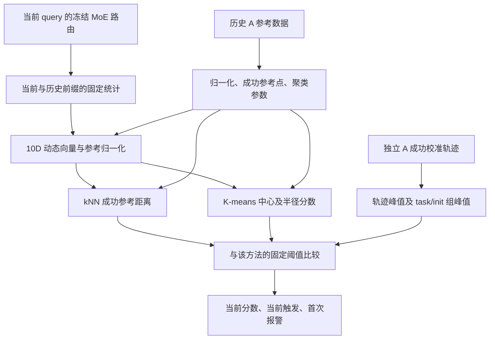

# 基于 MoE 路由动态的无训练失败监测：方法总览

更新日期：2026-09-07。范围：`safe&vlaconf/moe_trainfree` 中截至 Round 11 及 Round 12 的 LIBERO-10 共同窗口诊断的实际实现与结果。

本文是当前方法的统一入口。完整逐轮实验和原始数据仍保留在各轮结果目录；本文不替代原始协议，也不把历史探索结果改写成盲测结论。

## 阅读导航

- [1. 目标与当前状态](#scope)
- [2. 数据、轨迹与时间单位](#data)
- [3. 从路由到 10 维动态特征](#features)
- [4. 参考库与完整任务留出](#reference)
- [5. 异常分数：kNN、余弦与 K-means](#scores)
- [6. 阈值、报警与指标](#calibration)
- [7. v7/v8 的关系与融合](#fusion)
- [8. 已完成实验与主要结果](#results)
- [9. 报警时序与误报原因](#diagnosis)
- [10. 在线使用与恢复研究](#online)
- [11. 文件、数据格式与复现](#reproduction)
- [12. 当前结论与待验证问题](#conclusions)

<a id="scope"></a>

## 1. 目标与当前状态

### 1.1 我们解决什么问题

在冻结的 HiMoE-VLA 执行任务时，读取正常推理已经产生的 MoE 路由，计算当前前缀的异常程度，输出风险分数和首次报警时刻。研究目标是用 MoE 的计算结构提供失败监测信号，省去额外失败预测网络的训练。

主线借鉴 SAFE 的内部特征分析、成功轨迹校准和未见任务评价，以及 VLAConf 的成功参考支持度思路。当前输入主要是路由动态；没有在本分支训练 SAFE 的 MLP/LSTM 或 VLAConf 的 CFN，也没有完成同策略、同数据、同协议下的两篇论文原方法对照。因此不能声称已经优于 SAFE/VLAConf。文献依据和两篇工作的差异见[已有阅读记录](../MOE_RESEARCH_EXPLORATION_ZH.md)。

SAFE 正文与附录的实验、基线和评价细节见[SAFE v2 实验核查](../SAFE_EXPERIMENTS_ZH.md)，特别注意其成功/失败双库距离、LIBERO 主表共同长度处理，以及检测实验与闭环恢复的区别。

当前策略本身已经是 MoE-VLA。本工作改变的是监测器如何读取内部信号，不是在评估时修改策略架构或重新训练专家。

### 1.2 当前有哪些确定的实现

| 项目 | 当前状态 |
| --- | --- |
| MoE 路由提取、因果动态特征 | 已实现并核验，复用 v7 |
| 10D 成功参考欧氏 kNN-20 | 已有逐 query 接口；最新完整语料基线 |
| 余弦距离及近邻/打分分离对照 | 已完成 32,000 条完整任务留出评价 |
| k=1 至 10，另保留 k=20 | 已在同一完整语料、参考库上扫描 |
| K-means 中心与半径分数 | 已完成完整语料离线评分、校准与核验 |
| C=4 加簇半径归一化 | 当前扫描中的探索候选；尚未在新数据确认 |
| JA/WJ、v7/v8 融合 | 已实现并评估，使用较早的 12 折协议 |
| 当前 K-means 与 v7/v8 的新组合 | 尚未完成实验 |
| LIBERO-10 成功终止前共同窗口 | 已完成；原阈值与历史前缀重校准均已核验 |
| 报警后改噪声、分支 rollout、闭环救回 | 本分支尚未实现或验证 |

### 1.3 本文的 train-free 定义

不更新 VLA/MoE 权重，不训练新的监督失败分类器，不做反向传播。允许从历史数据计算统计量、保存成功参考点、拟合 K-means 中心及半径、校准阈值。

因此，当前方法是“策略和预测网络无新增训练”，但有参考数据依赖、历史成功标签依赖和离线参数拟合。前两轮曾使用更严格的无标签参考口径；当前成功参考方法不能继续称为完全无标签。研究过程已经查看过测试结果，C=4 的选择也来自扫描结果，不能称为结果标签完全未参与方法选择。

<a id="data"></a>

## 2. 数据、轨迹与时间单位

### 2.1 当前完整语料

| 批次 | 原始 run_id | 轨迹 | 成功 | 失败 |
| --- | --- | --- | --- | --- |
| A | `right-50x8-20260903` | 16,000 | 15,468 | 532 |
| B | `right-50x8b-20260903` | 16,000 | 15,436 | 564 |
| 总计 | A+B | 32,000 | 30,904 | 1,096 |

共 Goal、Long、Object、Spatial 四个套件，每套 10 个任务。每个任务在每批中包含 50 个初始状态、每初态 8 个噪声种子，共 400 条；A+B 合计每任务 800 条。四个套件的策略 checkpoint 分别处理，参考特征不跨 checkpoint 混合。

失败标签表示整条 rollout 最终未完成任务。已有失败类型和脱手事件来自事后物理审计，用于评价与解释，未输入当前几何分数。

### 2.2 时间与对象的严格定义

| 名称 | 定义 |
| --- | --- |
| rollout / episode / 轨迹 | 固定任务、初始状态和噪声配置的一次闭环执行，直到成功或步数上限 |
| query，记作 q | 一次策略推理，q 从 0 开始 |
| action chunk | 一次 query 生成的一段动作，本批数据完整 chunk 含 10 个动作 |
| 控制步 / 动作步 | 向环境实际执行一次动作，比 query 更细 |
| flow step | 一次 query 内部的生成/去噪迭代，本模型为 10 次；不等于环境动作步 |
| 一个参考点 | 一条历史参考轨迹在一个有效 query 上的特征向量 |
| kNN 的 k | 使用多少个参考点作为近邻 |
| K-means 的 C | 将参考点拟合为多少个中心，与 k 和 MoE 专家数均不同 |

q 时刻的路由来自当前观测下刚完成的策略推理。此时此前完整 chunk 已执行，当前生成的 chunk 尚未执行：在本批记录中，已执行动作数为 `10*q`，不计初始化静置步。例如 q7 对应已执行 70 个动作，q33 对应 330 个动作。

最后一个 chunk 可能因成功提前结束，所以真实总动作数不必等于 `10*query 数量`。当前缓存按最多 52 个 query 存放，但只评分真实有效区间。结束后的填充不是额外观测。

### 2.3 我们确实有哪些逐步数据

路由缓存包含每次真实 query 的张量，不是每条轨迹只有一个 embedding。因此当前可以画逐 chunk 的分数、近邻和首次报警。参考库会对历史 chunk 抽样；测试阶段仍对所有有效 chunk 评分。

不同噪声种子的 rollout 即使从同一 task/init 出发，中途状态也会分岔。同一 q、同一初始状态或同一任务，都不意味着此时处于同一个物理状态。当前 kNN 没有要求邻居来自同一初态、同一 q 或同一物理状态。

<a id="features"></a>

## 3. 从路由到 10 维动态特征

### 3.1 总体流程



### 3.2 原始路由张量

每次 query 输入 `hb_router_probs[8,10,11,32]`：

| 轴 | 含义 |
| --- | --- |
| 8 层 | L2、L3、L4、L5、L12、L13、L14、L15 |
| 10 flow steps | 索引 d0 至 d9 |
| 11 tokens | 1 个状态 token 和 10 个动作 token |
| 32 experts | 每个位置的专家路由概率 |

概率在专家轴上归一化。主动态特征使用动作 token；其中相邻 query 的比较使用最后 flow step d9。JA 对照另外使用实际记录的 Top-4 专家 ID，不能用低精度概率重算的 Top-4 冒充实际 dispatch。

### 3.3 三类基础量

令 `p`、`r` 为同一层、同一 token 对齐后的专家概率，采用：

```text
Hellinger(p,r) = sqrt(max(0, 1 - sum_e sqrt(p_e*r_e)))
WJ(p,r) = sum_e min(p_e,r_e) / sum_e max(p_e,r_e)
```

1. **逐层 mobility，m[q,l]**：当前与上一个 query 的最终 flow 路由做 Hellinger 距离，在 10 个动作 token 上平均，得到 8 个值。q0 没有前一时刻。
2. **flow acceleration，a[q]**：在后四层，对概率平方根沿 flow 轴做二阶差分，取专家轴 L2 范数除以 `sqrt(2)`，再在后层、内部 flow 位置和动作 token 上平均。它描述推理内部路由路径的弯折，不是机器人的物理加速度。
3. **lag periodicity，p[q]**：后四层最终 flow 路由与历史 q-1 至 q-4 做对齐 WJ 相似度，取可用 lag 2/3/4 的最大相似度减去 lag 1 相似度。q2 起才可能有效。它衡量相对长滞后的路由复现性，不是已经识别出的物理循环。

精确实现：[IntrinsicGuardMonitor._query_features](../../moe-v7-0905/method/intrinsic_guard_monitor.py)。

### 3.4 当前 10D 的构成

`Ww` 表示包含当前 q 在内的最近 w 个 query 的因果均值；整个窗口必须有效。`eps=1e-6`。

```text
baseline_m[l] = mean(m[1:5,l])                         # q1..q4
x_m[q,l] = W6(-log(max(m[q,l],eps)/max(baseline_m[l],eps)))

baseline_a = median(a[2:8])                           # q2..q7
x_a[q] = W3(log(max(a[q],eps)/max(baseline_a,eps)))

baseline_p = median(p[2:7])                           # q2..q6
s_p = 75% quantile of abs(periodicity) in A reference
x_p[q] = W6(-(p[q]-baseline_p)/s_p)

x[q] = [x_m[q,0], ..., x_m[q,7], x_a[q], x_p[q]]      # 10 dimensions
```

q0 至 q6 不输出可评分向量；q7 起所有初期基准都已可见。所有时间窗口只用当前和过去，评分不用真实最终长度、未来观测、未来成败或同状态的新 rollout。

这 10 维由 v7 派生，但不等于完整 v7 报警器：这里保留八层 mobility，而不是先压成后四层中位数；acceleration 和 periodicity 取平滑分数，没有在 10D 中加入 v7 的 8 次/4 次持续确认。

### 3.5 参考归一化

每轮从 A 参考子集的每条轨迹最多均匀选 8 个有效动态向量，逐维计算：

```text
center[j] = median(reference x[:,j])
scale[j]  = max(1.4826 * median(abs(reference x[:,j]-center[j])), 1e-6)
z[q,j]    = (x[q,j]-center[j]) / scale[j]
```

这里的统计使用 A 参考子集的全部结果，不依据成功/失败筛选。`s_p` 也来自全部 A 参考的有限原始 periodicity 值。成功标签在后面的成功点建库和阈值校准中使用。

精确实现：[dynamics / reference_scaling](feature_geometry/analyze.py)、[build_profile](boundary_knn/full_corpus_knn.py)。初期自参照不保证初期状态健康，也不能消除所有任务差异。

<a id="reference"></a>

## 4. 参考库与完整任务留出

### 4.1 当前统一比较采用 Round 9 的 16 轮划分

每个套件的 10 个任务用固定种子 `20260907` 打乱，分别由 4 轮拥有 `3、3、3、1` 个测试任务。每条 A/B 轨迹恰好进入一次测试。

每轮排除 3 个任务，以其他 7 个任务建库和校准。最后一轮只测试剩余的 1 个任务，另外排除前两项任务以保持 7 个参考任务预算，额外排除的两项不重复测试。

| 用途 | 使用哪些数据 | 数量与隔离 |
| --- | --- | --- |
| 特征尺度与建库候选 | 7 个参考任务的 A，每任务 30 个初态，各 8 次 | 1,680 条 |
| 成功 kNN/K-means 参考点 | 上述候选中最终成功的轨迹 | 每条最多 8 个有效 chunk，合计最多 4,096 点；本轮各库均为 4,096 |
| 阈值校准候选 | 同 7 个任务的 A，另 10 个初态，各 8 次 | 560 条；最终只使用成功轨迹 |
| 测试 | 本轮拥有的测试任务，全部 A+B | 每任务 800 条；与本轮参考/校准任务完全不同 |

参考与校准的 `(task, init_state_id)` 不交叉。B 不参与中心、尺度、参考成员或阈值的拟合。A 可以在其他轮作为参考，这是交叉验证；不等于同一条 A 轨迹被自己的测试检测器用于建库。

每库成功点先在每条参考轨迹的有效 q>=7 区间均匀抽最多 8 点；超过 4,096 后，用固定种子不放回抽样。Round 10 和 Round 11 复用相同成员、顺序与归一化。

套件按名称排序编号；任务打乱使用 `SeedSequence([20260907,suite_index])`，初态打乱使用 `SeedSequence([20260907,suite_index,fold_index,1])`，`bank_seed=20260907+100*suite_index+fold_index`。精确成员以保存的行号与 query 索引为准。

### 4.2 成功参考点意味着什么

参考点来自最终成功的 rollout，不是逐帧人工确认健康的状态。成功轨迹也可能短暂异常后自行恢复；失败轨迹也包含正常前缀。当前方法测量的是偏离这批成功执行参考的程度，不能把距离直接解释为失败概率或不可逆故障。

当前查询与参考点在 10D 中直接比较，不按 q、任务阶段或物理状态匹配，也不自动把新任务轨迹加入库。关于任务覆盖不足的后续归因实验，应与当前未见任务评价分开。

完整划分见 [FULL_CORPUS_PROTOCOL_ZH.md](boundary_knn/FULL_CORPUS_PROTOCOL_ZH.md)，各轮真实成员见 [Round 9 profiles](results/round9_full_corpus/profiles)。

<a id="scores"></a>

## 5. 异常分数：kNN、余弦与 K-means

所有当前主分数都按 query 计算，越大表示偏离成功参考越明显。参考库记作 `B={b_1,...,b_N}`，当前归一化向量记作 z。

### 5.1 欧氏成功 kNN

```text
d_i = ||z-b_i||_2
N_k(z) = indices of the k smallest d_i
S_knn(z) = mean(d_i for i in N_k(z))
```

主基线为 k=20，扫描了 k=1 至 10。它使用最近 k 个 chunk 的平均距离，不是第 k 个距离，也不是 k 条完整轨迹的距离；同一参考轨迹可贡献多个近邻。

正常区域由 `S_knn(z)<=tau` 隐式定义。当前主基线没有另外添加二维圆圈或“必须在外圈”的条件。范数 `||z||`、半径向外变化、二维 PCA kNN 和混合成败库近邻投票是分别测试过的对照，不能与成功 kNN 主分数混称。

### 5.2 余弦与幅度对照

```text
d_cos(z,b) = 1 - dot(z,b)/(||z||_2*||b||_2)
```

当前完整语料分别测试：欧氏选邻居/欧氏打分、余弦选邻居/余弦打分、余弦选邻居/欧氏打分、欧氏选邻居/余弦打分，以及不做中心化的余弦和单独向量范数。

各方法都独立校准阈值。不做中心化的余弦仍保留逐维 MAD 尺度和原参考成员。余弦忽略向量范数；本实验发现只替换邻居身份与只替换打分距离的影响不同，需要分别评价。距离的幅度包含有用信息，但这不等于所有信息都只来自范数。

### 5.3 JA/WJ 路由 kNN

这一组使用另一种输入表示：最后 flow step 的 8 层 x 10 个动作位置，共 80 个对齐位置。

| 方法 | 每对 query 的距离 |
| --- | --- |
| JA | 每位置实际 Top-4 集合的 `1-交集/并集`，再平均 |
| WJ，逐位置 | 每位置完整 32 维概率的 `1-sum(min)/sum(max)`，再平均 |
| WJ，整体 | 保留位置对齐后展平为 2,560 维，计算整体 `1-sum(min)/sum(max)` |

各自取最近 20 个成功参考点的平均距离。这里没有把 JA/WJ 套在可能有负数的 10D 向量上。由于表示和距离同时变化，结果不能完全归因于距离。实验仍使用早期 12 折，未在当前 16 轮完整语料协议下重新评价。

### 5.4 K-means 成功参考模式

在同一 4,096 个归一化成功参考点上拟合 C 个中心 `mu_c`，扫描 `C=1,2,4,8,16,32,64`。

| 参数 | 当前固定值 |
| --- | --- |
| 实现 | sklearn KMeans，Lloyd，k-means++ |
| 初始化与迭代 | `n_init=10`，`max_iter=300`，`tol=1e-4`，单线程 |
| 随机种子 | 对应 `bank_seed + 10000 + C` |
| 簇半径 | 本簇参考点到自己中心距离的 90% 分位数 |
| 稀疏簇 | 少于 20 个参考点时，半径回退为该轮该 C 的全部最近中心残差的 90% 分位数 |
| 半径下限 | `1e-6` |
| 事先主配置 | C=32；C=4 是查看本轮结果后得到的候选 |

定义 `d_c(z)=||z-mu_c||_2`、`c*=argmin_c d_c(z)`，半径为 `r_c`。三种分数：

| 分数 | 公式 | 方法 ID 示例 |
| --- | --- | --- |
| 最近中心距离 | `min_c d_c(z)` | `c4_centroid_distance` |
| 最近簇半径归一化 | `d_c*(z)/r_c*` | `c4_assigned_radius` |
| 所有簇相对半径最小值 | `min_c d_c(z)/r_c` | `c4_union_radius` |

后两种不同：第二种先按原始欧氏距离选中心，第三种按距离/半径选中心。只有第三种直接对应半径为 `tau*r_c` 的所有球形区域的并集。第二种还受最近中心分区约束。

半径不是最终报警阈值，不能直接把 `score>1` 当成报警。最终仍与该方法独立校准出的 tau 比较；若画的是 `score/tau`，这时超过 1 才表示报警。

最新探索候选是 `c4_assigned_radius`，但当前保留全部簇数和三种分数。中心没有失败类别标签，不能把四个簇命名为四个物理阶段，也不能理解为选择了四个 MoE 专家。

### 5.5 二维图与真实检测的关系

SAFE 式图使用相同二维坐标分别按成败进度、任务和运动等因素着色，用于提出假设。PCA/t-SNE 是分析工具；主 kNN 和 K-means 在 10D 中评分。

10D 的真实近邻投到二维后，不一定是画面上最近的点，二维连线或圈也不代表完整高维距离。较早的二维 PCA kNN 是另一个独立对照。失败后期在某些分支末端聚集，并不能推出存在覆盖全部任务、所有阶段的统一失败区。

可视化入口：[特征结构](results/round4_geometry/REPORT_ZH.md)、[真实 10D 评分投影](results/round5_knn/projection10)、[单轨迹 52 格视图与动画](results/round5_knn/trajectory_dynamics/long_episode_223/README_ZH.md)。

<a id="calibration"></a>

## 6. 阈值、报警与指标

### 6.1 成功轨迹校准

对每种方法分别计算独立 A 成功校准轨迹的分数，先取整条轨迹峰值，再对同一 task/init 的成功噪声重复取最大：

```text
M_i = max over valid q of S_i[q]
U_g = max(M_i for successful calibration episodes in task/init group g)
rank = ceil((number_of_groups+1)*(1-alpha))             # one-based
tau = sorted(U)[rank-1]
```

若 rank 超过组数，阈值为正无穷。另有直接用成功 episode 峰值 M_i 校准的对照；当前主设置是 `task_init`，不是 episode 校准。

离线可以使用历史校准轨迹的完整长度；测试轨迹实时评分只读取当前前缀，两者不矛盾。最新 K-means 的预算为 `alpha=0.02,0.03,0.05,0.10`，主对照为 0.05。

本划分每轮有 67 至 70 个有效成功校准组：5% 取第三大组分数，3% 取第二大，2% 取最大。名义预算不等于测试集实际误报率；未见任务与校准任务有分布差异，不能宣称新任务上的 5% 或 2% FPR 保证。

### 6.2 实时报警与锁存

```text
trigger_now[q] = finite(S[q]) and S[q] > tau
first_alarm = first valid q with trigger_now[q], otherwise -1
alarm[q] = whether any trigger has happened up to q
```

q0 至 q6 等待，第一次超阈值即记录；主 kNN/K-means 没有额外连续确认。三次确认 kNN 是独立对照，需要连续三个分数都超阈值。

当前分数可以下降，但锁存报警保留。这是首次报警监测的语义，不表示状态一直恶化；若要决定是否已经恢复，需要额外的恢复判据。原历史 v8 的分支有自己的非严格比较规则，不应据本文统一替换为严格 `>`。

### 6.3 结果如何计算

| 指标 | 当前含义 |
| --- | --- |
| TP | 最终失败且在真实轨迹结束前至少报警一次 |
| FN | 最终失败且未报警 |
| FP | 最终成功且在真实轨迹结束前至少报警一次 |
| TN | 最终成功且未报警 |
| 召回率 | `TP/(TP+FN)` |
| 成功误报率 FPR | `FP/(FP+TN)` |
| 报警精确率 | `TP/(TP+FP)`，报警轨迹中最终失败的比例 |
| 首次报警分布 | 精确 q、q 分箱、套件/任务分组；未报警单列 |
| 物理提前量 | 首次报警相对已有目标脱手等事件的位置；只在有标注子集评价 |

全部 32,000 条留在分母，包括没有可评分 q>=7 的 274 条短成功轨迹。成功轨迹在结束前最后几个动作收到报警也算误报，不能用“剩余提前量不足”将其删去。

AUROC/AP 和最终轨迹峰值只是补充排序指标。报警精确率不是当前 chunk 的健康概率，也不是触发干预后的成功率。`10*q/actual_action_steps` 仅用于事后进度分箱，不是线上输入。

<a id="fusion"></a>

## 7. v7/v8 的关系与融合

### 7.1 原 v7 的规则

v7 使用相同 MoE 路由构造三个头：

| 头 | 信号与时间处理 |
| --- | --- |
| relative freeze | 八层各自相对初期 mobility 归一化后，取后四层的中位负对数比，再做 W6 均值 |
| acceleration | 相对自身 q2..q7 的 flow acceleration，W3 平滑，再连续 8 次确认 |
| recurrence loss | 相对自身 q2..q6 的长滞后复现性损失，W6 平滑，再连续 4 次确认 |

原版布尔规则为 `freeze OR (acceleration AND recurrence_loss)`。两个后续头各自锁存，AND 表示截至当前两种确认都曾发生，不要求它们首次超阈值在同一个 query。

10D 几何特征与 v7 共用大量基础量，不能将 kNN 和 v7 当作独立传感器。原全局 v7 的阈值、当前成功校准的 v7 适配版，也不是同一配置。

### 7.2 v8/v8.2 增加什么

v8 从同一张量中计算相邻 flow step 之间的 Hellinger 速度，得到每 query 的 `[8 layers,9 intervals]`。新增两个头：

1. **前后层路径关系**：每层累加 9 段 flow 速度，比较前四层与后四层的平均路径。当前融合适配将 `-log(front/back)` 定为高值异常，做 W6 平滑；该量不再做本轨迹初期相减。
2. **三点 flow-speed 曲率**：后四层速度取索引 0、4、8，对应原协议记作第 1、5、9 个速度点，计算二阶差分绝对值并平均；相对本轨迹 q1..q4 均值取 log，再做 W6 平滑。

原 v8 为 v7 与新增两个确认头的 OR，新头连续 2 次确认。v8.2 进一步随已观察的 q 放宽新头阈值；在统一“高值异常”方向下，等价于向分数加 `0.0015*q`。它依赖当前计数，不读取最终 horizon，但仍应与时间基线对照。

公式实现见 [fusion.py](temporal_fusion/fusion.py)，历史机制见 [v8 协议](../../moe-v8-0906/method/ONLINE_INTRINSIC_GUARD_V8_PROTOCOL.md)和 [v8.2 协议](../../moe-v8-0906/method/ONLINE_INTRINSIC_GUARD_V82_PROTOCOL.md)。历史数字的限制见下文，不直接作为本轮全量基线。

### 7.3 已经尝试过的结合方式

| 方式 | 实际实现 |
| --- | --- |
| 连续确认 | 对 10D kNN 取过去 3 次分数的最小值，再独立校准 |
| 轨迹内距离变化 | `kNN[q]-kNN[q7]`，再独立校准 |
| 12D kNN | 原 10D 拼接上述两维 v8 平滑特征，独立参考归一化和校准 |
| 同折 kNN AND v7/v8 | 先标准化两个分数，取 min，再对最终分数统一校准 |
| 同折 kNN OR v8 | 标准化后取 max，再统一校准 |
| 跨任务校准 | 给 A 校准任务评分时，临时移除参考库中该任务全部点；测试仍用完整参考库 |
| 与历史冻结 v8/v8.2 组合 | 保留分支自己的阈值，对两个锁存报警做布尔 OR |

表中“分数 min/max 后再校准”与“两个原报警的布尔 OR”是不同操作。后者没有自动获得整体 5% 误报保证。跨任务校准增加参考任务上的陌生程度，所测配置提高了阈值，可推迟或取消报警，不能单独提供更早的报警。

### 7.4 历史 v8 指标必须单独处理

Round 7 审计发现，旧 v8 的 `nansum` 将全 NaN 的结束后补齐区变成有限分数，影响了参考分位数；旧首次报警数组也含真实结束后的时刻。新增适配明确使用真实有效 query 掩码，历史组合比较也排除了结束后的报警。

此外，旧版 `lead>=4` 同时过滤 TP 和成功误报。当前方法保留所有真实执行期间的成功报警，所以不能直接拿旧 headline 的低 FP 与本轮 FP 比大小。不能继续把旧前后层阈值恰好为零当成仅由真实执行数据得到的机制证据。

同折 v7/v8 重新适配与历史全局 v8 使用的参考任务范围也不同。已有融合结果有价值，但尚未在 Round 9 的 16 轮完整任务留出上全部重跑，更没有完成当前 C4 与这些头的统一融合实验。

<a id="results"></a>

## 8. 已完成实验与主要结果

### 8.1 哪些数字可以直接比较

| 实验范围 | 划分与统计单位 | 使用方式 |
| --- | --- | --- |
| Round 9/10/11 | 同一 16 轮完整任务留出，32,000 条唯一轨迹，每条测试一次 | 当前几何分数、k 扫描和 K-means 的统一比较 |
| Round 12 | 上述划分的 Long 子集，8,000 条唯一轨迹，固定共同观察窗口 | 检查完整轨迹成绩与早期监测的差距 |
| Round 5/6/7/8 | 较早的 12 折；含 seen/unseen 划分和跨折重复轨迹 | JA/WJ、v7/v8 融合、旧余弦诊断的历史依据 |
| 原 v7/v8 项目 | 全局参考及其他队列，包含不同 lead 口径 | 机制与历史锚点，不能直接拼入当前结果表 |

旧 12 折的完整测试有 21,120 次评估出现、13,568 条唯一 B 轨迹；旧 unseen 部分有 14,400 次出现，其中 491 次失败评估。此前“余弦检出 15 条”指的是 `15/491` 次 unseen 评估。全量的新结果是 `38/1,096` 条唯一失败，不能把两者相加或按比例外推。

### 8.2 当前 32,000 条上的距离对照

统一 `task_init` 校准、alpha=5%、k=20。失败分母 1,096，成功分母 30,904：

| 方法 | 检出失败 | 成功误报 | 召回率 | FPR | 精确率 |
| --- | --- | --- | --- | --- | --- |
| 欧氏近邻 + 欧氏打分 | 977 | 2,754 | 89.14% | 8.91% | 26.19% |
| 余弦近邻 + 余弦打分 | 38 | 672 | 3.47% | 2.17% | 5.35% |
| 余弦近邻 + 欧氏打分 | 910 | 1,967 | 83.03% | 6.36% | 31.63% |
| 欧氏近邻 + 余弦打分 | 30 | 642 | 2.74% | 2.08% | 4.46% |
| 不做中心化的余弦 | 158 | 1,125 | 14.42% | 3.64% | 12.31% |
| 仅标准化向量范数 | 824 | 1,467 | 75.18% | 4.75% | 35.97% |

纯余弦的低误报伴随几乎丧失召回。保留余弦近邻、恢复欧氏打分后检出明显回升，说明评分时去掉幅度是主要问题之一。没有证明任何一个方法在相同实际 FPR 下全面最优。

### 8.3 k=1 至 10 的完整扫描

相同库和划分，每个 k 独立校准到相同名义 5% 预算：

| k | 检出失败 | 成功误报 | 召回率 | FPR | 精确率 |
| --- | --- | --- | --- | --- | --- |
| 1 | 983 | 3,338 | 89.69% | 10.80% | 22.75% |
| 2 | 994 | 3,224 | 90.69% | 10.43% | 23.57% |
| 3 | 1,008 | 3,171 | 91.97% | 10.26% | 24.12% |
| 4 | 1,014 | 3,123 | 92.52% | 10.11% | 24.51% |
| 5 | 1,019 | 3,091 | 92.97% | 10.00% | 24.79% |
| 6 | 1,019 | 3,064 | 92.97% | 9.91% | 24.96% |
| 7 | 1,020 | 3,068 | 93.07% | 9.93% | 24.95% |
| 8 | 1,019 | 3,032 | 92.97% | 9.81% | 25.15% |
| 9 | 1,015 | 2,984 | 92.61% | 9.66% | 25.38% |
| 10 | 1,011 | 2,959 | 92.24% | 9.57% | 25.47% |
| 20 | 977 | 2,754 | 89.14% | 8.91% | 26.19% |

减少 k 会降低平均近邻距离，也会降低成功校准阈值；报警由两者的相对位置决定。原 k=20 的 2,754 条误报中，2,480 条在 k=1 至 10 全部报警。当前证据不支持只靠减小 k 解决误报。

若 k=1 保留原 k=20 阈值，误报可降到 1,449，但检出也降到 737；这属于更保守的工作点，不能解释成相同校准条件下更优。

### 8.4 K-means 主对照与探索候选

同一完整语料，alpha=5%：

| 方法 | 检出失败 | 成功误报 | 召回率 | FPR | 精确率 |
| --- | --- | --- | --- | --- | --- |
| 原欧氏 kNN-20 | 977 | 2,754 | 89.14% | 8.91% | 26.19% |
| C32 最近中心距离 | 991 | 2,867 | 90.42% | 9.28% | 25.69% |
| C32 最近簇半径归一化 | 982 | 2,906 | 89.60% | 9.40% | 25.26% |
| C32 所有簇相对半径最小值 | 921 | 1,799 | 84.03% | 5.82% | 33.86% |
| C4 最近中心距离 | 931 | 1,279 | 84.95% | 4.14% | 42.13% |
| C4 最近簇半径归一化 | 942 | 1,220 | 85.95% | 3.95% | 43.57% |
| C4 所有簇相对半径最小值 | 914 | 1,188 | 83.39% | 3.84% | 43.48% |

更多簇没有单调改善；原始 C4 中心距离已经有大部分精确率收益，半径归一化不是全部原因。C4 加半径相对 kNN 净少 1,534 条误报、净少检出 35 条失败。逐轨迹上是旧误报消失 1,695 条、新增 161 条；旧检出丢失 60 条、新增 25 条。

更严格预算下的同条件对照：

| 方法 | alpha | 检出失败 | 漏检失败 | 成功误报 | 召回率 | 精确率 |
| --- | --- | --- | --- | --- | --- | --- |
| kNN-20 | 2% | 773 | 323 | 1,318 | 70.53% | 36.97% |
| C4 加半径 | 2% | 721 | 375 | 401 | 65.78% | 64.26% |
| kNN-20 | 3% | 871 | 225 | 2,190 | 79.47% | 28.45% |
| C4 加半径 | 3% | 841 | 255 | 949 | 76.73% | 46.98% |
| kNN-20 | 10% | 1,050 | 46 | 4,874 | 95.80% | 17.72% |
| C4 加半径 | 10% | 1,018 | 78 | 2,347 | 92.88% | 30.25% |

全部 7 个簇数、3 种分数和各预算见 [Round 11 报告](results/round11_kmeans/REPORT_ZH.md)。C4 和 2% 工作点来自这批历史语料上的探索，不是最终部署配置。

### 8.5 JA/WJ 的历史结果

以下是旧 12 折 unseen 的等权折平均，与上面全量合并计数的权重不同：

| 方法 | 召回率 | FPR |
| --- | --- | --- |
| 原 10D kNN | 92.3% | 6.0% |
| JA 路由 kNN | 71.6% | 31.9% |
| WJ，逐位置平均 | 47.1% | 8.9% |
| WJ，对齐展平 | 46.3% | 8.8% |

当前绝对路由上的直接 JA/WJ 距离没有改善整体工作点。JA 在同初态、统一观察长度的排序中仍有信号，但存在很强的迁移误报问题，不能据此排除它在相对动态等其他表示中的价值。详见 [Round 6](results/round6_jaccard_knn/REPORT_ZH.md)。

### 8.6 v7/v8 融合的历史结果

以下是旧 12 折 unseen 的合并评估次数，分母为 491 次失败、13,909 次成功，包含跨折重复：

| 方法 | 整段检出 | 成功误报 | 不晚于 q14 的检出 |
| --- | --- | --- | --- |
| 原 10D kNN | 441 | 847 | 160 |
| 加 v8 特征的 12D kNN | 447 | 992 | 194 |
| 同折 kNN AND v8 | 401 | 589 | 80 |
| 同折 v8.2 guard | 405 | 487 | 64 |

12D 更敏感，也增加误报；共同确认减少误报，但早期检出明显下降。该批 175 次目标脱手事件评估中，事件前检出为原 kNN 12 次、12D 21 次、AND-v8 2 次。

第二轮跨任务校准加历史冻结 v8.2，在历史版本有记录的共同子集上，12D OR v8.2 相对 kNN 的误报从 847 降到 552，检出从 441 到 443，但 q14 前检出从 160 降到 96，事件前检出从 12 降到 2。这个子集有 14,000 次评估，历史全局 v8 还接触过更多 A 任务，不能把它当作当前严格任务留出的同条件成绩。

详见 [Round 7](results/round7_temporal_fusion/REPORT_ZH.md)。当前没有证据支持简单 AND/OR 就能同时解决精确率和物理提前量。

<a id="diagnosis"></a>

## 9. 报警时序与误报原因

### 9.1 最新全量的首次报警分布

同为 5% `task_init` 校准，C4 指最近簇半径归一化：

| 首次 q | kNN 失败 | C4 失败 | kNN 成功误报 | C4 成功误报 |
| --- | --- | --- | --- | --- |
| 未报警 | 119 | 154 | 28,150 | 29,684 |
| q7 | 0 | 0 | 4 | 0 |
| q8-10 | 63 | 45 | 1,829 | 634 |
| q11-14 | 278 | 237 | 798 | 464 |
| q15-19 | 167 | 206 | 65 | 59 |
| q20-29 | 145 | 131 | 27 | 32 |
| q30-39 | 246 | 240 | 31 | 30 |
| q40-51 | 78 | 83 | 0 | 1 |

虽然成功误报集中于 q8 至 q14，但许多成功任务本来很短。按 `10*q/实际总动作数` 事后分箱，仅统计已报警轨迹：

| 方法与最终结果 | 0-25% | 25-50% | 50-75% | 75-100% |
| --- | --- | --- | --- | --- |
| kNN 失败检出 | 30 | 159 | 598 | 190 |
| C4 失败检出 | 32 | 134 | 566 | 210 |
| kNN 成功误报 | 2 | 48 | 1,125 | 1,579 |
| C4 成功误报 | 1 | 46 | 430 | 743 |

因此，绝对 q 较小不等于任务开局，也不能把全部误报归因于 warmup 噪声。

### 9.2 任务差异、边界覆盖与阈值

目前证据支持以下判断：

- k=1 至 10 仍保留大多数原误报，邻居数不是主要解决方向。
- C4 下 40 个任务中 15 个误报减少、11 个不变、14 个增加；净减少量的 65.45% 集中于同一轮测试的三个任务，收益不均匀。
- 酒瓶放架子误报 `702/796 -> 69/796`，推盘子仍为 `644/797`；Object 套件误报 `141 -> 203`。
- 更多簇携带更多参考任务身份信息，但没有因此得到更好的未见任务边界。C4 也不能被直接解释为四种语义阶段。
- 距离与校准阈值会一起变化。酒瓶放架子成功轨迹的 C4/C32 原始峰值距离比例，10%、50%、90% 分位为 1.034、1.162、1.503；阈值比例却为 1.645，因此相对阈值更少越界。
- C4 全库排序改善，但任务内平均 AUROC 从 kNN 的 0.9945 到 0.9926，并未同步提高。这支持跨任务分数适配有所改善的解释，不证明已经学到更好的物理故障特征。

此前还做过固定阈值和尺度、等量补入参考点的归因实验，支持部分未见任务参考覆盖不足。补入该测试任务的 A 成功样本只能作为事后诊断，不能算保持未见任务条件的改进。

详见 [K-means 诊断](results/round11_kmeans/diagnosis/DIAGNOSIS_ZH.md)和[早期误报诊断](results/round7_temporal_fusion/false_alarm_diagnosis/REPORT_ZH.md)。这些是统计关联和受控对照，不等于已定位每条误报的具体物理原因。

### 9.3 失败稀少限制报警精确率

失败占比仅为 3.425%。C4 在 5% 设置下，942 次正确报警对应 1,220 次成功误报，因此精确率仍低于一半。若维持检出 942 条，要达到 80% 精确率，成功误报需降至约 235 条，即约 0.76% FPR。

这个数值只针对本语料失败占比。新任务失败率改变后，即使召回和 FPR 不变，报警精确率也会变化。当前原始距离、归一化距离和 `score/tau` 都不是已校准的失败概率。

### 9.4 终止时长与物理提前量

全部失败都执行到各套件上限，成功全部提前结束：

| 套件 | 失败条数 | 每条失败的动作数 | 成功最长动作数 |
| --- | --- | --- | --- |
| Goal | 208 | 300 | 293 |
| Long | 541 | 520 | 517 |
| Object | 81 | 280 | 275 |
| Spatial | 266 | 220 | 213 |

仅用最终动作数作为事后分数，在各套件及 37 个同时有成败的任务内都能完全区分结果。最终动作数在线不可用；这个对照揭示了完整轨迹评价的结构，并不证明 MoE 分数只是在计时，也不是特征读取未来的证据。

当前只有 B 的部分失败有已标注目标脱手事件。216 条唯一事件轨迹上的结果如下：

| 方法 | alpha | 事件前 | 同 q | 事件后 | 未报警 |
| --- | --- | --- | --- | --- | --- |
| kNN-20 | 5% | 23 | 6 | 162 | 25 |
| C4 加半径 | 5% | 10 | 10 | 166 | 30 |
| kNN-20 | 2% | 7 | 1 | 143 | 65 |
| C4 加半径 | 2% | 3 | 4 | 133 | 76 |

脱手不一定是不可逆失败起点。当前可主张整段轨迹报警工作点改善，尚不能主张更早预警或更高救回率。Long 的固定窗口已补充如下；其他套件和更完整的事件前评价仍待完成。

### 9.5 LIBERO-10 成功终止前的共同窗口

Round 12 保留 Long 全部 8,000 条轨迹：7,459 成功、541 失败。最早成功发生在第 140 个动作，所以全体都能比较到 q13 / 已执行 130 个动作；同任务共同窗口另按各任务首次成功之前截止，最后 query 为 q13-q34。

| C4 加半径评价设置 | AUROC，原阈值归一化峰值 | 检出 TP | 误报 FP | 召回率 | FPR | 精确率 |
| --- | --- | --- | --- | --- | --- | --- |
| 完整轨迹，原阈值 | 98.44 | 405 | 82 | 74.86% | 1.10% | 83.16% |
| 同任务共同窗口，原阈值 | 84.35 | 181 | 39 | 33.46% | 0.52% | 82.27% |
| 全体 130 步，原阈值 | 79.24 | 33 | 11 | 6.10% | 0.15% | 75.00% |

如果历史校准数据也截到同一窗口，再保持 task/init 组校准 alpha=5%，同任务共同窗口为 193 条检出、92 条误报；统一 130 步为 246 条检出、373 条误报，召回率 45.47%、FPR 5.00%、精确率 39.74%。重校准改变阈值，也改变跨折 `score/tau` 排序，因此完整报告另保留原始分数 AUC 和任务内 AUC。

统一 130 步的时间基线 AUC 为 50.00；C4 的任务内平均 AUC 为 62.70。此前完整轨迹高 AUC 不能当作早期监测的证明。这里控制的是成功终止前的观察长度，不是要求所有分数都在物理失败发生之前；截止长度来自事后数据统计，不是新任务可以预知的部署参数。

完整结果、逐任务截止时间及原 82 条误报身份见 [Round 12 报告](results/round12_common_horizon/REPORT_ZH.md)。

<a id="online"></a>

## 10. 在线使用与恢复研究

### 10.1 一次真实推理中的调用位置

以下是控制流程说明，不是现成的 K-means 监控类 API：

```python
monitor.reset()
while task_is_running:
    observation = observe()
    action_chunk, router_probabilities = frozen_policy(observation)
    result = monitor.update(router_probabilities)
    record(result)
    execute(action_chunk)
```

报警读取发生在当前动作 chunk 执行前；当步路由已经可见。流程不要求从当前状态额外 rollout，也不需要为每个 chunk 展开未来分支树。上述流程只记录监测结果，尚没有加入自动停机、换噪声或救回控制。

### 10.2 必须保存的监测状态

每条轨迹需要保存前一 query 的最终动作路由、最多四个 query 的滞后路由、初期基准与所需因果窗口、q 计数、首次报警状态。离线 profile 需要保存 checkpoint、特征公式与尺度、参考库或中心/半径、校准方法和阈值。

现有实现为便于核验会保存前缀历史；优化成有限窗口缓存需要保持数值和时序等价。新轨迹必须重置历史和锁存报警。当前已验证的几何监测范围最多 52 queries，不应无校准地外推到更长执行。

### 10.3 已有接口与适用 profile

| 接口 | 输入与用途 | 已适配的产物 |
| --- | --- | --- |
| [IntrinsicGuardMonitor](../../moe-v7-0905/method/intrinsic_guard_monitor.py) | 每 query 路由；原 v7 三头与锁存规则 | 原 v7 全局 profile 或对应适配标量 |
| [BoundaryKNNMonitor](boundary_knn/knn_monitor.py) | 每 query 路由；10D kNN 等 Round 5 对照 | Round 5 profile 格式 |
| [JaccardMonitor](jaccard_knn/metrics.py) | 每 query 路由和实际 Top-4 ID | Round 6 profile |
| [TemporalFusionMonitor](temporal_fusion/monitor.py) | 每 query 路由；10D/12D 与同折分数融合 | Round 7 profile |
| [KnNV8Monitor](temporal_fusion/hybrid_monitor.py) | 每 query 路由；kNN 与历史冻结 v8/v8.2 布尔 OR | Round 7 及其跨任务校准 profile |
| [score_clusters](boundary_knn/kmeans_reference.py) | 已归一化动态向量与聚类 profile；输出三种分数 | Round 11 聚类评分函数，尚非完整在线包装 |

实际运行时 checkpoint 应来自当前策略，与 profile 严格核对。当前全量实验是每套件/每折分别建立参考，不能把它描述为一个已验证跨所有 checkpoint 的通用 profile。

Round 9/11 的产物 schema 与 Round 5 不同，不能直接把最新 `.npz` 路径传给旧 `BoundaryKNNMonitor`。K-means 在线接入还需要将对应 Round 9 的特征尺度、Round 11 的中心/半径和校准阈值组成统一 profile，并核验原始路由逐步重放。当前已经核验的是冻结数据上的评分和报警，不能据此写成完成了机器人在线部署。

### 10.4 新任务与同状态分支

新任务可以用已有合适 checkpoint 的 profile 直接评分；异常可能来自任务/阶段偏移，也可能来自执行恶化。当前没有已验证的机制保证能分清两者，也没有通过自动补库消除这种差异。

未来若研究改变噪声寻找救回规律，可在预先规定的触发状态做有限次数分支，每次仅实际执行一个选择，随后重新观测。这能限制分支预算，但属于待实现方案。当前多噪声 rollout 主要共享初始状态，不能当作任意中间状态上的反事实结果。

同状态比较还需保存足够的环境状态、控制器/动作缓存、随机数状态和监测历史。监测器从轨迹初期自参照，不能在中途清空后直接与原报警分支比较。如何选分支、如何判断收益、何时解除报警以及是否能救回，都需要独立实验。

<a id="reproduction"></a>

## 11. 文件、数据格式与复现

### 11.1 主要代码入口

| 环节 | 位置 |
| --- | --- |
| v7 路由基础量与原规则 | [intrinsic_guard_monitor.py](../../moe-v7-0905/method/intrinsic_guard_monitor.py) |
| 10D 动态与 median/MAD | [feature_geometry/analyze.py](feature_geometry/analyze.py) |
| 参考 chunk 抽样与早期 kNN | [boundary_knn/knn.py](boundary_knn/knn.py) |
| 全量划分、参考、六种距离 | [full_corpus_knn.py](boundary_knn/full_corpus_knn.py) |
| k 扫描 | [sweep_k.py](boundary_knn/sweep_k.py) |
| K-means 拟合、评分与核验 | [kmeans_reference.py](boundary_knn/kmeans_reference.py) |
| K-means 指标与数据导出 | [report_kmeans.py](boundary_knn/report_kmeans.py) |
| K-means 现象诊断 | [diagnose_kmeans.py](boundary_knn/diagnose_kmeans.py) |
| v7/v8 特征与融合 | [temporal_fusion/fusion.py](temporal_fusion/fusion.py) |

### 11.2 最新数据如何读取

| 产物 | 内容 |
| --- | --- |
| [Round 11 trajectory_results.csv](results/round11_kmeans/trajectory_results.csv) | 恰好 32,000 行；轨迹身份、结果、实际动作数，以及基线、C32、C4 各预算的首次报警、阈值和峰值 |
| [Round 11 all_episode_results.npz](results/round11_kmeans/all_episode_results.npz) | 全部 23 种分数的逐轨迹结果；含轴名称 |
| [Round 11 predictions](results/round11_kmeans/predictions) | 16 轮的逐 chunk 测试与校准分数、真实全局行号、阈值和首次报警 |
| [Round 11 profiles](results/round11_kmeans/profiles) | 112 组聚类模型；中心、半径、参考分配、原始 episode/query 身份 |
| [Round 9 profiles](results/round9_full_corpus/profiles) | 对应原始 10D 参考库与特征归一化参数 |
| [严格 2% 下所有错误](results/round11_kmeans/candidate_errors_alpha002.csv) | C4 的 401 条误报和 375 条漏检，共 776 行，带原始身份 |
| [Round 11 pooled_metrics.csv](results/round11_kmeans/pooled_metrics.csv) | 全部 23 分数、4 个预算和两种校准的全量指标 |
| [报警 query 分布](results/round11_kmeans/alarm_query_distribution.csv) | 精确 q=-1,0,...,51 的分布 |
| [实际进度分布](results/round11_kmeans/alarm_progress_distribution.csv) | 事后真实动作进度四分箱 |
| [诊断目录](results/round11_kmeans/diagnosis/DIAGNOSIS_ZH.md) | 任务贡献、分数分布、校准来源、失败类型与时长分析 |

Round 11 的 `all_episode_results.npz`：

```text
first[calibration, alpha, method, global_row]       shape [2,4,23,32000]
thresholds[calibration, alpha, method, global_row]  shape [2,4,23,32000]
peak_scores[method, global_row]                    shape [23,32000]
calibration_kinds = [episode, task_init]
alphas = [0.02,0.03,0.05,0.10]
methods = saved method names; use these rather than hard-coded indices
```

每折 `predictions/*.npz` 的测试 `scores` 为 `[23,n_test,52]`，`calibration_scores` 为 `[23,n_cal,52]`，第二轴按各自 `test_rows/calibration_rows` 对齐全局轨迹。无效 query 分数是 NaN；没有可评分点的原始峰值可为负无穷，CSV 中导出为空值。首次报警 `-1` 表示未报警。

全局行号由冻结 index 定义；需要定位原始轨迹时使用 `source + episode`，不要只使用 episode 数字，因为不同任务/批次会重复编号。

示例：读取 C4 加半径、5% task/init 设置的所有首次报警和峰值：

```python
import numpy as np

path = 'safe&vlaconf/moe_trainfree/results/round11_kmeans/all_episode_results.npz'
with np.load(path, allow_pickle=False) as data:
    kind = list(data['calibration_kinds']).index('task_init')
    alpha = int(np.flatnonzero(np.isclose(data['alphas'], 0.05))[0])
    method = list(data['methods']).index('c4_assigned_radius')
    first_alarm = data['first'][kind, alpha, method]
    peak_score = data['peak_scores'][method]
    global_rows = data['global_rows']
```

Round 9 的总分数文件另为 [all_test_scores.npz](results/round9_full_corpus/all_test_scores.npz)，`scores` 为 `[6,32000,52]`。Round 10 同时保存 method 和 k 两个轴，不能套用 Round 11 的轴顺序。

### 11.3 复现当前 K-means 实验

从仓库根目录运行，使用现有 NumPy、pandas、SciPy、scikit-learn、matplotlib、threadpoolctl 和冻结缓存。本轮记录的 sklearn 版本为 1.8.0；精确重放需要保持版本与数值环境一致。重放已提取特征不需要加载 VLA、GPU 或仿真环境。

以下复用已存在且哈希匹配的 Round 9 产物及 `results/round3_safe/v7/v7_inputs.npz`。新输出目录必须不存在；评分脚本会拒绝覆盖历史结果。若从原始路由重建较早的缓存，需按对应轮次的 README 另行执行。

```bash
export OPENBLAS_NUM_THREADS=1 OMP_NUM_THREADS=1 MKL_NUM_THREADS=1
method_summary_kmeans_dir='/tmp/himoe-method-summary-kmeans'
python 'safe&vlaconf/moe_trainfree/boundary_knn/kmeans_reference.py' score --output "$method_summary_kmeans_dir"
python 'safe&vlaconf/moe_trainfree/boundary_knn/kmeans_reference.py' verify --output "$method_summary_kmeans_dir"
python 'safe&vlaconf/moe_trainfree/boundary_knn/report_kmeans.py' --output "$method_summary_kmeans_dir"
python 'safe&vlaconf/moe_trainfree/boundary_knn/diagnose_kmeans.py' --parent "$method_summary_kmeans_dir"
```

只重新生成当前冻结结果的诊断时：

```bash
OPENBLAS_NUM_THREADS=1 OMP_NUM_THREADS=1 MKL_NUM_THREADS=1 \
python 'safe&vlaconf/moe_trainfree/boundary_knn/diagnose_kmeans.py'
```

评分核验覆盖参考隔离、聚类中心/半径、独立距离计算、全部阈值和报警、时间有效性、基线复现及输入/代码/产物哈希。Round 11 评分核验复核 5,888,000 个轨迹判断；其诊断另核对所用的 256,000 个报警与 512 个阈值。哈希和核验规模是复现证据，不代表未见任务的泛化证明。

### 11.4 逐轮文档索引

| 轮次 | 主题与入口 |
| --- | --- |
| 1 | [无标签参考与固定 MoE 统计](results/round1/REPORT_ZH.md) |
| 2 | [专家输出、hidden 与动作的配对实验](results/round2/REPORT_ZH.md) |
| 3 | [完整轨迹、成功校准与 v7 复用](results/round3_safe/REPORT_ZH.md) |
| 4 | [SAFE 式二维结构与跨任务几何](results/round4_geometry/REPORT_ZH.md)、[外围现象](results/round4_geometry/edge_probe/REPORT_ZH.md) |
| 5 | [外围分数与动态 kNN](results/round5_knn/REPORT_ZH.md) |
| 6 | [JA/WJ 路由距离](results/round6_jaccard_knn/REPORT_ZH.md) |
| 7 | [完整报警分布、v7/v8 融合与跨任务校准](results/round7_temporal_fusion/REPORT_ZH.md) |
| 8 | [余弦对照](results/round8_cosine_knn/REPORT_ZH.md)、[低召回诊断](results/round8_cosine_knn/diagnosis/REPORT_ZH.md) |
| 9 | [32,000 条唯一轨迹完整任务留出](results/round9_full_corpus/REPORT_ZH.md) |
| 10 | [固定参考库的 k=1 至 10 扫描](results/round10_k_sweep/REPORT_ZH.md) |
| 11 | [K-means 与精确率](results/round11_kmeans/REPORT_ZH.md)、[现象诊断](results/round11_kmeans/diagnosis/DIAGNOSIS_ZH.md) |
| 12 | [LIBERO-10 成功终止前共同窗口、前缀重校准及原 82 条误报](results/round12_common_horizon/REPORT_ZH.md) |

<a id="conclusions"></a>

## 12. 当前结论与待验证问题

已经完成的是一条可复查的方法链：冻结 MoE 路由、因果动态特征、历史成功参考、几何异常分数、成功轨迹校准和逐 query 首次报警。已有证据表明，绝对路由身份有明显任务依赖，10D 动态的幅度有用，减少 k 没有解决高误报，少量 K-means 中心在部分任务上改善了报警精确率。

当前最有希望的聚类候选为 C4 最近簇半径归一化：在历史完整语料上，5% 校准预算下为 942 条检出、1,220 条误报；2% 下为 721 条检出、401 条误报。它仍有任务退步、参考覆盖、校准尾部敏感和提前量不足的问题，不能写成已经解决失败预测。

Long 共同窗口已确认早期与整段指标的差距：C4 在完整轨迹的 AUROC 为 98.44，在同任务首次成功前为 84.35；全体 130 步、按此前缀重新校准后精确率为 39.74%，召回率为 45.47%。因此后续不能继续以整段近 98 的 AUROC 作为主要早期能力依据。

下一轮应优先验证：

1. **候选稳定性**：冻结候选，在新任务划分、参考/校准抽样及新轨迹上验证；重点保留推盘子和 Object 的反例。
2. **真正提前量**：将 Long 已做的共同窗口检查扩展到其他套件，并在物理事件之前比较，保留当时可见的时钟对照、完整风险集和所有成功误报。
3. **任务/状态条件化**：研究成功参考覆盖与轨迹内恶化，所有条件只用在线可见信息；当前初期归一化已经存在，不能简单重复同一操作就宣称解决任务偏移。
4. **与 v7/v8 的增量**：在同一全量划分和指标口径下评价 C4、10D/12D、原有头和组合，确认是否增加物理事件前的有效检出。
5. **报警后的收益**：另行设计有界噪声分支和干预对照，分别测失败救回、成功轨迹被打扰的损失、额外推理和执行成本。

这些是待验证方向，没有计入本文已完成结果。当前分数回答的是“与成功执行参考有多不一致”；从这一点走到“现在应干预、采用什么干预、能否救回”，还需要独立证据。
