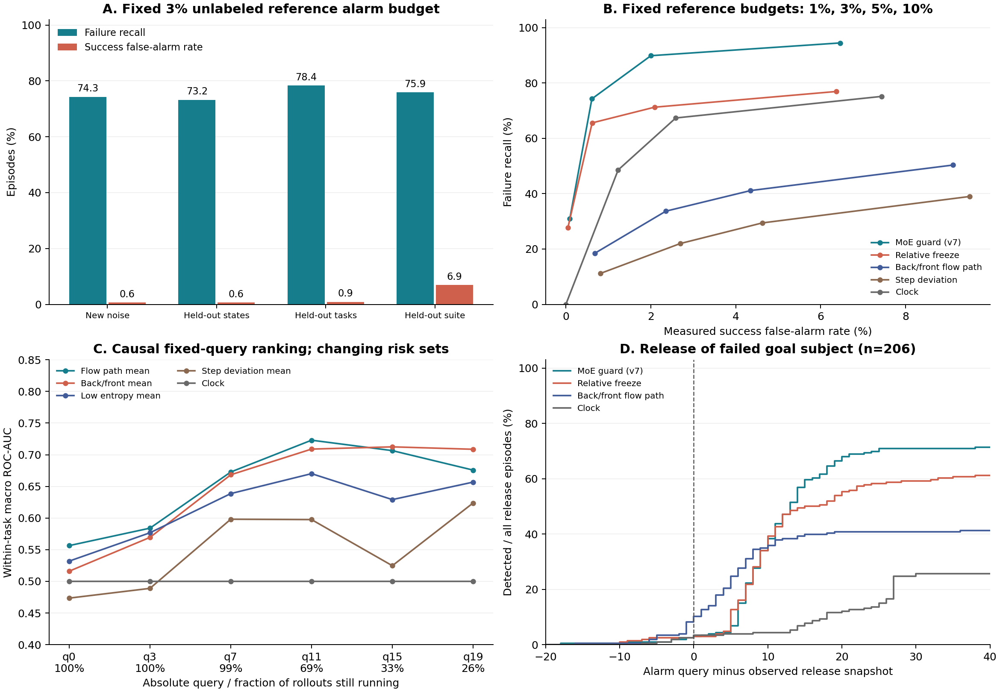
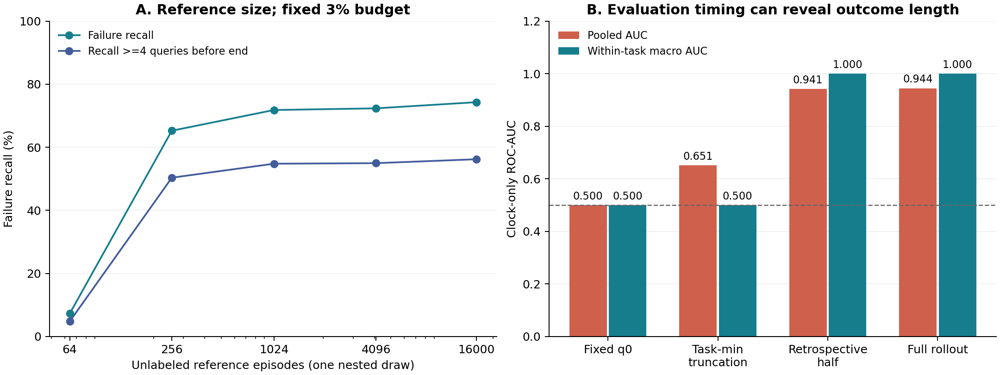

# 无训练 MoE 对照 SAFE / VLAConf：首轮实测报告

2026-09-06。已完成缓存上的评分、阈值校准、评价和审计。这里将失败检测的输入改为冻结 HiMoE-VLA 的 MoE 路由统计，使用固定公式；没有训练检测网络，也没有用本轮结果标签拟合阈值。

**主要结果：** 固定 3% 无标签参考报警预算，外部噪声队列检出 419/564 次失败，成功轨迹误报 92/15,036，即 recall 74.29%、FPR 0.61%。但执行前区分较弱，跨套件误报增大；主检测器在 206 条目标物体匹配的脱手记录中，只有 5 条在脱手前报警。当前证据支持部分执行异常的无训练检测，尚不支持通用的早期失败置信度。

## 0. 数据、方法与解释边界

参考集 16,000 集、40 个任务、噪声种子 1000–1007；测试集 15,600 集、39 个任务、噪声种子 1008–1015。测试有 564 次原始失败，参考标签在预测封存后核查为 532 次失败。初始状态均为 0–49；新噪声队列本身不是未见任务。

按 `(run_id, task, episode)` 一对一连接标签，交叉核对 init state / noise seed。MoE 各缓存的 task、episode、length、valid 全部对齐；564 条失败记录额外核对 snapshot 数等于 inference query 数、每 snapshot 间隔 10 个物理动作。成功定义沿用原始 rollout，不使用延长超时后的结果。

共比较 12 个固定 MoE 分数的 current / causal mean / prefix max，另加时钟和随机控制，共 38 个评分变体。在线首次报警合并等价的 current / max，再加入已有 v7 无标签预算 guard，共 27 个报警方法。8 种参考设置 × 4 档预算，完整结果均保留。

主操作对照 `v7_unlabeled_budget` 继承仓库已有的相对冻结与持续扰动规则。本轮重新校准并统一评价，不将它作为新发明。其他候选用于检验把 MoE 静态统计、flow 结构和非参数距离直接接入两篇论文实验的可行性。参考 median/MAD 是数据依赖的统计量：本轮是无检测器训练、有无标签参考数据。

全部新分数、阈值、报警和源文件哈希先由 `seal.py` 封存，然后 `evaluate.py` 读取标签；`diagnostics.py` 的套件拆分、选择性风险和物体匹配核查是在看过首批汇总后增加，未改变任何封存预测。继承的信号设计受过历史标签反馈，该语料也曾被探索，因此不称为全新盲测。

## 1. SAFE 对应：在线失败检测与提前量

[SAFE v2](https://arxiv.org/html/2506.09937v2) 用训练出的内部特征探针与成功样本校准阈值。本实验保留失败检测评价目标，替换为无训练 MoE 统计和全体无标签参考的报警预算。两者的校准目标不同，3% 参考预算不等于 3% 成功 FPR，也没有分布外 FPR 保证。

| 参考设置 | TP / 564 | FP / 15,036 | Recall | FPR | 至少提前 4 query | T-det |
| --- | --- | --- | --- | --- | --- | --- |
| cohort_transfer | 419 | 92 | 74.29% | 0.61% | 56.21% | 0.789 |
| state_heldout | 413 | 92 | 73.23% | 0.61% | 55.85% | 0.790 |
| task_heldout | 442 | 133 | 78.37% | 0.88% | 59.93% | 0.768 |
| suite_heldout | 428 | 1044 | 75.89% | 6.94% | 60.28% | 0.688 |

FPR 包含成功轨迹上的每一次首次报警，无论它多接近终止。提前量定义为最后观测 query 索引减报警 query；T-det 为报警索引除以最后 query 索引，漏报记 1。这是明确的本地实现口径，不能与旧报告中 `length - first` 的 lead 直接混用。

主设置的按 task、再按 task/init 聚类的 1,000 次 bootstrap：recall 95% 区间 61.40%–83.53%，FPR 0.24%–1.10%，提前 4 query recall 32.58%–72.30%。同一初始状态的全部噪声分支保留在一起，区间较宽。

### 固定分数消融（全参考，3% 预算）

| 方法 | TP | FP | Recall | FPR | 至少提前 4 query |
| --- | --- | --- | --- | --- | --- |
| entropy_high__current | 0 | 367 | 0.00% | 2.44% | 0.00% |
| entropy_high__mean | 0 | 452 | 0.00% | 3.01% | 0.00% |
| entropy_low__current | 62 | 455 | 10.99% | 3.03% | 9.75% |
| entropy_low__mean | 36 | 432 | 6.38% | 2.87% | 3.90% |
| margin_low__current | 14 | 421 | 2.48% | 2.80% | 2.48% |
| margin_low__mean | 12 | 460 | 2.13% | 3.06% | 2.13% |
| token_collapse__current | 40 | 389 | 7.09% | 2.59% | 6.91% |
| token_collapse__mean | 51 | 358 | 9.04% | 2.38% | 9.04% |
| flow_path_high__current | 121 | 389 | 21.45% | 2.59% | 20.39% |
| flow_path_high__mean | 70 | 450 | 12.41% | 2.99% | 7.80% |
| frontback_inversion__current | 190 | 354 | 33.69% | 2.35% | 31.21% |
| frontback_inversion__mean | 54 | 372 | 9.57% | 2.47% | 6.91% |
| entropy_front_low__current | 58 | 435 | 10.28% | 2.89% | 9.22% |
| entropy_front_low__mean | 5 | 585 | 0.89% | 3.89% | 0.89% |
| entropy_first_flow_low__current | 107 | 461 | 18.97% | 3.07% | 17.38% |
| entropy_first_flow_low__mean | 86 | 459 | 15.25% | 3.05% | 11.88% |
| token_front_collapse__current | 2 | 650 | 0.35% | 4.32% | 0.35% |
| token_front_collapse__mean | 0 | 449 | 0.00% | 2.99% | 0.00% |
| freeze__current | 370 | 93 | 65.60% | 0.62% | 50.00% |
| freeze__mean | 256 | 242 | 45.39% | 1.61% | 34.93% |
| deviation_global__current | 64 | 477 | 11.35% | 3.17% | 10.82% |
| deviation_global__mean | 27 | 463 | 4.79% | 3.08% | 3.72% |
| deviation_step__current | 124 | 405 | 21.99% | 2.69% | 18.09% |
| deviation_step__mean | 66 | 416 | 11.70% | 2.77% | 7.45% |
| clock | 274 | 185 | 48.58% | 1.23% | 48.58% |
| random | 44 | 486 | 7.80% | 3.23% | 6.91% |
| v7_unlabeled_budget | 419 | 92 | 74.29% | 0.61% | 56.21% |

相对 freeze 比熵、margin、token 分工绝对值更有用。高 entropy 在该固定工作点没有检出失败；低 entropy 也仅检出少数。前后层 flow-path 比值存在信号，但误报与覆盖仍不足。当前结果不能把 router entropy 当成成功概率。

时钟在 3% 预算下检出 274 次失败、185 次误报；它的检出全部来自 Long。主方法比时钟的 recall 高 25.71 个百分点，配对聚类区间为 3.71–56.83；提前 4 query recall 的差为 7.62 个百分点，区间 −6.38–31.73，未证明稳定的提前量优势。主方法相对单独 freeze 的 recall 差区间也跨 0，见 `paired_comparisons.csv`。

## 2. SAFE 对应：任务留出与套件留出

state_heldout 为 init ID mod 5 的五折；task_heldout 为套件内任务轮流分配的五折；suite_heldout 每次完全排除一个套件的参考统计。每条测试轨迹各评分一次；task ID 仅用于分割，不进入分数。这里留出的是参考数据，无法撤销历史研究中接触过这些任务的事实。

| 设置 | 套件 | 失败数 | Recall | FPR | 至少提前 4 query |
| --- | --- | --- | --- | --- | --- |
| cohort_transfer | libero_goal | 106 | 58.49% | 0.03% | 44.34% |
| cohort_transfer | libero_long | 274 | 86.50% | 2.28% | 84.31% |
| cohort_transfer | libero_object | 44 | 50.00% | 0.08% | 34.09% |
| cohort_transfer | libero_spatial | 140 | 70.00% | 0.08% | 17.14% |
| suite_heldout | libero_goal | 106 | 48.11% | 0.03% | 33.96% |
| suite_heldout | libero_long | 274 | 99.64% | 27.83% | 99.64% |
| suite_heldout | libero_object | 44 | 38.64% | 0.08% | 25.00% |
| suite_heldout | libero_spatial | 140 | 62.14% | 0.08% | 14.29% |

跨套件的主要失效集中在留出 Long：成功误报率达到 27.83%。短任务参考的停止/扰动分布不足以校准长任务，这一结果不支持直接跨时长分布部署。

## 3. SAFE 对应：统一长度后的区分能力

每个任务按测试轨迹的最短长度统一截断，再取可用前缀最大分数。截断点是离线评价信息，不输入检测器。pooled AUC 仍可能利用任务差异，因此必须同时看 task-macro AUC；宏平均只包含当时同时有成功和失败样本的任务。

| 方法 | Pooled AUC | Task-macro AUC | Failure AP |
| --- | --- | --- | --- |
| entropy_low__mean | 0.460 | 0.588 | 0.034 |
| flow_path_high__mean | 0.483 | 0.675 | 0.036 |
| frontback_inversion__current | 0.515 | 0.665 | 0.053 |
| freeze__current | 0.624 | 0.476 | 0.245 |
| deviation_global__mean | 0.468 | 0.532 | 0.034 |
| deviation_step__mean | 0.577 | 0.572 | 0.042 |
| clock | 0.651 | 0.500 | 0.145 |
| random | 0.557 | 0.470 | 0.044 |

在这个更受约束的早期比较中，flow-path mean 的任务宏 AUC 为 0.675，但 pooled AUC 只有 0.483。说明任务内存在一些区分信息，跨任务的绝对分数尺度仍有明显问题；不能用完整轨迹的大 AUC 替代该结果。

## 4. VLAConf 对应：执行前与在线排名

[VLAConf v2](https://arxiv.org/html/2605.29605v2) 的 CFN 和 Platt 校准均含拟合步骤；本轮以固定 MoE 分数评价对应的排序任务。q0 指首个动作 chunk 生成后、执行前；后续取固定绝对 query，评分仅使用当时前缀。

| q0 方法 | Pooled AUC | Task-macro AUC |
| --- | --- | --- |
| entropy_high__current | 0.556 | 0.468 |
| entropy_low__current | 0.444 | 0.532 |
| margin_low__current | 0.553 | 0.468 |
| token_collapse__current | 0.622 | 0.494 |
| flow_path_high__current | 0.474 | 0.556 |
| frontback_inversion__current | 0.428 | 0.516 |
| entropy_front_low__current | 0.468 | 0.478 |
| entropy_first_flow_low__current | 0.450 | 0.542 |
| token_front_collapse__current | 0.625 | 0.508 |
| freeze__current | -- | -- |
| deviation_global__current | 0.439 | 0.467 |
| deviation_step__current | 0.523 | 0.474 |
| clock | 0.500 | 0.500 |
| random | 0.516 | 0.536 |

q0 的 token collapse 虽有 pooled AUC 约 0.62，任务宏 AUC 约 0.49；任务难度差异不能当成同一任务内的可靠执行前预测。当前 fixed scores 的执行前能力总体较弱，最大者也受多候选选择影响。freeze 需要轨迹 warm-up，在 q0 不可用。

| 检查点 | 在运行轨迹覆盖 | Flow-path mean 宏 AUC | Back/front mean 宏 AUC | Step deviation mean 宏 AUC |
| --- | --- | --- | --- | --- |
| q0 | 100.00% | 0.556 | 0.516 | 0.474 |
| q3 | 100.00% | 0.584 | 0.569 | 0.489 |
| q7 | 99.12% | 0.673 | 0.668 | 0.598 |
| q11 | 68.81% | 0.723 | 0.709 | 0.598 |
| q15 | 32.53% | 0.706 | 0.712 | 0.525 |
| q19 | 26.24% | 0.676 | 0.709 | 0.624 |

到 q11，仍在运行的轨迹只剩 68.81%；到 q19 剩 26.24%。后续分数增强同时伴随成功轨迹退出风险集合，不能把不同取点的 AUC 曲线直接解释为对同一批样本越来越准确。标准三套件与 Long 的独立排名见 `scope_ranking_metrics.csv`。

## 5. VLAConf 对应：mean/max 与 step 消融

| 分数 | q11 pooled AUC | q11 task-macro AUC | q11 AP |
| --- | --- | --- | --- |
| flow_path_high__current | 0.654 | 0.635 | 0.101 |
| flow_path_high__mean | 0.487 | 0.723 | 0.120 |
| flow_path_high__max | 0.479 | 0.566 | 0.083 |
| deviation_global__current | 0.486 | 0.536 | 0.058 |
| deviation_global__mean | 0.535 | 0.561 | 0.095 |
| deviation_global__max | 0.493 | 0.538 | 0.063 |
| deviation_step__current | 0.499 | 0.541 | 0.059 |
| deviation_step__mean | 0.666 | 0.598 | 0.114 |
| deviation_step__max | 0.585 | 0.565 | 0.078 |

全局参考使用无标签 median/MAD；step 参考在每个 query 独立计算，少于 32 个可用参考样本时弃权。它是 VLAConf 时间条件的无训练对应实验，不是其 step embedding 的原样复现。step 对部分 pooled 指标有帮助，但没有一致的宏平均改善。

mean/max 的作用依赖分数和任务；mean 不能自动改善在线报警。对相同轨迹峰值阈值，current 与 prefix max 的首次报警严格等价，所以没有把这两者当成独立报警方法。全部组合列在 `ranking_metrics.csv`。

## 6. VLAConf 对应：参考数据量与选择性风险

| 参考轨迹数 | Recall | FPR | 至少提前 4 query |
| --- | --- | --- | --- |
| 16000 | 74.29% | 0.61% | 56.21% |
| 64 | 7.27% | 0.03% | 4.79% |
| 256 | 65.25% | 0.54% | 50.35% |
| 1024 | 71.81% | 0.65% | 54.79% |
| 4096 | 72.34% | 0.59% | 54.96% |

小参考量使用种子 20260906 的一组嵌套子集，没有多次抽样误差条，也不作为最小样本量保证。N=64 时 3% 预算只容许 1 条参考报警，而双分支并集的一个离散步长会产生 2 条，所以选到 0 条参考报警的保守阈值；检出率只有 7.27%。N=256 后明显改善。这是参考规模实验，不是 VLAConf 的有标签概率校准数据量实验。

| 参考预算 | 最终未报警覆盖率 | 未报警轨迹失败率 | 检出失败数 |
| --- | --- | --- | --- |
| 1.00% | 98.79% | 2.52% | 175 |
| 3.00% | 96.72% | 0.96% | 419 |
| 5.00% | 94.82% | 0.39% | 507 |
| 10.00% | 90.36% | 0.22% | 533 |

原始失败率为 3.62%。3% 参考预算在完整回放结束时保留 96.72% 未报警轨迹，保留集失败率为 0.96%；但在 q19 的保留集失败率仍为 2.96%，尚有 458 次最终失败未被报警。这里仅报告被动轨迹筛选结果，没有让被标记轨迹自动变成功，也没有模拟外部 expert 接管收益。

## 7. 物理事件：终止前报警不等于脱手前预警

| 方法 | 物体匹配事件数 | 最终检出 | 严格脱手前 | 脱手时或之前 | 至少提前 4 query | 已检出者中位延迟 |
| --- | --- | --- | --- | --- | --- | --- |
| frontback_inversion__current | 206 | 85 | 17 | 21 | 7 | 5 query |
| freeze__current | 206 | 126 | 5 | 6 | 5 | 9 query |
| clock | 206 | 53 | 5 | 7 | 2 | 23 query |
| v7_unlabeled_budget | 206 | 148 | 5 | 6 | 2 | 10 query |

先按脱手相关的失败 goal 找到对应物体，再读取该物体的首次抓持丢失 snapshot，避免把多物体任务中另一个已成功放置物体的更早 release 当成事件。266 次脱手相关主失败中有 206 次具备这一匹配时刻；缺失的 60 次不补造标签。首次抓持丢失仍只是已观测事件，不是已证明的不可逆失败起点；没有成功轨迹的同等事件标注，不能计算物理事件分类的完整 FPR。

第一版 `physical_timing.csv` 使用所有目标物体最早 release，在脱手相关子集为 208 次、主方法 4 次在该时刻或之前。物体匹配核查后为 206 次、6 次时刻或之前，其中严格提前 5 次，已检出者中位延迟 10 query。保留原表供审计，正文以 `subject_release_metrics.csv` 为准。结论仍是报警多数晚于可见的脱手事件。

| 原始失败模式 | 样本数 | Recall | 至少提前终止 4 query |
| --- | --- | --- | --- |
| approached_target_without_observed_contact | 14 | 85.71% | 78.57% |
| goal_predicate_regressed | 26 | 76.92% | 69.23% |
| mechanism_threshold_not_reached | 1 | 100.00% | 100.00% |
| no_meaningful_target_progress | 2 | 100.00% | 100.00% |
| object_moved_but_goal_unmet | 89 | 64.04% | 55.06% |
| object_released_or_dropped_before_goal | 241 | 71.37% | 44.40% |
| object_released_outside_goal | 25 | 60.00% | 32.00% |
| stable_grasp_not_observed | 143 | 86.71% | 74.13% |
| timeout_while_holding_target | 23 | 69.57% | 65.22% |

## 8. 必须保留的长度与套件控制

| 时钟评价取点 | Pooled AUC | Task-macro AUC |
| --- | --- | --- |
| q0 | 0.500 | 0.500 |
| safe_task_min_prefixmax | 0.651 | 0.500 |
| retrospective_half | 0.941 | 1.000 |
| full_rollout_prefixmax | 0.944 | 1.000 |

50% 实际长度与完整轨迹评价的时钟很强，说明该数据的停止规则泄露最终结果。这是评价时间轴的混淆，不能据此断言某个因果 MoE 分数读取了未来。SAFE 的统一长度策略减少任务内混淆，但 pooled AUC 仍可能来自任务间长度差。

| 主方法测试范围 | 轨迹数 | 失败数 | Recall | FPR | 至少提前 4 query |
| --- | --- | --- | --- | --- | --- |
| all | 15600 | 564 | 74.29% | 0.61% | 56.21% |
| standard_3_suites | 11600 | 290 | 62.76% | 0.06% | 29.66% |
| long | 4000 | 274 | 86.50% | 2.28% | 84.31% |

VLAConf 的标准三套件范围在本缓存中有 11,600 集；Long 有 4,000 集，单列。3% 工作点下，标准三套件的提前 4 query recall 为 29.66%，明显低于加入 Long 后的总分，不能只给总分。

## 9. 已核验与本轮未完成的对照

固定统计、平票预算、padding、前缀因果性和指标实现共 8 项测试通过。额外在真实缓存随机选 64 集，对各集的 52 个前缀重算 v7，全部与已封存首次报警一致；2,052 个参考校准检查均没有超过预算。分数缓存约 200 MB，主设置 248,255 个有效 query 的 38 个候选批量评分耗时约 0.52 秒。该耗时不含原始 MoE 张量提取，也不是单轨迹端到端延迟，不能与 SAFE 的在线开销数字直接比较。

| 论文实验或必要对照 | 状态 / 原因 |
| --- | --- |
| SAFE 式检测、统一长度 AUC、提前量、任务留出 | 已完成本地 MoE 适配；原策略和数据不同，非原表数值复现 |
| VLAConf 执行前/在线、聚合、step、参考量 | 已完成无训练对应实验；未训练 CFN 和 Platt |
| 概率校准 ECE / Brier / NLL | 未完成。无标签偏差或百分位不是成功概率，本轮不拟合结果监督概率映射 |
| SAFE 末层 hidden / VLAConf 原版配对基线 | 未完成。当前大规模缓存缺少所需配对特征/示范；零散 hidden 缓存属于另一任务和取点 |
| MoE 专家实际输出、动作/状态同协议对照 | 未完成全量配对实验；不能据本轮 routing 结果声称胜过这些表征 |
| LIBERO-Pro/Plus 受控扰动、多模型、实机 | 未完成，没有对应新 rollout |
| VLAConf 外部 expert 真实接管 | 未完成，只有被动选择性风险；无辅助成功率结论 |

本次检查时 8 张 GPU 均被现有进程占用，因此没有启动新策略 rollout 或专家输出重采集，也没有中断其他实验。现有缓存足以完成上面列出的首轮统计实验。

## 10. 对研究方向的判断

**在线异常检测有可用起点，执行前和故障前预警尚无充分支持。** 相对自身早期轨迹的 MoE 动态，比路由熵或绝对特征距离更有用；但当前效果集中在后期停滞，受长任务比例影响，跨套件校准会失效。

下一轮最有价值的检验是：在新采集、完整配对的固定前缀上，加入 routed/shared 比例、方向和专家输出分歧，并同最后层 hidden 及动作/状态的无训练统计比较。重点评价物理事件前、相同绝对 query、相同任务内的增量，保留从未参与方法选择的新任务/噪声数据。该建议来自本轮结果，尚未声称这些功能量已经有效。

## 复现文件

设计见 [PROTOCOL_ZH.md](../../PROTOCOL_ZH.md)，运行方式见 [README.md](../../README.md)。全部参数、拆分行号和统计量在 `*_profiles.json`；预测及源文件哈希在 `sealed_manifest.json`，标签连接在 `label_alignment.csv`。各 CSV 保留全部方法，不按本轮结果筛除负面结果。PNG 与矢量 PDF 均在 `figures/`。
