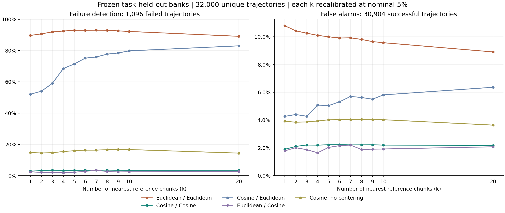
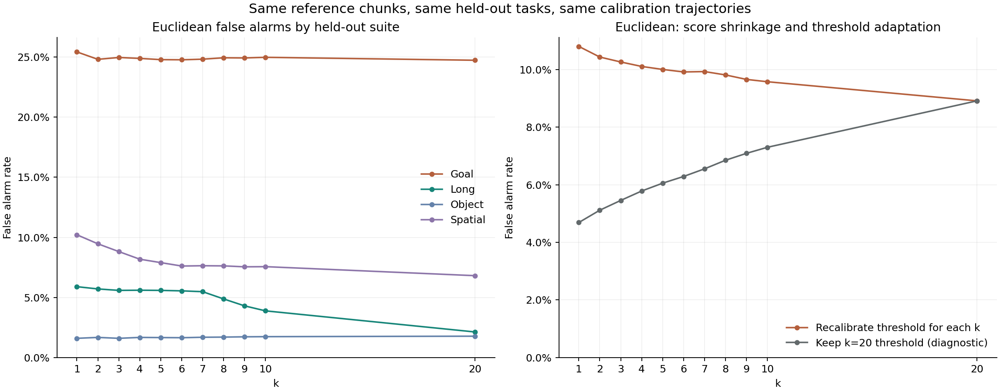

# k=1 至 10：全库误报敏感性扫描

固定上一轮 16 轮完整任务留出配置、参考库成员和 10D 特征；每种 k 都测试同样 32,000 条唯一轨迹，其中 30,904 成功、1,096 失败。k=20 作为复现对照。没有训练模型或新增 rollout。

## 欧氏 kNN 主结果

每个 k 独立在同一 A 成功校准集上按 task/init 组最大值校准，标称 alpha=5%。

| k | 检出 /1,096 | 召回率 | 误报 /30,904 | 误报率 | 报警精确率 |
| --- | --- | --- | --- | --- | --- |
| 1 | 983 | 89.69% | 3338 | 10.80% | 22.75% |
| 2 | 994 | 90.69% | 3224 | 10.43% | 23.57% |
| 3 | 1008 | 91.97% | 3171 | 10.26% | 24.12% |
| 4 | 1014 | 92.52% | 3123 | 10.11% | 24.51% |
| 5 | 1019 | 92.97% | 3091 | 10.00% | 24.79% |
| 6 | 1019 | 92.97% | 3064 | 9.91% | 24.96% |
| 7 | 1020 | 93.07% | 3068 | 9.93% | 24.95% |
| 8 | 1019 | 92.97% | 3032 | 9.81% | 25.15% |
| 9 | 1015 | 92.61% | 2984 | 9.66% | 25.38% |
| 10 | 1011 | 92.24% | 2959 | 9.57% | 25.47% |
| 20 | 977 | 89.14% | 2754 | 8.91% | 26.19% |

从 k=20 改为 k=1，误报从 2,754 变为 3,338，检出从 977 变为 983。k=1 至 10 的实际误报率范围为 9.57% 至 10.80%；不能把扫描中的最好结果当成已经在新数据上验证的最优 k。

本次冻结设置下，k=1 至 10 均比 k=20 误报更多。k=1 净增加 584 条误报，检出总数仅净增加 6 条。这个结果不支持仅通过减少邻居数解决当前高误报。



## 为什么减小 k 不一定降低误报

对欧氏 kNN，分数是最近 k 个参考 chunk 距离的平均值。k 减小会使这个平均距离不增，但成功校准轨迹的分数也一起缩小，因此对应阈值也不增。是否报警取决于距离相对阈值的位置，不是单独看距离大小。下面分别报告逐 k 校准和固定 k=20 阈值的结果：

| k | 独立校准：误报率 | 独立校准：检出 | 保留旧阈值：误报率 | 保留旧阈值：检出 |
| --- | --- | --- | --- | --- |
| 1 | 10.80% | 983 | 4.69% | 737 |
| 2 | 10.43% | 994 | 5.12% | 783 |
| 3 | 10.26% | 1008 | 5.46% | 829 |
| 4 | 10.11% | 1014 | 5.78% | 852 |
| 5 | 10.00% | 1019 | 6.05% | 879 |
| 6 | 9.91% | 1019 | 6.29% | 892 |
| 7 | 9.93% | 1020 | 6.55% | 902 |
| 8 | 9.81% | 1019 | 6.85% | 913 |
| 9 | 9.66% | 1015 | 7.09% | 918 |
| 10 | 9.57% | 1011 | 7.30% | 927 |
| 20 | 8.91% | 977 | 8.91% | 977 |

固定旧阈值会改变该 k 的校准工作点，需连同召回率一起比较，不能只看误报下降就归因为 k 更好。本轮 k=1 阈值是各自 k=20 阈值的 62.7% 至 86.5%。逐轮数值如下：

| 轮次 | k=1 | k=10 | k=20 | 阈值 k1/k20 |
| --- | --- | --- | --- | --- |
| libero_goal_full_0 | 1.619959 | 1.853745 | 1.959985 | 0.827 |
| libero_goal_full_1 | 1.809839 | 2.206711 | 2.456162 | 0.737 |
| libero_goal_full_2 | 1.915305 | 2.084499 | 2.221624 | 0.862 |
| libero_goal_full_3 | 1.841562 | 2.020635 | 2.129475 | 0.865 |
| libero_long_full_0 | 2.705848 | 3.490763 | 4.315521 | 0.627 |
| libero_long_full_1 | 2.855956 | 3.176598 | 3.934083 | 0.726 |
| libero_long_full_2 | 2.667431 | 3.574435 | 3.875976 | 0.688 |
| libero_long_full_3 | 2.882439 | 3.816478 | 4.464548 | 0.646 |
| libero_object_full_0 | 1.894348 | 2.195237 | 2.798142 | 0.677 |
| libero_object_full_1 | 1.981375 | 2.178276 | 2.344538 | 0.845 |
| libero_object_full_2 | 1.657453 | 1.980269 | 2.102504 | 0.788 |
| libero_object_full_3 | 1.888259 | 2.548034 | 2.761310 | 0.684 |
| libero_spatial_full_0 | 1.524893 | 1.882161 | 2.021518 | 0.754 |
| libero_spatial_full_1 | 1.562052 | 2.065137 | 2.192049 | 0.713 |
| libero_spatial_full_2 | 1.618907 | 1.860584 | 1.998883 | 0.810 |
| libero_spatial_full_3 | 1.807173 | 2.087781 | 2.305409 | 0.784 |



## 误报是否集中在同样的任务

| 任务 | 成功轨迹数 | k=1 误报 | k=5 误报 | k=10 误报 | k=20 误报 |
| --- | --- | --- | --- | --- | --- |
| libero_goal/push_the_plate_to_the_front_of_the_stove | 797 | 746 (93.60%) | 759 (95.23%) | 767 (96.24%) | 771 (96.74%) |
| libero_goal/put_the_wine_bottle_on_the_rack | 796 | 710 (89.20%) | 697 (87.56%) | 702 (88.19%) | 702 (88.19%) |
| libero_goal/open_the_middle_drawer_of_the_cabinet | 800 | 253 (31.62%) | 247 (30.88%) | 255 (31.87%) | 254 (31.75%) |
| libero_spatial/pick_up_the_black_bowl_on_the_wooden_cabinet_and_place_it_on_the_plate | 768 | 324 (42.19%) | 222 (28.91%) | 224 (29.17%) | 217 (28.26%) |
| libero_goal/put_the_wine_bottle_on_top_of_the_cabinet | 797 | 165 (20.70%) | 154 (19.32%) | 148 (18.57%) | 144 (18.07%) |
| libero_spatial/pick_up_the_black_bowl_next_to_the_ramekin_and_place_it_on_the_plate | 783 | 178 (22.73%) | 164 (20.95%) | 152 (19.41%) | 123 (15.71%) |
| libero_spatial/pick_up_the_black_bowl_on_the_stove_and_place_it_on_the_plate | 724 | 145 (20.03%) | 137 (18.92%) | 137 (18.92%) | 116 (16.02%) |
| libero_long/STUDY_SCENE1_pick_up_the_book_and_place_it_in_the_back_compartment_of_the_caddy | 786 | 281 (35.75%) | 252 (32.06%) | 164 (20.87%) | 91 (11.58%) |

原 k=20 的 2,754 条误报中，2,552 条在 k=1 仍然报警，202 条不再报警；同时 k=1 新增 786 条成功误报。原 k=20 误报中有 2,480 条在 k=1 至 10 全部报警。

以下是原 k=20 误报最多的两个任务，成功轨迹的全程峰值/对应阈值分布。比值大于 1 即报警。k=1 已经只使用最近的一个点；如果此时仍大量超过 1，扩大近邻平均半径就不能解释全部误报。

| 任务 | k | 不可评分 | ≤0.5 | (0.5,1] | (1,1.5] | (1.5,2] | >2 |
| --- | --- | --- | --- | --- | --- | --- | --- |
| libero_goal/push_the_plate_to_the_front_of_the_stove | 1 | 0 | 0 | 51 | 179 | 226 | 341 |
| libero_goal/push_the_plate_to_the_front_of_the_stove | 20 | 0 | 0 | 26 | 207 | 275 | 289 |
| libero_goal/put_the_wine_bottle_on_the_rack | 1 | 0 | 0 | 86 | 568 | 135 | 7 |
| libero_goal/put_the_wine_bottle_on_the_rack | 20 | 0 | 0 | 94 | 577 | 116 | 9 |

不同任务成功状态与历史参考几何的差异、参考点覆盖，以及跨任务校准阈值的适配性仍需区分。本轮保持它们固定，能够检验 k 的影响，但没有单独改变参考覆盖或任务校准，不能由此确定唯一物理原因。

## 余弦和混合打分对照

| k | 余弦检出 /1,096 | 余弦误报率 | 余弦近邻+欧氏打分检出 | 混合打分误报率 |
| --- | --- | --- | --- | --- |
| 1 | 32 | 1.90% | 571 | 4.27% |
| 2 | 35 | 2.10% | 592 | 4.40% |
| 3 | 38 | 2.21% | 647 | 4.28% |
| 4 | 36 | 2.20% | 751 | 5.08% |
| 5 | 37 | 2.22% | 783 | 5.04% |
| 6 | 38 | 2.23% | 824 | 5.32% |
| 7 | 38 | 2.21% | 832 | 5.70% |
| 8 | 39 | 2.22% | 852 | 5.63% |
| 9 | 38 | 2.22% | 860 | 5.51% |
| 10 | 37 | 2.20% | 875 | 5.82% |
| 20 | 38 | 2.17% | 910 | 6.36% |

欧氏近邻加余弦打分、不中心化余弦以及 episode 校准结果也全部保存在 CSV 中。五种方法各 11 个 k 配置，没有按测试标签选择阈值。

## 数据与复现

- [pooled_metrics.csv](pooled_metrics.csv)：全量所有 k、距离和校准对照。
- [suite_metrics.csv](suite_metrics.csv)、[cohort_metrics.csv](cohort_metrics.csv)、[task_metrics.csv](task_metrics.csv)：套件、A/B、任务明细。
- [euclidean_trajectory_results.csv](euclidean_trajectory_results.csv)：恰好 32,000 行，所有 k 的首次报警、阈值、峰值和实际控制进度。`-1` 表示没有报警。
- [all_episode_results.npz](all_episode_results.npz)：`first/thresholds` 为 `[calibration,method,k,global_row]=[2,5,11,32000]`；`peak_scores/first_fixed_k20` 为 `[5,11,32000]`。
- `predictions/*.npz`：每轮所有校准及测试 chunk 分数，`scores[method,k,test_position,query]`，含 `test_rows` 全局行号映射。q0 至 q6 及结束后为 NaN；分数不使用测试结果。
- [alarm_query_distribution.csv](alarm_query_distribution.csv)、[alarm_query_bins.csv](alarm_query_bins.csv)、[alarm_progress_distribution.csv](alarm_progress_distribution.csv)：每个 k 的全部首次报警分布；控制进度使用实际 action_steps。
- [paired_with_k20.csv](paired_with_k20.csv)、[k_persistence_distribution.csv](k_persistence_distribution.csv)：逐轨迹报警变化和跨 k 持续报警数量。
- [euclidean_peak_ratio_bins.csv](euclidean_peak_ratio_bins.csv)：各任务和各 k 的峰值/阈值分布。
- [thresholds.csv](thresholds.csv)、[k20_replay_audit.csv](k20_replay_audit.csv)、[verification.json](verification.json)、[report_verification.json](report_verification.json)：校准、复现和核验。
- [固定方案](../../boundary_knn/K_SWEEP_PROTOCOL_ZH.md)。

```bash
export OPENBLAS_NUM_THREADS=1 OMP_NUM_THREADS=1 MKL_NUM_THREADS=1
python 'safe&vlaconf/moe_trainfree/boundary_knn/sweep_k.py' score --output /tmp/himoe-k-sweep
python 'safe&vlaconf/moe_trainfree/boundary_knn/sweep_k.py' verify --output /tmp/himoe-k-sweep
python 'safe&vlaconf/moe_trainfree/boundary_knn/report_k_sweep.py' --output /tmp/himoe-k-sweep
```
