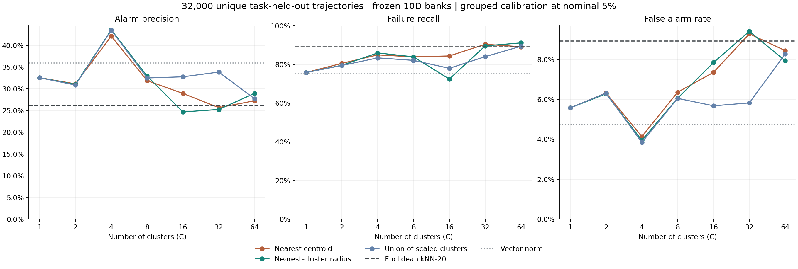
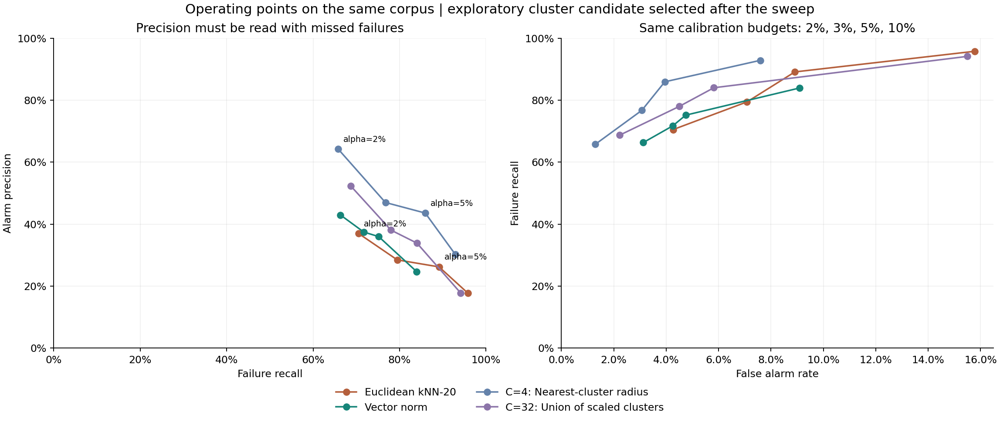

# K-means：能否提高报警精确率

同一 32,000 条轨迹、30,904 成功、1,096 失败，同一完整任务留出和成功参考库。策略参数冻结；只离线拟合 K-means 中心和参考半径，没有监督失败分类器训练或新增 rollout。K-means 有聚类拟合，不是完全不拟合任何参数。

本次扫描中，C=4: 最近簇半径归一化 在标称 5% 下精确率为 43.57%，原欧氏 kNN 为 26.19%；成功误报从 2,754 降到 1,220，失败检出从 977 变为 942。C=4 是看完本轮完整扫描后得到的探索候选，不能当成新的盲测成绩；事先指定的主簇数仍是 C=32。

## 三种打分

- 最近中心距离：参考成功 chunk 聚成 C 簇，取当前向量到最近中心的欧氏距离。
- 最近簇半径归一化：先按欧氏距离选簇，再除以该簇参考距离的 90% 半径。
- 所有簇相对半径取最小：允许任意一个正常簇解释当前向量，取所有距离/半径的最小值。

每种方法的最终阈值仍只用原 A 成功校准轨迹确定。测试任务从中心、半径、归一化和阈值计算中全部排除。

## 事先指定的主配置

| 方法 | 检出失败 | 召回率 | 成功误报 | 误报率 | 精确率 |
| --- | --- | --- | --- | --- | --- |
| 原欧氏 kNN-20 | 977/1096 | 89.14% | 2754/30904 | 8.91% | 26.19% |
| 向量范数 | 824/1096 | 75.18% | 1467/30904 | 4.75% | 35.97% |
| C=32: 最近中心距离 | 991/1096 | 90.42% | 2867/30904 | 9.28% | 25.69% |
| C=32: 最近簇半径归一化 | 982/1096 | 89.60% | 2906/30904 | 9.40% | 25.26% |
| C=32: 所有簇相对半径取最小 | 921/1096 | 84.03% | 1799/30904 | 5.82% | 33.86% |

## 扫描候选

| 方法 | 检出失败 | 召回率 | 成功误报 | 误报率 | 精确率 |
| --- | --- | --- | --- | --- | --- |
| C=4: 最近中心距离 | 931/1096 | 84.95% | 1279/30904 | 4.14% | 42.13% |
| C=4: 最近簇半径归一化 | 942/1096 | 85.95% | 1220/30904 | 3.95% | 43.57% |
| C=4: 所有簇相对半径取最小 | 914/1096 | 83.39% | 1188/30904 | 3.84% | 43.48% |

相对原 kNN，候选净减少 1,534 条成功误报，检出总数净减少 35 条。原误报中 1,695 条消失，同时新增 161 条误报；原检出中 60 条不再报警，又新增检出 25 条。应同时观察精确率和漏检，不能仅以报警数量少判断好坏。

## 全部簇数

| C | 中心：精确率 | 中心：召回 | 中心：FPR | 最近簇尺度：精确率 | 最近簇尺度：召回 | 最近簇尺度：FPR | 簇并集：精确率 | 簇并集：召回 | 簇并集：FPR |
| --- | --- | --- | --- | --- | --- | --- | --- | --- | --- |
| 1 | 32.56% | 75.82% | 5.57% | 32.56% | 75.82% | 5.57% | 32.56% | 75.82% | 5.57% |
| 2 | 31.15% | 80.57% | 6.32% | 31.01% | 79.56% | 6.28% | 30.88% | 79.47% | 6.31% |
| 4 | 42.13% | 84.95% | 4.14% | 43.57% | 85.95% | 3.95% | 43.48% | 83.39% | 3.84% |
| 8 | 31.89% | 83.94% | 6.36% | 32.95% | 83.94% | 6.06% | 32.50% | 82.12% | 6.05% |
| 16 | 28.94% | 84.40% | 7.35% | 24.68% | 72.45% | 7.84% | 32.77% | 78.01% | 5.68% |
| 32 | 25.69% | 90.42% | 9.28% | 25.26% | 89.60% | 9.40% | 33.86% | 84.03% | 5.82% |
| 64 | 27.25% | 89.14% | 8.44% | 28.96% | 91.15% | 7.93% | 27.72% | 89.42% | 8.27% |



簇数更多并不保证更好。粗粒度中心会合并一些参考点之间的细节，半径归一化会改变不同局部模式的容忍范围；这些操作也可能覆盖失败状态。哪一种改变起作用需要结合本表的原始中心和归一化对照，不能只归功于使用了 K-means。

## 精确率与召回的取舍

| 方法 | 标称预算 | 检出失败 | 召回率 | 成功误报 | 误报率 | 精确率 |
| --- | --- | --- | --- | --- | --- | --- |
| C=32: 所有簇相对半径取最小 | 2% | 753/1096 | 68.70% | 686/30904 | 2.22% | 52.33% |
| C=4: 最近簇半径归一化 | 2% | 721/1096 | 65.78% | 401/30904 | 1.30% | 64.26% |
| 原欧氏 kNN-20 | 2% | 773/1096 | 70.53% | 1318/30904 | 4.26% | 36.97% |
| 向量范数 | 2% | 727/1096 | 66.33% | 966/30904 | 3.13% | 42.94% |
| C=32: 所有簇相对半径取最小 | 3% | 855/1096 | 78.01% | 1391/30904 | 4.50% | 38.07% |
| C=4: 最近簇半径归一化 | 3% | 841/1096 | 76.73% | 949/30904 | 3.07% | 46.98% |
| 原欧氏 kNN-20 | 3% | 871/1096 | 79.47% | 2190/30904 | 7.09% | 28.45% |
| 向量范数 | 3% | 786/1096 | 71.72% | 1313/30904 | 4.25% | 37.45% |
| C=32: 所有簇相对半径取最小 | 5% | 921/1096 | 84.03% | 1799/30904 | 5.82% | 33.86% |
| C=4: 最近簇半径归一化 | 5% | 942/1096 | 85.95% | 1220/30904 | 3.95% | 43.57% |
| 原欧氏 kNN-20 | 5% | 977/1096 | 89.14% | 2754/30904 | 8.91% | 26.19% |
| 向量范数 | 5% | 824/1096 | 75.18% | 1467/30904 | 4.75% | 35.97% |
| C=32: 所有簇相对半径取最小 | 10% | 1032/1096 | 94.16% | 4789/30904 | 15.50% | 17.73% |
| C=4: 最近簇半径归一化 | 10% | 1018/1096 | 92.88% | 2347/30904 | 7.59% | 30.25% |
| 原欧氏 kNN-20 | 10% | 1050/1096 | 95.80% | 4874/30904 | 15.77% | 17.72% |
| 向量范数 | 10% | 920/1096 | 83.94% | 2808/30904 | 9.09% | 24.68% |

这些是相同校准预算下的工作点，实际误报率并不相同。更严格阈值可以提高精确率，但对应的漏检也必须保留在分母中。没有根据测试标签单独优化阈值，也没有设置部署用的精确率目标。



## 跨批次和任务表现

| 批次 | 方法 | 检出失败 | 成功误报 | 精确率 |
| --- | --- | --- | --- | --- |
| A | 原欧氏 kNN-20 | 478/532 | 1349/15468 | 26.16% |
| A | C=4: 最近簇半径归一化 | 457/532 | 577/15468 | 44.20% |
| B | 原欧氏 kNN-20 | 499/564 | 1405/15436 | 26.21% |
| B | C=4: 最近簇半径归一化 | 485/564 | 643/15436 | 43.00% |

| suite | 方法 | 检出失败 | 成功误报 | 精确率 |
| --- | --- | --- | --- | --- |
| libero_goal | 原欧氏 kNN-20 | 206/208 | 1927/7792 | 9.66% |
| libero_goal | C=4: 最近簇半径归一化 | 195/208 | 771/7792 | 20.19% |
| libero_long | 原欧氏 kNN-20 | 430/541 | 159/7459 | 73.01% |
| libero_long | C=4: 最近簇半径归一化 | 405/541 | 82/7459 | 83.16% |
| libero_object | 原欧氏 kNN-20 | 75/81 | 141/7919 | 34.72% |
| libero_object | C=4: 最近簇半径归一化 | 76/81 | 203/7919 | 27.24% |
| libero_spatial | 原欧氏 kNN-20 | 266/266 | 527/7734 | 33.54% |
| libero_spatial | C=4: 最近簇半径归一化 | 266/266 | 164/7734 | 61.86% |

| 原误报最多任务 | kNN 误报 | 候选误报 | kNN 检出 | 候选检出 |
| --- | --- | --- | --- | --- |
| libero_goal/push_the_plate_to_the_front_of_the_stove | 771/797 | 644/797 | 3/3 | 3/3 |
| libero_goal/put_the_wine_bottle_on_the_rack | 702/796 | 69/796 | 4/4 | 4/4 |
| libero_goal/open_the_middle_drawer_of_the_cabinet | 254/800 | 15/800 | 0/0 | 0/0 |
| libero_spatial/pick_up_the_black_bowl_on_the_wooden_cabinet_and_place_it_on_the_plate | 217/768 | 31/768 | 32/32 | 32/32 |
| libero_goal/put_the_wine_bottle_on_top_of_the_cabinet | 144/797 | 12/797 | 3/3 | 3/3 |
| libero_spatial/pick_up_the_black_bowl_next_to_the_ramekin_and_place_it_on_the_plate | 123/783 | 24/783 | 17/17 | 17/17 |
| libero_spatial/pick_up_the_black_bowl_on_the_stove_and_place_it_on_the_plate | 116/724 | 3/724 | 76/76 | 76/76 |
| libero_long/STUDY_SCENE1_pick_up_the_book_and_place_it_in_the_back_compartment_of_the_caddy | 91/786 | 12/786 | 12/14 | 14/14 |

改善并不均匀。应重点保留尚未解决的高误报任务和表现退化的 suite，避免用全库平均值掩盖局部问题。更严格 2% 设置下的剩余误报与漏检已分别标记在 [candidate_errors_alpha002.csv](candidate_errors_alpha002.csv)。

## 报警时序

以下使用标称 5% 的 task/init 校准。q 为零起始推理 chunk，每个完整 chunk 执行 10 个动作。

| 首次 q | kNN 失败 | 候选失败 | kNN 成功 | 候选成功 |
| --- | --- | --- | --- | --- |
| no_alarm | 119 | 154 | 28150 | 29684 |
| q7 | 0 | 0 | 4 | 0 |
| q8-10 | 63 | 45 | 1829 | 634 |
| q11-14 | 278 | 237 | 798 | 464 |
| q15-19 | 167 | 206 | 65 | 59 |
| q20-29 | 145 | 131 | 27 | 32 |
| q30-39 | 246 | 240 | 31 | 30 |
| q40-51 | 78 | 83 | 0 | 1 |

| 方法 | 轨迹结果 | 进度 0-25% | 25-50% | 50-75% | 75-100% |
| --- | --- | --- | --- | --- | --- |
| 原欧氏 kNN-20 | 失败检出 | 30 | 159 | 598 | 190 |
| 原欧氏 kNN-20 | 成功误报 | 2 | 48 | 1125 | 1579 |
| C=4: 最近簇半径归一化 | 失败检出 | 32 | 134 | 566 | 210 |
| C=4: 最近簇半径归一化 | 成功误报 | 1 | 46 | 430 | 743 |

进度按 10*q/实际 action_steps 事后分箱，不用轨迹补齐长度，也不是检测器输入。完整逐 q 和各控制进度分布都已导出，没有用一个中位数代替分布。

已有 B 目标物体脱手事件子集：

| 方法 | 标称预算 | 事件轨迹 | 早于事件 | 同 q | 晚于事件 | 没报警 |
| --- | --- | --- | --- | --- | --- | --- |
| 原欧氏 kNN-20 | 2% | 216 | 7 | 1 | 143 | 65 |
| 向量范数 | 2% | 216 | 5 | 0 | 137 | 74 |
| C=4: 最近簇半径归一化 | 2% | 216 | 3 | 4 | 133 | 76 |
| C=32: 所有簇相对半径取最小 | 2% | 216 | 4 | 4 | 138 | 70 |
| 原欧氏 kNN-20 | 5% | 216 | 23 | 6 | 162 | 25 |
| 向量范数 | 5% | 216 | 8 | 1 | 159 | 48 |
| C=4: 最近簇半径归一化 | 5% | 216 | 10 | 10 | 166 | 30 |
| C=32: 所有簇相对半径取最小 | 5% | 216 | 21 | 11 | 149 | 35 |

目标物体脱手不是不可逆失败起点。整段轨迹的检测精确率也不等于早期预警精确率或干预救回率。

## 参考簇覆盖

| C | 16 轮簇总数 | 少于 20 点的回退簇 | 最少参考点 | 最多参考点 |
| --- | --- | --- | --- | --- |
| 1 | 16 | 0 | 4096 | 4096 |
| 2 | 32 | 0 | 1156 | 2940 |
| 4 | 64 | 0 | 342 | 1902 |
| 8 | 128 | 0 | 30 | 929 |
| 16 | 256 | 0 | 26 | 547 |
| 32 | 512 | 7 | 13 | 310 |
| 64 | 1024 | 44 | 2 | 174 |

少于 20 点的簇使用该轮、该 C 的总体参考残差 90% 半径。全部半径和参考任务构成见 [cluster_summary.csv](cluster_summary.csv)。聚类不能凭空补充未见任务的真实成功状态，因此参考覆盖和任务偏移仍需要进一步区分。

## 数据与复现

- [pooled_metrics.csv](pooled_metrics.csv)：全部 23 种分数、4 档预算、2 种校准的全量结果。
- [cohort_metrics.csv](cohort_metrics.csv)、[suite_metrics.csv](suite_metrics.csv)、[task_metrics.csv](task_metrics.csv)：A/B、suite、任务明细。
- [trajectory_results.csv](trajectory_results.csv)：32,000 行，基线、C=32 和探索候选 C 的所有预算首次报警、阈值、峰值及实际进度。
- [candidate_errors_alpha002.csv](candidate_errors_alpha002.csv)：探索候选在严格 2% 设置下的所有误报和漏检，含原始轨迹身份。
- [all_episode_results.npz](all_episode_results.npz)：`first/thresholds[calibration,alpha,method,global_row]=[2,4,23,32000]`，`peak_scores=[23,32000]`，各轴名称一并保存。
- `predictions/*.npz`：所有校准和测试的逐 chunk 分数 `[method,trajectory_position,query]`，含全局行号；无效位置为 NaN。
- `profiles/*_c*.npz`：参考簇中心、分配、半径、稀疏回退标志和原始参考 episode/query 身份。
- [alarm_query_distribution.csv](alarm_query_distribution.csv)、[alarm_progress_distribution.csv](alarm_progress_distribution.csv)：所有预算的精确报警分布。
- [paired_with_knn20.csv](paired_with_knn20.csv)、[physical_summary.csv](physical_summary.csv)：逐轨迹报警变化与已有物理事件时序。
- [verification.json](verification.json)、[report_verification.json](report_verification.json)：参考隔离、独立距离、全部阈值/报警及数据哈希核验。
- [固定方案](../../boundary_knn/KMEANS_PROTOCOL_ZH.md)。

```bash
export OPENBLAS_NUM_THREADS=1 OMP_NUM_THREADS=1 MKL_NUM_THREADS=1
python 'safe&vlaconf/moe_trainfree/boundary_knn/kmeans_reference.py' score --output /tmp/himoe-kmeans
python 'safe&vlaconf/moe_trainfree/boundary_knn/kmeans_reference.py' verify --output /tmp/himoe-kmeans
python 'safe&vlaconf/moe_trainfree/boundary_knn/report_kmeans.py' --output /tmp/himoe-kmeans
```
