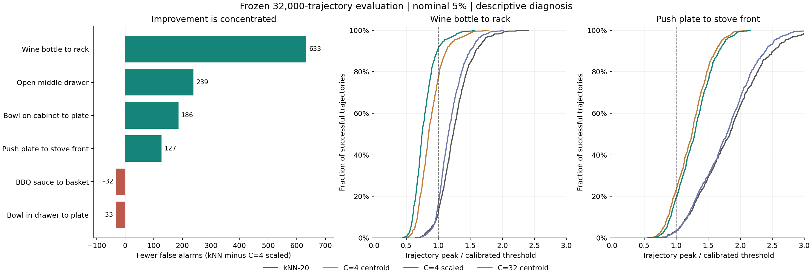

# K-means 现象诊断

本次只分析已经冻结的 32,000 条轨迹结果，没有重新拟合模型、选择新阈值或新增 rollout。下列结论区分了直接观测和机制解释；C=4 仍是前一轮扫描后选出的探索候选。

总体判断：4 簇改善了部分未见任务上的报警工作点，但改善集中、受到校准尾部影响，而且整段轨迹评价存在很强的终止时长因素。目前证据更支持跨任务分数尺度和正常区域覆盖有所改善，尚不能解释为学到了更准确的早期失败边界。

## 1. 低精确率首先受失败占比限制

当前失败占比为 1,096/32,000 = 3.425%。精确率同时取决于失败检出和成功误报：

```text
precision = prevalence * recall
            / (prevalence * recall + (1 - prevalence) * FPR)
```

4 簇加半径在 5% 校准预算下检出 942 条失败，同时误报 1,220 条成功，所以精确率仍只有 43.57%。实际成功误报率 3.95% 已经足以让误报多于正确报警。

若保持检出 942 条失败，要达到 80% 精确率，成功误报最多约 235 条，对应 FPR 约 0.76%；达到 90% 则需约 0.34%。这不是一般部署阈值建议，只是固定本语料失败占比和召回的数量关系。仅推盘子任务目前的 644 条误报，就已超过前一个全库误报额度。

## 2. 改善集中在少数任务和同一轮划分

40 个任务中，15 个误报减少，11 个不变，14 个增加。代表性结果如下，均为 5% 校准预算：

| 任务 | 原 kNN 误报 | 4 簇加半径误报 | 净减少 |
| --- | --- | --- | --- |
| 酒瓶放架子 | 702/796 | 69/796 | 633 |
| 打开中间抽屉 | 254/800 | 15/800 | 239 |
| 柜子上的碗放盘子 | 217/768 | 31/768 | 186 |
| 酒瓶放柜顶 | 144/797 | 12/797 | 132 |
| 推盘子到炉前 | 771/797 | 644/797 | 127 |
| BBQ 酱放篮子 | 55/779 | 87/779 | -32 |
| 抽屉里的碗放盘子 | 23/774 | 56/774 | -33 |

酒瓶放架子、打开中间抽屉、酒瓶放柜顶属于同一轮测试 `libero_goal_full_0`，共享该轮参考库和校准阈值。三个任务贡献 1,004/1,534 = 65.45% 的净误报减少，不能当成三次独立的校准验证。

移除这一轮后，精确率仍从 36.97% 提高到 45.41%，误报从 1,654 降到 1,124，检出从 970 降到 935。因此收益并非全部来自这一轮，但全库平均值显著放大了这组任务的改善。

Object 套件整体误报从 141 增到 203，精确率从 34.72% 降到 27.24%。这意味着还没有一个在各类任务上都稳定有效的正常边界。

完整 40 任务和 16 轮分解见 [task_effects.csv](task_effects.csv)、[fold_effects.csv](fold_effects.csv)。

## 3. 4 簇的部分收益来自距离与校准阈值的相对变化

以酒瓶放架子的 796 条成功轨迹为例。先比较同样使用原始欧氏中心距离的 C=4 和 C=32，避免半径归一化改变单位：

| 量 | 10% 分位 | 25% 分位 | 50% 分位 | 75% 分位 | 90% 分位 |
| --- | --- | --- | --- | --- | --- |
| 每条轨迹的 C4 峰值距离 / C32 峰值距离 | 1.034 | 1.075 | 1.162 | 1.315 | 1.503 |

对应校准阈值从 C32 的 2.428 提高到 C4 的 3.994，比例为 1.645。成功轨迹的原始距离通常也增大了，但阈值增幅更大，导致相对阈值的异常程度下降。这是该任务减误报的一个可直接核查的机制，不能仅解释成成功点更靠近了聚类中心。

把各方法的轨迹峰值除以它自己的 5% 校准阈值，超过 1 才报警：

| 方法 | 10% 分位 | 25% 分位 | 50% 分位 | 75% 分位 | 90% 分位 |
| --- | --- | --- | --- | --- | --- |
| kNN-20 | 0.984 | 1.091 | 1.233 | 1.401 | 1.584 |
| C32 中心距离 | 0.966 | 1.043 | 1.160 | 1.325 | 1.495 |
| C4 中心距离 | 0.675 | 0.748 | 0.851 | 0.988 | 1.126 |
| C4 中心距离 / 簇半径 | 0.600 | 0.667 | 0.748 | 0.866 | 0.985 |



图中右侧分布说明：4 簇使推盘子成功轨迹的相对分数下降了，但多数仍超过阈值。它缓解了一部分任务偏移，没有消除该任务的覆盖缺口。

全库中，C4 原始中心距离已有 42.13% 精确率，加半径后为 43.57%；不能把全部提升归因于半径修正。K-means 改变了几何表示，成功校准再改变报警边界，两者共同决定结果。仅凭当前分解，不能给两者分配独立的因果贡献比例。

完整分布见 [score_distributions.csv](score_distributions.csv)。

## 4. 更多簇确实携带更多参考任务信息，但不等于更好的失败边界

每簇以其最多的参考任务计数，汇总后得到参考点的任务集中度；同时报告扣除随机一致性的任务与簇分配关联度 AMI。16 轮取均值：

| 簇数 | 任务集中度 | 任务关联 AMI |
| --- | --- | --- |
| 1 | 20.95% | 0.000 |
| 4 | 39.22% | 0.256 |
| 8 | 45.91% | 0.291 |
| 16 | 52.57% | 0.307 |
| 32 | 57.07% | 0.307 |
| 64 | 63.05% | 0.312 |

数据支持参考任务身份影响了簇分配。少量中心会压缩一些任务和局部形状的差异，更多中心能描述这些差异，但未见任务未必符合这种更细的结构。与此同时，少量中心和球形范围也可能容纳失败状态，所以减误报会伴随漏检。

这是与当前结果相符的解释，不是已证明的物理机制：不能把四个簇命名为四个执行阶段，也不能推断最佳簇数必然为四。集中度本身会受簇数影响；AMI 也没有说明全部几何差异都来自任务。

详见 [cluster_task_summary.csv](cluster_task_summary.csv)、[cluster_task_composition.csv](cluster_task_composition.csv)。

## 5. 全库排序变好，同任务内部排序没有同步提高

使用各轮 5% 成功校准阈值归一化后的轨迹峰值，观察整条排序，而不仅是单一报警点。每个任务内阈值是常数，因此任务内排序不受该归一化影响。任务宏平均只含 37 个同时有成功和失败样本的任务：

| 方法 | 全库 AUROC | 全库 AP | 任务内平均 AUROC | 任务内平均 AP |
| --- | --- | --- | --- | --- |
| kNN-20 | 0.9647 | 0.6220 | 0.9945 | 0.9113 |
| C4 中心距离 | 0.9709 | 0.7356 | 0.9938 | 0.9158 |
| C4 加半径 | 0.9772 | 0.6889 | 0.9926 | 0.9130 |
| C32 中心距离 | 0.9676 | 0.6197 | 0.9923 | 0.8899 |

AP 是平均精度，汇总整条精确率与召回曲线，不是当前报警点的精确率。C4 加半径在当前工作点更好，不代表所有工作点都胜过 C4 原始距离。

这些对照更支持跨任务的分数可比性与工作点有所改善。同任务成败排序本来已经很高，C4 没有带来一致提升。少数任务只有极少失败，宏平均也不能当作统计显著性结论。

原 kNN 检出的失败中，C4 加半径丢掉 60 条，新增检出 25 条。丢掉的失败包括目标达成前脱手 22 条、物体移动但未达标 12 条、未观察到稳定抓取 12 条、目标条件回退 8 条等，没有证据表明它仅过滤了某一种无关报警。失败原因来自已有事后标注，不是本次新做的物理审计，完整计数见 [failure_reasons.csv](failure_reasons.csv)。

## 6. 2% 的精确率跳升受到校准尾部离散性的影响

每轮只有 67 至 70 个成功 task/init 校准组，每组先取多条成功轨迹峰值的最大值。在当前秩公式下：

| 校准预算 | 实际取的组分数 |
| --- | --- |
| 5% | 第三大 |
| 3% | 第二大 |
| 2% | 最大 |

16 轮全部如此。C4 加半径从 5% 改到 2%，阈值提高约 2.9% 至 52.2%，全库精确率从 43.57% 跳到 64.26%，同时检出从 942 降到 721。两者使用同一分数，变化完全来自阈值。

因此 2% 结果由各轮最极端的一个成功校准组决定，不能解释成边界分辨能力突然增强，也不代表未见任务实际 FPR 有 2% 保证。校准组的最大值来源轨迹、峰值 chunk 和任务都已导出：[calibration_units.csv](calibration_units.csv)、[calibration_thresholds.csv](calibration_thresholds.csv)。

## 7. 最重要的评估限制：最终时长已经能区分同套件成败

本语料全部失败都执行到步数上限，全部成功在上限前结束：

| 套件 | 失败条数 | 每条失败的最终动作步数 | 成功最长动作步数 |
| --- | --- | --- | --- |
| Goal | 208 | 300 | 293 |
| Long | 541 | 520 | 517 |
| Object | 81 | 280 | 275 |
| Spatial | 266 | 220 | 213 |

只把最终动作步数当作事后分数，在 37 个有失败样本的任务内，AUROC 和 AP 都为 1；每个套件内也为 1。最终时长在运行过程中不可用，这不是可以部署的预测器，而是揭示评价结构的诊断基线。

这不证明 MoE 分数只是在计时，也不是特征使用了未来数据的证据。它说明整段轨迹的峰值评价与提前预警是不同问题：成功早停，失败继续运行，时间相关的行为和更多评分机会都可能帮助事后区分。之前验证的逐 chunk 因果性不解决这种评价口径差异。

已有 216 条目标脱手事件轨迹中，在 5% 设置下，kNN 早于事件报警 23 条，C4 加半径只有 10 条；C4 还有 10 条同 chunk 报警、166 条晚于事件、30 条未报警。脱手本身不必然不可逆，但这些时序结果没有显示提前预警收益。

所以目前可以说“整段轨迹报警更精确”，还不能说“更早识别可救回的失败”。时长数据见 [duration_by_task.csv](duration_by_task.csv)，事件时序见 [上一轮物理事件明细](../physical_summary.csv)。

## 8. 对下一轮 train-free 修改的含义

1. 首先冻结 C4 候选，在新的参考与校准划分上检查任务稳定性，保留 C32 和 kNN 对照。优先看推盘子和 Object 回退任务，不能继续只按全库精确率选参数。
2. 把主要评价改为共同执行窗口、预定动作预算或已标注物理事件之前的报警，同时报告当时仍在运行的成功与失败数量。完整轨迹检出仍保留为辅助指标，防止终止时长主导结论。
3. 研究任务或状态条件下的参考覆盖，以及轨迹内分数是否持续恶化。当前 8 层 mobility 特征已经相对初期 q1-4 做归一化，再做相同操作没有解决残余任务偏移的依据。与 v7/v8 结合时，应检验额外的时间变化证据是否提供提前量，不能预设简单取交集就一定更好。
4. 条件化和自适应只能使用当时可见的状态与前缀，不能使用最终成败或真实总时长；参考更新也不能无条件吸收当前异常段。聚类仍只拟合历史参考统计，不更新 VLA/MoE 参数。

## 复现

[诊断脚本](../../../boundary_knn/diagnose_kmeans.py)只读取冻结结果，校验输入哈希，复核 256,000 个报警决定和 512 个校准阈值。诊断表格与图片的哈希见 [verification.json](verification.json)。本说明文档是对这些输出的人工整理。

```bash
OPENBLAS_NUM_THREADS=1 OMP_NUM_THREADS=1 MKL_NUM_THREADS=1 \
python 'safe&vlaconf/moe_trainfree/boundary_knn/diagnose_kmeans.py'
```
