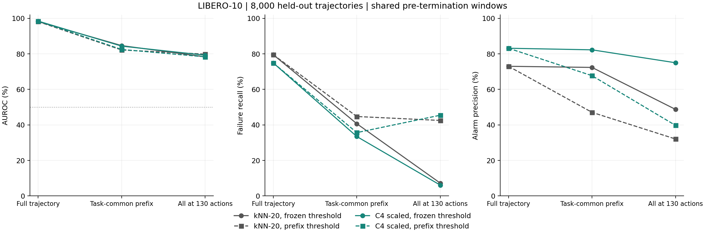

# LIBERO-10：在成功终止之前还能检测多少失败

日期：2026-09-07。复用 Round 11 的四轮完整任务留出及封存分数；不更新模型、参考或聚类，不新增 rollout。协议：[COMMON_HORIZON_PROTOCOL_ZH.md](../../boundary_knn/COMMON_HORIZON_PROTOCOL_ZH.md)。

**原先的 1.10% 误报率是 82 / 7,459 = 1.0993%。** 分母是最终成功轨迹，不是全部 8,000 条轨迹，也不是报警总数。对应 C4 最近簇半径归一化、task/init 校准、名义 alpha=5%。原先同时检出 405/541 条失败，共报警 487 次，精确率 405/487=83.16%。

控制观察长度后，原阈值下 C4 的结果变为：同任务首次成功之前检出 181 条、误报 39 条；全套件统一到 130 个动作时检出 33 条、误报 11 条。原先接近 98 的完整轨迹 AUROC 不能作为早期监测能力的证据。

## 1. 两种共同窗口

全部 8,000 条轨迹保留在分母中，包括 7,459 条成功和 541 条失败，没有按结果删除轨迹。

| 窗口 | 截止规则 | 最后使用的推理点 |
| --- | --- | --- |
| 完整轨迹 | 原评价方式，每条轨迹到自身终止前 | 每条不同 |
| 同任务共同窗口 | 每个任务找最早终止动作 T；该任务所有轨迹只用 10*q < T 的推理分数 | 各任务 q13-q34，即已执行 130-340 个动作 |
| 全套件共同窗口 | 所有任务统一在任何一条成功终止之前评价 | q13，即已执行 130 个动作 |

本批最早成功在第 140 个动作结束。q13 的特征来自已经执行 130 个动作后的观测，当前 chunk 尚未执行；不包含第 140 步的成功结果。所有任务的最早终止也都核对为成功。

逐任务共同截止如下，第一列任务简称与完整 ID 的对应见 [task_cutoffs.csv](task_cutoffs.csv)：

| 任务 | 最早成功动作 | 最后评分时已执行动作 |
| --- | ---: | ---: |
| 开炉灶并放上摩卡壶 | 216 | 210 |
| 黑碗放入下层抽屉并关闭 | 197 | 190 |
| 杯子放入微波炉并关闭 | 218 | 210 |
| 两个摩卡壶放到炉灶上 | 345 | 340 |
| 字母汤和奶油奶酪放进篮子 | 212 | 210 |
| 字母汤和番茄酱放进篮子 | 231 | 230 |
| 奶油奶酪和黄油放进篮子 | 221 | 220 |
| 两个杯子分别放到左右盘子 | 195 | 190 |
| 白杯放盘子、布丁放盘子右边 | 193 | 190 |
| 书放到收纳架后格 | 140 | 130 |

共同窗口长度是事后评价用的统计量，不是新任务运行时预先知道的信息。“成功终止之前”也不意味着所有失败轨迹都还没有发生物理错误。

## 2. 保留原阈值，只截断测试轨迹

以下为 `frozen_full`。AUROC 使用窗口内峰值除以原校准阈值，与上一轮报告定义衔接。各行失败分母均为 541、成功分母均为 7,459。

| 窗口 | 方法 | AUROC | 检出 TP | 误报 FP | 召回率 | FPR | 精确率 |
| --- | --- | ---: | ---: | ---: | ---: | ---: | ---: |
| 完整 | kNN-20 | 98.16 | 430 | 159 | 79.48% | 2.13% | 73.01% |
| 完整 | C4 加半径 | 98.44 | 405 | 82 | 74.86% | 1.10% | 83.16% |
| 同任务共同 | kNN-20 | 84.65 | 220 | 84 | 40.67% | 1.13% | 72.37% |
| 同任务共同 | C32 中心 | 82.93 | 252 | 173 | 46.58% | 2.32% | 59.29% |
| 同任务共同 | C4 中心 | 88.28 | 182 | 29 | 33.64% | 0.39% | 86.26% |
| 同任务共同 | C4 加半径 | 84.35 | 181 | 39 | 33.46% | 0.52% | 82.27% |
| 全体 130 步 | kNN-20 | 78.32 | 39 | 41 | 7.21% | 0.55% | 48.75% |
| 全体 130 步 | C32 中心 | 78.65 | 78 | 131 | 14.42% | 1.76% | 37.32% |
| 全体 130 步 | C4 中心 | 81.55 | 29 | 2 | 5.36% | 0.03% | 93.55% |
| 全体 130 步 | C4 加半径 | 79.24 | 33 | 11 | 6.10% | 0.15% | 75.00% |

C4 加半径的原 405 次检出中，224 次晚于对应任务共同窗口，372 次晚于全体 130 步窗口。原 82 次成功误报中，分别只有 39 次、11 次已经发生。提前结束评价使误报和检出同时减少，不能单凭误报下降判断方法改善。

原 82 条误报的 `task/source/episode/init_state_id/noise_seed/global_row`、首次报警 query 及截断后状态均保存在 [original_82_false_alarms.csv](original_82_false_alarms.csv)。

## 3. 历史校准数据也截断，再重新定阈值

完整轨迹阈值可能对早期窗口过高。因此另做 `prefix_calibration`：只使用原先划分的 A 历史校准轨迹，在与测试相同的 q 上限内取成功轨迹峰值，再按 task/init 组取最大值，保持 alpha=5%。参考库和评分不变，不使用测试分数或测试成败选择阈值。

| 窗口 | 方法 | 检出 TP | 误报 FP | 召回率 | FPR | 精确率 |
| --- | --- | ---: | ---: | ---: | ---: | ---: |
| 同任务共同 | kNN-20 | 242 | 272 | 44.73% | 3.65% | 47.08% |
| 同任务共同 | C32 中心 | 258 | 270 | 47.69% | 3.62% | 48.86% |
| 同任务共同 | C4 中心 | 200 | 199 | 36.97% | 2.67% | 50.13% |
| 同任务共同 | C4 加半径 | 193 | 92 | 35.67% | 1.23% | 67.72% |
| 全体 130 步 | kNN-20 | 230 | 487 | 42.51% | 6.53% | 32.08% |
| 全体 130 步 | C32 中心 | 226 | 464 | 41.77% | 6.22% | 32.75% |
| 全体 130 步 | C4 中心 | 284 | 486 | 52.50% | 6.52% | 36.88% |
| 全体 130 步 | C4 加半径 | 246 | 373 | 45.47% | 5.00% | 39.74% |

统一 130 步时，C4 的四个折阈值从约 2.16-2.37 降到 1.49-1.70。检出增加到 246 条，仍漏掉 295 条失败，成功误报则增加到 373 条。373 条中，33 条属于原来的 82 条误报，另外 340 条原先没有报警。

重校准不是把成功误报强行定成某个数；本次 C4 恰好接近 5% FPR，其他方法仍超过 5%。具体校准组数、秩和阈值见 [calibration_thresholds.csv](calibration_thresholds.csv)。

## 4. AUC 的取分数方式和任务混淆

| C4 加半径，保留原阈值 | 全体峰值/阈值 AUC | 原始峰值 AUC | 末端值/阈值 AUC | 任务内平均峰值 AUC | 时间基线 AUC |
| --- | ---: | ---: | ---: | ---: | ---: |
| 完整轨迹 | 98.44 | 98.40 | 84.16 | 98.03 | 100.00 |
| 同任务共同 | 84.35 | 83.78 | 77.29 | 77.89 | 70.81 |
| 全体 130 步 | 79.24 | 78.65 | 75.65 | 62.70 | 50.00 |

共同窗口排除了同任务成败观察长度不等，但不同任务仍有不同截止时间及失败率。因此时间基线在同任务共同窗口的全体排序中仍为 70.81，任务内部则全部为 50.00。全体固定 130 步后，所有样本时间相同，时间基线为 50.00。

C4 的任务内平均 AUC 从完整轨迹 98.03 降到共同任务窗口 77.89、固定 130 步 62.70，说明最早阶段的同任务成败区分更困难。共同任务窗口内 181 次检出中的 131 次来自“双摩卡壶”任务，39 次误报中的 30 次也来自该任务；逐任务差异仍需保留。

本次同时保存峰值和末端分数，是因为 SAFE 正文描述历史最大值，而附录共同长度段落写 s_T，不能擅自忽略二者差异。这里只借鉴共同窗口思想，没有复现 SAFE 的检测头、策略、样本量和全部划分。

重校准时，**原始峰值 AUC 和任务内 AUC 不变**；归一化后的全体 AUC 可能变化，因为每折/每任务的阈值不同，除以这些阈值会改变跨组排序。它不违背单一分数的 AUROC 不依赖某一个报警阈值的定义。两种分数在 [metrics.csv](metrics.csv) 中均有列示，不能只挑有利的一种。

## 5. 全体尚未成功时的逐 query 结果

下面完整列出 q7-q13，没有按结果选检查点。方法固定为 C4 加半径：

| 已执行动作 | q | 原阈值 TP | 原阈值 FP | 当前窗口重校准 TP | 当前窗口重校准 FP |
| --- | ---: | ---: | ---: | ---: | ---: |
| 70 | 7 | 0 | 0 | 22 | 215 |
| 80 | 8 | 0 | 0 | 27 | 229 |
| 90 | 9 | 8 | 1 | 63 | 127 |
| 100 | 10 | 13 | 1 | 143 | 197 |
| 110 | 11 | 21 | 3 | 174 | 235 |
| 120 | 12 | 32 | 11 | 221 | 344 |
| 130 | 13 | 33 | 11 | 246 | 373 |

每个重校准检查点是一个独立的固定截止窗口实验。不能把这些阈值直接串成在线时变阈值，再声称整条轨迹仍满足 5% 误报控制；还需要针对联合越界事件校准。



## 6. 数据与复现

- [metrics.csv](metrics.csv)：72 行，包含所有窗口、四种方法、两种阈值及 task 宏平均。
- [group_metrics.csv](group_metrics.csv)：task、fold、A/B 及总体细分。
- [clock_metrics.csv](clock_metrics.csv)：对应窗口的时间基线。
- [windows.csv](windows.csv)、[task_cutoffs.csv](task_cutoffs.csv)：精确截断规则及动作时刻。
- [original_82_false_alarms.csv](original_82_false_alarms.csv)：原 82 条成功误报身份与截断后状态。
- [index.csv](index.csv)、[window_results.npz](window_results.npz)：8,000 条唯一轨迹和所有窗口的逐轨迹分数、阈值与首次报警。
- [verification.json](verification.json)：输入及生成产物哈希、原结果复现和覆盖核验。
- [PDF 图](length_control.pdf)。

NPZ 中 `peak_scores/endpoint_scores` 为 `[9 windows, 4 methods, 8000 trajectories]`，`thresholds/first` 为 `[9 windows, 2 threshold_modes, 4 methods, 8000 trajectories]`，具体名称保存在同名字符串数组中。`last_queries` 为 `[9,8000]`，`first=-1` 表示窗口内未报警。

运行前，新输出目录必须不存在：

```bash
OPENBLAS_NUM_THREADS=1 OMP_NUM_THREADS=1 python \
  'safe&vlaconf/moe_trainfree/boundary_knn/evaluate_common_horizon.py' \
  --output /tmp/himoe-common-horizon-reproduction
python -m pytest -q 'safe&vlaconf/moe_trainfree/boundary_knn/test_common_horizon.py'
```

已通过 3 项针对终止边界、晚期分数隔离、历史成功组校准的测试；另外独立读取原封存预测，复核全部 576,000 个轨迹报警判断、72 行总体指标、峰值/末端值、截断校准阈值及输入/输出哈希。全部 8,000 条轨迹唯一覆盖，无缺失或静默筛选。
