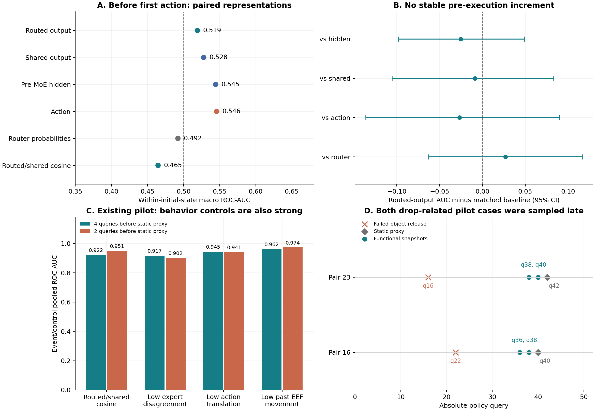
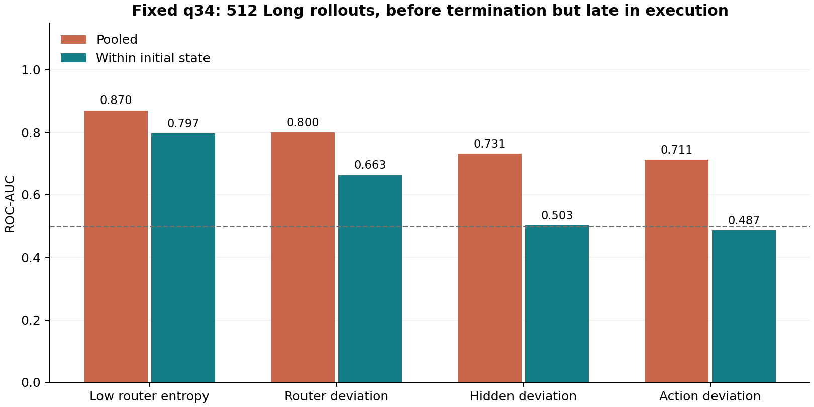

# 第二轮实测：专家功能量能否提供无训练的额外信号

2026-09-06。首轮之后补做了三组配对实验：首次动作执行前、固定在线 q34、已有功能事件 pilot。所有分数固定，不训练预测模型或概率头，完整预测在评价前封存。

**结论：本轮没有发现专家输出相对 hidden、共享分支或动作的稳定执行前增益。已有功能 pilot 的高区分度，也没有体现相对简单行为读数的优势。** 较晚阶段的路由熵仍有信号，但不应据此推广为执行前置信度或脱手前预警。

## 1. 实际使用的数据与方法

| 实验 | 规模 | 配对条件 | 可用输入 |
| --- | --- | --- | --- |
| q0 执行前 | 4 个任务，2,048 集，307 次失败 | 同一首次 query；每任务 16 init × 32 seeds | routed、shared、pre-MoE hidden、路由、动作、姿态 |
| q34 在线 | 1 个 Long 任务，512 集，216 次失败 | 全部轨迹在同一绝对 q34 仍有观测 | hidden 描述、路由、当前动作、当前姿态 |
| 静止事件 pilot | 24 对原始；每个 lead 23 对合格 | 同 init、同绝对 query 的事件/成功对照 | 真实采集功能标量、路由、历史动作及末端运动 |

q0 四任务涉及三个 checkpoint：Goal、Long 和 Spatial，后两个 Spatial 任务共享 checkpoint。参考统计、校准及测试始终在各任务内划分，没有将不同模型的 hidden 坐标混作共同参考。它们是历史 16×32 缓存，不同于首轮 40 任务的噪声队列，不直接比较两轮的绝对 recall/FPR。

主设置为四折 init 留出：每折 256 集算无标签统计、128 集校准阈值、128 集测试，三者的 init 完全分离。辅助设置按 noise seed 留出，允许相同初始状态。每集获得一次测试预测；预算为校准折的总标记率 1/3/5/10%，主点 3%。

所有表征采用同样两种固定评分：参考 median/MAD 下的平均绝对偏差，以及同一归一化空间中最近 5 个无标签参考点的平均 RMS 距离。没有 PCA、学习的特征权重、逻辑回归或神经检测头。routed/shared/hidden 使用已有同维度、同随机投影的每-token 表征，分别比较 flow d0、d9、全部 flow 均值；还评价 21 个定向功能/路由标量及控制，共 57 种读数。

**表征限制：** q0 的 routed/shared 输出由历史 fp16 hidden、记录的 Top-4 dispatch 和 checkpoint 权重离线重建，未声称运行时数值完全一致；同样的固定投影会损失信息。hidden 为 pre-MoE 输入的方向投影或统计描述，不是 SAFE 原版最后层特征。q34 没有专家实际输出缓存，因此该组只用于在线基线比较。

## 2. 执行前：没有看到 routed 输出优势

主指标为同一 task/init 内的 AUC，先对每任务有结果变化的 init 平均，再对四任务等权平均。这样能区分某个 init 本身更难和同一状态下某条 rollout 更危险；不含结果变化的 init 不进入该 AUC。q0 有 40 个混合结果的 task/init 组。

| 固定读数 | Pooled AUC | 任务宏 AUC | 同 init 宏 AUC |
| --- | --- | --- | --- |
| routed_d9__knn5 | 0.465 | 0.451 | 0.519 |
| shared_d9__knn5 | 0.519 | 0.494 | 0.528 |
| hidden_d9__knn5 | 0.419 | 0.447 | 0.545 |
| function4_d0__knn5 | 0.597 | 0.581 | 0.558 |
| route_d9__knn5 | 0.446 | 0.407 | 0.492 |
| proprio__knn5 | 0.413 | 0.429 | 0.500 |
| action__knn5 | 0.458 | 0.498 | 0.546 |
| cosine_high__flowmean | 0.569 | 0.407 | 0.465 |
| clock | 0.500 | 0.500 | 0.500 |
| random | 0.523 | 0.533 | 0.584 |

预先固定的主比较 routed-d9 kNN 为 0.519，hidden 为 0.545，shared 为 0.528，动作是 0.546。功能 pilot 沿用的 cosine 方向在执行前只有 0.465，不能把某一静止阶段的方向当成全程通用风险方向。

| Routed-d9 kNN 对照 | 同 init AUC 差 | 95% 区间 |
| --- | --- | --- |
| hidden_d9__knn5 | -0.025 | [-0.098, 0.049] |
| shared_d9__knn5 | -0.009 | [-0.105, 0.083] |
| action__knn5 | -0.027 | [-0.136, 0.090] |
| route_d9__knn5 | 0.027 | [-0.063, 0.117] |

上述四个差值区间均跨 0。区间以 init 重采样、条件于已有任务、噪声种子和已封存预测；它没有涵盖更换参考数据或新任务的所有不确定性。新噪声留出也没有稳定的主比较优势，全部结果在 `representation_comparisons.csv`。

### 各任务主读数

| 任务 | 失败 / 512 | Routed-d9 kNN 同 init AUC | Hidden-d9 kNN 同 init AUC |
| --- | --- | --- | --- |
| open_the_top_drawer_and_put_the_bowl_inside | 42 | 0.515 | 0.543 |
| KITCHEN_SCENE8_put_both_moka_pots_on_the_stove | 216 | 0.571 | 0.506 |
| pick_up_the_black_bowl_on_the_ramekin_and_place_it_on_the_plate | 12 | 0.512 | 0.609 |
| pick_up_the_black_bowl_on_the_stove_and_place_it_on_the_plate | 37 | 0.479 | 0.520 |

### 无标签阈值的实际工作点

| q0 方法 | 检出 / 307 | 误报 / 1,741 | Recall | FPR |
| --- | --- | --- | --- | --- |
| routed_d9__knn5 | 55 | 137 | 17.92% | 7.87% |
| shared_d9__knn5 | 94 | 147 | 30.62% | 8.44% |
| hidden_d9__knn5 | 81 | 273 | 26.38% | 15.68% |
| action__knn5 | 86 | 222 | 28.01% | 12.75% |
| cosine_high__flowmean | 41 | 105 | 13.36% | 6.03% |

3% 是独立校准折的总标记预算，不是新 init 上的 FPR 保证。128 条校准轨迹只允许 3 次标记；这些校准/测试 init 的分布差异可导致测试 FPR 明显增大。不能把无标签 kNN 距离称为已经校准的失败概率。

## 3. 随机控制与多重比较核查

本轮固定随机控制的宏 AUC 偶然偏高：q0 为 0.584，q34 为 0.631。没有更换它来改善图表。补充 1,000 次独立随机读数后，q0 中位数为 0.503，95% 范围约 [0.420, 0.577]；q34 中位数为 0.502，范围约 [0.409, 0.590]。分别有 15 次和 2 次达到原随机控制的值，说明有限混合 init 数与少量失败会产生明显波动。

另做了 5,000 次全局噪声种子置换：同一排列联合施加于所有 task/init，保留共同噪声种子的依赖；用 rank-sum 独立复算的 AUC 与原评价一致。对 57 个 q0 候选进行单侧 maxT 校正后，**没有一个达到 0.05**。这些诊断是在看过首批结果后增加，完整数据和研究历史也已被探索，不能当成预注册确认检验。

## 4. 固定 q34：路由有较晚阶段的信号

| q34 方法 | Pooled AUC | 同 init 宏 AUC |
| --- | --- | --- |
| hidden_descriptor__deviation | 0.731 | 0.503 |
| hidden_descriptor__knn5 | 0.452 | 0.495 |
| proprio__deviation | 0.437 | 0.552 |
| action__deviation | 0.711 | 0.487 |
| route_d9__deviation | 0.800 | 0.663 |
| clock | 0.500 | 0.500 |
| random | 0.537 | 0.631 |
| route_entropy_low__d9 | 0.870 | 0.797 |
| route_entropy_low__flowmean | 0.828 | 0.758 |

最后 flow 的低路由熵 pooled AUC 为 0.870、同 init AUC 为 0.797；这条固定信号在当前 Long 数据上比通用 hidden 描述距离更有效。3% 校准预算下仅检出 20/216 次失败、误报 1/296，显示高 AUC 不等于当前工作点有高召回。

这个结果有三项边界：一是 q34 的成功轨迹中位长度只有 39，失败轨迹全部长度 52，已接近正常完成阶段；二是有 20 条脱手相关失败具备对应物体的 release 时刻，其中 12 条发生在 q34 之前、8 条之后；三是只有一个已被反复探索的任务。

q34 的 23 候选校正中有 6 个通过，其中还包含偶然偏高的固定随机控制。原随机控制在 1,000 次重复随机读数中只有 2 次被达到；这个小概率结果被保留并明确报告。当前不把 q34 的显著性作为可靠的新任务泛化或早期安全预警证据。

## 5. 功能 pilot：高 AUC 是否超出行为读数

| 距静止 proxy 的 lead | 读数 | Pooled AUC | 同一匹配对排序准确率 |
| --- | --- | --- | --- |
| -4 | authority_low | 0.845 | 95.65% |
| -4 | disagreement_low | 0.917 | 91.30% |
| -4 | cosine_high | 0.922 | 91.30% |
| -4 | action_translation_low | 0.945 | 95.65% |
| -4 | eef_motion_low | 0.962 | 95.65% |
| -4 | clock | 0.500 | 50.00% |
| -2 | authority_low | 0.811 | 73.91% |
| -2 | disagreement_low | 0.902 | 91.30% |
| -2 | cosine_high | 0.951 | 95.65% |
| -2 | action_translation_low | 0.941 | 95.65% |
| -2 | eef_motion_low | 0.974 | 100.00% |
| -2 | clock | 0.500 | 50.00% |

功能 cosine 的 0.922/0.951 AUC 得到复现。但动作平移幅度为 0.945/0.941，过去四个 query 的末端位移为 0.962/0.974。后两者只用当前动作或已观测历史，没有读取事件后的状态。高功能 AUC 本身不足以证明超出行为读数的信息。

| Lead | Cosine 对照 | 匹配对准确率差 | 95% 配对区间 |
| --- | --- | --- | --- |
| -4 | action_translation_low | -0.043 | [-0.136, 0.000] |
| -4 | eef_motion_low | -0.043 | [-0.190, 0.091] |
| -2 | action_translation_low | 0.000 | [-0.130, 0.130] |
| -2 | eef_motion_low | -0.043 | [-0.136, 0.000] |

没有一个 cosine 相对动作/位移的差值区间显示正向优势。对于同一批样本中的完美排序或两个方法完全一致，普通 bootstrap 可能给出 [1,1] 或 [0,0]，不代表总体没有不确定性；额外的匹配对胜负计数及二项区间保存在 `pilot_pair_count_intervals.csv`。23/23 全胜的二项 95% 下界约 0.852，也仍以这些被选择的 pair 可交换为前提。

无标签混合参考距离在这个特意平衡的 pilot 上甚至给出反向排序：function4-kNN AUC 约 0.242/0.176。病例对照样本中大量静止失败本身组成密集簇，因此简单的低密度异常不等于失败。这些方向没有按结果翻转，也没有用成功标签重建参考。

### 与物理事件重新对齐

| 每个 lead 的合格事件类型 | 事件数 |
| --- | --- |
| stable_grasp_not_observed | 15 |
| object_moved_but_goal_unmet | 5 |
| object_released_or_dropped_before_goal | 2 |
| timeout_while_holding_target | 1 |

23 对中只有 2 条事件以脱手为主要失败原因。对应失败物体的 release 分别在 q22 和 q16，而功能快照分别取 q36/q38 与 q38/q40，已经晚了 14–24 个 query。该 pilot 的 -4/-2 是相对静止 proxy，不是相对真实脱手。

对所有事件，最早任意目标物体 release 都在快照之前，但它往往是另一个已成功放置物体的正常 release，不能据此认定所有事件都已经脱手失败。匹配失败 goal 后，只有上述两条事件有该证据，其余应保留为未抓稳、移动未完成等不同模式。

此外，功能 recorder 开关的动作一致性在原采集中通过，但重建图像后的动作与历史原动作并非完全一致；本轮行为动作基线使用保存的历史动作。当前姿态和过去运动可直接核对，动作对照仍带有这项重采集误差限制。

## 6. 这轮改变了什么判断

**不再把已有静止 pilot 的高功能 AUC 当作优先扩展的充分依据。** 它没有证明比简单行为读数更早，也没有覆盖真正脱手前的风险。q0 的配对实验进一步表明，把 hidden 换成专家输出再套固定密度读数，并未自然产生可靠的成功置信度。

仍然可以继续检验 MoE，但问题应更具体：在动作幅度与过去运动相近、同一物理阶段、确实尚未发生失败的状态上，专家功能量是否有额外的风险信息。需要新的配对采集，保留完整 pre-MoE/末层 hidden、真实专家输出、同次预测动作和后续物理结果；先做真实物理事件前的识别，再考虑更复杂的无训练组合。

这里没有证据否定所有 MoE 读出方式；结论只覆盖本轮固定表征、距离规则和已有样本。也没有通过反转分数、重新选窗口或训练分类头来追求更好的本轮数字。

## 7. 核验与复现

已完成两轮代码共 14 项测试。第二轮核验了 q0 raw route/episode/姿态对齐、三方分组隔离、全部 7,664 个校准预算、96 份功能快照哈希和 recorder 透明性、92 条合格样本的匹配条件；独立 rank-sum 复算与主评价 AUC 一致。

本轮新生成约 152 MB 的输入、预测和汇总缓存；没有新训练、没有新 rollout。8 张 GPU 本次检查均被已有进程占满，因此完成的是现有数据上的配对实验与必要核查。原版 SAFE/VLAConf 末层配对复现、真正脱手前功能采集和真实干预仍未完成。

实验设计见 [PROTOCOL_ZH.md](../../round2/PROTOCOL_ZH.md)，运行方式见 [README.md](../../round2/README.md)。`sealed_manifest.json` 包含源文件与预测哈希；`ranking_metrics.csv`、`alarm_metrics.csv` 保留全部候选；`representation_comparisons.csv` 和 `pilot_paired_comparisons.csv` 为配对增量；`*_physical_timing.csv` 为物理时序；`inference_audit.json` 记录补充随机/置换检查及其发生时间边界。
