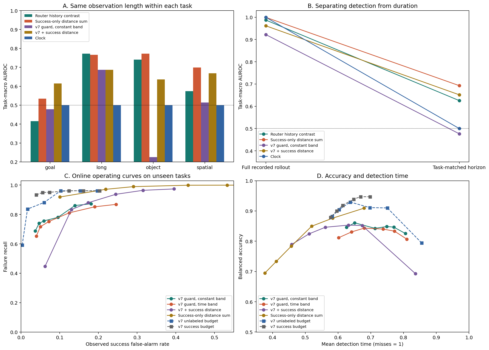
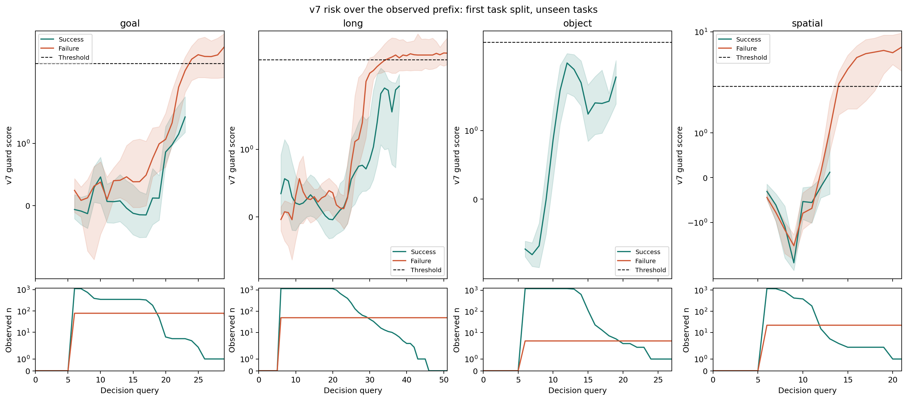
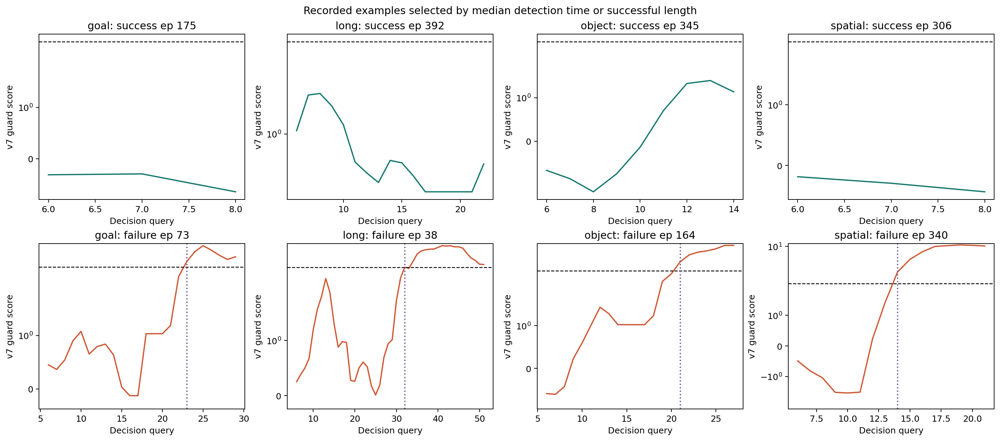
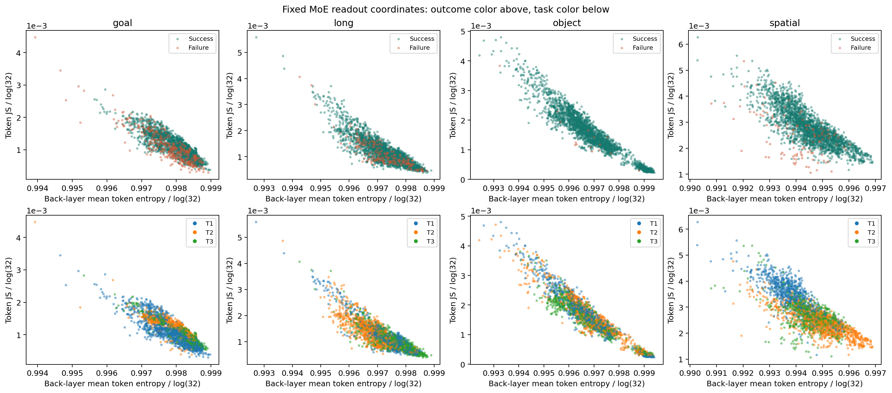

# SAFE 思路的无训练 MoE 实验：复用 v7、参考距离和成功校准

2026-09-06。已完成原始实验、明确标记的距离后续探索，以及按用户要求加入的 v7 复用实验。
所有方法均冻结 VLA，不训练新增 MLP/LSTM/概率头。允许历史标签构建参考和筛选成功校准集。

**当前最有价值的是保留 v7 的时间机制和原有多分支校准。** 有符号距离直接累加的原主方法表现较弱；
纯成功 MoE 距离在统一观察长度后有一定区分力，但阈值迁移和与 v7 的简单融合仍有明显误报代价。
这轮检验的是完整执行过程中的失败检测，是否先于物理故障另作时序评价。

## 1. 数据与 SAFE 思路的对应

两批缓存共 32,000 条轨迹、508,023 次决策，覆盖四套 LIBERO 的 40 个任务。
A 批 16,000 条含 532 次失败，B 批 16,000 条含 564 次失败。直接核验全部 80 个来源。
四个 suite 对应不同 checkpoint，各自建参考和阈值；不跨模型比较专家坐标。

每个 checkpoint 做三次随机 7 seen / 3 unseen 任务划分。每折 A 的 1,680 条轨迹作参考、
560 条作校准；B 的 560 条 seen 初态留出与 1,200 条 unseen 轨迹作测试。
参考、校准、seen 测试的 task/init 分离，A/B 噪声种子分离。
重复划分总共涉及 13,568 条不重复的 B 轨迹，
其中 11,200 条、
28 个任务曾进入 unseen 测试；重复出现不算新增独立样本。

沿用 [SAFE](https://arxiv.org/html/2506.09937v2) 的逻辑：完整前缀风险、成功轨迹校准、
未见任务评价、准确率与报警时间曲线。使用固定距离和 v7 代替训练的检测头。
同任务统一观察长度取该任务 B 批最短轨迹，仅用于离线 AUC；长度不输入检测器。
AUC 表先在每个 suite/划分内对有两类结果的任务求平均，再对有效设置等权平均。
报警表先在每个设置内计算轨迹级 recall/FPR，再对设置等权平均。
同初态和共同噪声使轨迹之间有依赖；不将跨划分重复出现当作独立新增样本。

## 2. 实际复用了 v7 的什么

直接调用 `moe-v7-0905/method/intrinsic_guard_monitor.py` 与 `unlabeled_budget_calibration.py`。
保留后四层相对 q1..q4 的冻结信号、W6 平滑、flow 曲率和复现性变化的持续确认，以及锁存 AND/OR。
没有重新扫描窗口、分位数组合或学习组合权重。
复用 31,600 条已有特征，缺失的 400 条从原始路由补齐，
另按 suite/批次抽样重放核验旧缓存。原版 monitor 也直接用于验证新的预算 profile。

三种校准需分清：原有无标签总报警预算、独立成功轨迹的经验报警预算、以及成功轨迹的有限样本
conformal 顺序统计量。后两者使用成功标签，但都没有训练模型。
预算函数内部没有标签参数，不代表外层的“筛选成功轨迹”不使用标签。

另外构造了一个连续 guard：三个原有 head 先用参考 median/MAD 固定标准化，
`G = max(freeze, min(prefix_max(acceleration), prefix_max(recurrence_loss)))`。
它保留锁存关系，但不是原版三个独立阈值的精确等价；因此必须保留原版 Boolean 规则作对照。

## 3. 原有 v7 多分支规则的在线工作点

下表是未见任务结果。`unlabeled_reference_budget` 是参考集总报警预算；
`success_calibration_budget` 是独立成功校准集的经验报警预算。均不能承诺新任务 FPR 等于 budget。

| method | budget | recall | fpr | balanced_accuracy | t_det |
| --- | --- | --- | --- | --- | --- |
| success_calibration_budget | 0.01 | 0.933 | 0.039 | 0.947 | 0.698 |
| success_calibration_budget | 0.03 | 0.950 | 0.055 | 0.947 | 0.669 |
| success_calibration_budget | 0.05 | 0.951 | 0.073 | 0.939 | 0.648 |
| success_calibration_budget | 0.1 | 0.961 | 0.124 | 0.919 | 0.614 |
| unlabeled_reference_budget | 0.01 | 0.592 | 0.003 | 0.795 | 0.855 |
| unlabeled_reference_budget | 0.03 | 0.837 | 0.017 | 0.910 | 0.751 |
| unlabeled_reference_budget | 0.05 | 0.881 | 0.059 | 0.911 | 0.697 |
| unlabeled_reference_budget | 0.1 | 0.961 | 0.103 | 0.929 | 0.637 |

5% 点上，原规则加无标签预算的平均 recall 约 88.1%、FPR 约 5.95%；
改用独立成功轨迹校准后 recall 约 95.1%、FPR 约 7.35%。
与旧报告不同，这里只用本折 seen 任务标定，各设置的参考和测试构成也不同，不直接比较跨报告绝对数值。

## 4. 统一观察长度后的区分能力

| 方法 | 统一观察长度 AUC | 同 init AUC | 完整轨迹 AUC |
| --- | --- | --- | --- |
| stats_contrast__cumsum | 0.477 | 0.488 | 0.487 |
| load_contrast__current | 0.619 | 0.615 | 0.884 |
| history_contrast__current | 0.626 | 0.639 | 0.987 |
| behavior_contrast__current | 0.589 | 0.589 | 0.921 |
| eef_motion_low__current | 0.641 | 0.654 | 0.985 |
| success_only__current | 0.673 | 0.656 | 0.849 |
| success_only__cumsum | 0.693 | 0.661 | 1.000 |
| stats_ratio__cumsum | 0.605 | 0.599 | 1.000 |
| v7_guard_constant | 0.476 | 0.452 | 0.922 |
| v7_turbulence_constant | 0.540 | 0.532 | 0.909 |
| v7_success_fusion_constant | 0.652 | 0.602 | 0.962 |
| clock | 0.500 | 0.500 | 1.000 |
| random | 0.529 | 0.547 | 0.727 |

原主方法 `stats_contrast__cumsum` 已保留。有符号分数的早期负值可能抵消后续异常；
SAFE-MLP 本身累加非负 sigmoid 输出，不能把有符号距离累加视作等价。
事后固定的正部、距离比、纯成功距离见 [后续设计](../../safe_protocol/FOLLOWUP_ZH.md)。
纯成功距离从归一化到查表都不使用失败样本，累计版本的同任务等时长 AUC 约 0.693。
原 `stats_success` 只是不减失败距离，归一化仍共享双类参考，不能把它称为完整的 success-only 方法。

完整轨迹 clock AUC 近乎 1，统一观察长度后是 0.5。这说明“多数失败跑满时间”的信息非常强。
v7 在完整执行中的区分能力有用途，但其早期信息和时长信息要分开。这里不会因为它没有提前预报
每次脱手就判定在线检测无效，也不会把接近结束时的高 AUC 包装成早期预测。

## 5. 成功轨迹 CP：同一标称 alpha=0.05

| 方法 | 校准 | recall | fpr | balanced_accuracy | t_det |
| --- | --- | --- | --- | --- | --- |
| stats_contrast__cumsum | episode | 0.522 | 0.232 | 0.645 | 0.660 |
| stats_contrast__cumsum | task_init | 0.399 | 0.058 | 0.671 | 0.787 |
| success_only__cumsum | episode | 0.989 | 0.291 | 0.849 | 0.519 |
| success_only__cumsum | task_init | 0.861 | 0.085 | 0.888 | 0.709 |
| v7_guard_constant | episode | 0.756 | 0.059 | 0.849 | 0.749 |
| v7_guard_constant | task_init | 0.672 | 0.036 | 0.818 | 0.810 |
| v7_guard_timeband | episode | 0.752 | 0.072 | 0.840 | 0.738 |
| v7_guard_timeband | task_init | 0.642 | 0.038 | 0.802 | 0.811 |
| v7_turbulence_constant | episode | 0.767 | 0.057 | 0.855 | 0.727 |
| v7_turbulence_constant | task_init | 0.710 | 0.012 | 0.849 | 0.789 |
| v7_success_fusion_constant | episode | 0.880 | 0.174 | 0.853 | 0.632 |
| v7_success_fusion_constant | task_init | 0.368 | 0.044 | 0.662 | 0.876 |
| clock | episode | 1.000 | 0.061 | 0.969 | 0.701 |
| clock | task_init | 1.000 | 0.050 | 0.975 | 0.730 |

`episode` 对每条成功轨迹的峰值校准；`task_init` 先取同初态成功分支的组内最大值。
组校准更保守，但共享噪声、任务聚类和跨任务分布偏移仍不满足简单的独立同分布解释。
v7 的常数峰值阈值没有被时间带稳定改进。固定 max 融合提高了部分召回和等时长 AUC，
但在逐轨迹校准下 FPR 约 17.4%；不能仅凭 recall 把融合称为改进。

v7 guard 常数阈值在各 suite 的结果也不一致：

| suite | recall | fpr | t_det |
| --- | --- | --- | --- |
| libero_goal | 0.745 | 0.109 | 0.696 |
| libero_long | 0.831 | 0.042 | 0.645 |
| libero_object | 0.586 | 0.064 | 0.857 |
| libero_spatial | 0.863 | 0.023 | 0.797 |

## 6. 风险随执行过程变化

曲线使用第一次划分的 unseen 任务，分别显示最终成功/失败轨迹的中位数和四分位范围；
下方给出仍有有限读数的样本数。少于 5 条时不画分位数，防止将尾部极少数样本当作稳定现象。
这是事后分组展示，运行时不读取最终标签。q0 附近的 v7 空白是历史不足导致的等待期。

每个 suite 的失败案例按检出时间中位数选择，成功案例按未误报轨迹长度中位数选择。
精确任务、episode 与阈值在 `example_index.csv`；这些例子用于解释流程，不替代总体指标。

两个坐标是后四层 entropy 与 token JS 的固定统计；上图按结果、下图按任务着色。
图中的 T1/T2/T3 与具体任务的对应保存在 `feature_map_tasks.csv`。
没有训练投影或检测器。这仅是低维观察，不证明存在统一失败区域，也不证明其他 MoE 信息无效。

## 7. 与物理失败的时间关系

| 方法 | 有脱手时刻的测试出现次数 | 检出 | 严格早于脱手 | 检出者延迟中位数(query) |
| --- | --- | --- | --- | --- |
| behavior_contrast__cumsum | 175 | 100 | 41 | 2.0 |
| clock | 175 | 175 | 16 | 4.0 |
| freeze__current | 175 | 149 | 16 | 5.0 |
| history_contrast__cumsum | 175 | 117 | 66 | -1.0 |
| stats_contrast__cumsum | 175 | 91 | 66 | -5.0 |
| stats_positive__current | 175 | 115 | 14 | 3.0 |
| stats_ratio__cumsum | 175 | 175 | 74 | 0.0 |
| success_calibration_budget@5% | 175 | 174 | 13 | 5.5 |
| success_only__cumsum | 175 | 175 | 55 | 3.0 |
| success_only__current | 175 | 86 | 37 | 0.0 |
| unlabeled_reference_budget@5% | 175 | 162 | 5 | 6.0 |
| v7_freeze_constant | 175 | 136 | 7 | 8.0 |
| v7_guard_constant | 175 | 143 | 7 | 8.0 |
| v7_guard_timeband | 175 | 148 | 17 | 8.0 |
| v7_success_fusion_constant | 175 | 161 | 21 | 6.0 |
| v7_turbulence_constant | 175 | 158 | 13 | 6.0 |

只匹配未满足 goal 中标为脱手相关失败的物体。正常放置另一个物体的 release 不算失败开始。
表中是不同随机划分中的测试出现次数，包含重复；只用于时序诊断，不当作独立实验次数。
release 的时间分辨率约一个 action chunk，且不一定是不可恢复故障。
提前检出数必须连同对应方法的误报率阅读；高误报方法也可能更早触发。
SAFE 式在线检测和真正故障前预测是不同评价目标，表格明确保留二者的边界。

## 8. 参考量消融与核验

原主方法每类参考点数上限的消融：

| reference_cap | task_macro_auc | within_init_macro_auc |
| --- | --- | --- |
| 512.0 | 0.524 | 0.513 |
| 1024.0 | 0.521 | 0.535 |
| 4096.0 | 0.477 | 0.488 |

每条参考轨迹最多均匀取 8 个已记录时刻，防止长轨迹单纯贡献更多参考点。
没有使用测试标签调整点数、评分方向、窗口或部署阈值。

已运行原有与新增相关测试，共 49 项通过。第三轮原始实验独立核验 4,032 个校准秩，
用另一个距离实现复算 144 个主方法阈值；
916 次提取前缀检查、36 条原始轨迹在线主方法重放通过。
v7 另有 24 条缓存核验和 72 次原版 monitor/profile 重放。预算及后续方法的核验文件分别保留。
两组后续实验另核验 1,584 个校准秩，
复算 864 个距离阈值，并完成各 36 条原始轨迹的
六种距离读数与五种 v7 新读出重放，分数和首次报警一致，见 `extension_verification.json`。
主距离 monitor 在路由张量已可用时的 CPU 用时中位数约 0.686 ms/query，
不包含 VLA 推理、路由采集或磁盘读取；不与论文的不同硬件数字直接比较。

## 9. 范围与产物

所有队列已经被探索；本轮是可复现的回顾性实验，不是独立盲测或完整 SAFE 原版复现。
两批全任务数据没有完整末层 hidden 或真实专家输出，因此本轮证明不了相对 SAFE hidden 的优势。
已有局部配对结果在第二轮报告；当前结论只覆盖可核验的路由及行为输入。
没有训练、没有新 rollout、没有真实机器人或恢复干预结果。GPU 仍被已有任务占用。

可继续发展的具体基础是原 v7 的多分支时间规则，并把成功校准作为一个明确的选项；
纯成功距离可作为不同类型的信号，是否融合必须连同误报和检测时间一起判断。
本轮没有用新分数替换既有 v7，也没有删除不利的候选结果。

设计：[主协议](../../safe_protocol/PROTOCOL_ZH.md)、[v7 复用](../../safe_protocol/V7_ZH.md)。
运行与代码：[README](../../safe_protocol/README.md)。
完整数据分别在本目录、`followup/`、`v7/` 的 `ranking_metrics.csv`、`alarm_metrics.csv`、
`task_*_metrics.csv`、`physical_timing.csv` 和各自 `sealed_manifest.json`。
原 v7 预算规则的结果在 `v7/budget_metrics.csv`，不要混同 CP 的 alpha。
