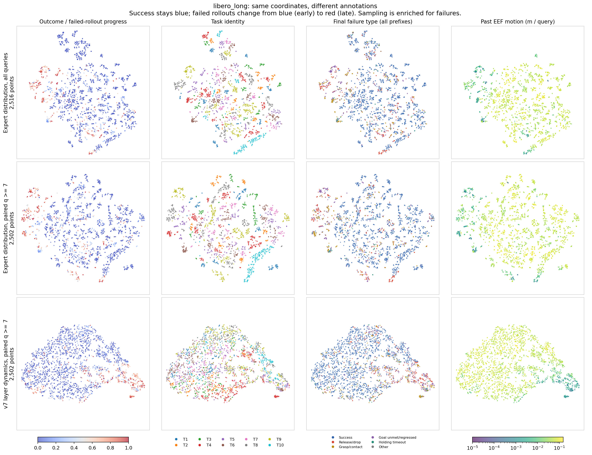
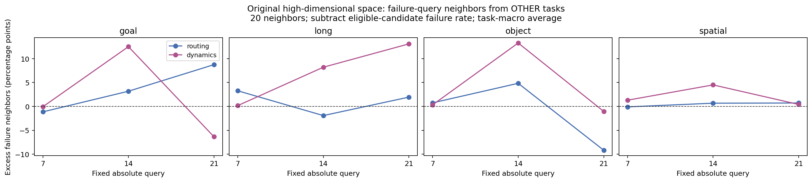
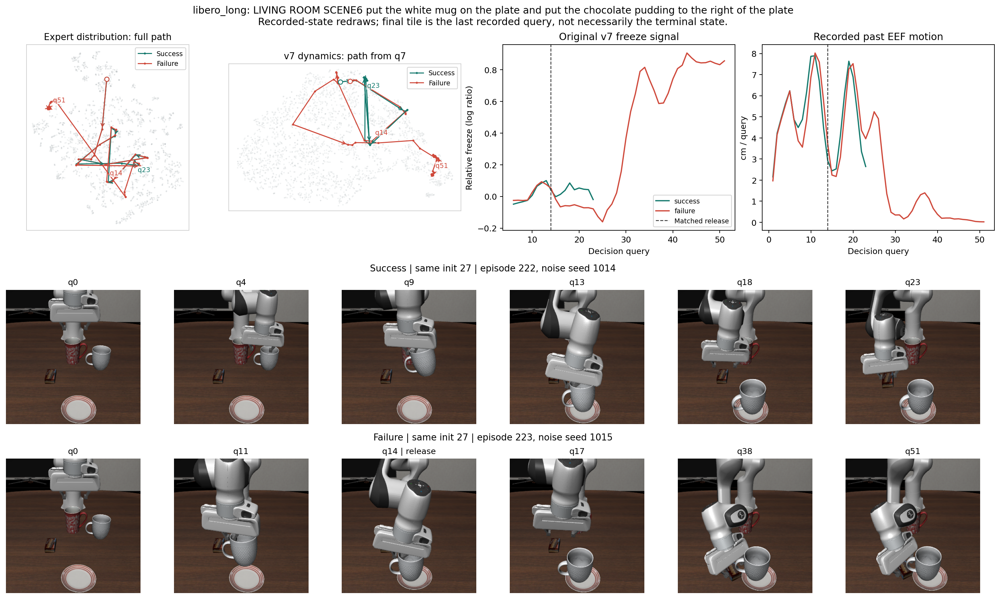

# 第四轮：从 SAFE 二维图出发，检查 MoE 中的失败结构

2026-09-06。基于已有 HiMoE-VLA 缓存与 v7 的解释性探索。

后续针对“很多失败点落在边缘”的量化检查见[外围观察补充](edge_probe/REPORT_ZH.md)。

**观察到了值得继续研究的结构：相对路由动态中的部分分支汇集了不同任务的失败后期状态。相比绝对专家使用分布，这种共同结构在图上更清楚；但目前不能称为一个覆盖大部分失败、可直接用于检测的统一失败区。**

全程未训练策略、MoE 或失败检测头，未执行新 rollout。t-SNE 和 PCA 是仅用于分析的无监督数值拟合。最终成败参与了可视化抽样、着色和事后统计，没有进入投影目标函数或参考归一化。

## 先看这张图

重点比较第二、三行的前两列：

- **第二行：绝对路由分布。** 点表示当前更常使用哪些专家。按任务着色后，许多局部小簇有明显的任务颜色。
- **第三行：v7 相对动态。** 点表示路由变化相对各轨迹初期基准的变化。任务颜色更混合，失败后期的红点在若干分支末端聚集。
- **第一列：SAFE 式成败/进度着色。** 成功轨迹始终蓝色；失败轨迹按 `q/(length-1)` 从蓝变红。红色不代表该帧已被逐帧标注为故障，蓝色也包含失败轨迹的早期。
- **第二列：任务。** 与同一行第一列使用完全相同的坐标，只换颜色，用来检查红点聚集是否只是某个任务自己的簇。
- **第三列：最终失败类型。** 类型来自第三轮物理检查，贴在整条轨迹的所有前缀上；不能解释为该时刻已经发生对应物理事件。
- **第四列：过去四个 query 的末端执行器位移。** 只用于解释图，未输入 MoE 表征。低运动状态与部分红色分支重合，提示必须检查行为混杂。

第二、三行使用完全相同的 2,502 个 episode/query 点。第一行包含早期时刻，单独保留以展示完整路由路径。每行内部坐标相同；不同行、不同套件的二维坐标不能直接对应。t-SNE 的上下左右没有固定物理含义。

## 学习 SAFE 的哪部分思想

SAFE Figure 1 的关键做法，是先把内部特征投到二维，再在同一坐标上依次观察成败进度、任务身份和具体执行过程，从现象提出关于失败结构的假设。其后训练的失败检测器与这张解释性图是两件事。论文 Appendix C.1 也讨论了不同模型下结构不完全一致的情况。[论文 Section 4.1 与 Appendix C.1](https://arxiv.org/html/2506.09937v2)、[官方可视化脚本](https://github.com/vla-safe/SAFE/blob/main/scripts/visualize_features.py)。

本轮把观察对象换成已经记录的 MoE 路由和 v7 时序统计，并补充高维空间核查。没有拟合一个监督分类头，也没有按这批失败点画椭圆作为在线报警边界。当前缓存没有完整隐藏激活或各专家实际输出，因此结果描述的是**路由行为**，不能称为专家输出空间的复现。

## 数据与特征

复用第三轮已经核验的两批数据：A 为 `right-50x8-20260903`，B 为 `right-50x8b-20260903`，各 16,000 条轨迹、40 个任务。B 中共 564 条失败。四套任务对应四个 checkpoint，始终分别分析。

归一化使用第三轮第一次划分中 A 的 seen 参考集，每套 1,680 条轨迹；参考集选择与本轮归一化不读取成败标签。可视化从 B 抽样，高维近邻诊断使用全部 B 中满足固定时刻条件的轨迹。这是已经分析过的数据上的探索，不是新的盲测。

| 表征 | 定义 | 维数 | 可用时刻 |
| --- | --- | ---: | --- |
| 绝对路由 `routing` | 最后一个 flow 步、8 层各 32 个专家的概率；每层先平均 10 个动作 token，再逐维开平方 | 256 | q0 起 |
| 相对动态 `dynamics` | 8 层分别计算相对 q1..q4 mobility 均值的负对数比，做 W6 历史平滑；拼接原版 v7 的 W3 相对 acceleration 与 W6 相对 recurrence-loss | 10 | q7 起 |

绝对路由只减中心并除以同一个全局尺度，保留原来的 Hellinger 距离几何。动态表征逐维使用参考 median/MAD 缩放，并沿用 v7 的 epsilon 与基准。动态特征只读取当前及过去时刻；q7 前不输出。这里保留层结构的 10 维向量是 v7 派生表征，不等同于原版完整报警规则。

每个任务分别随机抽最多 20 条成功、20 条失败。普通轨迹每种视图最多取 8 个均匀时刻；每套额外加入预先选定的同任务、同初态成败案例并保留其全部时刻。抽样种子为 `20260906 + suite_index`，案例在投影前按目标匹配 release 的相对时刻中位数选取，不依据图形筛选。

| 套件 | 抽样轨迹 | 其中失败 | 完整路由点 | 配对 q>=7 点 |
| --- | ---: | ---: | ---: | ---: |
| Goal | 276 | 75 | 2,234 | 1,381 |
| Long | 307 | 106 | 2,516 | 2,502 |
| Object | 245 | 44 | 1,985 | 1,704 |
| Spatial | 315 | 114 | 2,535 | 1,678 |
| 合计 | 1,143 | 339 | 9,270 | 7,265 |

Goal 有 3 条成功轨迹在 q7 前结束，因此配对视图包含 273 条轨迹。7,265 个配对时刻分别用于路由和动态两种投影，不能重复计算为独立样本。图中刻意提高了失败的抽样比例，点的颜色比例不是总体失败率；两种视图的均匀取样网格也不同。

## 四套任务都看到了什么

| 套件 | 定性观察 | 图与初始化检查 |
| --- | --- | --- |
| Goal | 动态空间的几个末端偏红，中心区域成败仍有重叠；低运动与部分红区相伴 | [主图](figures/libero_goal_atlas.png)、[敏感性](figures/libero_goal_sensitivity.png) |
| Long | 绝对路由有明显的局部任务结构；相对动态出现任务混合的失败后期分支，是本轮最值得细看的例子 | [主图](figures/libero_long_atlas.png)、[敏感性](figures/libero_long_sensitivity.png) |
| Object | 动态图有多个偏红末端，不能用一个方向或单一冻结值概括；选中的失败案例冻结信号并未升高 | [主图](figures/libero_object_atlas.png)、[敏感性](figures/libero_object_sensitivity.png) |
| Spatial | 失败后期沿部分分支聚集，案例同时表现出冻结增加与 EEF 运动降低；较晚时刻的成功观测很少 | [主图](figures/libero_spatial_atlas.png)、[敏感性](figures/libero_spatial_sensitivity.png) |

这些是图形观察。尚未预先定义一个区域并在独立数据上统计其覆盖率，因此**不能把“部分分支偏红”写成“大部分失败都落入同一个区域”**。任务混合的程度也未在本轮单独做数值检验。

## 回到高维空间核查

为检查红色聚集是否只来自二维投影，事先固定 q7、q14、q21；每条仍有观测的 B 轨迹取一个点，找同 checkpoint、同绝对 query、**其他任务**的 20 个高维近邻。同任务的任何轨迹都不参与候选。

取到邻居后才读取其最终成败，并比较“近邻中的失败比例”与“全部合格候选中的失败比例”。先在各查询任务内部平均，再对任务宏平均。下表只汇总最终失败的查询轨迹，数值不是检测准确率、召回率或 AUROC。

q14 的结果如下；它是三个预设时刻中的一个，其他时刻完整保留在下一张表。

| 套件 | 候选基准失败比例 | 路由近邻失败比例 | 动态近邻失败比例 | 动态相对基准增量 |
| --- | ---: | ---: | ---: | ---: |
| Goal | 18.46% | 21.64% | 30.96% | +12.50 个百分点 |
| Long | 6.85% | 4.93% | 15.05% | +8.20 个百分点 |
| Object | 3.05% | 7.88% | 16.32% | +13.27 个百分点 |
| Spatial | 85.35% | 86.02% | 89.85% | +4.50 个百分点 |

**Long q14 的证据最容易解释：4,000 条轨迹此时都有观测，没有因成功提前结束而筛掉样本。** 在相对动态空间，最终失败轨迹的跨任务邻居有 15.05% 最终失败，候选基准为 6.85%；成功查询轨迹的对应近邻比例为 5.37%。这支持该时刻存在与最终成败有关的跨任务局部结构，但还不说明这种结构早于实际物理失败，也不构成部署性能验证。

所有预设时刻的“近邻失败比例减候选基准”，单位为百分点：

| 套件 | q7 路由 | q7 动态 | q14 路由 | q14 动态 | q21 路由 | q21 动态 |
| --- | ---: | ---: | ---: | ---: | ---: | ---: |
| Goal | -1.14 | -0.07 | +3.18 | +12.50 | +8.74 | -6.35 |
| Long | +3.27 | +0.17 | -1.92 | +8.20 | +1.94 | +13.08 |
| Object | +0.75 | +0.33 | +4.83 | +13.27 | -9.18 | -1.05 |
| Spatial | -0.10 | +1.30 | +0.67 | +4.50 | +0.72 | +0.41 |

必须同时看各时刻的观测覆盖，单元格为“仍有观测的轨迹数 / 其中最终失败数”；每套原本均为 4,000 条：

| 套件 | q7 | q14 | q21 |
| --- | ---: | ---: | ---: |
| Goal | 3,877 / 106 | 601 / 106 | 124 / 106 |
| Long | 4,000 / 274 | 4,000 / 274 | 3,457 / 274 |
| Object | 4,000 / 44 | 1,342 / 44 | 53 / 44 |
| Spatial | 3,986 / 140 | 164 / 140 | 142 / 140 |

例如 Spatial q14 的候选基准已经高达 85.35%，不能把 89.85% 的近邻失败比例当作很强的检测结果。Goal/Object q21 的动态富集为负，q7 的动态富集普遍很弱。这些结果不支持“越接近结束，所有套件都会进入一个通用失败区”。候选基准按查询任务排除同任务后再宏平均，所以不必等于表中总体失败数除以观测数。

数据表见 [逐点近邻](neighbor_points.csv) 和 [任务宏平均汇总](neighborhood_summary.csv)。邻居共享轨迹集合，任务与重复初态也存在相关性，本轮没有据此宣称统计显著或因果关系。

## 轨迹是否真的进入那些分支

每套选一对同 task/init、不同 noise seed 的成败分支。路径按记录 query 顺序叠加，空心点为起点，箭头表示时间顺序；配对动态从 q7 开始。原版 v7 freeze、历史 EEF 位移和状态画面使用同一时间索引。

| 套件 | 初态 | 成功 / 失败 episode | 失败分支的目标匹配 release | 案例与动画 |
| --- | ---: | --- | --- | --- |
| Goal | 19 | 155 / 156 | q15 | [案例](figures/libero_goal_case.png)、[动画](figures/libero_goal_recorded_path.gif) |
| Long | 27 | 222 / 223 | q14 | [案例](figures/libero_long_case.png)、[动画](figures/libero_long_recorded_path.gif) |
| Object | 8 | 67 / 68 | q11 | [案例](figures/libero_object_case.png)、[动画](figures/libero_object_recorded_path.gif) |
| Spatial | 29 | 237 / 238 | q10 | [案例](figures/libero_spatial_case.png)、[动画](figures/libero_spatial_recorded_path.gif) |

Long 失败案例在 q14 有目标匹配 release，之后仍持续执行；约 q28..q30 起 EEF 运动明显下降、freeze 上升，轨迹逐渐进入偏红的末端。它支持“部分后期失败伴随相对动态变化和运动减少”，不能证明在 q14 前就已预测失败。Spatial 案例也显示后期冻结上升。

Object 是需要保留的反例：失败分支沿另一端推进，但原版 freeze 一直为负，没有类似 Long 的后期上升。该分支不能仅靠“freeze 越高越失败”解释；是否由层间差异、加速度或复现性分量主导，需要进一步消融。本轮没有把这个例子自动归因于某一分量。

画面由记录的 `sim_state` 恢复后，用采集环境的 CPU OSMesa 重绘，共 8 条轨迹、193 个状态。它们不是原始 RGB 录像；最后一帧是最后一次记录 query，也未必是环境终态。release 是既有物理标注中与目标匹配的释放事件，不等于已经证明的不可逆失败时刻。GIF 仅展示失败分支，每个 query 播放 300 ms，不代表实际执行速度。

## 投影是否稳定

主图固定 `perplexity=30`、`init=pca`、`max_iter=1000`、`learning_rate=auto`、`seed=20260906`。原计划额外换两个随机种子，但检查发现 10 维 dynamics 的 PCA 初始化产生了完全相同的重复坐标，不能把它们作为独立稳定性证据。

因此另行记录了[补充方案](../../feature_geometry/RANDOM_INIT_ZH.md)，对两种配对表征各增加 `init=random`、种子 20260907/20260908 的投影。四套均保留两次结果，未择优展示；敏感性图同时给出主投影、两次随机初始化和直接 PCA。

| 套件 | 主 t-SNE 路由 15 邻居保留率 | 主 t-SNE 动态 15 邻居保留率 | 路由 PCA 二维解释方差 | 动态 PCA 二维解释方差 |
| --- | ---: | ---: | ---: | ---: |
| Goal | 67.72% | 60.93% | 15.02% | 90.17% |
| Long | 62.80% | 49.21% | 10.79% | 90.47% |
| Object | 44.93% | 47.68% | 10.74% | 88.88% |
| Spatial | 65.45% | 53.97% | 14.49% | 88.75% |

动态表征在不同初始化下仍可见部分偏红分支，但全局方向和弯折会改变。二维 t-SNE 也只保留约一半到三分之二的原始局部邻居，所以不能把二维图的距离或边界直接搬到在线监控中。动态 PCA 的解释方差高说明这组手工时序统计存在强共同变化，不等于前两维专门编码失败。

完整指标见 [主投影与原始重复](projection_metrics.csv)、[随机初始化](random_init/metrics.csv)。本轮共保存 44 次 t-SNE 结果，其中 8 次动态 PCA 初始化重复与主图完全相同；它们不是 44 次独立证据。

## 对 train-free MoE 方向的启发

当前证据支持优先研究**相对于自身正常变化模式的路由动态**，并保留多个异常分支的可能性。绝对专家身份对任务有较强依赖，单一冻结信号又无法解释所有案例。

要把观察推进为检测方法，下一项关键验证应是在固定 query、相近 EEF 运动水平内，检查 MoE 动态是否仍提供成败区分，并对层间差异、加速度、复现性分别消融。只有确认额外信息后，再将高维统计和预先固定的参考分位数阈值用于在线监控，复用第三轮按 task/init 分组的误报预算检查，并在新的留出数据上验证。这些是由本轮现象提出的后续假设，尚未在本轮完成，也不需要训练检测网络。

本轮回答的是“MoE 特征里有没有类似 SAFE 所展示的可解释结构”。结果是有局部证据、有跨任务高维支持，也有明确反例；目前不能据此声称 MoE 检测器强于 SAFE/VLAConf，或能够覆盖大部分物理失败。

## 复现与核验

- [分析代码与复现命令](../../feature_geometry/README.md)、[投影前固定方案](../../feature_geometry/PROTOCOL_ZH.md)。
- [最终核验](final_verification.json)：358 项来源/产物哈希检查；28 组原始投影的点身份核对；另核对补充随机初始化文件哈希；8 条案例从原始路由重算；48 项直接高维距离近邻复算。
- [状态重绘核验](render_verification.json)：193 帧，恢复 qpos 最大误差为 0；记录 EEF 与重建 EEF 最大差异 0.956 mm，低于既有物理检查使用的 5 mm 容差；重建 observable 与模拟器运动学位置一致。
- 3 项针对动态前缀因果性、跨任务邻居约束和参考归一化隔离性的测试通过；所有 PNG/GIF 均检查非空像素，4 个 GIF 的帧数与记录 query 数一致，首尾画面有变化。

所有静态图均同时提供同名 PDF；每个点的轨迹身份、query、标签和坐标保存在 `projections/`，便于继续从图回查原始执行。
