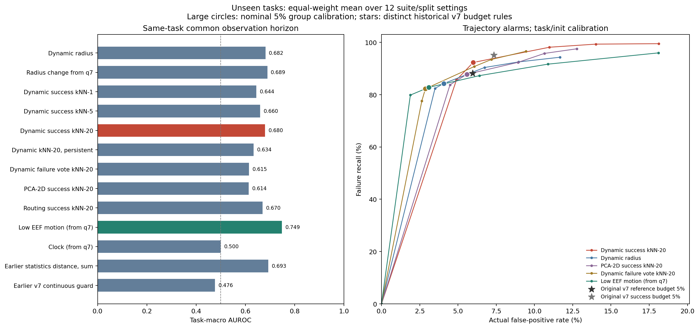
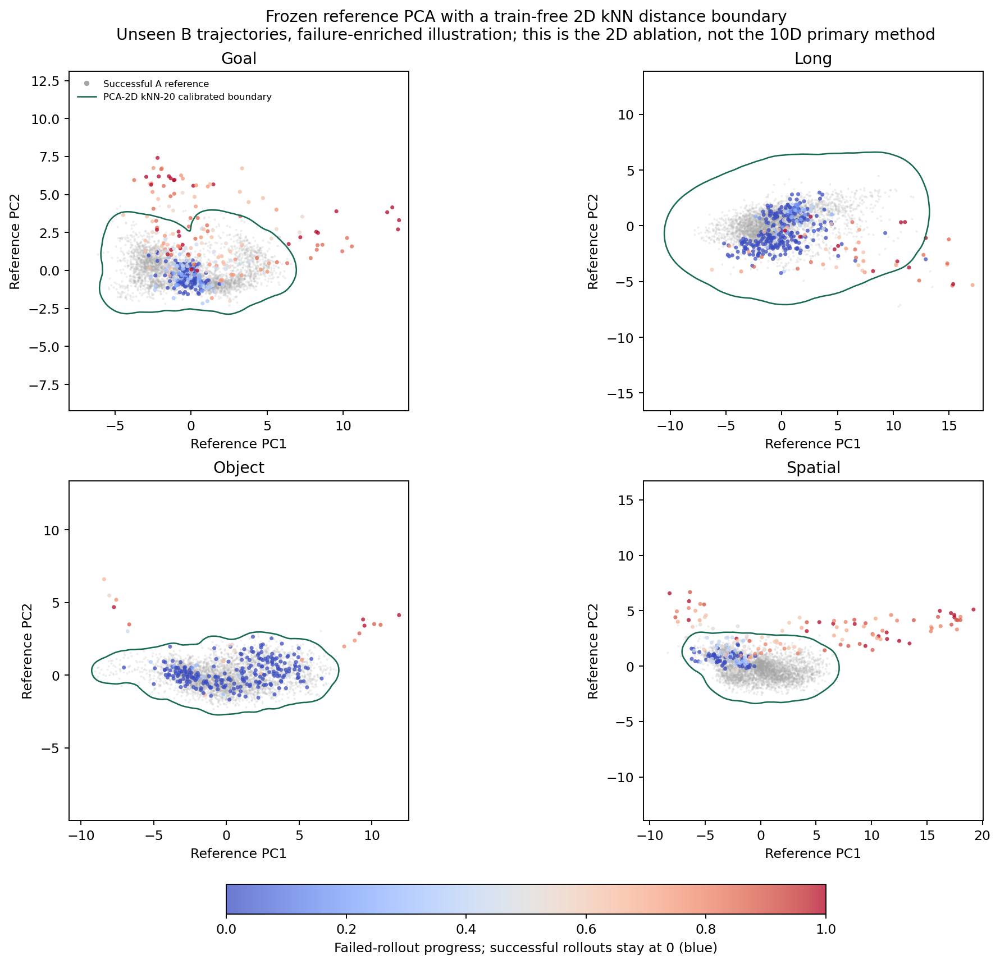
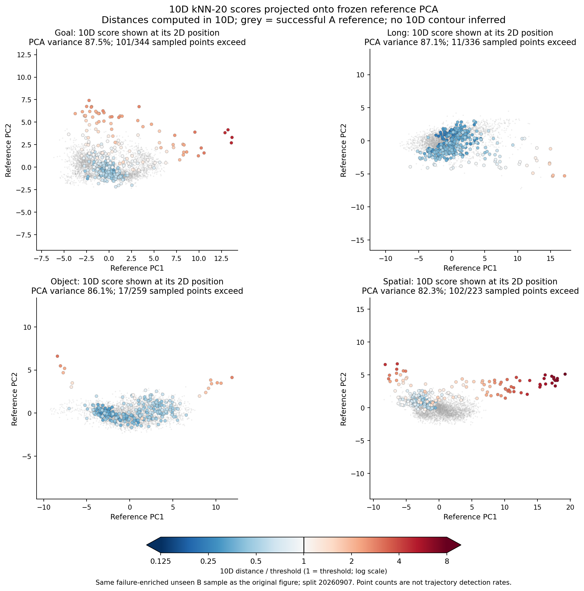

# 第五轮：把 MoE 外围观察变成 train-free kNN 监控

2026-09-06。沿用前三轮缓存与第四轮动态表征，完成四套任务、三次划分的回顾性实验。

**动态 kNN 值得保留。** 事先固定的 10 维成功 kNN-20，在未见任务、task/init 组校准 5% 的工作点上，平均检出率为 **92.3%**、实际误报率为 **6.0%**。它比此前统计特征距离的在线工作点更有竞争力，但没有全面超过原版 v7；早期信息、行为混杂和 Goal 的高误报仍需解决。

全程无新增策略或检测网络训练。历史成功标签用于建库与校准，混合库投票还使用历史失败标签。因此这里是 train-free，不是完全 label-free。没有新 rollout、恢复干预或真实机器人实验。

## 实际怎么做

每个决策 q，计算第四轮使用的 10 维 v7 相对动态，用本折 A 参考集的 median/MAD 归一化。
从成功参考轨迹取样建库，检索当前点的 20 个最近邻，以平均欧氏距离作为分数：

```text
s(q) = mean(distance(z(q), its 20 nearest successful reference points))
```

这衡量的是偏离成功参考样本的程度。参考中心半径、半径相对 q7 的增加量、k=1/5、
三步持续确认、失败邻居投票、二维 PCA kNN 和原始路由 kNN 都作为预先固定的对照保留。
没有按测试结果选择 k、评分方向或阈值，也没有累加距离或学习融合权重。

复用原三次 7 seen / 3 unseen 划分。每折参考集为 A 中 1,680 条轨迹，校准集为另外 560 条，
测试集为 B 中 560 条 seen 初态留出和 1,200 条 unseen 轨迹。参考、校准、seen 测试的 task/init 分开，
A/B 噪声种子分开；四个 checkpoint 分别建库。参考点每条轨迹最多 8 个、每库最多 4,096 个。

所有分数和阈值保存后，评估器才读取 B 的最终标签。当前数据已经经过多轮探索，不能称为新的盲测。
重复划分涉及 13,568 条不同的 B 轨迹，跨折重复出现不算独立新增实验。

## 在线工作点

下表均为 unseen 任务，先在每个 suite/划分内计算指标，再对 12 个设置等权平均。
除单独说明的原版 v7 预算规则外，表中均采用独立成功轨迹的 task/init 组峰值校准，标称 alpha=5%。
`t_det` 为失败轨迹上的平均 `(首次报警query+1)/轨迹长度`，漏检记为 1，越小越早。

| 方法 | 检出率 | 实际误报率 | t_det |
| --- | ---: | ---: | ---: |
| 动态参考半径 | 84.2% | 4.1% | 0.759 |
| 半径相对 q7 的增加量 | 75.5% | 2.6% | 0.786 |
| 动态成功 kNN-1 | 90.3% | 7.9% | 0.626 |
| 动态成功 kNN-5 | 90.7% | 7.0% | 0.638 |
| **动态成功 kNN-20，主方法** | **92.3%** | **6.0%** | **0.641** |
| 动态 kNN-20，连续三步确认 | 92.7% | 6.0% | 0.669 |
| 动态失败投票 kNN-20 | 82.2% | 2.9% | 0.728 |
| 参考 PCA 二维成功 kNN-20 | 87.8% | 5.6% | 0.700 |
| 256 维路由成功 kNN-20 | 63.4% | 11.1% | 0.716 |
| 低 EEF 运动，q7 起 | 82.8% | 3.1% | 0.677 |
| 时钟，q7 起 | 100.0% | 5.1% | 0.719 |
| 之前的统计特征成功距离，累计 | 86.1% | 8.5% | 0.709 |
| 之前的 v7 连续 guard | 67.2% | 3.6% | 0.810 |

主方法与三步确认版接近；三步确认并没有显示明确的全面提升，且报警较晚。
投票和半径变化量的误报较少，检出也较少，不能只看一列宣布它们更强或更弱。
绝对路由的在线阈值迁移较差，本轮更支持在相对动态中检索。

原版 v7 的多分支预算规则是另一种校准方式，不能混同于上面的单分数组 CP：

| 原版 v7 规则 | 预算 | 检出率 | 实际误报率 | t_det |
| --- | ---: | ---: | ---: | ---: |
| 无标签参考集总报警预算 | 5% | 88.1% | 5.9% | 0.697 |
| 独立成功校准集经验预算 | 5% | 95.1% | 7.3% | 0.648 |

动态 kNN-20 在与无标签 v7 预算相近的实际误报率下检出更多、平均报警更早，但使用了历史成功标签。
原版 v7 成功校准仍有更高召回和更高误报，不能据此声称 kNN 全面胜出。



若改用逐 episode 的成功校准，kNN-20 的召回上升到 99.95%，但误报也达到 18.14%。
这不是稳健的低误报工作点，不能把接近 100% 的召回单独当成结论。

## 二维空间上也做了 kNN



灰色为 A 成功参考点；彩色为 B 未见任务的示意轨迹点，成功始终蓝色、失败按执行进度从蓝变红。
示意图提高了失败抽样比例。绿色线是二维 kNN 距离达到本折成功校准阈值的等值线，
不是依据 B 的红点位置手工圈定的区域。其外侧对应二维对照的超阈值区域。

PCA 只拟合 A 的混合参考点，随后冻结，因此新的 B 状态有确定的投影变换。
它不是之前把 B 联合投影的 t-SNE 坐标，也不是 10 维主方法在二维中的精确决策边界。
每折参考 PCA 的二维解释方差为 80.7% 到 87.5%。二维版本可以工作，但本轮保留全部 10 维更有竞争力。

## 10 维分数的投影与圈的大小



新增图的 **kNN 距离在 10 维中计算，只有坐标投影到二维**。颜色为 `10维距离 / 10维阈值`：
蓝色小于 1，红色大于 1，颜色条采用对数刻度；它不是失败概率。灰色仍为成功 A 参考点。
沿用原图 split=20260907 的全部示意点与 A 参考集上冻结的 PCA，没有重新拟合、训练或调整阈值。

每个套件另有三栏对照：左侧是原二维圈和轨迹进度，中间是真实 10 维分数，右侧是两种方法的逐点判断。
右侧橙色 X 表示二维未超阈值、但 10 维已超阈值。图中显示当前分数判断；已经触发并锁存的在线报警另存于 CSV。

- [Goal 三栏对照](projection10/figures/libero_goal_comparison.png)
- [Long 三栏对照](projection10/figures/libero_long_comparison.png)
- [Object 三栏对照](projection10/figures/libero_object_comparison.png)
- [Spatial 三栏对照](projection10/figures/libero_spatial_comparison.png)

在这批提高了失败抽样比例的示意点上：

| 套件 | 示意点数 | 10 维超阈值 | 二维超阈值 | 二维圈内、10 维超阈值 |
| --- | ---: | ---: | ---: | ---: |
| Goal | 344 | 101 | 59 | 42 |
| Long | 336 | 11 | 11 | 0 |
| Object | 259 | 17 | 14 | 3 |
| Spatial | 223 | 102 | 72 | 30 |

因此一些看起来还在二维圈内的点，确实已被 10 维方法识别为偏离参考的点。
这些计数不是轨迹检出率，10 维新增超阈值也不等于新增正确检出的失败。
Long 在这些抽样点上两种判断完全相同；不能认为保留 10 维就自动解决保守阈值的问题。

原来的绿色圈是 **二维分数达到报警阈值的等值线**，不是某一个查询点的 20 近邻半径。
它看起来偏大的主要原因是校准单位：先取每条成功轨迹的全程峰值，再对同 task/init 的成功执行取峰值，
最后用这些组峰值校准标称 5% 工作点。本图四折各有 70 个成功校准组，取排序后第 68 个值。
灰色点则来自另一个参考集，所以边界不需要紧贴灰色密集区。

| 套件 | 二维成功校准点距离 P95 | 二维逐轨迹校准阈值 | 二维 task/init 组阈值 | 组阈值 / 点 P95 |
| --- | ---: | ---: | ---: | ---: |
| Goal | 0.465 | 0.684 | 1.186 | 2.55 |
| Long | 0.597 | 1.503 | 3.549 | 5.94 |
| Object | 0.398 | 0.634 | 0.877 | 2.20 |
| Spatial | 0.387 | 0.599 | 1.222 | 3.15 |

Long 最明显：组阈值约为逐点 P95 的 5.94 倍。其 10 维方法同样偏保守，组阈值为 4.068，
成功校准点 P95 为 1.682。不同维度的原始距离不能直接比较，新图用各自阈值归一化。
逐点 P95 在这里仅用于诊断，没有被替换成新的报警阈值；缩小圈会改变误报预算。

二维投影省略的维度会改变距离和最近邻，两种方法也分别校准阈值。
不能用一条二维圈完整表达 10 维判别，所以新图直接显示真实分数与判断，没有把二维边界冒充 10 维边界。

[逐点数据](projection10/projected_points.csv)、[校准诊断](projection10/calibration_diagnostics.csv)、
[核验记录](projection10/verification.json)均已保存，图片同时提供 PDF。
核验复算了 1,162 个示意点的两种分数，共 2,324 个分数值，并对 96 个点/方法组合直接排序参考距离；
逐点超阈值判断、首次报警以及 16 个校准阈值均与原保存结果一致。

## 统一观察长度后的区分能力

对每个任务使用 B 中最短轨迹的长度作为统一观察窗口，计算窗口内分数峰值的 AUC；
先在每个设置内对任务取宏平均，再对设置平均。同 init 一列再控制初态配对。
这些是离线诊断，轨迹终长度不输入在线监控。

| 方法 | 同任务统一观察长度 AUC | 同 init AUC |
| --- | ---: | ---: |
| 动态参考半径 | 0.682 | 0.589 |
| 半径相对 q7 的增加量 | 0.689 | 0.632 |
| 动态成功 kNN-1 | 0.644 | 0.642 |
| 动态成功 kNN-5 | 0.660 | 0.667 |
| 动态成功 kNN-20 | 0.680 | 0.668 |
| 动态 kNN-20，连续三步确认 | 0.634 | 0.609 |
| 动态失败投票 kNN-20 | 0.615 | 0.610 |
| 参考 PCA 二维成功 kNN-20 | 0.614 | 0.537 |
| 256 维路由成功 kNN-20 | 0.670 | 0.672 |
| 低 EEF 运动，q7 起 | 0.749 | 0.670 |
| 时钟，q7 起 | 0.500 | 0.500 |
| 之前的统计特征成功距离，累计 | 0.693 | 0.661 |
| 之前的 v7 连续 guard | 0.476 | 0.452 |

这里 kNN 没有整体超过 EEF 运动，也没有超过之前累计统计距离的所有 AUC 指标。
完整轨迹上的 kNN AUC 为 0.995，时钟约为 1.000；它们都受到失败通常运行更久的强影响。
因此本轮主要证明在线失败检测具有可用信号，还没有证明可靠的故障前预测。

新方法 q7 前等待，三步确认版 q9 前等待。统一观察窗口中，两者平均可读比例分别为 88.9% 和 69.4%；
没有有效读数的轨迹保留为并列最低分，不从分母中删除。旧方法等待期不同，比较时也需考虑这一点。
新的 EEF 对照同样从 q7 起；它与第三轮从更早时刻累计前缀峰值的 EEF 对照不能直接混用数字。

固定 q7/q14/q21 的前缀评价也全部保存。主方法的 unseen 任务宏 AUC 分别为 0.549/0.535/0.601；
这些视图仅包含该时刻仍有观测的轨迹，有成功提前结束的筛选，不能与统一观察窗口的 AUC 混同。

## 哪些任务值得继续看

主方法在各套件的组校准 5% 工作点：

| 套件 | 检出率 | 实际误报率 | t_det |
| --- | ---: | ---: | ---: |
| Goal | 99.6% | 14.1% | 0.566 |
| Long | 73.4% | 1.5% | 0.772 |
| Object | 96.1% | 4.2% | 0.622 |
| Spatial | 100.0% | 4.2% | 0.605 |

Goal 的误报达到 14.1%，是当前主要问题。标称 5% 并不保证未见任务的真实 FPR 为 5%。
同一主方法在 seen 初态留出测试上的平均检出率为 84.8%、误报率为 1.1%，也显示了跨任务分布变化。

Object 更值得后续研究增量信息：其 kNN 同任务统一观察长度 AUC 为 0.756、同 init AUC 为 0.678，
对应 EEF 对照为 0.706 和 0.606。Long 的同任务 AUC 为 0.807，但 EEF 为 0.903；
同 init 比较则为 0.795 对 0.785。Spatial 暂无类似优势。这些仍是有限任务的回顾性观察，未做显著性声明。

## 校准预算敏感性

主方法采用 task/init 组峰值校准时：

| 标称 alpha | 检出率 | 实际误报率 | t_det |
| --- | ---: | ---: | ---: |
| 1% | 0.0% | 0.0% | 1.000 |
| 3% | 85.6% | 4.9% | 0.688 |
| 5% | 92.3% | 6.0% | 0.641 |
| 10% | 98.1% | 11.0% | 0.543 |
| 15% | 99.3% | 14.0% | 0.515 |
| 20% | 99.5% | 18.1% | 0.484 |

每折只有 69 到 70 个成功 task/init 校准组。1% 的有限样本秩超出可用组数，阈值为无穷大，
所以没有报警。没有改为插值分位数或按 B 的结果降低阈值。3% 点也是预设网格中的结果，主工作点仍固定为 5%。

## 相对物理释放事件的时间

以下为 unseen、组校准 5%，共 175 次有目标匹配 release 的测试出现，涉及 162 条不同轨迹。
跨折重复仍保留，仅用于时序诊断。延迟为首次报警 query 减 release query，仅在检出者中取中位数。

| 方法 | 检出次数 | 严格早于 release | 检出者延迟中位数 |
| --- | ---: | ---: | ---: |
| 动态成功 kNN-20 | 156 | 12 | +4 query |
| 动态 kNN-20，连续三步确认 | 160 | 10 | +5 query |
| 动态参考半径 | 125 | 4 | +8 query |
| 动态失败投票 kNN-20 | 129 | 2 | +5 query |
| 参考 PCA 二维成功 kNN-20 | 146 | 10 | +5 query |
| 低 EEF 运动，q7 起 | 156 | 3 | +6 query |
| 之前的 v7 连续 guard | 119 | 0 | +8 query |

大部分检出发生在释放之后。release 也不一定代表不可逆故障，所以本轮不将这些数值包装为提前安全预警。
提前数量必须与各方法误报率一起读；物理事件的匹配沿用第三轮目标级标注。

## 实现与核验

[运行说明与在线接口](../../boundary_knn/README.md)、[固定方案](../../boundary_knn/PROTOCOL_ZH.md)。

实现了可逐 query 调用的 `BoundaryKNNMonitor`，直接读取原始 flow 路由，保持 v7 的前缀因果特征，
q7 起计算 kNN 距离并按常数阈值报警、锁存。新轨迹重置历史，checkpoint 必须与 profile 匹配。

6 项测试通过；[独立核验](verification.json)检查了 180 项哈希、1,584 个校准秩，
在 111 个校准/测试时刻直接排序距离复算全部 7 种基础分数，并完成 108 次原始路由流式重放，
分数及首次报警一致。重放覆盖 12 折各 3 条测试轨迹、3 种时序方法。

主 monitor 的 CPU 更新时间中位数约 2.09 ms/query，95 分位约 4.45 ms，基于 334 个等待期后的读数。
包括 MoE 特征提取与检索，不包括策略推理、路由采集和磁盘读取；该小样本计时不是跨硬件性能比较。

全部候选、两种校准、所有 alpha、逐任务结果和原始预测均已保留。
目前可继续发展的候选是 10 维动态成功 kNN；下一项关键验证应聚焦 Object 中的增量信息与 Goal 的误报来源，
并使用新的留出数据检验。直接与 SAFE/VLAConf 的论文数值比较强弱，仍缺少相同策略、数据和协议下的原版复现。
