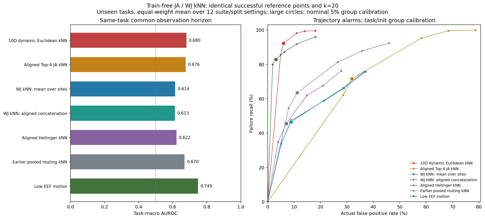

# 第六轮：JA / WJ 做成功参考 kNN

2026-09-06。已完成四套任务、三次划分，共 12 个设置的精确 kNN 回顾性实验。

**本轮绝对路由上的 JA/WJ kNN，没有超过原 10 维动态 kNN 的在线工作点。**
JA 的同初态区分能力值得保留，但跨任务误报很高；WJ 两种汇总方式结果接近，整体检出偏低。
这不是对 JA/WJ 的所有用法下结论，也没有验证把它们用作相对动态特征后的效果。

## 实际做法

每个推理 query 使用最后 flow 步 d9 的 8 层 x 10 动作 token，共 80 个对齐位置。
JA 使用实际记录的 Top-4 专家集合；WJ 和 Hellinger 使用各位置归一化后的全部 32 个专家概率。
保留层和动作位置，不使用状态 token，不对非负概率进行中心化。

| 方法 | 两个 query 之间的距离 |
| --- | --- |
| JA | 各位置 `1 - 交集大小/并集大小`，再平均 |
| WJ，逐位置平均 | 各位置 `1 - sum(min)/sum(max)`，再平均 |
| WJ，对齐展平 | 对齐为 2,560 维，整体计算 `1 - sum(min)/sum(max)` |
| Hellinger，对齐 | 80 个位置 Hellinger 距离的 RMS，同表示对照 |

每种距离独立选出最近 20 个成功参考点，取其平均距离作为分数。
与第五轮使用完全相同的参考 episode/query 身份及顺序，每库 4,096 点。
参考、校准、测试划分不变；每折 A 有 1,680 条参考、560 条校准，B 有 1,760 条测试。
从零基 q7 开始每个 query 评分，严格超阈值后报警并锁存。

这里改变了路由表示和距离，不能直接把改进或退步全部归因于距离。
所以同时加入保留同样 80 个位置的 Hellinger 对照；原路由基线会先平均动作 token。
也没有把 JA/WJ 套在含负数的 10 维动态向量上。

无新增网络训练、rollout 或策略干预。成功建库和校准使用历史成功标签。
评分封存后再读取 B 标签，但 B 已被多轮探索，不是新盲测。

## 主要结果

以下为 unseen 任务，先在每个 suite/split 中计算，再对 12 个设置等权平均。
均使用原来的 task/init 组峰值校准，标称 alpha=5%。
`t_det` 为失败轨迹上的平均 `(首次报警query+1)/轨迹长度`，漏检记 1。

| 方法 | 检出率 | 实际误报率 | t_det |
| --- | ---: | ---: | ---: |
| 原 10 维动态 kNN | **92.3%** | **6.0%** | 0.641 |
| JA kNN | 71.6% | 31.9% | 0.592 |
| WJ kNN，逐位置平均 | 47.1% | 8.9% | 0.799 |
| WJ kNN，对齐展平 | 46.3% | 8.8% | 0.804 |
| 同表示 Hellinger kNN | 45.4% | 7.0% | 0.805 |
| 原先平均 token 的路由 kNN | 63.4% | 11.1% | 0.716 |
| 低 EEF 运动对照 | 82.8% | 3.1% | 0.677 |

JA 的较早报警伴随大量误报，不能仅依据 t_det 说它更强。
WJ 相对同表示 Hellinger 多检出少量失败，也多误报；没有显示全面优势。
本轮保留全部 token 的绝对路由表示也没有超过此前平均 token 的路由基线。

曲线只连接预先固定的 alpha=1/3/5/10/15/20% 工作点，不代表已验证连续的中间工作点。
1% 因成功校准组数量不足而产生无穷阈值，全部不报警。即使使用预设 3% 组工作点，
JA 的 unseen 误报仍为 28.5%，检出为 62.0%。没有根据 B 结果重新校准。
若改为 episode 校准 5%，JA 检出接近 99.8%，但误报达到 74.8%；这不是可用的高检出结论。

## JA 的信号与迁移问题

统一使用每个任务的最短 B 轨迹长度作为观察窗口，所有方法同样处理等待期：

| 方法 | 同任务统一观察长度 AUC | 同初态 AUC |
| --- | ---: | ---: |
| 原 10 维动态 kNN | 0.680 | 0.668 |
| JA kNN | 0.676 | **0.701** |
| WJ，逐位置平均 | 0.614 | 0.632 |
| WJ，对齐展平 | 0.613 | 0.631 |
| 同表示 Hellinger | 0.622 | 0.635 |
| 原先平均 token 的路由 kNN | 0.670 | 0.672 |
| 低 EEF 运动 | 0.749 | 0.670 |

JA 同初态 AUC 高于当前 10 维方法，说明 Top-4 集合仍有可研究的区分信息；尚未做显著性声明。
统一窗口内平均可读比例均为 88.9%，没有有效分数的轨迹保留为并列最低分。
固定 q7/q14/q21 的前缀结果也已保存；它们只包含该时刻仍有观测的轨迹，不能与统一窗口结果混读。

JA 在 seen 新初态上的误报仅 **0.85%**，到了 unseen 任务变成 **31.86%**。
WJ 逐位置版对应为 1.12% 与 8.88%。这支持绝对路由距离存在明显的跨任务迁移问题，
不能直接把“远离参考路由”解释成任务失败。

12 折重复计数的 4,418 次 JA 误报中，2,310 次，即 52.3%，发生在最早可评分的 q7。
这个事后诊断提示不少异常分数从监控启动时就已经偏高，不是执行后段才出现。
这里仍是重复测试出现次数，不是 4,418 条独立轨迹。

## 各套件

均为 unseen、组校准 5%，每套件对三次划分平均：

| 套件 | JA 检出 | JA 误报 | WJ 逐位置检出 | WJ 逐位置误报 |
| --- | ---: | ---: | ---: | ---: |
| Goal | 100.0% | 69.2% | 85.5% | 18.5% |
| Long | 48.0% | 34.2% | 0.7% | 4.6% |
| Object | 64.1% | 5.7% | 19.3% | 4.8% |
| Spatial | 74.2% | 18.3% | 82.9% | 7.6% |

JA 的主要误报集中在 Goal 与 Long。WJ 在 Long 的检出几乎消失，因此总体结果不能推广为所有任务均有效。
全部套件和候选的明细见 [suite_group5_summary.csv](suite_group5_summary.csv)。

## 相对释放事件的时序

同样的 175 次 unseen 测试出现，涉及 162 条不同的有目标匹配 release 轨迹：

| 方法 | 检出次数 | 严格早于 release | 检出者延迟中位数 |
| --- | ---: | ---: | ---: |
| 原 10 维动态 kNN | 156 | 12 | +4 query |
| JA | 133 | 64 | 0 query |
| WJ，逐位置平均 | 92 | 37 | 0 query |
| WJ，对齐展平 | 90 | 34 | 0 query |
| 同表示 Hellinger | 90 | 29 | +1 query |

这些路由分数在部分案例中更早触发，但必须同时看其高误报及漏检。
特别是 JA 有很多 q7 即触发的误报，本轮不能据此声称获得了更可靠的故障前预测。
release 也不一定是不可逆失败起点。

## 核验与数据

新旧方法共 11 项测试通过。原环境不支持新 Numba 实验时，会跳过该组可选测试；
此次完整实验和全部新测试使用隔离的 NumPy 2.4.6 环境，未修改系统环境。

[独立核验](verification.json)检查 163 项哈希、576 个校准秩及所有对应首次报警。
在 71 个校准/测试点直接排序参考距离，复算四种分数共 284 个值，最大绝对误差约 `2.9e-8`。
完成 36 条原始轨迹的 WJ 逐 query 在线接口回放，分数及首次报警一致；参考点身份与第五轮完全相同。

参考回放中监控更新的 CPU 时间中位数约 4.22 ms/query、95 分位约 4.47 ms，基于 334 个等待期后读数。
当前接口会同时计算四种距离，配置 8 个 Numba 线程；不包括 VLA 推理、采集或磁盘读取。
该计时不是与第五轮不同实现和线程配置的严格性能比较。

- [主要工作点数据](unseen_group5_summary.csv)
- [统一观察长度数据](common_horizon_summary.csv)
- [全部逐轨迹报警](episode_decisions.csv)
- [原 1,162 个示意点追加 JA/WJ 分数](illustration_points.csv)
- [数据字段说明](DATA_ZH.md)
- [运行说明](../../jaccard_knn/README.md)、[固定方案](../../jaccard_knn/PROTOCOL_ZH.md)

完整预测在 `predictions/`，参考库在 `profiles/`，原始对齐路由缓存位于 `route_cache/`。
JA 的后续价值更可能在于处理任务差异后使用其区分信息；当前直接以绝对路由成功距离报警尚不合适。
