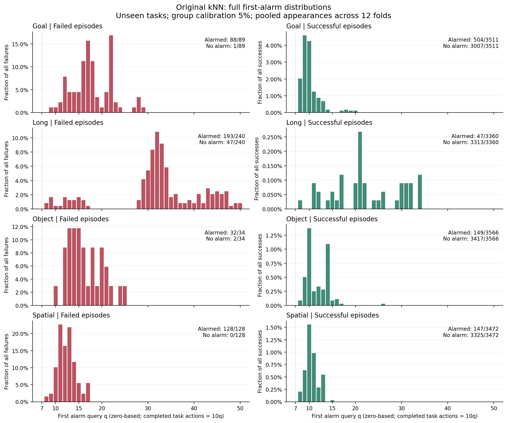
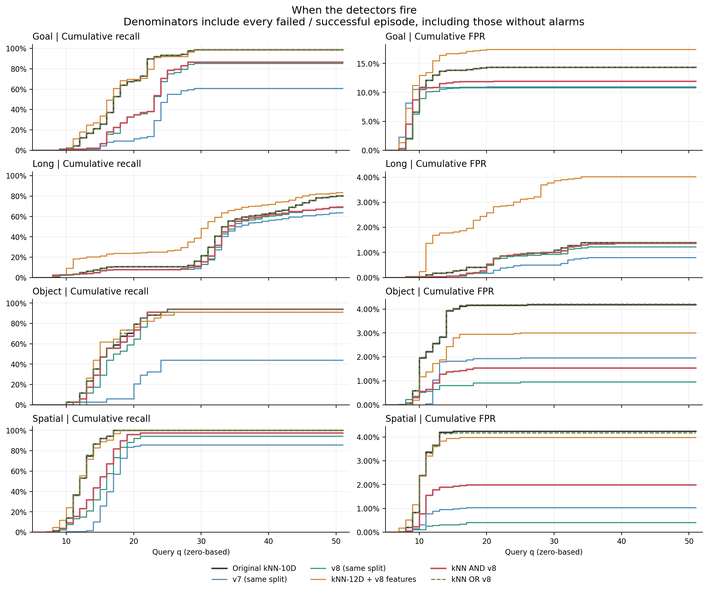
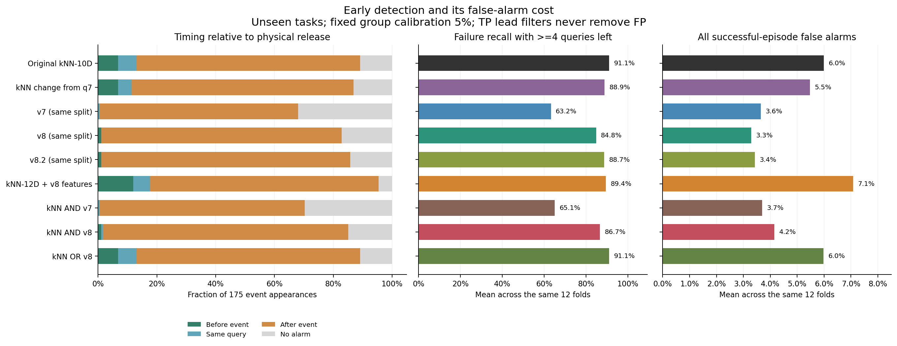
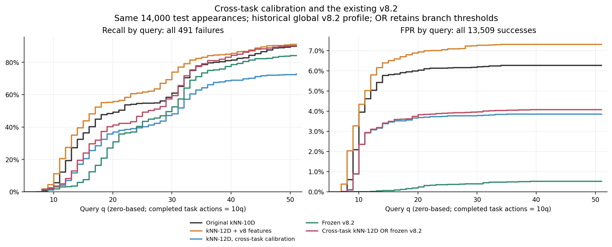

# 完整报警分布与无训练模型修正

本轮完成了两轮实际实验：十种时序/特征/融合规则，以及随后提出的跨任务
校准。全部沿用已有轨迹，无模型训练、无新增环境 rollout。

当前证据支持两个不同结论：加入 v8 特征的 12D kNN 增加了早期检出，
但误报也增加；跨任务校准后与冻结 v8.2 做 OR，可以减少误报并大致保留
整段检出，但报警明显后移。因此不能把后者写成早期预警的改进。

## 1. 原 kNN 的完整分布

原方法为 10D 成功参考 kNN-20，task/init 组校准 alpha=0.05。
下表合并 12 折未见任务的评估次数，不把跨折重复轨迹当独立样本。
失败共 491 次评估，成功共 13,909 次。

| 首次报警区间 | 失败轨迹检出次数 | 成功轨迹误报次数 |
|---|---:|---:|
| q0–q7 | 0 | 0 |
| q8–q10 | 28 | 535 |
| q11–q14 | 132 | 244 |
| q15–q19 | 78 | 30 |
| q20–q29 | 49 | 25 |
| q30–q39 | 111 | 13 |
| q40–q51 | 43 | 0 |
| 没有报警 | 50 | 13,062 |

q 从零开始，一次 query 是一次模型推理。已执行任务动作步为 10q，
当前生成的下一段动作尚未执行。初始化静置步不计入。

847 次误报中，63.2% 集中于 q8–q10，92.0% 集中于 q8–q14。
到了 q14，失败只检出 160/491=32.6%。这说明大量早报并不等于早期
失败识别，必须同时展示成功轨迹的分布。

| 失败轨迹所在套件 | q8–10 | q11–14 | q15–19 | q20–29 | q30–39 | q40–51 | 漏报 |
|---|---:|---:|---:|---:|---:|---:|---:|
| Goal，89 次 | 2 | 17 | 41 | 28 | 0 | 0 | 1 |
| Long，240 次 | 7 | 11 | 8 | 13 | 111 | 43 | 47 |
| Object，34 次 | 1 | 11 | 12 | 8 | 0 | 0 | 2 |
| Spatial，128 次 | 18 | 93 | 17 | 0 | 0 | 0 | 0 |

Long 的 64.2% 失败评估在 q30 以后才报警，另有 19.6% 漏报。
Spatial 的主要报警区间为 q11–q14。将两者混在一个中位数里会丢掉结构。

误报还高度集中于任务：

| 未见任务 | 误报次数 |
|---|---:|
| push_the_plate_to_the_front_of_the_stove | 387 |
| put_the_wine_bottle_on_the_rack | 93 |
| pick_up_the_bbq_sauce_and_place_it_in_the_basket | 76 |
| pick_up_the_alphabet_soup_and_place_it_in_the_basket | 55 |

第一个任务贡献 45.7% 的误报。这支持“部分 kNN 分数在反映任务差异”
的解释，但仅靠本次观察不能将其确认为所有误报的原因。

`query_distribution.csv` 同时提供每个 query 的有效风险集：仍在运行且
尚未报警的轨迹数量。累计召回/误报始终以全部失败/成功为分母，不把
已结束或没有报警的轨迹从分母中删掉。

## 2. v7 / v8 提供什么信息

原 10D 已经包含八层相对 mobility，以及 v7 的 acceleration 和
recurrence-loss 两个量。v7 的 guard 又加入持续确认和头间组合，因此
它与 kNN 存在大量信号重叠，不能把两者视为独立证据。

v8 的新增信息是前后层 flow-path 比例和三点 flow-speed 曲率。
本轮将它们加入 10D 得到 12D，也测试了与 guard 的共同确认和联合触发。
两维均取自现有 MoE 路由，不增加外部输入。

同折适配的 v7/v8：参考和归一化只使用该折 A 参考，成功校准集和原 kNN
相同，所有候选各自校准最终分数。它们与原全局固定阈值版不是同一配置。
后者另列历史锚点，避免混用。

## 3. 第一轮十种规则

以下为与之前报告一致的 12 折等权平均。所有误报都保留，包括发生较晚的
成功轨迹报警。表中 q14 指首次报警不晚于 q14。

| 方法 | 整段召回 | 全部误报率 | q14 前召回 |
|---|---:|---:|---:|
| 原 10D kNN | 92.27% | 5.99% | 40.94% |
| kNN 连续三次确认 | 92.74% | 5.98% | 35.95% |
| kNN 减去 q7 距离 | 91.29% | 5.47% | 41.47% |
| 同折 v7 guard | 67.24% | 3.65% | 9.03% |
| 同折 v8 guard | 88.95% | 3.30% | 17.33% |
| 同折 v8.2 guard | 92.76% | 3.42% | 18.36% |
| 加 v8 特征的 12D kNN | 90.70% | 7.09% | 47.19% |
| kNN AND v7 | 68.82% | 3.70% | 9.63% |
| kNN AND v8 | 90.24% | 4.15% | 22.00% |
| kNN OR v8 | 92.27% | 5.98% | 40.94% |

这些 AND/OR 是标准化分数的 min/max，再统一校准。不是直接拿两个原版
报警布尔值做 AND/OR。不同方法的最终阈值也不同。

折平均与合并条次有不同权重。例如同折 v8.2 的折平均召回较高，但合并
491 次失败只检出 405 次，原 kNN 为 441 次。Long 失败更多，合并统计中
权重更大，所以两种汇总必须同时保留。

主要候选的合并计数如下，分母保持 491 失败、13,909 成功：

| 方法 | 整段检出 | 全部误报 | q14 前检出 |
|---|---:|---:|---:|
| 原 10D kNN | 441 | 847 | 160 |
| 12D kNN | 447 | 992 | 194 |
| kNN AND v8 | 401 | 589 | 80 |
| 同折 v8.2 guard | 405 | 487 | 64 |

12D 的早期增量伴随误报增加。共同确认减少了 258 次误报，但少检出
40 次失败，q14 前检出减半。不能只用误报下降来判定融合成功。

## 4. 物理事件前后

使用同一批已标注的失败相关物体释放事件：175 次折内评估，162 个唯一
事件。它是部分失败的物理时点代理，不代表全部失败的真实起点。

| 方法 | 事件前 | 同 query | 事件后 | 没有报警 |
|---|---:|---:|---:|---:|
| 原 10D kNN | 12 | 11 | 133 | 19 |
| kNN 连续三次确认 | 10 | 2 | 148 | 15 |
| 12D kNN | 21 | 10 | 136 | 8 |
| kNN AND v7 | 0 | 1 | 122 | 52 |
| kNN AND v8 | 2 | 1 | 146 | 26 |
| 同折 v8 guard | 2 | 0 | 143 | 30 |
| 同折 v8.2 guard | 2 | 0 | 148 | 25 |

持续确认和 guard 在这里主要提供事后确认。共同长度窗口的同 init AUC
也未支持共同确认：原 kNN 为 0.6675，12D 为 0.6767，AND-v8 为 0.6010。
12D 的差异较小，不能据此宣称稳定优势。

## 5. 第二轮：跨任务校准，再与现有 v8 结合

第一轮之后新增两个固定候选，单独保留协议和封存记录。对 A 校准任务 T，
计算距离时临时移除参考库中所有 T 的点，模拟“参考库没见过该任务”。
测试仍使用完整参考库，不输入测试任务名。参考点、归一化和测试分数不变。

这一步会提高阈值，只能保留或推迟原有报警，不会自己产生更早的报警。
它没有新的新任务误报率保证，也没有根据 B 的结果调阈值。

单独跨任务校准后，10D 的折平均召回/误报为 83.25%/3.58%，12D 为
82.52%/3.70%。因此还需评估现有冻结版 v8 能否补回漏检。

下面严格限制在历史 v8 有记录的相同测试轨迹：14,000 次未见任务评估，
491 失败、13,509 成功。历史全局 v8 接触过更多 A 任务，这是历史组合
对照，不能与同折适配版混称为同一种无任务泄漏评测。

| 方法 | 整段检出 | 全部误报 | q14 前检出 | 物理事件前 |
|---|---:|---:|---:|---:|
| 原 10D kNN | 441 | 847 | 160 | 12/175 |
| 原 12D kNN | 447 | 987 | 194 | 21/175 |
| 冻结 v8 | 401 | 64 | 22 | 2/175 |
| 冻结 v8.2 | 413 | 72 | 29 | 2/175 |
| 跨任务校准 10D OR 冻结 v8.2 | 445 | 553 | 80 | 2/175 |
| 跨任务校准 12D OR 冻结 v8.2 | 443 | 552 | 96 | 2/175 |

同一人群上的折平均：原 kNN 为 92.27% 召回、6.07% 误报；
跨任务 10D OR v8.2 为 94.52%/3.98%，12D OR v8.2 为 94.49%/3.95%。
OR 保留分支自己的阈值，不声称组合仍有标称 5% 保证。

以 12D 组合为例，合并条次的误报少了 295 次，整段检出多 2 次，但 q14 前
检出少 64 次，物理事件前检出少 10 次。它优化的是整体检出与误报的折中。

对同一任务的所有折记录一起重采样，28 个任务、2,000 次分套件 bootstrap：

| 12D 组合相对原 kNN，合并条次 | 差值 | 95% 区间 |
|---|---:|---:|
| 整段召回 | +0.41 个百分点 | [-7.51, +13.66] |
| 全部误报率 | -2.18 个百分点 | [-3.84, -0.87] |
| q14 前召回 | -13.03 个百分点 | [-24.78, -6.15] |
| 事件前检出比例 | -5.71 个百分点 | [-13.55, -0.53] |

误报下降和早期检出退步都有明确方向，整体召回改善没有稳定证据。
区间仅反映当前任务和冻结参考上的抽样变化，不包含重新采样策略权重等不确定性。

## 6. v8 原实现中的补齐区问题

旧 `evaluate_full_corpus.py` 用 `nansum` 处理 flow_speed：全 NaN 的轨迹
补齐区得到零路径，前后层 log 比例变为零；平滑还会把曲率传播到结束后。
development_main 的旧前后层分数池有 221,781 个真实 query 和 547,819 个
有限的补齐 query。其 0.5% 分位数为 0；只保留真实 query 后为 0.06586。
曲率旧阈值为 0.38900，只保留真实 query 后为 0.30387。
这两个比较保持了旧脚本的其他规则；进一步排除 warmup 的数值另列在 CSV。

历史 external_8b 的 v8 首次报警数组中有 15,008 条记录位于真实轨迹结束后。
这些不能算作在线报警。旧 lead>=4 评价会排除它们，但直接读取报警数组
做分布或 OR/AND，会引入错误。新适配和历史比较均显式检查有效 query。

此外，即使只看真实执行区，原冻结 v8 实际有 90 次成功误报；旧 lead>=4
口径只保留 66 次。此处保留全部 90 次。冻结 v8.2 相应为 98 次与 73 次。

旧实验文件保留作为历史记录；新增代码修正有效性处理，避免改写历史结果。
不能继续把旧“阈值恰好等于零”当成纯粹由真实执行数据得到的机制证据。

## 7. 已完成的代码与验证

- 输入复用 30,400 条，缺失的 1,600 条从原始路由补齐，覆盖全部 32,000 条。
- 原 kNN、持续版 kNN、v7 在全部 12 折的报警数组均复现。
- 第一轮：96 项哈希核验，1,440 个校准秩检查，72 个直接距离 oracle。
- 24 条完整原始轨迹重算全部十个分数并逐 query 验证在线主候选。
  缓存输入重算与封存分数完全一致；原始重算存在 float32 差异，
  受检轨迹的全部十种方法在主工作点的首次报警一致。
- 新增与原 kNN 单元测试共 10 项通过，包含有效掩码、前缀因果、action/flow
  轴、连续确认和当前共同确认。
- 第二轮：168 个排除任务参考库的直接距离检查、288 个独立校准秩检查，
  校准距离与报警时点的单调性检查通过。
- 32 条组合配置/轨迹的完整原始输入回放通过，覆盖 10D/12D 与冻结 v8/v8.2。

在线接口为 `TemporalFusionMonitor` 和 `KnNV8Monitor`，后者保留各分支
报警来源。当前 CPU 上主候选每次 query 的计时为 4.36 ms 中位、8.17 ms P95，
仅为当前缓存规模的测量，不是策略推理端到端延迟。

目前不推荐用严格共同确认替换早期 kNN。12D 可保留为更敏感的异常候选；
跨任务校准加冻结 v8.2 可保留为降低误报的整体报警候选。两者都需要在新的
任务和轨迹上验证，当前结果不足以宣称已经解决早期失败预测。

[数据索引](DATA_ZH.md)提供逐轨迹分数、分布、风险集、阈值和验证文件。
[复现与在线接口](../../temporal_fusion/README.md)给出完整命令。
