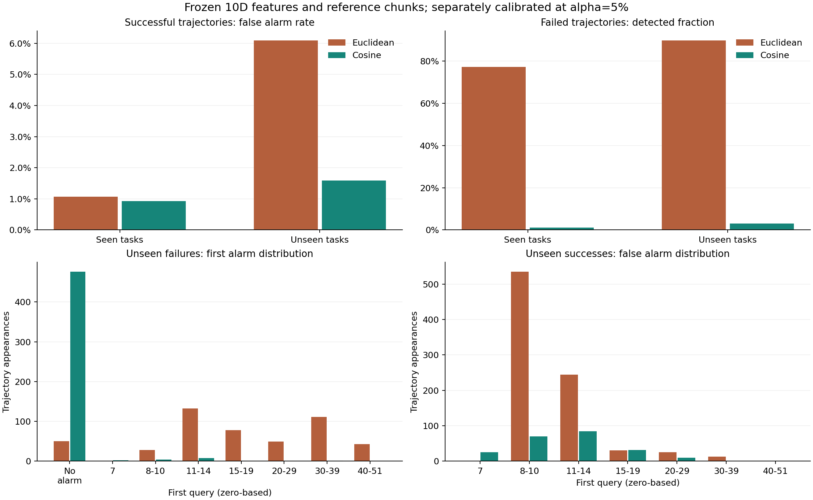
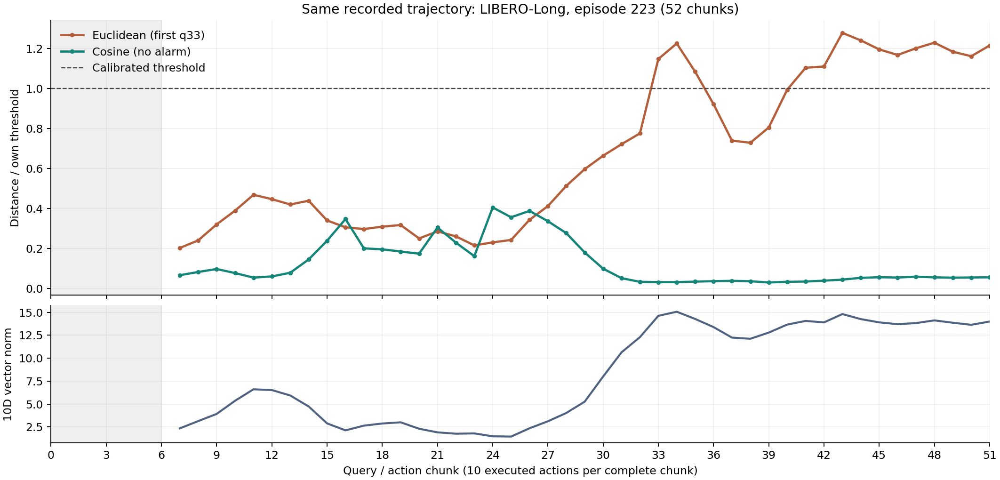

# 10 维 kNN：欧氏距离与余弦距离对照

主工作点下，未见任务的误报由欧氏的 6.09% 变为余弦的 1.59%，召回由 89.82% 变为 3.05%。
本轮纯余弦大幅降低误报，同时丢失大部分失败检出，不能直接替换现有主分数。

固定特征、参考 chunk 身份、k=20、12 折与校准数据，仅替换距离；分别重新校准阈值。
余弦在原 median/MAD 中心化、标准化坐标上计算，无训练、无新增 rollout。
共 21,120 次测试轨迹出现，涉及 13,568 条独立轨迹。
同一轨迹可能跨折重复，以下计数是出现次数。主工作点是 task/init 分组校准 alpha=5%。

## 整体结果

| 范围 | 距离 | 误报 / 成功 | 误报率 | 检出 / 失败 | 召回率 |
|---|---|---:|---:|---:|---:|
| seen | euclidean | 69/6469 | 1.07% | 194/251 | 77.29% |
| seen | cosine | 60/6469 | 0.93% | 3/251 | 1.20% |
| unseen | euclidean | 847/13909 | 6.09% | 441/491 | 89.82% |
| unseen | cosine | 221/13909 | 1.59% | 15/491 | 3.05% |

同样的校准预算不等于同样的实测误报率；未见任务没有 5% 误报率保证。
完整的 1/3/5/10/15/20% 与两种校准结果见 [pooled_metrics.csv](pooled_metrics.csv)。



## 阈值与排序的检查

以下均为预先固定的工作点，没有按 B 的结果搜索新阈值。

| 校准 alpha | 欧氏实测误报率 | 欧氏召回 | 余弦实测误报率 | 余弦召回 |
|---|---:|---:|---:|---:|
| 1% | 0.00% | 0.00% | 0.00% | 0.00% |
| 3% | 4.99% | 85.34% | 1.42% | 2.85% |
| 5% | 6.09% | 89.82% | 1.59% | 3.05% |
| 10% | 10.95% | 98.57% | 4.69% | 11.81% |
| 15% | 13.93% | 99.39% | 7.00% | 14.46% |
| 20% | 17.99% | 99.59% | 9.71% | 16.90% |

描述性地比较误报率接近的已有工作点：欧氏 alpha=3% 的实测误报率 4.99%、召回 85.34%；余弦 alpha=10% 的实测误报率 4.69%、召回 11.81%。
这不是在 B 上选择部署参数，也不声称两者误报率严格相等。

不依赖报警阈值的排序指标也下降。下表先计算每折的 task-macro AUC，再对 12 折等权平均；
只看未见任务。全程峰值会受成功 / 失败轨迹长度差异影响，所以同时报告每个任务统一观察长度的结果。

| 排序视角 | 欧氏 task-macro AUC | 余弦 task-macro AUC |
|---|---:|---:|
| 全程峰值 | 0.9951 | 0.6374 |
| 同任务统一观察长度 | 0.6803 | 0.4456 |

因此现有证据不支持把性能损失只归因于 5% 工作点的阈值。

## 未见任务的报警分布

q 为从零开始的推理 / chunk 编号，q33 表示本次动作执行前已完成 330 个动作步。
下表保留未报警数量，不用中位数概括时间分布。

| 首次报警区间 | 欧氏：失败检出 | 余弦：失败检出 | 欧氏：成功误报 | 余弦：成功误报 |
|---|---:|---:|---:|---:|
| 未报警 | 50 | 476 | 13062 | 13688 |
| q7 | 0 | 2 | 0 | 25 |
| q8-10 | 28 | 4 | 535 | 70 |
| q11-14 | 132 | 8 | 244 | 84 |
| q15-19 | 78 | 0 | 30 | 32 |
| q20-29 | 49 | 0 | 25 | 10 |
| q30-39 | 111 | 1 | 13 | 0 |
| q40-51 | 43 | 0 | 0 | 0 |

成功轨迹的‘未报警’是正确阴性，失败轨迹的‘未报警’是漏检。

| 误报时已执行动作比例 | 欧氏次数 | 余弦次数 |
|---|---:|---:|
| [0,25%) | 1 | 0 |
| [25,50%) | 30 | 34 |
| [50,75%) | 385 | 109 |
| [75,100%) | 431 | 78 |

动作比例使用 `10*q/实际 action_steps`，只用于事后评价，不输入检测器。

## 成对变化

| 范围与结果 | 仅欧氏报警 | 仅余弦报警 | 两者报警 | 两者不报警 | 共同检出中余弦更早 / 更晚 / 同时 |
|---|---:|---:|---:|---:|---:|
| seen 成功 | 67 | 58 | 2 | 6342 | 2/0/0 |
| seen 失败 | 191 | 0 | 3 | 57 | 2/1/0 |
| unseen 成功 | 836 | 210 | 11 | 12852 | 8/3/0 |
| unseen 失败 | 427 | 1 | 14 | 49 | 13/1/0 |

## 误报较多的任务

两种方法分别按误报数量取前五，展示其并集；完整任务表包含全部任务。

| 任务 | 欧氏误报 / 成功 | 余弦误报 / 成功 | 欧氏检出 / 失败 | 余弦检出 / 失败 |
|---|---:|---:|---:|---:|
| libero_goal/push_the_plate_to_the_front_of_the_stove | 387/399 | 6/399 | 1/1 | 0/1 |
| libero_goal/open_the_top_drawer_and_put_the_bowl_inside | 20/349 | 98/349 | 50/51 | 12/51 |
| libero_goal/put_the_wine_bottle_on_the_rack | 93/399 | 1/399 | 1/1 | 0/1 |
| libero_object/pick_up_the_bbq_sauce_and_place_it_in_the_basket | 76/780 | 7/780 | 20/20 | 0/20 |
| libero_object/pick_up_the_alphabet_soup_and_place_it_in_the_basket | 55/794 | 1/794 | 6/6 | 0/6 |
| libero_spatial/pick_up_the_black_bowl_next_to_the_ramekin_and_place_it_on_the_plate | 53/392 | 0/392 | 8/8 | 0/8 |
| libero_spatial/pick_up_the_black_bowl_on_the_stove_and_place_it_on_the_plate | 30/359 | 25/359 | 41/41 | 2/41 |
| libero_goal/open_the_middle_drawer_of_the_cabinet | 3/400 | 21/400 | 0/0 | 0/0 |
| libero_long/LIVING_ROOM_SCENE1_put_both_the_alphabet_soup_and_the_cream_cheese_box_in_the_basket | 4/370 | 18/370 | 25/30 | 1/30 |
| libero_long/KITCHEN_SCENE4_put_the_black_bowl_in_the_bottom_drawer_of_the_cabinet_and_close_it | 8/1197 | 9/1197 | 3/3 | 0/3 |

## 释放事件前的检出

仅统计存在目标物体释放标记的失败轨迹。释放是事后物理代理事件，不等于不可逆失败起点。

| 范围 | 距离 | 事件数 | 事件前 | 同一 query | 事件后 | 未检出 |
|---|---|---:|---:|---:|---:|---:|
| seen | cosine | 96 | 0 | 0 | 1 | 95 |
| unseen | cosine | 175 | 9 | 0 | 0 | 166 |
| seen | euclidean | 96 | 3 | 3 | 73 | 17 |
| unseen | euclidean | 175 | 12 | 11 | 133 | 19 |

## 同一条 52-chunk 轨迹

沿用此前展示的 Long episode 223，本轮运行前固定。

| 距离 | 阈值 | 首次报警 query |
|---|---:|---:|
| euclidean | 4.06781721 | 33 |
| cosine | 0.42159283 | 未报警 |



上图分数分别除以各自阈值；比值不是失败概率。下图是标准化 10D 向量范数。
这条轨迹 q28 到 q33 的向量范数从 4.03 升至 14.62，欧氏 kNN 分数从 2.0846 升至 4.6654，余弦 kNN 分数却从 0.1163 降至 0.0130。
也就是说，这些后期点仍能在成功参考中找到方向接近的邻居。这是特征空间的观察，不能据此断言幅度变化在物理上导致了失败。
余弦忽略径向幅度，可能减少幅度导致的误报，也可能漏掉主要表现为幅度变化的异常。
两种方法仍使用同一批历史成功 chunk，任务 / 阶段不匹配的问题并没有由距离替换自动解决。

## 核验与数据

- 独立核验 73 个哈希、288 个校准与报警数组、159 个直接距离排序样本，以及四个套件的原始路由重放。
- 有效 query 最小向量范数 0.26578；参考点最小范数 0.31919。没有触发近零向量保护。
- [逐轨迹结果](episode_decisions.csv) / [成对报警变化](paired_decisions.csv) / [完整 query 分布](alarm_query_distribution.csv)。
- [逐任务结果](task_metrics.csv) / [分套件结果](suite_metrics.csv) / [排序指标](ranking_metrics.csv)。
- [事件时序](physical_timing.csv) / [截至各 query 的失败检出](failure_detection_by_horizon.csv)。
- [52-chunk 分数](long_episode_223_queries.csv) / [两种距离的近邻身份](long_episode_223_neighbors.csv)。
- 每折 `predictions/*.npz` 保留全部测试与校准 chunk 分数、阈值和首次报警；`profiles/*.npz` 保留参考点与尺度。
- [评分清单](sealed_manifest.json) / [独立核验](verification.json) / [评估来源](evaluation_summary.json)。

```bash
export OPENBLAS_NUM_THREADS=1 OMP_NUM_THREADS=1 MKL_NUM_THREADS=1
python 'safe&vlaconf/moe_trainfree/boundary_knn/cosine_knn.py' score --output /tmp/himoe-cosine-reproduction
python 'safe&vlaconf/moe_trainfree/boundary_knn/cosine_knn.py' verify --output /tmp/himoe-cosine-reproduction
python 'safe&vlaconf/moe_trainfree/boundary_knn/compare_cosine.py' --output /tmp/himoe-cosine-reproduction
```
