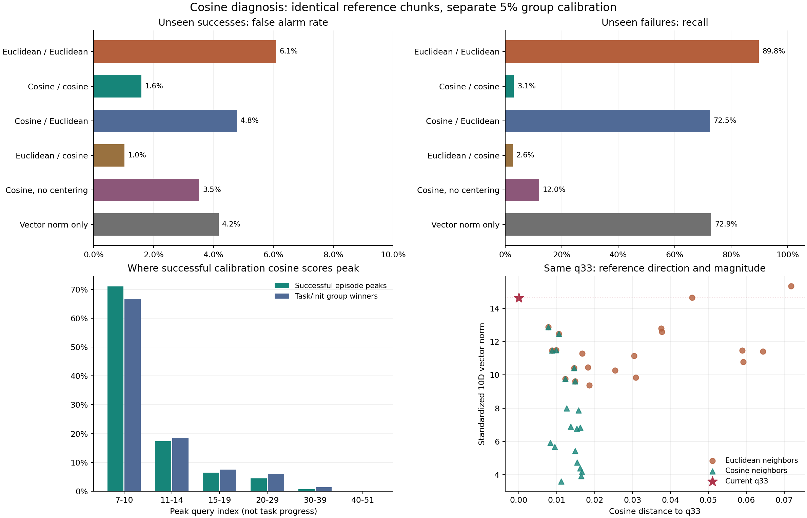

# 余弦 kNN 为什么漏检：独立重放与控制对照

没有发现余弦计算、排序或报警实现错误。主要损失来自纯角度打分删除了有效的幅度信息，
同时成功校准样本中的角度峰值使全程阈值较高。中心化和分组最大值都有影响，但不足以单独解释低召回。

保留余弦邻居、恢复欧氏打分，未见任务检出从 15 次回升至 356 次；固定原欧氏邻居、只用余弦打分，仍仅检出 13 次。

本轮定位 Round 8 的低召回原因，复用缓存，不训练、不新增环境 rollout。
固定 10 维动态、原参考点、k=20 和 12 折。新增对照仅改变近邻选择、距离打分或参考原点，
每种分数均使用原 A 成功校准数据重新校准。所有变体是看过既有结果后的诊断，不是新的盲测。

## 1. 实现与统计口径

独立使用 SciPy 的欧氏与余弦距离矩阵，重放全部 248,406 个有效校准 / 测试 chunk。
原欧氏分数最大绝对差 0，原余弦最大绝对差 0。
旧阈值和首次报警完全复现；没有把相似度当距离、反转排序、沿用欧氏阈值或误删有效 chunk。
Round 8 已核验四个套件的原始路由；本轮继续沿用相同输入哈希。

## 2. 拆分检索与打分

下表均为未见任务、task/init 分组校准 alpha=5%。每个参考对象仍是一个历史 chunk 特征点。
重复折按出现次数统计，不作为独立样本。

| 对照 | 误报 / 成功 | 误报率 | 检出 / 失败 | 召回 |
|---|---:|---:|---:|---:|
| 欧氏检索 + 欧氏打分 | 847/13909 | 6.09% | 441/491 | 89.82% |
| 余弦检索 + 余弦打分 | 221/13909 | 1.59% | 15/491 | 3.05% |
| 余弦检索 + 欧氏打分 | 665/13909 | 4.78% | 356/491 | 72.51% |
| 欧氏检索 + 余弦打分 | 143/13909 | 1.03% | 13/491 | 2.65% |
| 余弦：不减参考中心 | 490/13909 | 3.52% | 59/491 | 12.02% |
| 只用向量范数 | 580/13909 | 4.17% | 358/491 | 72.91% |

‘余弦检索 + 欧氏打分’固定余弦选出的 20 个点，再计算它们与当前点的欧氏距离均值。
‘欧氏检索 + 余弦打分’保留原欧氏近邻身份，只改变这些近邻的打分。
前者检查恢复幅度后是否能恢复检出；后者检查仅固定旧近邻能否解决问题。
‘不减参考中心’保留 MAD 尺度和原始参考 chunk，只去掉 median 平移，检查角度对原点的敏感性。
‘只用向量范数’直接复用 Round 5 已保存的 dyn_radius，不增加新的训练或拟合。



## 3. 漏检点的邻居究竟像在哪里

聚焦原欧氏能检出、纯余弦整条轨迹不报警的 427 次未见任务失败，在各自原欧氏首次报警时检查邻居。
其中 172 次的 20 个余弦邻居平均距离不超过 0.05（平均相似度至少 0.95）；
57 次当前向量范数至少是余弦邻居平均范数的两倍。

欧氏距离与角度、幅度的关系是：

```text
||x-y||^2 = (||x||-||y||)^2 + 2*||x||*||y||*cosine_distance(x,y)
```

纯余弦同时丢掉径向差和角度项的幅度权重。按每个近邻的距离分解后，下面统计径向部分对原欧氏平均距离的贡献：

| 径向贡献占比 | 次数 | 比例 |
|---|---:|---:|
| [0,25%) | 218 | 51.05% |
| [25,50%) | 179 | 41.92% |
| [50,75%) | 30 | 7.03% |
| [75,100%] | 0 | 0.00% |

需要区分‘幅度信息’和‘单纯半径差’：397/427 个漏检点的原欧氏分数中，径向差贡献不到一半。幅度也通过上式的 `2*||x||*||y||` 放大角度差；纯余弦连这一项也去掉了。
因此不能把所有漏检简化为‘向量长度变大但方向不变’。
这是已触发原欧氏报警时的算术分解，不是幅度变化造成物理失败的因果证据，也不表示幅度足以区分全部正常行为。

## 4. 成功校准样本如何设置阈值

成功校准轨迹的 6476 个有效余弦峰值中，5720 个（88.33%）出现在 q7 至 q14。
这是绝对 query 编号；下面另外列出真实控制步比例，不能直接称为任务前期。

| 峰值时已执行动作比例 | 成功轨迹峰值数 | task/init 组胜出峰值数 |
|---|---:|---:|
| [0,25%) | 4 | 1 |
| [25,50%) | 645 | 69 |
| [50,75%) | 2614 | 325 |
| [75,100%) | 3213 | 443 |

全程最大值再对同一 task/init 的成功重复取最大值，使少数角度稀疏的正常点决定阈值。
它符合原轨迹级误报校准规则；原欧氏也使用同样规则，所以并非程序多做了一次错误的最大值。

| 纯余弦校准单位 | 检出 / 失败 | 召回 | 误报 / 成功 | 误报率 |
|---|---:|---:|---:|---:|
| task_init | 15/491 | 3.05% | 221/13909 | 1.59% |
| episode | 75/491 | 15.27% | 1121/13909 | 8.06% |

改用逐轨迹校准取消了跨噪声重复的最大值，但改变了校准保证的统计单位，不能当成同一误报预算。
[每折阈值及其倍率](threshold_inflation.csv)和[真正决定阈值的成功 chunk](threshold_owners.csv)保留了来源与时点。

在同一个 Long 划分里，决定余弦阈值的成功点与此前失败案例的 q33 可以直接比较：

| 样本 | 标准化向量范数 | 欧氏 kNN 距离 | 余弦 kNN 距离 |
|---|---:|---:|---:|
| 成功校准轨迹 q7 | 0.6453 | 0.839777 | 0.421593 |
| 失败轨迹 q33 | 14.6208 | 4.665396 | 0.013040 |

该成功点的范数只处在参考库第 0.05 百分位。
中心化之后，靠近参考中心的成功点也可能有较大的角度差；单位化忽略它的偏离幅度很小这一事实。
这里是几何信息的丢失，不是浮点数下溢或零向量错误。仅去掉中心化有一定改善，但前面的对照显示仍远未恢复原检出。

## 5. 同一条轨迹上的幅度控制

仍使用之前固定的 Long episode 223、q33。下表只在特征空间中保持方向并缩放向量，未更改任何仿真状态或动作。

| 缩放倍数 | 向量范数 | 欧氏 kNN | 余弦 kNN |
|---|---:|---:|---:|
| 0.25 | 3.6552 | 0.990229 | 0.013040 |
| 0.5 | 7.3104 | 1.650291 | 0.013040 |
| 1 | 14.6208 | 4.665396 | 0.013040 |
| 2 | 29.2416 | 18.245354 | 0.013040 |

真实 q33 的向量范数为 14.6208，余弦近邻的平均范数为 7.6169，平均余弦距离为 0.013040。
这种方向匹配并不要求幅度匹配，更不代表物理状态、任务或执行阶段相同。

## 数据与复现

- [全部工作点](pooled_metrics.csv) / [分套件](suite_metrics.csv) / [逐任务](task_metrics.csv)。
- [完整报警 query 分布](query_distribution.csv) / 每折全部 chunk 分数与报警位置：`predictions/*.npz`。
- [全部成功校准峰值](calibration_peaks.csv) / [组峰值](calibration_group_peaks.csv) / [阈值来源](threshold_owners.csv)。
- [阈值来源点的幅度和两种距离](threshold_owner_details.csv)。
- [所有原欧氏报警点的几何分解](alarm_geometry.csv) / [分布汇总](geometry_summary.csv)。
- [逐 chunk 案例](case_queries.csv) / [近邻身份与幅度](case_neighbors.csv) / [幅度缩放控制](case_radial_rescaling.csv)。
- [各折完整分数分布](distance_distributions.csv) / [逐点独立重放记录](replay_audit.csv) / [哈希与核验](verification.json)。

```bash
export OPENBLAS_NUM_THREADS=1 OMP_NUM_THREADS=1 MKL_NUM_THREADS=1
python 'safe&vlaconf/moe_trainfree/boundary_knn/diagnose_cosine.py' --output /tmp/himoe-cosine-diagnosis
python 'safe&vlaconf/moe_trainfree/boundary_knn/report_cosine_diagnosis.py' --output /tmp/himoe-cosine-diagnosis
```
