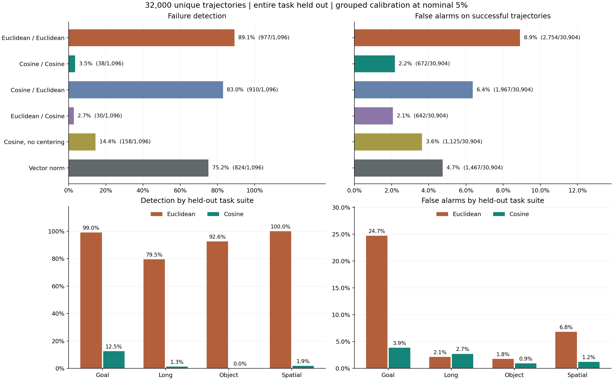
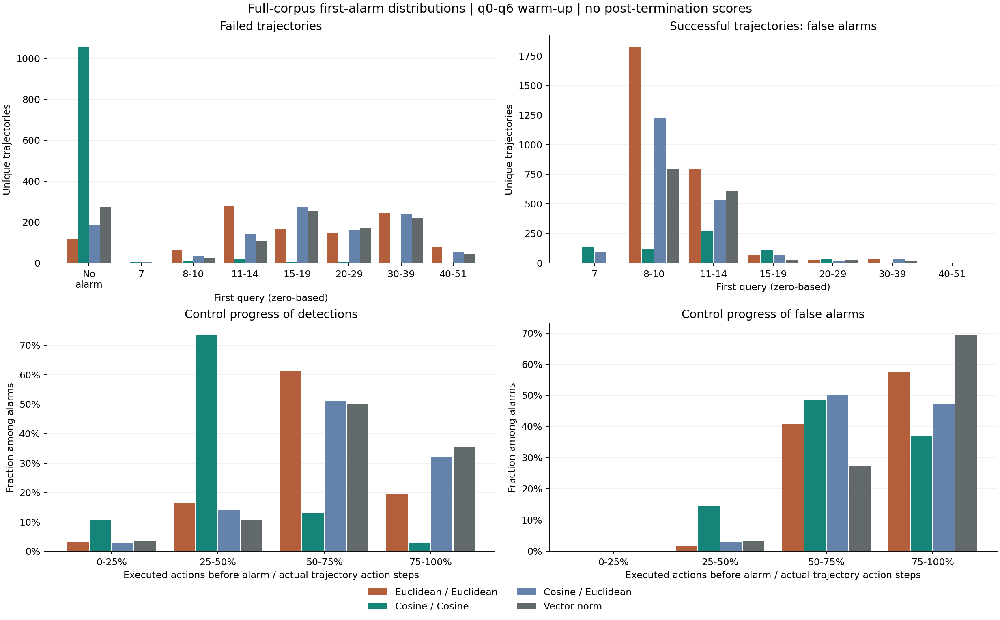

# 全部 32,000 条轨迹：MoE kNN 的完整任务留出评估

本轮每条轨迹恰好测试一次：30,904 条成功、1,096 条失败，共 284,023 个有效测试 chunk。四个 suite、40 个任务、16 个检测配置。
这是重新覆盖全库的交叉验证结果；同一轮的测试任务完全不进入参考、归一化和校准。B 不参与这些拟合；A 在其他轮可以作为历史参考。方法没有训练预测网络，但使用历史成功标签建库和定阈值。

此前报告的 15/491 是旧 12 折未见任务的计数。旧全部测试含 21,120 次出现、13,568 条唯一 B 轨迹；本轮任务划分和参考点重新确定，不把旧计数相加或乘比例外推。

## 主结果

沿用 10D、k=20、4,096 点上限和成功 task/init 组最大值校准，名义 alpha=5%。阈值只从参考任务的 A 校准数据确定。

| 方法 | 检出失败 | 召回率 | 漏检 | 成功误报 | 误报率 | 报警中实际失败占比 |
| --- | --- | --- | --- | --- | --- | --- |
| 欧氏近邻 + 欧氏打分 | 977/1096 | 89.14% | 119 | 2754/30904 | 8.91% | 26.19% |
| 余弦近邻 + 余弦打分 | 38/1096 | 3.47% | 1058 | 672/30904 | 2.17% | 5.35% |
| 余弦近邻 + 欧氏打分 | 910/1096 | 83.03% | 186 | 1967/30904 | 6.36% | 31.63% |
| 欧氏近邻 + 余弦打分 | 30/1096 | 2.74% | 1066 | 642/30904 | 2.08% | 4.46% |
| 余弦，不做中心化 | 158/1096 | 14.42% | 938 | 1125/30904 | 3.64% | 12.31% |
| 只用向量范数 | 824/1096 | 75.18% | 272 | 1467/30904 | 4.75% | 35.97% |

纯余弦在全库仍只检出 38 条、漏掉 1058 条。保留余弦近邻而恢复欧氏打分后检出 910 条，与上一轮诊断一致，说明打分中保留向量幅度非常关键；这组对照没有证明某个方法在相同实际误报率下最优。

欧氏的 3,731 次报警中，2,754 次来自最终成功轨迹，报警精确率只有 26.19%。其中 Goal 占 1,927/2,754 条误报，本套件成功误报率 24.73%。任务分布和参考库覆盖仍是需要解决的问题，不能把高整段召回直接理解为可用的干预触发器。



精确率直接反映触发后需要检查的成功轨迹数量；失败仅占全库 3.425%，不能用总体准确率衡量检测能力。表中的成功/失败是整条 rollout 最终标签，成功轨迹的 chunk 不保证一直处于健康状态，失败报警也不保证早于不可逆失误。

## A/B 与任务套件

| 批次 | suite | 轨迹数 | 成功 | 失败 |
| --- | --- | --- | --- | --- |
| A | libero_goal | 4000 | 3898 | 102 |
| A | libero_long | 4000 | 3733 | 267 |
| A | libero_object | 4000 | 3963 | 37 |
| A | libero_spatial | 4000 | 3874 | 126 |
| B | libero_goal | 4000 | 3894 | 106 |
| B | libero_long | 4000 | 3726 | 274 |
| B | libero_object | 4000 | 3956 | 44 |
| B | libero_spatial | 4000 | 3860 | 140 |

| 批次 | 方法 | 检出失败 | 召回率 | 成功误报 | 误报率 |
| --- | --- | --- | --- | --- | --- |
| A | 欧氏近邻 + 欧氏打分 | 478/532 | 89.85% | 1349/15468 | 8.72% |
| A | 余弦近邻 + 余弦打分 | 17/532 | 3.20% | 322/15468 | 2.08% |
| B | 欧氏近邻 + 欧氏打分 | 499/564 | 88.48% | 1405/15436 | 9.10% |
| B | 余弦近邻 + 余弦打分 | 21/564 | 3.72% | 350/15436 | 2.27% |

| suite | 方法 | 检出失败 | 召回率 | 成功误报 | 误报率 |
| --- | --- | --- | --- | --- | --- |
| libero_goal | 欧氏近邻 + 欧氏打分 | 206/208 | 99.04% | 1927/7792 | 24.73% |
| libero_goal | 余弦近邻 + 余弦打分 | 26/208 | 12.50% | 301/7792 | 3.86% |
| libero_long | 欧氏近邻 + 欧氏打分 | 430/541 | 79.48% | 159/7459 | 2.13% |
| libero_long | 余弦近邻 + 余弦打分 | 7/541 | 1.29% | 203/7459 | 2.72% |
| libero_object | 欧氏近邻 + 欧氏打分 | 75/81 | 92.59% | 141/7919 | 1.78% |
| libero_object | 余弦近邻 + 余弦打分 | 0/81 | 0.00% | 73/7919 | 0.92% |
| libero_spatial | 欧氏近邻 + 欧氏打分 | 266/266 | 100.00% | 527/7734 | 6.81% |
| libero_spatial | 余弦近邻 + 余弦打分 | 5/266 | 1.88% | 95/7734 | 1.23% |

## 触发时刻分布

q 从 0 起计数。q7 发生在已执行 70 个动作后；q33 对应已执行 330 个动作。q0 至 q6 不报警；每个有效 q 都是真实记录的推理 chunk，没有给结束后的轨迹补齐动作。

| 首次报警 q | 欧氏：失败 | 余弦：失败 | 欧氏：成功 | 余弦：成功 |
| --- | --- | --- | --- | --- |
| no_alarm | 119 | 1058 | 28150 | 30232 |
| q7 | 0 | 5 | 4 | 138 |
| q8-10 | 63 | 7 | 1829 | 118 |
| q11-14 | 278 | 18 | 798 | 266 |
| q15-19 | 167 | 4 | 65 | 114 |
| q20-29 | 145 | 3 | 27 | 34 |
| q30-39 | 246 | 0 | 31 | 2 |
| q40-51 | 78 | 1 | 0 | 0 |

下表仅统计实际触发的轨迹，以 `10*q / 实际 action_steps` 分箱。分母是事后已知的真实执行总长度，仅用于分析；固定 q 较小不等于处于任务初期。

| 结果 | 方法 | 0–25% | 25–50% | 50–75% | 75–100% |
| --- | --- | --- | --- | --- | --- |
| 失败检出 | 欧氏近邻 + 欧氏打分 | 30 | 159 | 598 | 190 |
| 失败检出 | 余弦近邻 + 余弦打分 | 4 | 28 | 5 | 1 |
| 成功误报 | 欧氏近邻 + 欧氏打分 | 2 | 48 | 1125 | 1579 |
| 成功误报 | 余弦近邻 + 余弦打分 | 0 | 98 | 327 | 247 |

欧氏误报虽然集中在 q8 至 q14，但 2,704/2,754（98.18%）实际已过该轨迹执行总长度的一半。这些多是较短的成功轨迹，不能仅凭绝对 q 较小归因为开局噪声。



没有有效评分 chunk 的短轨迹共 274 条，仍留在分母。详细覆盖见 [corpus_coverage.csv](corpus_coverage.csv)。

## 任务集中情况

纯余弦发生失败检出的任务如下；其余任务检出数为零。

| 任务 | 检出失败 | 成功误报 |
| --- | --- | --- |
| libero_goal/open_the_top_drawer_and_put_the_bowl_inside | 25/103 | 236/697 |
| libero_long/LIVING_ROOM_SCENE1_put_both_the_alphabet_soup_and_the_cream_cheese_box_in_the_basket | 5/56 | 79/744 |
| libero_spatial/pick_up_the_black_bowl_on_the_wooden_cabinet_and_place_it_on_the_plate | 3/32 | 8/768 |
| libero_spatial/pick_up_the_black_bowl_on_the_stove_and_place_it_on_the_plate | 2/76 | 59/724 |
| libero_goal/put_the_wine_bottle_on_the_rack | 1/4 | 9/796 |
| libero_long/KITCHEN_SCENE3_turn_on_the_stove_and_put_the_moka_pot_on_it | 1/10 | 30/790 |
| libero_long/LIVING_ROOM_SCENE6_put_the_white_mug_on_the_plate_and_put_the_chocolate_pudding_to_the_right_of_the_plate | 1/90 | 13/710 |

欧氏误报条数最多的八个任务：

| 任务 | 成功误报 | 误报率 | 检出失败 |
| --- | --- | --- | --- |
| libero_goal/push_the_plate_to_the_front_of_the_stove | 771/797 | 96.74% | 3/3 |
| libero_goal/put_the_wine_bottle_on_the_rack | 702/796 | 88.19% | 4/4 |
| libero_goal/open_the_middle_drawer_of_the_cabinet | 254/800 | 31.75% | 0/0 |
| libero_spatial/pick_up_the_black_bowl_on_the_wooden_cabinet_and_place_it_on_the_plate | 217/768 | 28.26% | 32/32 |
| libero_goal/put_the_wine_bottle_on_top_of_the_cabinet | 144/797 | 18.07% | 3/3 |
| libero_spatial/pick_up_the_black_bowl_next_to_the_ramekin_and_place_it_on_the_plate | 123/783 | 15.71% | 17/17 |
| libero_spatial/pick_up_the_black_bowl_on_the_stove_and_place_it_on_the_plate | 116/724 | 16.02% | 76/76 |
| libero_long/STUDY_SCENE1_pick_up_the_book_and_place_it_in_the_back_compartment_of_the_caddy | 91/786 | 11.58% | 12/14 |

这些是任务层面的关联，不能据此断定具体物理失败原因；每任务完整数据见 [task_metrics.csv](task_metrics.csv)。

## 校准敏感性

若用成功 episode 的最大值直接校准，去掉 task/init 噪声重复的组最大值，得到：

| 方法 | 检出失败 | 召回率 | 成功误报 | 误报率 |
| --- | --- | --- | --- | --- |
| 欧氏近邻 + 欧氏打分 | 1076/1096 | 98.18% | 6941/30904 | 22.46% |
| 余弦近邻 + 余弦打分 | 199/1096 | 18.16% | 2742/30904 | 8.87% |
| 余弦近邻 + 欧氏打分 | 1035/1096 | 94.43% | 5357/30904 | 17.33% |
| 欧氏近邻 + 余弦打分 | 133/1096 | 12.14% | 2552/30904 | 8.26% |
| 余弦，不做中心化 | 334/1096 | 30.47% | 3350/30904 | 10.84% |
| 只用向量范数 | 967/1096 | 88.23% | 3382/30904 | 10.94% |

这只是预先保留的校准对照，没有按测试表现选择工作点。分布发生任务迁移后，名义 5% 不保证实际成功误报率为 5%。

## 已有物理事件子集

只有 B 的部分失败有目标物体脱手事件；下表严格在这些已有事件上计算。事件时刻不等于不可逆失败起点，也不代表提前报警后能够救回。

| 方法 | 事件轨迹 | 早于事件 | 同 q | 晚于事件 | 没有报警 |
| --- | --- | --- | --- | --- | --- |
| 欧氏近邻 + 欧氏打分 | 216 | 23 | 6 | 162 | 25 |
| 余弦近邻 + 余弦打分 | 216 | 14 | 0 | 1 | 201 |
| 余弦近邻 + 欧氏打分 | 216 | 15 | 1 | 164 | 36 |
| 欧氏近邻 + 余弦打分 | 216 | 10 | 0 | 0 | 206 |
| 余弦，不做中心化 | 216 | 27 | 1 | 19 | 169 |
| 只用向量范数 | 216 | 8 | 1 | 159 | 48 |

## 数据和复现

- [trajectory_results.csv](trajectory_results.csv)：恰好 32,000 行，原始轨迹身份、最终结果、六种方法首次报警、峰值、阈值和实际进度。`-1` 表示从未报警，NaN 峰值表示没有可评分 chunk。
- [all_test_scores.npz](all_test_scores.npz)：`scores[method, global_row, query]` 为 `[6,32000,52]`；`first` 与 `thresholds` 为 `[2,6,32000]`，第一维依次为 episode、task_init。方法名与全局行号也保存在文件内。
- [metrics.csv](metrics.csv)：全部、批次、套件、任务及其交叉分组的两种校准结果。
- [alarm_query_distribution.csv](alarm_query_distribution.csv)：全部 q=-1,0,...,51 的精确分布；[alarm_progress_distribution.csv](alarm_progress_distribution.csv) 为实际控制进度分布。
- [test_assignment.csv](test_assignment.csv)：每条轨迹唯一测试轮次；`profiles/` 保存同轮参考库每个点的真实 episode/query 身份。
- [thresholds.csv](thresholds.csv)：逐轮、逐方法的校准阈值、单位数与秩。
- [verification.json](verification.json) 与 [report_verification.json](report_verification.json)：划分、独立距离、时序、全量导出及哈希核验。
- [固定方案](../../boundary_knn/FULL_CORPUS_PROTOCOL_ZH.md)、[打分及核验脚本](../../boundary_knn/full_corpus_knn.py)、[报告脚本](../../boundary_knn/report_full_corpus.py)。

```bash
export OPENBLAS_NUM_THREADS=1 OMP_NUM_THREADS=1 MKL_NUM_THREADS=1
python 'safe&vlaconf/moe_trainfree/boundary_knn/full_corpus_knn.py' score --output /tmp/himoe-full-corpus
python 'safe&vlaconf/moe_trainfree/boundary_knn/full_corpus_knn.py' verify --output /tmp/himoe-full-corpus
python 'safe&vlaconf/moe_trainfree/boundary_knn/report_full_corpus.py' --output /tmp/himoe-full-corpus
```

本轮没有重新评价 v7/v8 融合或进行噪声干预；当前结果仅覆盖上列六种已有 MoE 几何分数。
