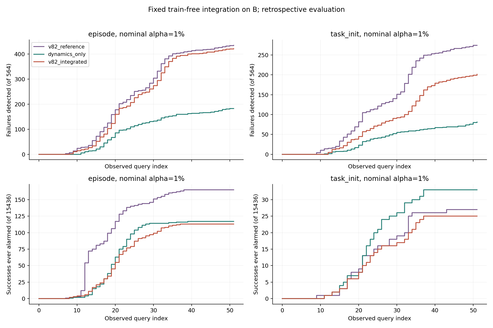

# 无训练整合报警实验

整合与测试已完成。新特征提高了未截断连续分数的区分度，但预先固定的三分支等额预算规则没有改善主报警工作点。当前应保留为实验配置，不据此替换原 v8.2。

## 方法与数据

三条固定分支是原 v8.2 连续分数、内部二阶路由变化相对增强、近期查询间减弱与查询内增强的脱耦。后两条各需连续 2 次确认，分别最早 q8、q11 可用。其余编码只用于诊断。

没有训练 VLA、分类器、融合权重或做参数搜索。A 用作旧方法参考标准化与成功分位数标定；B 共 16000 条、564 失败、15436 成功，每条只测试一次。五折按 `(task, init)` 隔离参考、标定和测试角色。A/B 均曾被前序分析查看，这是回顾性实验。

每条分支相对于 A 成功轨迹峰值计算尾部秩 `p_b=(1+count(peak>=score))/(N+1)`。k 条分支的报警秩为 `p=min(1,k*min(p_b))`，当 `p<=alpha` 报警。主设置为 `task_init, alpha=1%`；episode 标定和其他预算是预先固定的同步报告项。任务初态标定在每组已有成功种子内再取最大峰值，约 398 至 400 组；episode 标定每折约 3077 至 3116 条成功轨迹。名义预算不等于 B 上的实际误报率。

在线只输入 HB 路由概率，不输入任务、结果、最终时长、剩余时间或物理状态。旧 v8.2 的 `0.0015*q` 阈值松弛被保留，因此仍有其原来的查询序号依赖；没有新增时间分数或计算时长基线。长度只屏蔽无效补齐，动作上限比例只用于离线描述。

完整固定规则见 [整合协议](../../routing_dynamics/INTEGRATION_PROTOCOL_ZH.md)，在线接口见 [guard.py](../../routing_dynamics/guard.py)，调用说明见 [README](../../routing_dynamics/README.md)。

## 全程报警

“v8.2 同预算对照”是沿用原路由结构、用 A 参考标准化并重新标定的连续分数工作点，与原始冻结的多分支阈值工作点不同。

| 标定方式，alpha=1% | 方法 | 检出/564 | 检出率 | 误报/15436 | 误报率 | 检出失败的首次报警中位 q |
|---|---|---:|---:|---:|---:|---:|
| task_init，主设置 | v8.2 同预算对照 | 274 | 48.58% | 27 | 0.175% | 29 |
| task_init，主设置 | 仅新动力学分支 | 81 | 14.36% | 33 | 0.214% | 25 |
| task_init，主设置 | 三分支整合 | 201 | 35.64% | 25 | 0.162% | 33 |
| episode | v8.2 同预算对照 | 435 | 77.13% | 165 | 1.069% | 23 |
| episode | 仅新动力学分支 | 183 | 32.45% | 117 | 0.758% | 21 |
| episode | 三分支整合 | 422 | 74.82% | 113 | 0.732% | 25 |

主设置少检出 73 条，只少误报 2 条，没有支持升级。episode 设置少检出 13 条、少误报 52 条，表现为取舍改变；它不能证明在相同实际误报率下优于 v8.2。上述报警中位数的样本集合不同，应结合下方共同检出轨迹的配对时间比较。

原始冻结 v8.2 为 **475/564 检出、99/15436 误报**，即 84.22% 检出、0.641% 误报。保留该报警并直接追加 episode 标定的新分支，变成 **493 检出、174 误报**：补回 18 条失败，但增加 75 条误报，并将 61 条原有检出提前。它没有相同的总误报预算，只是增量证据诊断。使用更严格的 task_init 新分支并集，则是 479 检出、115 误报。

其他预先固定预算 0.5%、2%、5%，各套件和 40 个任务的完整结果在 [alarm_metrics.csv](alarm_metrics.csv)。task_init 的三分支 0.5% 设置完全无法触发：`alpha/3=0.001667` 小于约 400 个标定组的最小尾秩约 0.0025。这是有限样本分辨率限制。

## 为什么报警没有改善

三分支共用 1% 总预算，各自只获得三分之一。主设置的 v8.2 分支阈值，五折中位数从 **6.203 提高到 8.394**。该分支单独能检出的数量因此从 274 降到 150，新分支合起来只补到 201。

| 配对比较：整合减同预算对照 | 新检出 | 丢失检出 | 新增误报 | 消除误报 | 共同检出提前/相同/推迟 |
|---|---:|---:|---:|---:|---:|
| task_init | 35 | 108 | 13 | 15 | 14 / 8 / 144 |
| episode | 36 | 49 | 49 | 101 | 40 / 72 / 274 |

共同检出轨迹的首次报警中位变化分别为推迟 2 次和 1 次查询。新分支有补充信息，但在极端成功尾部仍会遇到成功与失败重叠，且固定等额分配牺牲了旧分支的检出。不能把这种结果解释成“新增特征没信息”，也不能只展示新增检出而忽略丢失检出。

各分支触发及首次原因见 [branch_attribution.csv](branch_attribution.csv)，完整配对结果见 [paired_changes.csv](paired_changes.csv)。并发触发可有多个原因，原因计数不应简单相加。

## 连续分数的 AUROC

按同任务、同查询、同可用轨迹比较，先对查询求均值，再对任务求均值；具有两类样本的任务为 36 个。不是以最终长度或全程最大分数比较不同长度轨迹。“全程”指所有仍同时有成功和失败观察的查询。早期窗口 q7..q13 中，新分支方法实际从 q8 可用，其对照也限制为相同查询和样本。

原固定协议的 `-log(p)` 分数由于 p 截断至 1，在主设置的早期观察中有 81.24% 并列于 0。直接使用该截断分数，整合 AUROC 早期/全程为 0.594/0.630，对照为 0.607/0.649。

因此额外进行了**事后排序诊断**：使用 `-log(min(p_b))` 保留连续秩，不截断至 0。它等价于保留合并前的排序，不修改分支、阈值或任何首次报警。该诊断与原固定协议统计分开保存。

| 未截断排序分数 | 早期 AUROC | 全程可比查询 AUROC |
|---|---:|---:|
| task_init：v8.2 同预算对照 | 0.607 | 0.649 |
| task_init：三分支整合 | 0.673 | 0.688 |
| task_init：仅新动力学分支 | 0.721 | 0.705 |
| episode：v8.2 同预算对照 | 0.609 | 0.649 |
| episode：三分支整合 | 0.668 | 0.684 |
| episode：仅新动力学分支 | 0.725 | 0.708 |

主设置整合相对对照的早期 AUROC 差为 +0.066，任务分层 bootstrap 95% 区间 [0.034,0.100]；全程差 +0.038，区间 [0.011,0.066]。这是同一回顾性数据上的补充分析，没有经过独立盲测，也未做多重比较修正。

对“仅新动力学分支”，早期基线限制到其 q8..q13，主设置为 0.607、episode 为 0.609；全程对应基线分别约 0.654、0.653，不能直接拿整合行的基线充当精确配对分数。历史原始 v8.2 标准化连续分数在整合支持集的早期/全程 AUROC 是 0.602/0.641；上表基线经过 A 尾秩映射，故数值不同。

更准确的判断是：**路由动力学包含额外的失败关联信息，但当前严格预算报警规则没有兑现这种排序收益。** AUROC 改善不能代替低误报工作点改善。

原分数统计见 [auroc_summary.csv](auroc_summary.csv)，未截断诊断见 [补充 AUROC](unclipped_rank_diagnostic/auroc_summary.csv)、[截断比例](unclipped_rank_diagnostic/clipping_counts.csv)及 [不改变报警的验证](unclipped_rank_diagnostic/verification.json)。

## S05 与报警位置

任务为“把盘子旁的黑碗移到盘子上”，B 有 24 失败、376 成功。

| 设置 | 检出/24 | 误报/376 | 首次报警中位 q | 占配置 220 动作上限 |
|---|---:|---:|---:|---:|
| 原始冻结 v8.2 | 18 | 2 | 20 | 90.9% |
| episode：v8.2 同预算对照 | 7 | 1 | 19 | 86.4% |
| episode：三分支整合 | 13 | 1 | 17 | 77.3% |
| episode：原始冻结 v8.2 加新分支 | 19 | 2 | 17 | 77.3% |
| task_init：v8.2 同预算对照 | 2 | 1 | 21 | 95.5% |
| task_init：三分支整合 | 3 | 1 | 20 | 90.9% |

episode 整合检出原始 v8.2 漏掉的失败 episode 286，首次 q16，来自脱耦分支；其余原始漏报 96、102、363、366、367 仍未检出。成功 episode 174 仍会被脱耦报警。这个局部收益符合此前观察，但不足以证明普遍的不可恢复 trap；S05 也是构造特征时已经分析过的任务。

全任务，主设置三分支整合在各任务配置动作上限 50%/60% 以内分别检出 23/49 条失败，对照为 38/65；episode 整合为 66/124，对照为 72/157。按各轨迹自身最终长度计算的进度没有用于检测。每个任务的报警占配置动作上限比例和单条首次原因已写入 [任务统计](alarm_metrics.csv)、[单条报警](episode_alarms.csv)和 [S05 明细](s05_alarms.csv)。

## 状态解除与误报

当前 NORMAL/WATCH/ALARM 状态可在连续两次有效低风险观察后解除，但历史报警永久计入。主设置整合的 25 条成功误报中，15 条后来信号解除；201 条被检出的失败中，也有 38 条出现报警后的信号解除。episode 设置对应成功 67/113、失败 80/422。

因此“路由报警消退”既会发生于成功也会发生于失败，不能用它证明物理恢复，也不能据此把成功轨迹上的历史误报删掉。明细见 [current_state_audit.csv](current_state_audit.csv)。

## 核验与产物

- 15 项单元测试通过，包括秩相等值、有限样本分辨率、固定预热分支数、连续确认、状态记账、前缀因果性与填充不变性。
- 508023 个有效 A 标定/B 查询的旧 v8.2 缓存分数完全复现；2 种单位、4 个预算下共 128000 次旧首次报警核对全部相同。
- 回放 129 条原始路由、3976 个查询，包含 47 条阈值边界附近轨迹。全部 24 个设置首次报警均与缓存相同。
- 原始回放最大分支差：v8.2 为 0.0002242，内部变化为 8.95e-8，脱耦为 4.36e-6。出现 11 个分支尾秩差异，但没有改变被回放轨迹的报警。这是抽样及边界回放，不能宣称所有原始路由都逐条重算过。
- 1485 行报警统计独立复算、310 个 AUROC 与 Mann-Whitney 统计交叉核验；96000 条当前状态回放保留历史误报。
- 排序补充诊断核对 384000 个“单位、预算、方法、轨迹”组合，所有报警均不变。图像像素与版面已检查。

最初汇总中的 int16 报警位置乘法溢出已经修正；复跑前后预测数组完全相同。初次产物保存在相邻 `routing_guard_20260908_before_position_fix` 目录，仅供核验，不作为结果引用。

[独立核验](independent_verification.json)、[预测数组](predictions.npz)、[标定封存](calibration_seal.json)、[阈值表](calibration_thresholds.csv)、[在线配置示例](fold_0_profile.json)。

