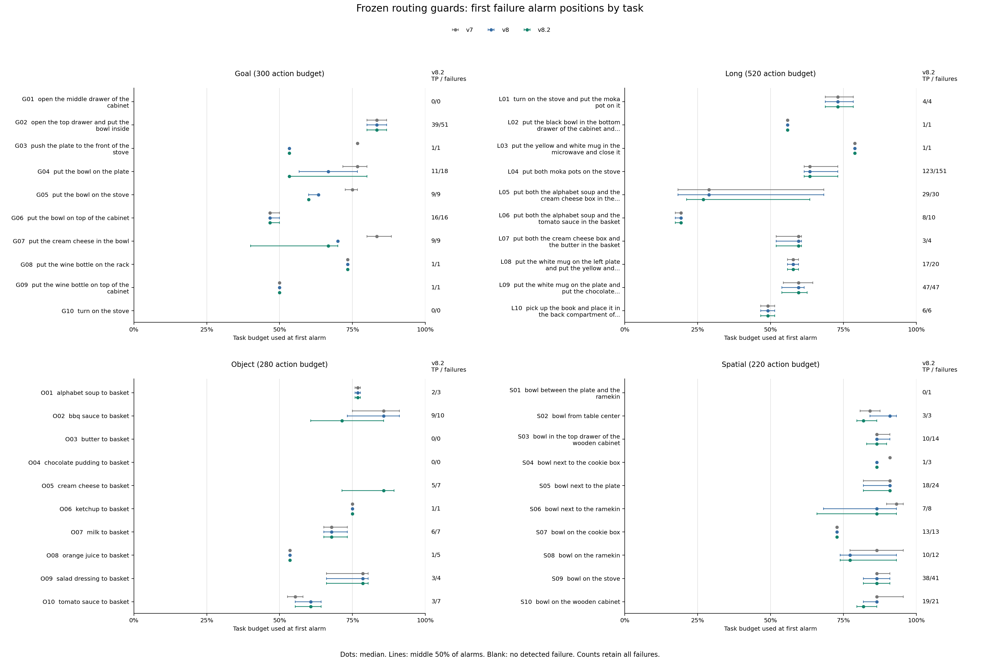

# First Alarm Positions by Task

Position = executed actions / configured task budget. All values describe the original frozen routing guards.
Cells show the median position and detected failures / all failures. IQR is the middle 50% of v8.2 failure alarms.
v8.2 FP cells show median position and false alarms / all successful episodes. Missing medians mean no alarm.

## libero_goal

| ID | Task | v7 | v8 | v8.2 | v8.2 IQR | v8.2 FP |
| --- | --- | --- | --- | --- | --- | --- |
| G01 | open the middle drawer of the cabinet | NA (0/0) | NA (0/0) | NA (0/0) | NA | NA (0/400) |
| G02 | open the top drawer and put the bowl inside | 83.3% (39/51) | 83.3% (39/51) | 83.3% (39/51) | 80.0-86.7% | 53.3% (1/349) |
| G03 | push the plate to the front of the stove | 76.7% (1/1) | 53.3% (1/1) | 53.3% (1/1) | 53.3-53.3% | 50.0% (4/399) |
| G04 | put the bowl on the plate | 76.7% (4/18) | 66.7% (7/18) | 53.3% (11/18) | 53.3-80.0% | NA (0/382) |
| G05 | put the bowl on the stove | 75.0% (8/9) | 63.3% (9/9) | 60.0% (9/9) | 60.0-60.0% | NA (0/391) |
| G06 | put the bowl on top of the cabinet | 46.7% (16/16) | 46.7% (16/16) | 46.7% (16/16) | 46.7-50.0% | NA (0/384) |
| G07 | put the cream cheese in the bowl | 83.3% (3/9) | 70.0% (9/9) | 66.7% (9/9) | 40.0-70.0% | 36.7% (5/391) |
| G08 | put the wine bottle on the rack | 73.3% (1/1) | 73.3% (1/1) | 73.3% (1/1) | 73.3-73.3% | NA (0/399) |
| G09 | put the wine bottle on top of the cabinet | 50.0% (1/1) | 50.0% (1/1) | 50.0% (1/1) | 50.0-50.0% | NA (0/399) |
| G10 | turn on the stove | NA (0/0) | NA (0/0) | NA (0/0) | NA | NA (0/400) |

## libero_long

| ID | Task | v7 | v8 | v8.2 | v8.2 IQR | v8.2 FP |
| --- | --- | --- | --- | --- | --- | --- |
| L01 | turn on the stove and put the moka pot on it | 73.1% (4/4) | 73.1% (4/4) | 73.1% (4/4) | 68.8-78.4% | NA (0/396) |
| L02 | put the black bowl in the bottom drawer of the cabinet and... | 55.8% (1/1) | 55.8% (1/1) | 55.8% (1/1) | 55.8-55.8% | 38.5% (3/399) |
| L03 | put the yellow and white mug in the microwave and close it | 78.8% (1/1) | 78.8% (1/1) | 78.8% (1/1) | 78.8-78.8% | 40.4% (15/399) |
| L04 | put both moka pots on the stove | 63.5% (123/151) | 63.5% (123/151) | 63.5% (123/151) | 61.5-73.1% | 61.5% (14/249) |
| L05 | put both the alphabet soup and the cream cheese box in the... | 28.8% (27/30) | 28.8% (27/30) | 26.9% (29/30) | 21.2-63.5% | 36.5% (5/370) |
| L06 | put both the alphabet soup and the tomato sauce in the basket | 19.2% (8/10) | 19.2% (8/10) | 19.2% (8/10) | 17.3-19.2% | 57.7% (1/390) |
| L07 | put both the cream cheese box and the butter in the basket | 59.6% (3/4) | 59.6% (3/4) | 59.6% (3/4) | 51.9-60.6% | 51.0% (6/396) |
| L08 | put the white mug on the left plate and put the yellow and... | 57.7% (17/20) | 57.7% (17/20) | 57.7% (17/20) | 55.8-59.6% | 50.0% (5/380) |
| L09 | put the white mug on the plate and put the chocolate... | 59.6% (46/47) | 59.6% (46/47) | 59.6% (47/47) | 53.8-62.5% | 42.3% (8/353) |
| L10 | pick up the book and place it in the back compartment of... | 49.0% (6/6) | 49.0% (6/6) | 49.0% (6/6) | 46.6-51.4% | 42.3% (20/394) |

## libero_object

| ID | Task | v7 | v8 | v8.2 | v8.2 IQR | v8.2 FP |
| --- | --- | --- | --- | --- | --- | --- |
| O01 | alphabet soup to basket | 76.8% (2/3) | 76.8% (2/3) | 76.8% (2/3) | 75.9-77.7% | 64.3% (1/397) |
| O02 | bbq sauce to basket | 85.7% (7/10) | 85.7% (7/10) | 71.4% (9/10) | 60.7-85.7% | NA (0/390) |
| O03 | butter to basket | NA (0/0) | NA (0/0) | NA (0/0) | NA | 44.6% (2/400) |
| O04 | chocolate pudding to basket | NA (0/0) | NA (0/0) | NA (0/0) | NA | 46.4% (1/400) |
| O05 | cream cheese to basket | NA (0/7) | NA (0/7) | 85.7% (5/7) | 71.4-89.3% | 78.6% (1/393) |
| O06 | ketchup to basket | 75.0% (1/1) | 75.0% (1/1) | 75.0% (1/1) | 75.0-75.0% | NA (0/399) |
| O07 | milk to basket | 67.9% (6/7) | 67.9% (6/7) | 67.9% (6/7) | 65.2-73.2% | 71.4% (1/393) |
| O08 | orange juice to basket | 53.6% (1/5) | 53.6% (1/5) | 53.6% (1/5) | 53.6-53.6% | 62.5% (2/395) |
| O09 | salad dressing to basket | 78.6% (3/4) | 78.6% (3/4) | 78.6% (3/4) | 66.1-80.4% | NA (0/396) |
| O10 | tomato sauce to basket | 55.4% (2/7) | 60.7% (3/7) | 60.7% (3/7) | 55.4-64.3% | NA (0/393) |

## libero_spatial

| ID | Task | v7 | v8 | v8.2 | v8.2 IQR | v8.2 FP |
| --- | --- | --- | --- | --- | --- | --- |
| S01 | bowl between the plate and the ramekin | NA (0/1) | NA (0/1) | NA (0/1) | NA | 81.8% (1/399) |
| S02 | bowl from table center | 84.1% (2/3) | 90.9% (3/3) | 81.8% (3/3) | 79.5-86.4% | NA (0/397) |
| S03 | bowl in the top drawer of the wooden cabinet | 86.4% (8/14) | 86.4% (9/14) | 86.4% (10/14) | 83.0-89.8% | NA (0/386) |
| S04 | bowl next to the cookie box | 90.9% (1/3) | 86.4% (1/3) | 86.4% (1/3) | 86.4-86.4% | NA (0/397) |
| S05 | bowl next to the plate | 90.9% (17/24) | 90.9% (18/24) | 90.9% (18/24) | 81.8-90.9% | 63.6% (2/376) |
| S06 | bowl next to the ramekin | 93.2% (4/8) | 86.4% (7/8) | 86.4% (7/8) | 65.9-93.2% | NA (0/392) |
| S07 | bowl on the cookie box | 72.7% (13/13) | 72.7% (13/13) | 72.7% (13/13) | 72.7-72.7% | 63.6% (1/387) |
| S08 | bowl on the ramekin | 86.4% (9/12) | 77.3% (10/12) | 77.3% (10/12) | 73.9-93.2% | NA (0/388) |
| S09 | bowl on the stove | 86.4% (36/41) | 86.4% (38/41) | 86.4% (38/41) | 81.8-90.9% | NA (0/359) |
| S10 | bowl on the wooden cabinet | 86.4% (18/21) | 86.4% (19/21) | 81.8% (19/21) | 79.5-86.4% | NA (0/379) |

Full task identifiers: [task_map.csv](task_map.csv).

